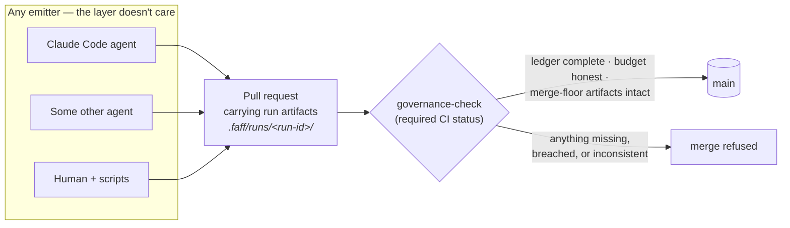
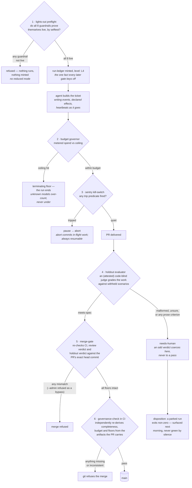
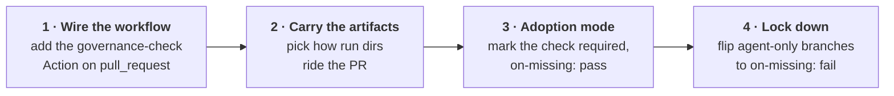
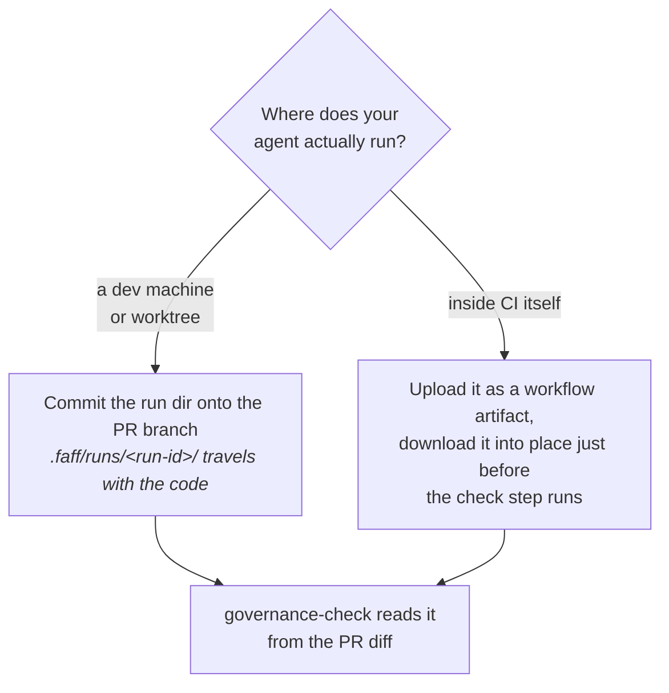
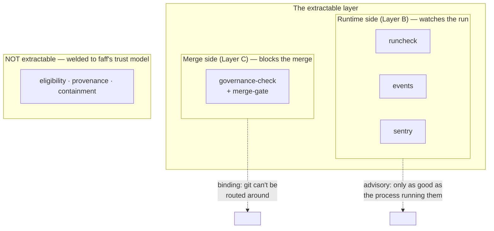
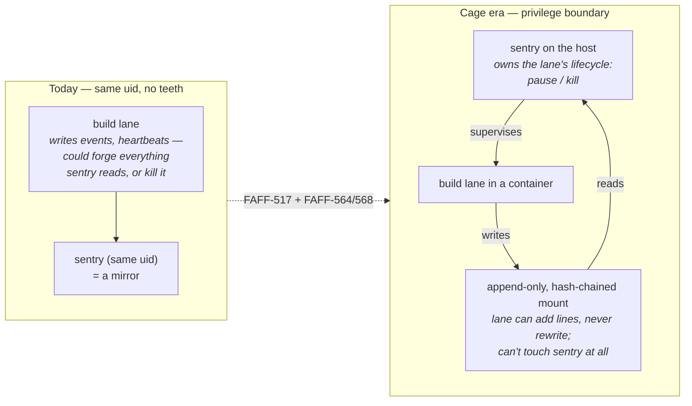
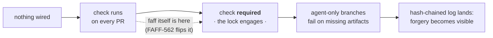

# The governance layer, on its own

- **Status:** Explainer, written 2026-07-20 off the back of the L4 capabilities audit of the same date.
- **Audience:** Anyone — including a team that has never touched faff — who wants to understand what the governance layer is, how it works in action, and how to adopt just that layer without the rest of the system.
- **Sources:** [2026-07-20 L4 capabilities audit](../audits/2026-07-20-l4-capabilities-audit.md) · [governance-check wiring guide](../guide/governance-check.md) · [enforcement RFC v2](../rfc/rfc-governance-pipeline-enforcement-v2.md) · [governance landscape report](governance-landscape-2026-07.md) · [adopting by change-class](../guide/adopting-by-change-class.md) · [tamper-evidence RFC](../rfc/rfc-governance-tamper-evidence.md)

faff is two things welded together: an agent that *builds* software, and a referee that *checks the paperwork* before anything merges. The referee is deliberately separable — this document explains, in plain terms and diagrams, how a team that never touches the rest of faff can adopt just that part.

---

## 1. The one idea everything hangs on

Most agent frameworks govern themselves from the inside: the agent is supposed to check its own budget, run its own review step, log its own actions. The problem is structural — **a check the agent can simply decline to run is advice, not enforcement**. An agent that never calls the checker is ungoverned, and nothing notices.

faff's answer is to move enforcement to a place the agent doesn't control: **the merge**. Every run must leave behind a paper trail (a run ledger, an event log, declared side-effects, verdicts). A CI check called `governance-check` reads that paper trail off the pull request and independently re-derives whether the run was complete, on budget, and passed its gates. Branch protection makes that check *required* — so git itself refuses the merge if the paperwork doesn't hold up — the mechanism is built and runs on every faff PR; marking the check *required* is the one config change still outstanding (§8). The agent can say anything it likes about its own run; it can't route around git.



Two useful analogies. It's a **flight recorder plus an interlock**: the run writes a black-box record as it goes, and the interlock refuses to let the plane land unless the recording is present and coherent. Or: the agent is the player, `governance-check` is the referee, and git is the stadium — the referee doesn't chase the player around, it just stands at the only exit.

---

## 2. The gates in action — one ticket's journey

Here is the whole gauntlet a piece of work runs in an unattended faff run — from "may this run even start?" to "may this merge?". The thing to notice is the shape: **every gate's failure edge lands on a stop, a park, or a human — never on a silent pass**. That's the fail-closed posture: when a gate can't prove things are fine, the answer is no.



One simplification for readability: the budget governor and sentry are drawn as steps, but in reality they are *standing* gates that watch continuously for the whole build — a breach or a trip can end the run at any moment, not just "after building."

Three of these gates are worth a second look:

- **The preflight (gate 1) tests the guardrails, not the config.** It doesn't check that a kill-switch is *configured* — it runs each guardrail's genuine selftest and demands a live result. A guardrail that can't prove itself working is treated as absent, and the run refuses to start.
- **The holdout judge (gate 4) never reads the code.** It grades the delivered work against acceptance scenarios that were withheld from the builder — so the builder can't teach to the test, and the judge can't be charmed by a tidy diff. Today that blindness is attested, not enforced — the evaluator runs inline and can read the repo, so `code_blind` holds only while it complies; the cage that makes it physical is built but not yet wired into the live dispatch. Per the landscape research, nobody else does this anywhere, commercial or academic.
- **The last two gates (5 and 6) re-derive rather than trust.** Neither believes the run's own account of itself. merge-gate re-checks every floor against the PR's exact head commit; governance-check recomputes completeness and budget from the carried artifacts in CI. A self-reported "done" that doesn't match reality simply has nothing to show them.

---

## 3. What's in the box — four layers, three of them real today

The layer isn't one monolith — it's a small stack, and each slice is useful on its own:

| Layer | In plain terms | Status |
|---|---|---|
| **A — the paper trail format** | Agreed file shapes for what a run leaves behind: run ledger, append-only event log, declared side-effects, heartbeats, verdict blocks. The pitch is the OpenTelemetry move: *if your agent emits these files, any conforming checker can audit it* — no faff required. | Partially built — side-effects and verdicts have real published schemas; the ledger and event-log shapes still live partly in prose and code |
| **B — the reference checkers, with swappable vocabulary** | The tools that read the paper trail (run completeness, event-log sanity, the kill-switch thresholds) don't hardcode faff's dialect. They bind to a **profile** — a small closed-vocabulary JSON declaring your terminal states, event types, and thresholds. A second, deliberately alien test profile proves the engines genuinely don't care whose vocabulary they run. | Built |
| **C — the enforcement binding** | The GitHub Action that runs the checker on every PR, plus the branch-protection setting that makes it required. This is the only layer that *enforces* anything — A and B without C is logging, not governance. | Built, one config short of binding — the check runs on every faff PR but isn't yet marked required even there (FAFF-562) |
| **D — a policy language on top** | Composing appetites, ceilings, and gates as declarative policy. | Deliberately not built, possibly never — the design's own failure-mode list treats a premature policy DSL as a trap |

The adoption story for another team is: **emit A, optionally reuse B with your own profile, and wire C.** Layer C is the one that turns the other two from telemetry into a gate.

---

## 4. Why bother — what this buys that the market doesn't have

faff's own landscape research scored eleven agent frameworks and products against five governance properties. The honest headline: every individual idea has prior art somewhere, but **no surveyed project — open-source or commercial — combines even three of the five**. GitHub's Copilot coding agent is the only other product using git as the chokepoint; CrewAI is the strongest open-source comparator at two of five.

| Property, in plain terms | faff today | Anyone else? |
|---|---|---|
| A gate the agent can't decline to consult (git + required check) | One config short | Copilot coding agent only |
| An audit trail that shows tampering (hash-chained log) | Not built — RFC written | Nobody; AutoGen has an open RFC |
| Work graded by a judge that never reads the code, against withheld scenarios | Built (blindness attested today) | Not found anywhere, commercial or academic |
| Side-effects declared up front against a closed allowlist | Built | CrewAI (in-process); active research topic |
| Governance vocabulary that's swappable data, not one tool's dialect | Built | Nascent research only |

The defensible claim, in the landscape report's own careful words: *a near-unique combination of individually-precedented properties* — not "nobody ever thought of this."

---

## 5. The adoption path — four steps, none of which require faff's agent

Prerequisites: GitHub, Node 20 in CI, and an agent (any agent) that can be taught to write the run-artifact files. You do **not** need Claude Code, Linear, faff's skills, or its autonomous pipeline.



Each step is independently reversible, and the gate tightens gradually — the same "widen trust as evidence accrues" motion faff recommends for everything.

### Step 1 — add the workflow

One YAML file. The Action is a composite published from faff's repo; a consumer pins it to a commit SHA (a tag can be silently moved; a SHA can't — this is the wiring guide's own loudest warning).

```yaml
name: governance-check
on:
  pull_request:
jobs:
  governance-check:
    runs-on: ubuntu-latest
    steps:
      - uses: actions/checkout@v4
        with:
          fetch-depth: 0        # the Action diffs base...head to find carried run dirs
      - uses: actions/setup-node@v4
        with:
          node-version: 20
      - uses: shftwst/faff/.github/actions/governance-check@<pinned-commit-sha>
        with:
          on-missing: pass       # adoption mode — see step 3
          faff-version: "<pinned-commit-sha>"   # pins the fetched binary too
```

### Step 2 — decide how artifacts ride the PR

The check only ever reads run directories that appear *in the PR's own diff* — never "the newest run dir in the checkout," so a stale, already-merged run can never vouch for a new PR. Where the run dir comes from depends on where your agent runs:



Committing onto the branch is the v1-blessed path — it's the only channel that reliably rides the PR when the emitter has no CI run of its own.

### Step 3 — mark it required, in adoption mode

The Action never touches your branch protection itself — flipping the lock is deliberately a human act (one click, or one `gh api` call). Start with `on-missing: pass`: PRs that carry no artifacts (all your human PRs) sail through, but every job summary says so out loud — *"no governance artifacts carried"* — so the gap stays visible instead of silent. This is what keeps a mixed human-and-agent repo adoptable; a required check that fails every human PR kills adoption on day one.

### Step 4 — lock down where it's earned

Once a branch only ever receives agent-built PRs (say, an agent-only integration branch), flip that branch to `on-missing: fail`. Now "the agent forgot its paperwork" is a refused merge, not a visible-but-passing note. Different branches can hold different postures indefinitely — the same coexistence idea as faff's per-ticket adoption pattern, where boring change-classes run unattended while scary ones stay hand-driven, on the same board, the same night.

---

## 6. The honest edges — what the referee can and cannot see

faff's docs are unusually blunt about the boundary, and it's worth keeping that bluntness: **the check validates conformance, not authenticity**. The paperwork is written by the same party being judged. A cooperating-but-fallible agent gets caught; a deliberately lying one that forges a clean ledger reads as real — until the tamper-evidence work lands.

**Catches today:**

- Incomplete runs — a ledger that never reached a terminal state
- Budget breaches the run recorded (an unknown model prices at the costliest known rate, so gaps *over*count, never under)
- Missing or inconsistent merge-floor artifacts — review verdicts, holdout verdicts, integrity floors
- The "agent never ran its checks" case — the ungoverned-by-omission PR
- Silence itself: every job summary states whether artifacts were carried at all

**Doesn't catch yet:**

- A *forged* clean paper trail — the hash-chained, git-anchored event log that would make forgery visible is a written RFC, not shipped code (FAFF-564 / FAFF-568)
- A run that kept going after its clean ledger was committed (the summary prints the last event timestamp, so drift is visible, not hidden)
- Wrong judgement calls — a well-formed verdict can still be a false pass; no format check fixes that

> **The one sentence to remember:** emitting the format is not the same as being governed. A repo that wires the workflow but never marks the check required has adopted the paperwork without the lock — that's logging, not governance. The layer's own docs, the audit, and the landscape report all repeat this because it's the failure mode adopters will actually hit.

---

## 7. Sentry and the extractable layer

**Is sentry part of the extraction? Yes — by design and by code.** The enforcement RFC names sentry as one of the three Layer B engines (with `runcheck` and `events`), and `sentry.js` confirms it's already extraction-shaped: its trip thresholds come from `profile.sentry.thresholds`, the thrash-detection event names from `profile.sentry.thrash`, and what counts as a "park" from `profile.sentry.failure`. Only the trip *logic* is fixed; every word and number it compares against is swappable data another team could redeclare.

But there's an important distinction in *what kind* of gate travels with it:



Three caveats for an adopting team:

- **Sentry is a watchdog, not a chokepoint.** It runs *alongside* the agent — the same in-process weakness the landscape report dings CrewAI for. An agent not wired to consult it is simply unsupervised. The enforcement property of the extractable layer lives entirely on the merge side.
- **Its "un-subvertable by construction" claim was formally retracted.** ADR-0034's amendment demonstrated all four trip predicates forgeable by a build lane running as the same user (eight hermetic probes). An adopter gets sentry-as-honest-watchdog against a *cooperating-but-fallible* agent — the same conformance-not-authenticity boundary as the rest of the layer.
- **The `correct` rung won't work for them either.** It's dormant everywhere real, including in faff, because it needs a read-only integrity boundary deferred to the process-isolation era (FAFF-517). What travels today is effectively `continue → pause → abort`, with abort committing in-flight work so it's always resumable.

### Can sentry ever have teeth?

Yes — but only by moving it across a privilege boundary, and the repo's own decision records already sketch exactly that path. The honest framing: **sentry can never grow teeth where it currently stands; it can grow them by standing somewhere else.**

The structural problem is that sentry and the build lane run as the same user: everything sentry reads — heartbeats, the event log, the signals its trip predicates key off — can be written by the very lane it's supervising. A supervisor whose evidence is authored by the supervised is a mirror, not a guard. Two independent upgrades change that, and both already exist as named work:

1. **Make lying visible (the hash chain).** The tamper-evidence RFC (FAFF-564/568) hash-chains `events.jsonl` per-line and anchors the chain head in git. Sentry reading a chained log can't stop the lane writing *false* events, but rewrites and gaps become detectable rather than silent. No new process model needed — this upgrades sentry from "trusts the log" to "can prove the log wasn't doctored after the fact."
2. **Make trips enforceable (process isolation).** This is FAFF-517 and the cage era ADR-0041 defers to: the build lane goes into a container, sentry stays outside with the launcher truthfully able to declare `FAFF_INTEGRITY_BOUNDARY` — a mount the lane can *append to but never rewrite*. The groundwork exists: `corrective-integrity.js` deliberately sources its boundary from pid 1 rather than anything forgeable in the lane's environment. Once real, the dormant `correct` rung wakes up, because the corrective channel finally rests on evidence the lane can't author.



The second diagram is the important one, because teeth come from **authority, not observation**: sentry becomes a real interlock the moment it *holds something the lane needs* — its process lifecycle, its network egress, its credentials. Then a trip isn't a log entry the lane can ignore; it's the ground being pulled out from under it.

This upgraded sentry travels too, and doesn't need faff's factory: any team could run their agent in a container and sentry on the host as the container's supervisor, reading an append-only mount — plain Docker/systemd machinery, harness-independent in the same spirit as the merge chokepoint.

Two limits stay true even fully armed, and the design is honest about both. Sentry still can't catch a lane that writes *plausible false* events from the start — authenticity-of-authorship is a different property than tamper-evidence (that's what the code-blind holdout and merge-side re-derivation exist for). And it remains the *runtime* interlock complementing the merge chokepoint, never replacing it: sentry stops a run going wrong mid-flight; git stops a wrong run landing. The design wants both walls, not a taller version of one.

---

## 8. Where it stands — the gap between built and binding

The July audit's sharpest finding about this layer is also the simplest: everything above exists and is exercised on every faff PR, but even faff's own main branch hasn't yet flipped the check to *required* — the machinery is real, the lock is one config change from engaged. The audit calls that flip "tonight-class" work (FAFF-562), and the same is true for any adopter: the distance from "we emit artifacts" to "git enforces them" is one branch-protection edit.



Which is also the audit's adoption verdict in miniature: the product other teams can use *today* is not the lights-out factory — it's this layer, bound onto whatever agent they already run. The strongest public demo the layer could have, per its own backlog (FAFF-360), is exactly that: the check holding the line on a repo that has nothing else of faff in it.
