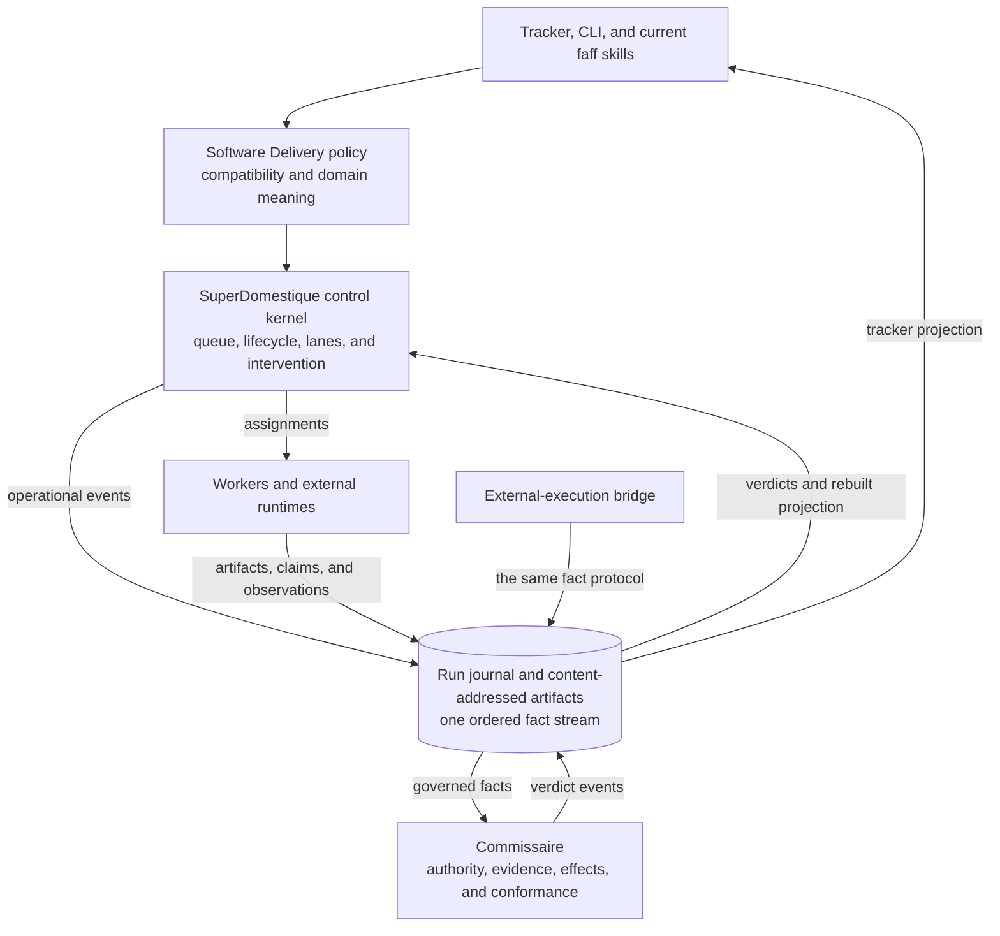
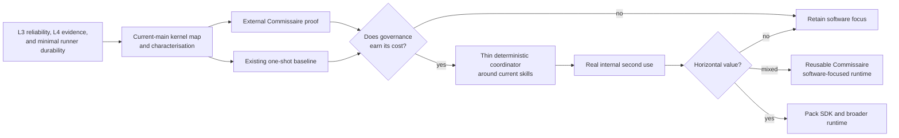

# Critique of the SuperDomestique runtime direction

**Status:** recorded review  
**Date:** 2026-08-11  
**Model:** GPT-5.6-luna
**Scope:** the RFC pack in this directory, cross-checked against the current repository and the earlier [review](critique-1.md)  
**Repository code reviewed at:** `6fed6a810e6a`

## Bottom line

The direction is worth pursuing, but the v2 sequence asks a solo builder to build a platform before proving that the platform is the cheapest way to improve an already valuable product.

The strongest assets are present today:

- L3 can already automate most of a build on a runner.
- The repository contains deterministic queue, lifecycle, eligibility, budget, liveness, gate, and terminal-verdict logic.
- Commissaire already has a meaningful governance boundary.
- There is an unusually useful one-shot external baseline against which the proposed runtime can be tested.

The next move should therefore be extraction and proof, not wholesale construction. Preserve the current L3 product, make its runs durable enough to trust, expose the smallest useful Commissaire protocol, compare it with the existing one-shot baseline, and only then wrap the existing skills in a thin coordinator.

The revised direction is recorded in [master v3](v3/FAFF-SAFE-PROGRESSIVE-AUTONOMY-MASTER-v3.md).

## What was reviewed

- [Plot input v2](v2/FAFF-PLOT-INPUT-v2.md)
- [Progressive autonomy roadmap v2](v2/FAFF-PROGRESSIVE-AUTONOMY-ROADMAP-v2.yaml)
- [Safe progressive autonomy master v2](v2/FAFF-SAFE-PROGRESSIVE-AUTONOMY-MASTER-v2.md)
- [Distributed evidence and recoverable runs](v1/faff-distributed-evidence-recoverable-runs.md)
- [Previous review](critique-1.md)
- Current governance and factory code, skills, runner definitions, tests, experiment records, and product language

The review treated design claims and implemented facts differently. A claim in an RFC was not counted as current capability unless the repository or an experiment record supported it.

## Repository checks

These checks were rerun after drafting the critique:

| Check | Result |
|---|---|
| `faff regions check` | Pass. The governance-to-factory and shared-infrastructure dependency rules hold. |
| `faff next --selftest` | Pass. All 23 transition cases and the automation-eligibility table pass. |
| `faff run-done --selftest` | Pass. All terminal-floor, policy-rung, and default-behaviour cases pass. |
| `faff queue-state --selftest` | Pass. Run-ID, queue-terminal, malformed-ledger, marker, and network-purity cases pass. |

The [README](../../../README.md) still labels L3 as the current unattended path and L4 as preview with incomplete external proof. The [L3 watcher](../../../operations/ci/l3-watcher.yml), [L4 watcher](../../../operations/ci/l4-watcher.yml), and [self-hosted rig guide](../../guide/self-hosted-rig.md) confirm the runner-recovery limitations described below. The [L4 experiment design](../../../verification/external-verification/faff-labs/experiments/l4-experiment-design.md) states that all nine one-shot controls worked.

## Cross-check of the previous review

| Finding | Assessment | Cross-check |
|---|---|---|
| Keep Commissaire, SuperDomestique, and domain meaning separate | Confirmed | The current region checker already enforces a useful governance and factory dependency boundary. The conceptual split is sound. |
| Treat SuperDomestique as greenfield | Rejected | Orchestration is still partly interpreted from skill prose, but deterministic coordination primitives already exist and are tested. This is an extraction problem before it is a platform problem. |
| Bank L4 before broader work | Qualified | Honest L4 evidence is important, but it must not freeze L3 reliability, recovery, or operator ergonomics. L3 is the current value-bearing product. |
| Define the complete architecture and contracts before implementation | Rejected | Thirteen up-front ADRs plus full schemas and conformance create a long speculative chain. Decisions should be taken at the first slice that needs them. |
| Prove execution-independent governance | Confirmed and moved earlier | This is the cheapest test of Commissaire's reusable value and should precede a generic runtime. |
| Build a second-domain pack as the horizontal proof | Qualified | A real internal workflow is a useful abstraction-pressure test, but software-adjacent internal work is not proof of a horizontal market. A distant design partner is required before a broad claim. |
| Run competitive falsification | Confirmed and moved earlier | The existing one-shot faff-lab baseline is already strong. It should be compared before significant platform investment, not near the end. |
| Use an event-oriented evidence model | Confirmed with a boundary change | One neutral, append-only run journal should sit below both runtime and governance semantics. Commissaire should not own the only physical store merely because it owns governance meaning. |
| Add distributed evidence and recovery later | Rejected | Minimal off-box evidence and stage-boundary recovery are prerequisites for trusting L3 and L4 on runners. Live cross-machine workspace continuation can remain deferred. |
| Freeze naming for one to two months | Replaced | Naming stability should be tied to a product-shape decision, not a calendar. Current public naming remains authoritative in the meantime. |

## Confirmed strengths

### 1. There is a real product to protect

The current public front door describes L3 as the current unattended level and L4 as preview. That matches the practical state of the repository: scheduled runner operation can already complete much of the software-delivery loop, while the strongest independence claims remain under development.

This matters strategically. The runtime effort should compound L3 rather than make L3 wait for a future abstraction.

### 2. A deterministic kernel already exists

The current implementation includes deterministic functions for:

- deciding the next eligible work in [`next.js`](../../../plugin/skills/faff/bin/lib/next.js);
- computing terminal run outcomes in [`run-done.js`](../../../plugin/skills/faff/bin/lib/run-done.js);
- projecting queue state in [`queue-state.js`](../../../plugin/skills/faff/bin/lib/queue-state.js);
- applying region dependency rules in [`regions.js`](../../../plugin/skills/faff/bin/lib/regions.js); and
- handling budgets, liveness, resume, gates, merge state, and run ledgers in adjacent modules.

The [`faff-beep-boop` skill](../../../plugin/skills/faff-beep-boop/SKILL.md) still asks an LLM to interpret the orchestration procedure. That is a real control risk, but it does not erase the deterministic substrate. The most credible first runtime is a thin cycle around current primitives and current skills.

### 3. The governance boundary is more than a diagram

The region checker classifies governance concerns such as events, effects, budgets, sentry decisions, audit, and reconciliation separately from factory concerns such as queueing, next-step selection, run completion, and lights-out execution. Its dependency check passes in the reviewed repository state.

This is useful evidence for the proposed three-part model:

1. Commissaire governs authority, evidence, protected effects, reconciliation, and conformance.
2. SuperDomestique coordinates work deterministically.
3. A domain layer defines what stages, artifacts, checks, and outcomes mean.

The boundary should be strengthened through a small protocol and characterisation tests, not recreated from a blank slate.

### 4. The one-shot baseline is unusually valuable

The [L4 experiment design](../../../verification/external-verification/faff-labs/experiments/l4-experiment-design.md) reports that all nine one-shot control tasks worked. Those successful controls give the product thesis a hard comparison.

SuperDomestique must earn its extra machinery through outcomes a one-shot runner does not reliably provide:

- contract qualification before work starts;
- independent governance catches;
- deterministic stop, park, correction, and resume behaviour;
- recovery after executor loss;
- evidence that can be audited without transcript replay; and
- lower operator burden across repeated work.

Successful code generation alone is not a differentiator.

## Material weaknesses in v2

### 1. The roadmap is front-loaded with speculative architecture

The v2 sequence places a large contract and architecture project before external governance proof and competitive falsification. It asks for thirteen ADRs, delegation and lifecycle contracts, lane semantics, worker and provider contracts, a generic governance facade, a runtime vertical slice, a domain pack, a second domain, and adapter proof before the simplest economic question is answered.

That sequence is risky for a solo builder because it maximises work in areas where learning is cheapest through a thin real slice. A schema can be internally coherent and still describe the wrong product.

Improvement: move the external Commissaire proof and the existing one-shot comparison directly after the current-main map. Let those proofs determine which contracts deserve to become stable.

### 2. The greenfield framing would discard existing work

Calling SuperDomestique wholly greenfield underweights the current kernel and encourages a parallel implementation. A second queue, lifecycle, budget, gate, or terminal model would introduce semantic drift before it creates user value.

Improvement: first classify current modules into governance, runtime kernel, software policy, harness orchestration, and adapters. Extract one vertical path while keeping the present CLI, tracker, and skills as the compatibility surface.

### 3. L4 evidence can become a release ceremony

The L4 plan is directionally correct but can become self-certification if the same process authors, executes, evaluates, and publishes its own evidence. A solo builder cannot require a second human for every run, so the answer cannot simply be "add human approval".

Improvement: use a clean outward repository, reproducible successful, seeded-blocked, and executor-killed fixtures, a different model family for adversarial review, fresh context, conflicting-lane exclusion, and code-blind evaluation where it is enforceable. Record the assurance achieved instead of claiming abstract independence.

### 4. The state authority is not settled

V2 makes the Commissaire ledger authoritative while allowing runtime state to be reconstructed from that ledger plus worker or system observations. It does not define which observations may change canonical state, how concurrent writers are ordered, or how an incomplete journal is prevented from producing a false terminal result.

Improvement: introduce one neutral run journal and content-addressed artifact store. Operational and governance events share its ordering, integrity, idempotency, and compare-and-swap rules. SuperDomestique and Commissaire own projections and semantics, not competing mutable stores.

### 5. Runner loss is treated too locally

The L3 watcher deliberately works in bounded segments. If a runner disappears before durable branch or evidence publication, the next firing may repeat work. Later-stage interruption can leave an issue in progress without an automatic path forward. The L4 watcher and self-hosted rig also rely on persistent local run ledgers.

The existing hosted-runner spike proved that a runner could be built and measured, but the recorded environment was destroyed. It is not evidence of a standing durable service.

Improvement: add a stable run ID, a new attempt ID for each execution, off-box journal publication at stage boundaries, durable terminal artifacts and branch references, expired-attempt detection, and deterministic reconciliation. Do not build live workspace migration yet.

### 6. Effect control is described too uniformly

An effect declared "protected" is not necessarily prevented. A worker holding the same credential can bypass an in-process policy check.

Improvement: classify each consequential effect by assurance:

| Class | Mechanism | Claim supported |
|---|---|---|
| A | External enforcement outside the worker trust domain | The effect was blocked unless an external rule allowed it. |
| B | Mediated gateway with a scoped credential unavailable to the worker | The effect was blocked unless the gateway allowed it. |
| C | Independent post-hoc observation | A mismatch can be detected and reconciled after the attempt. |
| D | Worker or coordinator self-attestation | The system reports that it followed the rule. |

Only A and B justify "blocked before execution". C is still valuable, but it is detection rather than prevention. D is diagnostic evidence, not separation of duty.

### 7. Independence is underspecified

"Independent" can mean a different prompt, invocation, model, provider, credential, workspace, or information set. These properties are not interchangeable.

Improvement: record independence as a vector:

- invocation and principal;
- lane history and conflicting-role exclusion;
- context lineage;
- model provider or family;
- workspace and capability isolation; and
- artifact version and observation time.

The solo-builder L4 default should require a distinct invocation, fresh context, conflicting-lane exclusion, and a different model family for adversarial review. Stronger isolation can be added where the effect warrants it.

### 8. Acceptance language overclaims quality

Deterministic bookkeeping can prove that a contract was admitted, named evidence arrived, checks passed, and no blocking verdict remained. It cannot prove that the implementation is good in every relevant sense.

Improvement: use `accepted_under_contract` and attach an assurance summary. Preserve the contract version, evidence coverage, review independence, effect-control classes, unresolved observations, and any waivers.

### 9. The second-domain proof is too synthetic

A synthetic supplier workflow can validate schema mechanics while missing the organisational and semantic pressure that makes horizontal systems hard. An internal eval-baseline workflow is more real, but it is still software-adjacent and human-supervised.

Improvement: use the internal workflow first to break abstractions cheaply. Treat it as an abstraction-pressure test, not market proof. Seek one real, distant design partner only after the internal test still supports the horizontal thesis.

### 10. The documents duplicate their planning source

The v2 master embeds large parts of the plot input and roadmap. That creates multiple apparent authorities and makes review difficult.

Improvement: keep the critique as evidence, the master as the normative direction, and future tracker or plot output as generated planning. Link between them rather than copying them verbatim.

## Recommended architecture correction

The cleanest ownership model adds a neutral run-record substrate below the two semantic systems.

The journal owns ordering, revisions, idempotency, integrity, artifact references, and conditional append. SuperDomestique owns operational meaning and coordination projections. Commissaire owns governance meaning and verdicts. Leases are operational coordination whose acquisition, renewal, expiry, and recovery are journalled. A workspace is a content-addressed snapshot, not a second canonical state store.

This also makes the external proof honest: an external workflow uses the same fact protocol without pretending SuperDomestique orchestrated it.

## Recommended sequence

The sequencing change tests reusable governance and competitive value before a generic coordinator, domain-pack SDK, control plane, or hosted runtime.

## What should be retained even if the horizontal thesis fails

Every project should state which final outcomes retain its value:

| Outcome | Description |
|---|---|
| Horizontal | SuperDomestique becomes a broader protocol-driven runtime with domain packs. |
| Mixed | Commissaire is reusable, while SuperDomestique remains focused on software delivery. |
| Software focused | The extracted boundaries improve L3 and L4 without becoming separate products. |

High-value early work should survive all three outcomes. The neutral journal, runner recovery, characterisation tests, governance facade, assurance vocabulary, and operator-facing run summary all pass this test.

## Final assessment

The architecture is plausible and the product insight is stronger than the v2 roadmap makes it look. The main risk is spending the advantage already present in L3 on a large abstraction programme whose unique value could have been tested much earlier.

Proceed, but make each abstraction pay rent:

1. protect the unattended runner;
2. extract what is already deterministic;
3. prove governance on execution it did not control;
4. beat or clearly complement the one-shot baseline;
5. add the narrow coordinator;
6. generalise only in response to real pressure.
