# FAFF / SuperDomestique Safe Progressive Autonomy — Master Design Pack v2


---

# FILE: README.md

# SuperDomestique / FAFF — Progressive Autonomy Architecture Pack v2

**Status:** planning and architecture material  
**Purpose:** give FAFF enough context to create Linear initiatives, ADRs, experiments, migration issues, and evidence requirements without prematurely implementing the generalized platform.

## Executive position

The project should **bank the current software-delivery thesis before broad extraction**.

The near-term sequence is:

```text
FAFF / SuperDomestique today
    L3 solid
    L4 finish + harden + improve critical ergonomics
        ↓
L4 reference release
    successful governed run
    intentionally blocked run
    current limitations
    dated future-architecture ADRs
        ↓
architectural decomposition proof
    Commissaire
    SuperDomestique runtime
    Software Delivery domain pack
    FAFF adoption layer
        ↓
second-domain proof
        ↓
adapter + competitive falsification
        ↓
continue / narrow / verticalise
```

The target conceptual architecture is:

```text
Domain packs
    concrete lifecycle composition, domain policy, evidence,
    worker bindings, integrations, effects, observations, UX extensions
        ↓
SuperDomestique
    deterministic progressive-autonomy runner and control plane
    around probabilistic/external workers
        ↓
Commissaire
    execution-independent deterministic governance core

SuperDomestique ↔ external workers and systems
Commissaire     ↔ authorization/policy/observation infrastructure via adapters
```

## Naming for the next 1–2 months

Do **not** introduce another public brand.

- **SuperDomestique** — public/project identity and current documentation heading.
- **FAFF** — repository, plugin, skills, commands, and lightweight in-harness adoption identity.
- **Commissaire** — deterministic governance subsystem, with planned extraction.
- **Software Delivery Pack** — proposed future extraction of software-specific semantics; do not present as current implementation.
- **Domain packs** — proposed future extension model.
- **SuperDomestique runtime** — proposed architectural decomposition; do not claim it is fully extracted today.

Recommended transition sentence:

> **SuperDomestique is the project currently implemented and distributed as FAFF; the repository, plugin, skills and commands retain their existing names while the architecture evolves.**

## Core principles

1. **Workers reason probabilistically. SuperDomestique coordinates deterministically. Commissaire governs independently.**
2. **Commissaire governs; SuperDomestique runs; domain packs define meaning; workers perform work.**
3. **Own semantics; adapt infrastructure.**
4. **The executor cannot certify its own completion.**
5. **Consequential effects are authorized before execution where possible and independently observed/reconciled afterward.**
6. **The state of delegated work is the interface; transcripts are evidence/debug material, not the primary control plane.**
7. **L1–L4 remain useful user-facing autonomy presets but should ultimately compile into explicit lane, authority, evidence, and approval rules.**
8. **Proof precedes package extraction, broad rebranding, hosted-platform work, and marketplace work.**
9. **The generalized thesis must survive competitive falsification against simpler workflow/governance systems.**

## Use this pack

For planning, start with:

1. `18-faff-plot-input.md`
2. `roadmap.yaml`
3. `23-l4-release-gate.md`
4. `24-naming-and-adoption-strategy.md`
5. `25-own-semantics-adapt-infrastructure.md`
6. `26-competitive-landscape-and-falsification.md`

The remaining documents are architectural constraints and supporting material.

## Supersession

This v2 pack supersedes the previous planning emphasis where immediate runtime extraction followed current-state inventory.

The critical change is:

> **Finish and publish a defensible L4 reference release first.**

Architecture work may proceed in ADR/design form before that release, but broad generalized-runtime implementation is gated behind L4.


---

# FILE: 18-faff-plot-input.md

# FAFF Plot Input v2: Bank L4, Then Prove a Runtime for Safe Progressive Autonomy

Use this as the primary initiative brief. `roadmap.yaml` is the structured planning source. The rest of the pack defines architectural constraints.

## Initiative

**Title:** Bank L4 and prove the SuperDomestique / Commissaire architecture

## Strategic intent

Do not jump directly from today's software-specific FAFF implementation into a generic business-agent platform.

First produce a credible L4 reference release. Then determine whether the current system can be honestly decomposed into:

```text
FAFF
    lightweight skills/plugin/harness adoption layer

Software Delivery domain pack ──────┐
                                    │
Other domain packs ─────────────────┼──▶ SuperDomestique
                                    │     deterministic progressive-autonomy runner
                                    │     around probabilistic/external workers
                                    ▼
                               Commissaire
                               independent deterministic governance
```

## Near-term naming constraint

For the next 1–2 months:

- project/docs identity: **SuperDomestique**;
- repository/plugin/skills/commands: **FAFF**;
- governance subsystem: **Commissaire**;
- do not introduce another public brand;
- do not claim generalized domain-pack runtime as current implementation.

Recommended public line:

> **SuperDomestique is the project currently implemented and distributed as FAFF; existing repository, plugin, skill and command names are retained while the architecture evolves.**

## Core thesis

> **Workers reason probabilistically. SuperDomestique coordinates deterministically. Commissaire governs independently.**

And:

> **Commissaire governs; SuperDomestique runs; domain packs define meaning; workers perform work.**

## Immediate gate: L4 Reference Release

Before broad extraction:

- complete remaining L4 correctness/hardening work;
- improve only ergonomics required for believable unattended operation;
- produce successful reference run;
- produce intentionally blocked/failure run;
- demonstrate independent adversarial/holdout responsibilities;
- demonstrate fail-closed evidence/governance;
- demonstrate park/escalation/recovery;
- document L3 vs L4;
- document current limitations;
- commit proposed future architecture ADRs;
- tag the release.

Do not hold the release for non-critical polish.

## Architecture to test after L4

### Commissaire owns

- governed event history and integrity;
- authority/policy verdict composition;
- evidence obligations;
- effects/observations/reconciliation;
- lifecycle conformance;
- checkpoint/acceptance verdicts;
- audit reconstruction.

It must not orchestrate models/workers or understand domain nouns.

### SuperDomestique owns

- task/contract runtime state;
- lifecycle graphs and stage attempts;
- bounded lanes;
- worker assignment/invocation;
- deterministic routing and correction;
- pause/park/resume/escalation;
- human intervention;
- canonical control-plane state;
- worker/provider interfaces.

### Domain packs own

- task types;
- lifecycle composition;
- custom stages;
- lane templates;
- prompts/skills;
- domain policies/evidence;
- worker bindings;
- integrations;
- domain effects/observers;
- UI extensions.

### FAFF adoption layer may own

- skills/plugin distribution;
- harness-native commands;
- developer-local defaults;
- L1–L4 progressive adoption UX;
- compatibility/projection into existing coding workflows.

## Infrastructure philosophy

**Own semantics; adapt infrastructure.**

Own:

- Delegation Contract;
- lifecycle primitives;
- lane semantics;
- evidence/effect/reconciliation;
- acceptance;
- domain-pack/runtime/governance protocols;
- conformance suites.

Use reference + replaceable adapters for:

- authorization/policy;
- durable execution;
- workflow/agent runtimes;
- identity/secrets;
- connectors;
- persistence/observability.

Do not expose backend-specific formats as the canonical pack API by accident.

## Workstreams

### W0 — L4 reference release
Finish, harden, failure-test, document, tag.

### W1 — Four-way current-main inventory
Classify code as Commissaire / SuperDomestique runtime / Software Delivery domain / FAFF adoption / adapter.

### W2 — Contracts and architectural boundaries
ADRs, Delegation Contract, lifecycle, lane, worker/provider/governance contracts.

### W3 — Commissaire facade
Expose current governed facts through a narrow domain-neutral API.

### W4 — SuperDomestique runtime vertical slice
One software task through generic task/lifecycle/lane/worker/control-plane structures.

### W5 — Software Delivery domain-pack slice
Move concrete software semantics out of the runtime boundary while preserving FAFF UX.

### W6 — Second-domain proof
Supplier onboarding or similarly distinct evidence-heavy process.

### W7 — Adapter proof
Replace native authorization with external task-scoped authorization; use an external worker/runtime.

### W8 — Execution-independent Commissaire
Govern a workflow that SuperDomestique did not primarily execute.

### W9 — Control-plane proof
Generic supervision without transcript dependence.

### W10 — Competitive falsification
Compare against simpler workflow/agent baseline.

### W11 — Decision and optional productisation
Continue horizontal, narrow/verticalise, or retain software focus.

## Mandatory proof criteria

The generalized path only succeeds if:

1. same runtime runs unrelated domain packs;
2. same Commissaire categories govern both;
3. no domain nouns/conditionals leak into core/runtime;
4. worker cannot self-accept;
5. separation-of-duty lane rules are enforceable;
6. consequential effect can be blocked before execution;
7. false effect claim is exposed by independent observation;
8. contract amendment invalidates affected work predictably;
9. authorization backend can be swapped without pack changes;
10. Commissaire can govern external execution;
11. generic control plane is usable without transcripts;
12. benefits exceed a simpler established workflow approach.

## Non-goals before proof

- hosted multi-tenant platform;
- connector marketplace;
- generic visual workflow builder;
- full repo/package split;
- broad rebranding;
- replacement for authorization/policy engines;
- replacement for durable workflow engines;
- replacement for n8n/LangGraph/agent harnesses;
- enterprise SSO/SCIM programme;
- compliance certification claims.

## Planning instructions

Create:

- one parent Linear initiative;
- projects matching W0–W11;
- small reviewable issues;
- explicit dependencies;
- exit gate and evidence artifact for every project;
- ADR issues for every unresolved architecture decision;
- failure-injection issues, not only success-path work;
- conformance tests for every provider/adapter interface;
- decision checkpoints where work may intentionally stop.

Do not let the future runtime derail the L4 release.


---

# FILE: 23-l4-release-gate.md

# L4 Reference Release Gate

## Decision

Before materially extracting a generic SuperDomestique runtime, finish, harden, document, and tag a credible L4 software-delivery release.

This is not a polish programme. It is a **thesis-banking and evidence milestone**.

## Why L4 comes first

L4 is the best available laboratory for the generalized runtime because it forces the project to confront:

- unattended execution;
- separation of duties;
- adversarial review;
- independent holdout evaluation;
- correction loops;
- bounded context;
- escalation and parking;
- evidence quality;
- deterministic governance;
- tracker/control-plane ergonomics;
- failure behavior when workers stall, thrash, misreport, or disagree.

Generalizing before those behaviors are convincing risks designing abstractions around theory rather than observed operating pressure.

## L4 release-blocking criteria

A release candidate is acceptable when a representative task demonstrates:

1. Human supplies intent but does not babysit the terminal.
2. Specification/planning is produced and challenged.
3. Adversarial review is independent from the producer.
4. Execution proceeds unattended.
5. Review/correction loops converge or park/escalate predictably.
6. Holdout evaluation is independent enough that the executor is not grading itself.
7. Required product and process evidence is produced.
8. Commissaire-style checks fail closed when required evidence/invariants are absent.
9. Parks and escalations are human-legible and recoverable.
10. The tracker/control surface is sufficient to understand status and intervene without replaying the entire worker transcript.
11. A successful run reaches a defensible terminal disposition.
12. Deliberately seeded failures demonstrate that governance blocks false or incomplete success.

## Required failure demonstrations

At minimum include deliberately induced cases such as:

- missing required review evidence;
- reviewer not independent from builder;
- stale or wrong artifact version reviewed;
- claimed completion without terminal evidence;
- effect claimed but not observed;
- budget or retry threshold exceeded;
- stalled worker / missing heartbeat;
- unresolved blocking review finding.

The exact set may vary with current implementation. Prefer reproducible fixtures.

## Non-blocking polish

Do not delay the L4 reference release for:

- perfect CLI aesthetics;
- every harness being equally polished;
- complete onboarding redesign;
- every naming migration;
- exhaustive model matrix;
- perfect docs for every feature;
- zero-configuration adoption;
- broad runtime extraction.

## Release artifacts

Publish/tag:

- successful L4 reference-run walkthrough;
- intentionally blocked-run walkthrough;
- L3 vs L4 responsibilities and guarantees;
- current architecture diagram;
- evidence taxonomy;
- current limitations;
- Commissaire subsystem description;
- future-architecture ADR describing the proposed decomposition;
- version/tag identifying the pre-extraction state.

## Exit gate

Proceed to generalized-runtime implementation only when:

> **L4 demonstrates that the software-specific system can autonomously perform, challenge, verify, correct, govern, and disposition real work with enough observable rigor that there is something worth generalizing.**


---

# FILE: 24-naming-and-adoption-strategy.md

# Naming and Adoption Strategy

## Near-term stability objective

For the next one to two months, optimize for:

- external legibility of the project;
- stable public links;
- continuity for existing users;
- truthful claims about current implementation;
- preservation of architectural direction without overclaiming future work.

## Names

### SuperDomestique

Public/project identity.

Current safe positioning:

> **SuperDomestique enables progressively autonomous AI software delivery by combining AI-led execution with deterministic governance, explicit engineering constraints, and verifiable evidence.**

Do not yet headline it as a generic enterprise autonomy platform.

### FAFF

Retain as:

- GitHub repository name;
- plugin name;
- skill/command prefix;
- lightweight in-harness adoption identity.

FAFF's low-friction value is distinct:

> Someone already using Claude Code/Codex can adopt progressively governed software delivery without first deploying a separate enterprise platform.

Long term, FAFF may become the adoption/distribution layer for the Software Delivery domain pack, but this remains a hypothesis until extraction is proven.

### Commissaire

Retain as the named deterministic governance subsystem.

It may become independently consumable, but current docs must distinguish current internal boundary from proposed physical extraction.

## Public architecture during transition

Show current architecture as:

```text
SuperDomestique / FAFF
    AI-led software delivery
    + internal Commissaire governance region
```

Show future architecture only in clearly marked ADR/design sections:

```text
FAFF adoption layer

Software Delivery domain pack
        ↓
SuperDomestique runtime
        ↓
Commissaire
```

## Do not add another public product name

The runtime itself can be called **SuperDomestique runtime** architecturally.

Avoid introducing a fourth brand until the architecture is proven and there is a real product/repository boundary.

## Physical split trigger

Do not fork solely to satisfy diagrams.

Consider a new physical SuperDomestique runtime repository/package when at least one is true:

- runtime extraction causes repeated compatibility compromises in FAFF;
- a second domain consumes the same runtime;
- independent versioning becomes necessary;
- runtime release cadence diverges from FAFF skills/plugin cadence;
- external adopters need the runtime without FAFF;
- dependency-direction tests are easier to enforce across packages/repos.

Preserve repository history when splitting.

## Public description guidance

Use a stable form such as:

> **SuperDomestique (currently distributed as FAFF)** — progressively autonomous AI software delivery...

or:

> **FAFF / SuperDomestique** — progressively autonomous AI software delivery...

Do not change this wording every few weeks.


---

# FILE: 25-own-semantics-adapt-infrastructure.md

# ADR Candidate: Own Semantics; Adapt Infrastructure

## Context

The emerging agent ecosystem already contains increasingly capable infrastructure for:

- task-scoped authorization;
- policy evaluation;
- durable workflow execution;
- resumable human-in-the-loop operation;
- workflow integration;
- agent/model execution;
- identity and secrets;
- observability.

Rebuilding all of those layers would dramatically increase time to market and obscure the project's actual thesis.

At the same time, binding SuperDomestique/Commissaire directly to one external project's data model would outsource the architecture before the abstractions are proven.

## Decision

Own the **semantic contracts** and provide replaceable adapters to specialized infrastructure.

### Project-owned semantics

Own and version:

- Delegation Contract;
- lifecycle primitive model;
- lane model and separation-of-duty semantics;
- progressive-autonomy presets/compilation;
- worker assignment protocol;
- evidence model;
- effect declaration model;
- observation/reconciliation model;
- checkpoint semantics;
- acceptance semantics;
- task/run state;
- domain-pack contract;
- adapter contracts;
- conformance test suites.

### Reference implementations

Provide deliberately small native/reference implementations for:

- authorization;
- policy checks;
- event persistence;
- task persistence;
- worker execution;
- observation adapters.

Their purpose is to define semantics, enable tests, and avoid mandatory infrastructure—not to compete with mature enterprise systems.

### Early adapters

Prove replaceability early.

Priority candidates:

1. task-scoped authorization adapter (e.g. OpenFGA-style backend);
2. policy adapter (OPA-style backend where useful);
3. external worker/runtime adapter (n8n/LangGraph/etc.);
4. later, durable execution backend (Temporal-style) once long-running semantics demand it.

## API direction

Illustrative, not final:

```ts
interface AuthorizationProvider {
  authorize(request: AuthorizationRequest): Promise<AuthorizationDecision>;
}

interface PolicyProvider {
  evaluate(context: GovernanceContext): Promise<PolicyDecision[]>;
}

interface WorkerAdapter {
  start(assignment: WorkerAssignment): Promise<RunHandle>;
  observe(handle: RunHandle): AsyncIterable<WorkerEvent>;
  signal(handle: RunHandle, signal: WorkerSignal): Promise<void>;
  interrupt(handle: RunHandle, reason: Intervention): Promise<void>;
  dispose(handle: RunHandle): Promise<void>;
}

interface EffectObserver {
  observe(effect: DeclaredEffect): Promise<Observation[]>;
}
```

## Architectural rule

Never expose an external backend's native policy or workflow format as the canonical domain-pack API unless that format is deliberately adopted as the project's own semantic contract.

Example:

Bad:

```yaml
policy: ./supplier.rego
```

Preferred:

```yaml
authority:
  supplier.create:
    requires:
      - procurement-manager
```

A provider/adapter may compile that into a backend-specific representation.

## Success criteria

- native and external authorization providers pass the same conformance suite;
- swapping providers does not change domain packs;
- swapping a worker implementation does not change Delegation Contract semantics;
- Commissaire can govern work whose execution backend it does not control;
- no external tool becomes the hidden canonical model of the architecture.


---

# FILE: 26-competitive-landscape-and-falsification.md

# Competitive Landscape and Falsification Plan

## Why this exists

The generalized architecture should not proceed merely because it is elegant.

Several projects and infrastructure categories are converging on pieces of the same problem:

- deterministic workflow structure around probabilistic agents;
- human approval gates;
- durable state/retry;
- task-scoped agent authorization;
- agent action policy enforcement;
- audit trails and tamper-evident logs;
- general business automation.

The risk is building an attractive recombination of capabilities that users can already assemble more simply.

## Working differentiation hypothesis

The project is **not** differentiated by:

- multi-agent orchestration;
- deterministic workflow graphs;
- prompts/skills;
- approval buttons;
- agent logs;
- basic audit history;
- tool authorization alone;
- generic business workflow automation.

The potentially distinctive thesis is:

> **A delegated outcome is admitted under an explicit contract; workers operate through bounded lanes and authority; required product and process evidence is produced; consequential effects are authorized, independently observed, and reconciled; and acceptance is determined against the admitted contract rather than by the executor's own completion claim.**

## Architectural differentiators to prove

1. **Delegation Contract** is first-class and versioned.
2. **Progressive authority** is capability/obligation based, not merely "agent on/off".
3. **Bounded lanes** provide identity, context, authority, independence, and separation of duties.
4. **Product + process evidence** are both governed.
5. **Executor cannot self-accept.**
6. **Declared effects vs independently observed effects** are reconciled.
7. **Acceptance references the original admitted contract.**
8. **Commissaire can govern execution it did not orchestrate.**
9. **Same SuperDomestique runtime hosts materially unrelated domain packs without domain conditionals.**

## Required competitive falsification experiments

### F1 — External execution governance

Run a task primarily through an external workflow/agent runtime.

Commissaire must still:

- know the admitted contract;
- enforce/check authority;
- receive evidence;
- receive/derive effect declarations;
- independently observe/reconcile an effect;
- determine acceptance.

If governance only works when SuperDomestique owns every execution step, "execution-independent governance" is disproven.

### F2 — Cross-domain runtime

Run:

- one software-delivery slice;
- one materially different business-task slice;

through unchanged runtime/core APIs.

Adding the second pack must not require domain `if` statements in SuperDomestique or Commissaire.

### F3 — Replace authorization backend

Run the same conformance scenarios with:

- native reference authorization;
- external task-scoped authorization backend.

Expected governance verdicts must match.

### F4 — Self-certification attack

Worker reports success while required evidence/effect observation is absent or contradictory.

System must refuse acceptance.

### F5 — Separation-of-duty attack

The same worker/lane attempts to satisfy an independent challenge/holdout requirement.

System must reject the evidence or block progression.

### F6 — Simpler baseline comparison

Implement/represent the same second-domain workflow using a conventional agent/workflow approach without the full governance contract.

Measure:

- violations prevented;
- false-success detection;
- evidence completeness;
- recovery/replay quality;
- operator intervention burden;
- configuration overhead;
- runtime cost.

## Kill / narrow criteria

Do not continue toward a broad horizontal platform if:

- second-domain support requires repeated core/runtime domain changes;
- evidence/reconciliation provides little practical advantage over normal workflow logs;
- external authorization/workflow integration overwhelms the semantic model;
- operators cannot understand the control plane without transcripts;
- governance overhead materially exceeds the risk value in target workflows;
- the architecture cannot govern external execution without wrapping every action itself;
- a simpler established platform provides equivalent acceptance/accountability with much less configuration.

Possible outcomes:

```text
PASS → continue horizontal runtime
MIXED → narrow to regulated/high-consequence verticals
FAIL → retain software-delivery focus and Commissaire as software governance
```


---

# FILE: 27-faff-adoption-layer.md

# FAFF as the Lightweight Adoption Layer

## Hypothesis

FAFF should not automatically disappear when the generalized architecture is extracted.

Its skills/plugin model provides a valuable low-friction adoption path for software engineers already working inside an AI coding harness.

## Potential long-term relationship

```text
FAFF
    lightweight skills/plugin UX
    harness-native commands
    progressive adoption
        ↓
Software Delivery domain pack
        ↓
SuperDomestique
        ↓
Commissaire
```

FAFF may:

- package software-delivery skills/prompts;
- provide harness-native commands;
- compile simple configuration into domain-pack/runtime configuration;
- expose L1–L4 progressive adoption;
- project runtime state into the developer's tracker/harness;
- work in a reduced local mode where appropriate.

## Why preserve it

A general runtime can increase deployment friction.

FAFF's current value is nearly the opposite:

> Install into the workflow you already use and progressively hand over more responsibility.

That adoption vector may remain independently useful even if the underlying architecture becomes more ambitious.

## Boundary test

FAFF belongs outside the generic runtime if it primarily owns:

- installation into coding harnesses;
- skill/plugin distribution;
- command UX;
- developer-local defaults;
- migration/compatibility with current workflows.

Software-specific lifecycle semantics belong in the Software Delivery domain pack.

Generic lifecycle/lanes/state belong in SuperDomestique.

Governance belongs in Commissaire.

## Decision timing

Do not physically split FAFF before:

- L4 reference release;
- current-code four-way inventory;
- first extracted runtime slice;
- clear evidence that skills/plugin UX should version independently.

Treat this document as a preservation strategy, not an immediate repo-split instruction.


---

# FILE: 28-ingestion-order.md

# Recommended FAFF Ingestion Order

## Primary planning inputs

1. `18-faff-plot-input.md`
2. `roadmap.yaml`
3. `23-l4-release-gate.md`
4. `02-architecture-principles.md`
5. `24-naming-and-adoption-strategy.md`
6. `25-own-semantics-adapt-infrastructure.md`
7. `26-competitive-landscape-and-falsification.md`
8. `27-faff-adoption-layer.md`

## Architecture detail

Then read:

- `01-current-state.md`
- `03-intermediate-proof.md`
- `04-end-state-architecture.md`
- `05-commissaire-core.md`
- `06-superdomestique-runtime.md`
- `07-domain-pack-model.md`
- `08-lifecycle-lanes-and-workers.md`
- `09-contract-state-and-events.md`
- `10-control-plane.md`
- `11-worker-effect-protocol.md`

## Planning/support

Then:

- `12-migration-strategy.md`
- `13-proof-and-evaluation-plan.md`
- `14-roadmap.md`
- `15-risk-register.md`
- `16-open-questions.md`
- `17-traceability-matrix.md`
- `19-glossary.md`
- `20-implementation-invariants.md`
- `21-supersession-and-decision-history.md`
- ADRs, schemas, examples, templates.

## Instruction

Treat v2 documents and ADR-0009 through ADR-0013 as superseding conflicting v1 planning assumptions.
Do not assume proposed architecture is already implemented.


---

# FILE: 00-source-basis-and-confidence.md

# Source Basis, Confidence, and Status Labels

## Purpose

This pack deliberately separates **what is demonstrably present today** from **what was established in a previous code-level audit** and **what is now proposed**. FAFF should preserve these labels when turning the pack into work, so aspirational architecture is never described as current implementation.

## Evidence classes

### `OBSERVED-CURRENT`

Directly visible in the public repository surface inspected on 8 August 2026:

- FAFF is presented as a Claude Code skills-based harness around `issue → spec → build → review → ship`.
- Stages are protected by fixed contracts and gates.
- The tracker is explicitly described as the human-legible record, control plane, and observability surface.
- Autonomy is assigned per workload through L1–L4, not globally per team.
- L3 uses the park protocol and run ledger for unattended operation.
- L4 adds fail-closed preflight, adversarial review, and isolated holdout evaluation.
- `slots` select what runs at a stage and `appetite` limits how much rope the pipeline receives.
- Current documentation references segregated orchestrator, implementor, and evaluator lanes.
- Current documentation references a harness-independent `governance-check` binding.

### `RETAINED-AUDIT`

Findings from the earlier repo-grounded code and positioning audit retained with this project:

- an append-only lifecycle event model;
- run state and ledgers;
- admission and terminal-disposition checks;
- ownership and heartbeats;
- budgets and resource boundaries;
- park and escalation semantics;
- sentry/derailment detection;
- declared effects and observed-versus-declared reconciliation;
- audit reconstruction;
- integrity chains and witnesses;
- deterministic profiles;
- fail-closed governance checks;
- a one-way dependency principle in which governance is consumed by factory code and must not import factory-specific code;
- a conceptual split between generic governance primitives and software-specific composition such as PRs, CI, holdouts, merge requirements, and GitHub integration.

### `PROPOSED`

Everything in this pack concerning:

- Commissaire as a separately consumable governance core;
- SuperDomestique as a general progressive-autonomy runtime;
- installable domain packs;
- a generic delegation contract;
- lifecycle primitive composition;
- bounded lane manifests;
- a stable worker/effect protocol;
- tracker and other tools as projections;
- a second non-software domain proof;
- any hosted, multi-tenant, or commercial end state.

## Inspection limitation

The current public repository could not be cloned into the authoring environment. The current README and public repository structure were inspected directly, and the detailed governance findings come from the retained earlier audit. Therefore:

- the **logical decomposition is well grounded**;
- exact file moves and module boundaries remain provisional;
- the first roadmap project must perform a fresh code inventory against the current `main` branch;
- no document in this pack should be used to claim that the runtime or domain-pack APIs already exist.

## Required planning convention

Every issue generated from this pack should include one of:

```text
Evidence status: OBSERVED-CURRENT
Evidence status: RETAINED-AUDIT — revalidate against current main
Evidence status: PROPOSED — requires design and proof
```

Any implementation issue based on `RETAINED-AUDIT` must include a first acceptance criterion to revalidate the relevant source paths and tests before changing them.


---

# FILE: 01-current-state.md

# Current State: FAFF / SuperDomestique Before Generalized Extraction

## Evidence status

**Current/product claim:** software-delivery system with L1–L4 progressive autonomy model, skills/plugin/harness integration, tracker-centered operation, gates/contracts, and governance-shaped mechanisms.

**Retained code-audit claim requiring revalidation on current `main`:** append-only lifecycle events, ledgers, ownership/heartbeats, budgets, parks/escalation, effects/reconciliation, integrity/witnesses, profiles, fail-closed checks, and a one-way governance/factory boundary.

**Proposed:** generalized SuperDomestique runtime, domain packs, execution-independent Commissaire, generalized lane/authority contracts.

## Current product identity

For the near term:

> **SuperDomestique is the project currently implemented and distributed as FAFF.**

The repository/plugin/skills remain named FAFF.

## Current autonomy maturity

### L3

Treat L3 as solid enough to form part of the baseline:

- unattended runner behavior;
- tracker/run-ledger visibility;
- park/escalation;
- progressive delegation without continuous terminal interaction.

### L4

L4 exists as the high-autonomy thesis but still requires:

- testing;
- hardening;
- failure-injection evidence;
- ergonomics work necessary for believable unattended operation;
- clearer evidence of independent adversarial/holdout responsibilities.

The immediate project goal is **not** generic runtime extraction. It is to produce a defensible L4 reference release.

## Current integrated shape

```text
FAFF / SuperDomestique today
├── harness adoption
│   ├── skills
│   ├── plugin
│   ├── commands
│   └── harness-specific behavior
│
├── progressive-autonomy runner behavior
│   ├── stage/lifecycle coordination
│   ├── model/role assignments
│   ├── tracker visibility
│   ├── park/resume/correction
│   └── L1–L4 behavior
│
├── software-delivery semantics
│   ├── intake
│   ├── spec/ADR
│   ├── implementation
│   ├── review
│   ├── QA/CI
│   ├── holdout
│   └── merge/release/delivery
│
└── governance-shaped region
    ├── lifecycle events/ledger
    ├── evidence/checkpoints
    ├── budgets/ownership/heartbeats
    ├── effects/reconciliation
    ├── integrity
    └── fail-closed verdicts
```

The key architectural hypothesis is that these are four different responsibilities currently entangled:

1. **FAFF adoption layer**
2. **SuperDomestique runtime**
3. **Software Delivery domain semantics**
4. **Commissaire governance**

Do not claim they are already cleanly separated.

## Current control plane

The tracker is currently an excellent developer-facing control plane:

- intent/work admission;
- specs/status;
- parks;
- outcomes;
- visibility without watching a terminal.

The future architecture should preserve this experience while treating trackers as **projections/command surfaces** rather than the universal canonical data model.

## Immediate design pressure

Finishing L4 should be used to discover:

- what a lane actually needs to own;
- which context may cross lane boundaries;
- what independence means mechanically;
- where deterministic transitions end and model judgment begins;
- which evidence is actually useful;
- which checks are generic governance versus software policy;
- what human intervention the control plane must expose;
- how stalls/thrash differ from clean failures;
- what must be persisted to resume/reconstruct work.

These observations feed the extraction.


---

# FILE: 02-architecture-principles.md

# Architecture Principles v2

## P1 — Workers reason probabilistically; SuperDomestique coordinates deterministically; Commissaire governs independently

Given the same admitted contract, runtime state, domain-pack version, worker outputs, observations, and governance verdicts, SuperDomestique should select the same next control transition.

Workers may remain probabilistic or external.

Commissaire must not rely on the worker's opinion to establish objective conformance.

## P2 — Three conceptual layers plus adoption

```text
FAFF adoption layer
    optional lightweight software/harness UX

Domain packs
        ↓
SuperDomestique runtime
        ↓
Commissaire core

SuperDomestique ↔ workers/systems
```

## P3 — Commissaire is narrow

Commissaire owns:

- governed event identity/history;
- integrity;
- authority/policy verdict composition;
- evidence obligations;
- effects/observations/reconciliation;
- lifecycle conformance;
- checkpoint and acceptance verdicts;
- audit reconstruction.

It does not own models, prompts, orchestration, retries, routing, domain nouns, or UI.

## P4 — SuperDomestique owns operation

SuperDomestique owns:

- task/contract runtime state;
- lifecycle graphs;
- stage attempts;
- bounded lanes;
- worker assignment/invocation;
- deterministic routing policy;
- correction/park/resume/escalation;
- human intervention;
- canonical control-plane state;
- worker/runtime adapter interfaces.

## P5 — Domain packs define meaning

Packs define:

- concrete task types;
- lifecycle composition;
- custom stages;
- lane templates;
- prompts/skills;
- domain policies;
- evidence schemas;
- semantic evaluators;
- worker bindings;
- integrations;
- effects/observers;
- UI extensions.

## P6 — Lane is a boundary, not a prompt

A lane represents responsibility and operating constraints:

- identity;
- role;
- context;
- tools/data;
- authority;
- model/worker compatibility;
- budgets;
- independence;
- visibility;
- effect permissions.

Prompts/skills are configurable assets within a lane/stage.

## P7 — Make probabilistic routing explicit work

Do not hide LLM judgment inside deterministic runtime internals.

If the system needs judgment such as "does this require architecture review?", model it as:

- an explicit lane;
- structured decision artifact;
- recorded evidence;
- deterministic routing based on the admitted result/policy.

## P8 — Executor cannot self-accept

`worker_complete` or `stage_complete` is a claim, not acceptance.

Acceptance occurs only after configured obligations/verdicts are satisfied.

## P9 — Authorize then reconcile effects

For consequential actions:

1. proposed effect is checked against current authority/policy;
2. action executes;
3. external state is independently observed where possible;
4. declared vs observed state is reconciled;
5. governance consequence is recorded.

## P10 — Own semantics; adapt infrastructure

Own contracts and conformance semantics.

Use replaceable adapters for specialized authorization, policy, durability, workflow execution, identity, and external systems.

## P11 — Bank L4 before broad extraction

Architecture ADRs and inventories may proceed.

Major generic-runtime implementation follows the L4 reference release.

## P12 — Evidence beats positioning

Every generalized claim requires a reference experiment.

Do not market domain neutrality before the second-domain proof.


---

# FILE: 03-intermediate-proof.md

# Intermediate Proof Architecture v2

## Goal

Prove that the current software system contains:

- an execution-independent deterministic governance core;
- a reusable deterministic progressive-autonomy runner;
- software-specific semantics that can live in a domain pack;
- an optional FAFF harness/adoption surface.

## Preconditions

- L4 reference release exists.
- Current `main` is freshly inventoried.
- Existing software behavior is protected by characterization fixtures.
- ADRs for the target boundaries are accepted/rejected explicitly.

## Shape

```text
FAFF (software/harness adoption)
        ↓
Software Delivery Pack ─────┐
                            │
Second Domain Pack ─────────┼──▶ SuperDomestique ───▶ Commissaire
                            │           ↕
                            │        workers
                            │           ↕
                            └──── external systems
```

## Proof strategy

Do not build a perfect platform.

Extract one narrow vertical lifecycle slice that both domains can exercise:

```text
intent
→ admit
→ specify
→ challenge
→ execute
→ verify
→ approve effect
→ commit effect
→ observe/reconcile
→ accept / reject / correct / park
```

### Software interpretation

```text
issue/intent
→ spec
→ adversarial spec/architecture challenge
→ implementation
→ test/review/holdout
→ merge/deploy authority
→ merge/deploy
→ observe GitHub/CI/deployment
→ accept delivery
```

### Second-domain interpretation

Use a materially different, evidence-heavy business task such as supplier onboarding:

```text
supplier intent
→ onboarding contract
→ policy/risk challenge
→ document/registry work
→ verify required evidence
→ approval for record creation
→ create record
→ independently read system state
→ accept/reject/escalate
```

## Mandatory proof properties

1. Same runtime code executes both domains.
2. Same Commissaire contract categories govern both.
3. Generic schemas contain no `PR`, `CI`, `supplier`, `insurance`, `ERP`, etc.
4. Second domain is added through pack registration/configuration, not runtime conditionals.
5. At least one stage uses an external worker/runtime.
6. Authorization backend is replaceable behind a stable contract.
7. Worker cannot satisfy its own independent-review obligation.
8. Worker completion claim does not imply acceptance.
9. False effect claim is exposed by observation/reconciliation.
10. Control plane displays meaningful state without worker transcripts.

## Physical extraction

Keep a monorepo/workspace if convenient.

The proof requires **dependency boundaries**, not package marketing.

Suggested directional rule:

```text
faff-adoption        → software-pack
software-pack        → superdomestique
second-domain-pack   → superdomestique
superdomestique      → commissaire

commissaire          ✕ domain packs
superdomestique      ✕ domain packs
```

Adapters may be injected from composition roots.


---

# FILE: 04-end-state-architecture.md

# Proposed End-State Architecture v2

## Product stack

```text
┌──────────────────────────────────────────────────────┐
│ Products / customer solutions                       │
│ software delivery · supplier ops · claims · etc.   │
└───────────────────────┬──────────────────────────────┘
                        │ composed from
                        ▼
┌──────────────────────────────────────────────────────┐
│ Domain packs                                         │
│ lifecycle · lanes · policy · prompts/skills          │
│ evidence · worker bindings · integrations · UX       │
└───────────────────────┬──────────────────────────────┘
                        │ run by
                        ▼
┌──────────────────────────────────────────────────────┐
│ SuperDomestique                                      │
│ deterministic runtime for safe progressive autonomy │
│ task state · lifecycle · lanes · coordination        │
│ workers · intervention · control plane               │
└───────────────────────┬──────────────────────────────┘
                        │ governed by
                        ▼
┌──────────────────────────────────────────────────────┐
│ Commissaire                                          │
│ deterministic execution-independent governance      │
│ contract conformance · authority · evidence          │
│ effects · observations · reconciliation · integrity  │
└──────────────────────────────────────────────────────┘
```

## Sideways infrastructure

```text
SuperDomestique
   ↕ Worker adapters
Claude / Codex / Cohere / n8n / LangGraph / Temporal / humans / APIs

Commissaire
   ↕ Governance infrastructure adapters
task-scoped authorization / policy engines / observation providers

Both
   ↕ Persistence / identity / observability infrastructure
```

## FAFF in the end state

Possible long-term role:

```text
FAFF
    harness-native software adoption
        ↓
Software Delivery Pack
        ↓
SuperDomestique
        ↓
Commissaire
```

This is deliberately not a committed packaging decision until proven.

## Determinism boundary

### SuperDomestique deterministic region

- allowed lifecycle transitions;
- stage requirements;
- lane assignment rules;
- context/authority boundaries;
- retry/timeout behavior;
- correction/park/resume semantics;
- approval routing;
- control-plane state transitions;
- reaction to Commissaire verdicts.

### Explicitly non-deterministic/external region

- model output;
- human judgment;
- external APIs;
- changing external state;
- semantic evaluation.

Probabilistic decisions must appear as explicit lane work/artifacts rather than hidden runtime branches.

## Core acceptance concept

The terminal object is not "workflow succeeded".

It is:

> **The admitted Delegation Contract is satisfied under its current version, required independent obligations are evidenced, consequential effects reconcile with observed reality, and no blocking governance condition remains.**


---

# FILE: 05-commissaire-core.md

# Commissaire Core Design

**Status:** Proposed detailed boundary, grounded in the retained governance audit.

## 1. Definition

> **Commissaire is the deterministic governance core for autonomous and semi-autonomous workflows. It records the governed execution history, validates authority and obligations, reconciles declared and observed effects, verifies mechanically expressible lifecycle conformance, and returns fail-closed verdicts.**

Commissaire does not run work. It does not choose a model. It does not compose a lifecycle. It does not decide whether a design is elegant or a risk summary is persuasive. It verifies whether the required process, evidence, authority, and effect facts satisfy the active contract and policy.

```text
SuperDomestique runs the work.
Commissaire verifies the governed run.
```

## 2. Boundary

### Commissaire owns

- immutable event envelopes and ordering;
- contract/policy version anchors and hashes;
- actor, lane, worker, and causation identity;
- authority and budget decisions;
- evidence obligations and satisfaction facts;
- separation-of-duties checks;
- proposed, authorised, declared, observed, and reconciled effects;
- lifecycle conformance against an admitted graph/contract;
- deterministic checkpoint and terminal verdicts;
- integrity chains, witnesses, audit, and reconstruction.

### Commissaire does not own

- task prioritisation;
- lifecycle composition;
- stage scheduling;
- lane creation or worker selection;
- prompts, skills, models, or context construction;
- retries, concurrency, work queues, or durable timers;
- semantic evaluation itself;
- domain adapters or UI;
- GitHub, CI, CRM, ERP, supplier, or software concepts.

## 3. Component model

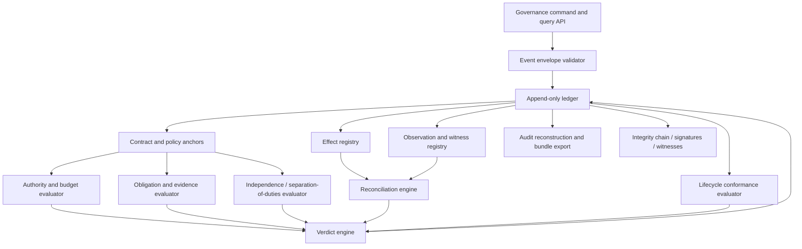

## 4. Canonical records

Commissaire should keep a small number of stable records.

### Governance event

```yaml
id: evt_01J...
taskId: task_01J...
runId: run_01J...
contractVersion: 3
policyBundle: software-delivery@0.4.0
sequence: 184
occurredAt: 2026-08-08T16:05:00Z
recordedAt: 2026-08-08T16:05:01Z
actor:
  type: worker
  laneId: implementation
  workerId: codex-17
  principalId: service-account/codex-runner
causationId: cmd_01J...
correlationId: stage_01J...
type: domain.software.effect.declared
schema: domain.software.effect.declared@1
payloadRef: artifact://sha256/...
previousHash: sha256:...
eventHash: sha256:...
witnesses: []
```

The envelope is generic. The domain owns the payload schema. Commissaire validates registration, identity, sequence, integrity, and policy facts derived from it.

### Contract anchor

Commissaire need not author the full contract. It stores or references:

```text
contract ID and immutable version
content hash
schema version
pack and pack version
admission decision
policy-bundle versions
review/evidence references required for admission
superseded version relation
```

### Obligation

```yaml
id: required-independent-review
kind: evidence
appliesAt: checkpoint/pre-commit
required:
  evidenceType: review.independent
  minimumCount: 1
constraints:
  actorLaneNotIn: [implementation]
  artifactVersionEquals: current-candidate
onMissing: block
```

### Effect

```yaml
id: effect_01J...
type: domain.software.merge
status: proposed | authorised | attempted | declared | observed | reconciled | disputed
capability: repository.merge
subject: github://shftwst/faff/pull/123
requestedBy: lane/ship
approvalRef: approval_01J...
declaredOutcomeRef: artifact://...
observationRefs: [observation_01J...]
```

### Verdict

```yaml
id: verdict_01J...
checkpoint: pre-commit
result: allow | block | approval-required | park | escalate | reject | accept
contractVersion: 3
facts:
  - obligation: required-independent-review
    status: satisfied
  - authority: repository.merge
    status: approval-required
reasons:
  - code: APPROVAL_MISSING
    message: Named release approval has not been recorded.
```

## 5. Command surface

A first narrow API may include:

```text
admit_contract
record_event
register_obligation
request_authority_verdict
request_checkpoint_verdict
propose_effect
record_approval
record_declared_effect
record_observation
request_reconciliation
request_terminal_verdict
verify_integrity
reconstruct_audit
```

The API should accept structured facts and return explicit decisions. It should never accept an unconstrained prompt and “decide” governance through model reasoning.

## 6. Decision semantics

Recommended decision vocabulary:

| Decision | Meaning |
|---|---|
| `allow` | The requested transition/action is mechanically permitted now. |
| `deny` | The action is outside authority or violates a hard rule. |
| `approval-required` | An eligible approval must be recorded before retry. |
| `evidence-required` | Required evidence is missing or invalid. |
| `amendment-required` | Active contract does not permit the requested change. |
| `block` | Progress cannot continue until a condition is corrected. |
| `park` | Human or external resolution is required; the run remains explicit and resumable. |
| `escalate` | Policy requires a named role or higher authority. |
| `reject` | The candidate outcome or run cannot be accepted under this contract. |
| `accept` | All required mechanically expressible obligations for terminal acceptance are satisfied. |

A `semantic-pass` is evidence, not a Commissaire decision vocabulary item unless policy translates a structured evaluator result into a deterministic threshold fact.

## 7. Evidence model

Commissaire should distinguish evidence assurance levels:

1. **Self-attested:** supplied by the worker whose work is being assessed.
2. **Runtime-observed:** captured by SuperDomestique or an adapter during execution.
3. **Independent evaluator:** produced by a separate lane/worker under declared independence rules.
4. **Externally observed:** queried from the system in which the effect should exist.
5. **Witnessed/signed:** supplied by an independent trusted principal or cryptographic witness.

Policies specify which assurance level is sufficient. A screenshot or prose claim should not satisfy an obligation requiring an external observation.

## 8. Independence and lineage

Commissaire must evaluate independence from structured lineage, not labels alone. Possible facts include:

- lane ID and responsibility;
- worker ID and principal;
- model/harness identity;
- context lineage or artifact access;
- parent invocation;
- shared mutable workspace;
- whether the evaluator saw hidden implementation context;
- organisation-defined conflicts.

The initial proof can implement simple lane-identity rules. The schema should allow stronger lineage later.

## 9. Effect mediation and reconciliation

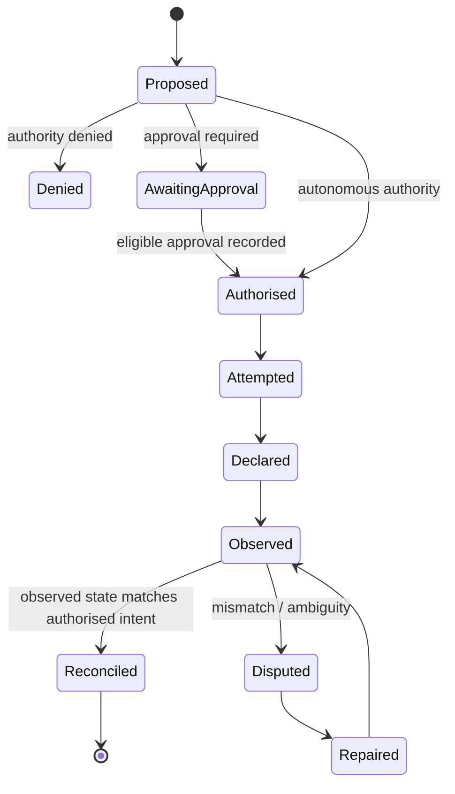

High-assurance effects should be mediated before execution. Lower-assurance integrations may only provide observation. The record must say which assurance mode applied.

## 10. Lifecycle conformance

SuperDomestique owns and operates the lifecycle graph. Commissaire receives the admitted graph or a stable digest and verifies:

- requested transition exists;
- predecessor conditions are satisfied;
- required stage instances occurred;
- required correction loops completed;
- current contract version applies;
- no prohibited skip occurred;
- terminal state is permitted;
- all admitted work has disposition.

Commissaire should not choose the next stage or interpret what `architecture` means.

## 11. Persistence

The first extraction should preserve existing ledger mechanics where possible. A long-term design may offer:

- embedded file/git ledger for local mode;
- SQLite for local runtime mode;
- append-only database/event store for service mode;
- exported signed audit bundles.

The storage backend must not change event meaning.

## 12. Security properties

Minimum properties:

- append-only logical history;
- idempotent event ingestion;
- sequence and causation validation;
- contract/policy version pinning;
- actor authentication boundary supplied by host runtime;
- payload hashes for external artifact storage;
- explicit redaction/retention metadata;
- no hidden chain-of-thought requirement;
- fail closed when an obligation cannot be evaluated.

## 13. Compatibility with current FAFF

Current `governance-check` should initially become a Software Delivery pack composition over Commissaire APIs. Existing event names may be accepted through a translation adapter. The first extraction should avoid breaking public commands or artifact conventions.

## 14. Core conformance tests

The core test suite should include:

- domain vocabulary rejection in core schemas;
- missing-evidence fail closed;
- worker self-review rejected when independence required;
- approval recorded after effect does not retroactively authorise it;
- duplicate event replay is idempotent;
- declared/observed mismatch produces disputed effect;
- contract amendment creates a new immutable chain;
- ledger tampering is detected;
- admitted task without terminal disposition cannot yield run completion;
- semantic evaluator result is treated as evidence, not unqualified truth.


---

# FILE: 06-superdomestique-runtime.md

# SuperDomestique Runtime Design

**Status:** Proposed generic runner extracted from current FAFF operating behaviour.

## 1. Definition

> **SuperDomestique is a runtime for safe progressive autonomy. It turns an admitted task contract and domain pack into a visible, bounded, interruptible execution across lifecycle stages and lanes, coordinates external workers, and uses Commissaire to govern progression and acceptance.**

It is the active system. It owns the loop.

```text
Commissaire: “Is this allowed and evidenced?”
SuperDomestique: “What runs next, in which lane, with which worker and context?”
```

## 2. Runtime responsibilities

SuperDomestique owns:

- task creation and operational identity;
- active contract versions and amendment orchestration;
- domain-pack loading and compatibility checks;
- lifecycle graph instances;
- stage scheduling and dependencies;
- lane creation, assignment, occupancy, and visibility;
- worker selection and invocation;
- context, artifact, and evidence routing;
- concurrency, pause, park, resume, cancellation, and correction;
- approvals and human intervention UX;
- runtime state projections and query/command APIs;
- requests to Commissaire for admission, authority, checkpoint, effect, and terminal verdicts;
- compatibility facades for current FAFF commands and tracker workflows.

## 3. Runtime components

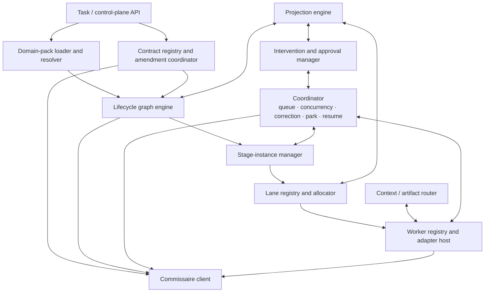

## 4. Task model

A runtime task contains operational state, not governance truth alone:

```yaml
id: task_01J...
type: software.change
pack: software-delivery@0.4.0
contract:
  id: contract_01J...
  activeVersion: 3
lifecycle:
  graph: software.standard-change@2
  status: running
  activeStages: [implementation]
lanes:
  - id: implementation
    state: occupied
    worker: codex-17
  - id: independent-review
    state: ready
runtime:
  createdAt: ...
  paused: false
  parkReason: null
projections:
  githubIssue: shftwst/faff#123
```

The canonical governance history is recorded through Commissaire; runtime state is reconstructed or checked against that history.

## 5. Lifecycle graph engine

The engine should support:

- directed acyclic paths and controlled loops;
- required and optional stages;
- parallel stages;
- stage entry/exit conditions;
- correction edges;
- approval pauses;
- manual or automated stage assignment;
- domain custom stages;
- pack-defined terminal states;
- graph version pinning per task.

Example generic graph:

```yaml
stages:
  specify:
    responsibility: specify
    next: [challenge]
  challenge:
    responsibility: challenge
    onPass: [execute]
    onRevise: [specify]
  execute:
    responsibility: execute
    next: [verify]
  verify:
    responsibility: verify
    onPass: [commit]
    onCorrect: [execute]
  commit:
    responsibility: commit-effect
    next: [reconcile]
  reconcile:
    responsibility: reconcile
    onPass: [accept]
    onRepair: [commit]
```

The runtime operates graph state. Commissaire verifies that transitions conform to the admitted graph and obligations.

## 6. Bounded lanes

A lane is a runtime boundary combining responsibility, authority, identity, and visibility.

```yaml
id: implementation
responsibilities: [execute, correct]
workers:
  selector: software.coding
  preferred:
    - adapter: claude-code
      model: sonnet
context:
  include: [contract, specification, repository]
  exclude: [holdout-private-rubric]
tools:
  allow: [repo.read, repo.write, test.run]
  deny: [repo.merge, deploy.production]
authority:
  reversibleWrites: autonomous
  externalEffects: prohibited
budgets:
  elapsed: PT90M
  modelCostCad: 20
independence:
  cannotSatisfy: [review.independent, holdout.code-blind]
visibility:
  exposeProgress: true
  exposeArtifacts: true
```

Lane definition belongs to a pack or overlay. Lane instance and activity belong to SuperDomestique. Authority facts and resulting verdicts belong to Commissaire.

## 7. Worker selection

Worker selection may be:

- fixed by pack;
- configured by organisation/project overlay;
- selected from a compatible capability registry;
- manually assigned;
- escalated to a human;
- changed on retry or fallback.

Selection constraints may include:

```text
required input/output schemas
harness availability
model class
local/private deployment
cost ceiling
latency target
tool requirements
data residency
independence from prior lanes
```

The runtime records the selected worker before invocation so Commissaire can evaluate identity and authority.

## 8. Context and artifact routing

SuperDomestique should pass structured context rather than an uncontrolled transcript:

- active contract and relevant version;
- stage contract;
- permitted source artifacts;
- prior outputs explicitly allowed by the lane;
- tool/capability grants;
- evidence obligations the worker is expected to produce;
- budget and interruption semantics;
- domain prompt/skill assets.

Artifacts should be content-addressed where practical. The runtime passes references; Commissaire records hashes and provenance.

## 9. Coordination

The coordinator handles operational concerns:

- ready-queue calculation;
- lane occupancy and concurrency;
- worker start/heartbeat/timeout;
- transient retry policy;
- correction routing;
- human approval waits;
- park and resume;
- cancellation and compensation request;
- fallback worker selection;
- durable continuation through external runtimes where configured.

SuperDomestique should not reproduce Temporal-grade durable execution in its first version. A worker adapter may delegate a stage or subgraph to Temporal/n8n/LangGraph while SuperDomestique remains the supervisory runtime.

## 10. Intervention model

Interventions are commands, not hidden side conversations:

```text
pause task
resume task
park with reason
cancel task
approve/deny proposed effect
add evidence
replace worker
request correction
amend contract
accept policy exception
escalate to role
```

A material command is recorded through Commissaire and may trigger a new contract version or stage replay.

## 11. Control-plane API

Queries:

```text
get_task
list_tasks
get_contract_history
get_lifecycle_state
get_lane_state
get_required_evidence
get_effects
get_blocks_and_parks
get_pending_approvals
get_audit_timeline
```

Commands:

```text
submit_intent
draft_contract
request_admission
pause
resume
park
cancel
approve_effect
deny_effect
add_evidence
amend_contract
request_correction
assign_worker
```

Domain packs may add views and forms, but generic state remains available through this API.

## 12. Runtime state versus governance state

Avoid two conflicting truths:

```text
Commissaire ledger
    authoritative immutable record of governed facts and verdicts

SuperDomestique state
    operational projection used to coordinate work
```

SuperDomestique may use a local state store for performance, but it must be reconstructable or reconcilable from the governance ledger plus worker/system observations. A mismatch is a runtime integrity fault.

## 13. Progressive-autonomy presets

The current L1–L4 model should remain as an operator-friendly layer.

```text
L1 preset
    human workers for execution; AI may plan/prepare

L2 preset
    agent workers; human approval at configured gates

L3 preset
    unattended progression inside authority envelope;
    ambiguity parks rather than guessing

L4 preset
    unattended progression plus mandatory independent challenge,
    holdout/evaluation, stronger isolation, and stricter fail-closed rules
```

A pack compiles each preset into lane, authority, evidence, and approval defaults. A task may override capabilities within policy.

## 14. Compatibility surface

Current FAFF commands should map onto runtime actions:

| Current command/concept | Transitional runtime mapping |
|---|---|
| `/faff-jot` | Intent capture and task/contract drafting |
| `/faff-plot` | Domain-aware initiative/lifecycle planning |
| `/faff-prep` | Run `specify` stages in Software Delivery pack |
| `/faff-graft` | Start an L2 Software Delivery task |
| `/faff-beep-boop` | Drain eligible L3 tasks using runtime scheduler |
| `faff lights-out` | Start L4 preset with stronger pack policies |
| slot | Compatibility selector that compiles into lane worker configuration |
| appetite | Compatibility configuration that compiles into budgets/authority |
| tracker status | Software projection of runtime lifecycle state |

## 15. Runtime conformance tests

- adding a domain pack does not require runtime source changes;
- graph versions remain pinned for active tasks;
- lane permissions cannot exceed contract authority;
- worker replacement preserves task and evidence history;
- a parked task resumes at an explicit recoverable point;
- a material amendment invalidates or replays affected stages;
- current FAFF compatibility commands produce equivalent visible outcomes;
- runtime state can be reconstructed/reconciled from governance history;
- control-plane clients cannot bypass Commissaire verdicts.


---

# FILE: 07-domain-pack-model.md

# Domain Pack Model

**Status:** Proposed extension and composition model.

## 1. Definition

> **A domain pack is a versioned, installable operating model for a concrete class of delegated work. It defines lifecycle composition, domain stages, bounded lanes, policy, evidence, worker bindings, system adapters, effects, observations, terminology, and optional control-plane extensions.**

A pack is more than prompt configuration and less than a standalone runtime.

## 2. Pack hierarchy

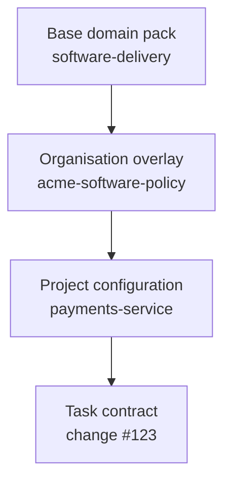

### Base pack

Reusable domain lifecycle and default policy.

### Organisation overlay

Organisation-specific standards, approved workers, data policy, approvals, and risk appetite.

### Project or process configuration

Repository, service, business-unit, connector, environment, and local policy details.

### Task contract

The immutable admitted instance for one delegated outcome.

## 3. Pack contents

```text
domain-pack/
├── pack.yaml
├── task-types/
├── contracts/
├── lifecycles/
├── stages/
├── lanes/
├── policies/
├── evidence/
├── evaluators/
├── workers/
├── effects/
├── observations/
├── adapters/
├── prompts/
├── skills/
├── projections/
├── terminology/
├── tests/
└── migrations/
```

Not every pack needs every directory.

## 4. Pack manifest

```yaml
apiVersion: superdomestique.dev/v1alpha1
kind: DomainPack
metadata:
  name: software-delivery
  version: 0.4.0
  description: Progressively autonomous software delivery
compatibility:
  superdomestique: ">=0.2 <0.3"
  commissaire: ">=0.2 <0.3"
provides:
  taskTypes:
    - software.change
    - software.project
  lifecycleGraphs:
    - software.standard-change@2
  laneTemplates:
    - specification
    - architecture
    - implementation
    - independent-review
    - holdout
    - ship
  workerBindings:
    - software.coding
    - software.review
  policyBundles:
    - software.default@3
entrypoints:
  compiler: ./contracts/compiler.ts
  registration: ./register.ts
```

## 5. Lifecycle composition

A pack uses generic responsibilities and adds domain stages:

```yaml
stages:
  specification:
    responsibility: specify
  architecture:
    responsibility: plan
    optionalWhen: "change.architectureImpact == none"
  adversarial-spec-review:
    responsibility: challenge
  environment-standup:
    responsibility: execute
    subtype: prepare-environment
  implementation:
    responsibility: execute
  code-review:
    responsibility: verify
  holdout:
    responsibility: verify
    independence: code-blind
  merge:
    responsibility: commit-effect
  deployment-observation:
    responsibility: observe
  delivery-acceptance:
    responsibility: accept
```

Custom stage names are allowed. Generic responsibility tags let the runtime and control plane reason consistently across domains.

## 6. Lane templates

Packs define responsibilities and constraints; overlays choose workers and local details.

```yaml
id: independent-review
responsibilities: [challenge, verify]
inputs:
  allow: [contract, candidate-artifact, public-domain-context]
  deny: [implementation-private-notes]
outputs:
  schema: software.review-finding@2
independence:
  disallowPriorLaneOccupancy: [implementation]
  requireFreshContext: true
tools:
  allow: [repo.read, test.run]
  deny: [repo.write, repo.merge]
```

## 7. Policy and evidence

A pack registers domain evidence types:

```text
software.specification
software.adr
software.test-result
software.code-review
software.holdout-verdict
software.ci-observation
software.deployment-observation
```

It maps them to generic obligation facts without teaching Commissaire software semantics.

Example adapter result:

```yaml
obligation: candidate.required-ci
status: satisfied
evidence:
  type: software.ci-observation
  ref: artifact://sha256/...
assurance: externally-observed
facts:
  commit: abc123
  requiredChecksPassed: true
```

## 8. Worker bindings

A pack declares semantic bindings:

```yaml
id: software.coding
compatibleResponsibilities: [execute, correct]
inputSchema: software.implementation-assignment@2
outputSchema: software.change-candidate@2
adapters:
  - claude-code
  - codex
  - human-engineer
requiredCapabilities:
  - repository.read
  - repository.write
```

SuperDomestique chooses and invokes an adapter. The pack does not implement scheduling or lifecycle state.

## 9. Effects and observations

A pack defines effect semantics:

```yaml
id: software.merge
capability: repository.merge
requestSchema: software.merge-request@1
declaredSchema: software.merge-declared@1
observationAdapter: github.pull-request-observer
reconciliation: exact-commit-and-target-branch
```

A supplier pack might similarly define `supplier.erp-record-create`. Commissaire sees generic effect status and adapter-produced facts.

## 10. UI and terminology extensions

The generic control plane uses generic labels. Packs may supply:

- stage names and descriptions;
- artifact renderers;
- domain summary cards;
- approval forms;
- timeline event renderers;
- links to external systems;
- domain-specific filters and search facets.

They must not create hidden alternative lifecycle state.

## 11. Pack composition and conflicts

Overlays may:

- add stricter obligations;
- narrow authority;
- replace worker selectors;
- add stages/checkpoints;
- add evidence requirements;
- override labels and projections;
- configure external systems.

They should not silently weaken a base pack or organisation policy. Weakening requires an explicit exception or policy-authorised override recorded in the contract.

## 12. Pack versioning

- active tasks pin exact pack, graph, schema, and policy versions;
- patch versions may fix compatible implementation details;
- lifecycle or evidence meaning changes require a new version;
- task migration is explicit, never automatic during execution;
- old versions remain available for audit reconstruction;
- signatures or trusted registries may be added later.

## 13. Domain-pack conformance suite

A valid pack must prove:

- manifest and compatibility are valid;
- all lifecycle stages map to known generic responsibilities or declared extensions;
- lane inputs/outputs and authority are explicit;
- every consequential effect has an authority policy and observation strategy;
- required semantic evaluators return structured evidence;
- no pack directly mutates runtime or governance stores;
- a dry-run task can be compiled and admitted;
- seeded policy failures are blocked;
- pack terminology does not leak into core schemas.

## 14. Software Delivery pack migration

The first Software Delivery pack should initially wrap current assets:

```text
commands and skills
    become compatibility entrypoints and lane prompt/skill assets

slots
    compile into lane worker selectors

appetite
    compiles into budgets and authority defaults

tracker statuses
    become GitHub/Linear projection mappings

PR/CI/holdout rules
    become evidence and effect adapters plus pack policies
```

The pack should preserve the current user experience before it attempts a cleaner native runtime UX.


---

# FILE: 08-lifecycle-lanes-and-workers.md

# Lifecycle Primitives, Bounded Lanes, and Workers

**Status:** Proposed core operating model for SuperDomestique.

## 1. Conceptual model

```text
Lifecycle graph
    defines responsibilities and dependency order

Stage instance
    is one concrete occurrence of a lifecycle responsibility

Lane
    is the bounded execution context assigned responsibility

Worker
    is the model, agent, workflow, service, or human occupying a lane

Prompt / skill / rubric
    is a behaviour asset configured for the worker and stage
```

This separates orchestration from implementation.

## 2. Lifecycle primitives

The initial vocabulary should remain small:

| Primitive | Responsibility |
|---|---|
| `intent` | Capture the requested outcome and source request. |
| `admit` | Determine whether the task and contract are eligible to run. |
| `specify` | Turn intent into an explicit outcome contract. |
| `challenge` | Independently test assumptions, scope, risk, and plan. |
| `plan` | Produce a domain execution design or decomposition. |
| `execute` | Perform reversible or preparatory work. |
| `verify` | Evaluate artifacts or state against contract requirements. |
| `approve` | Obtain authority from an eligible human/system. |
| `commit-effect` | Perform a consequential external action. |
| `observe` | Independently inspect external state. |
| `reconcile` | Compare intent, authorisation, declaration, and observation. |
| `accept` | Establish terminal satisfaction of the contract. |
| `correct` | Repair work after failed verification. |
| `park` | Suspend with explicit unresolved state and required intervention. |
| `escalate` | Route to a higher authority or specialist. |
| `cancel` | End under an authorised cancellation disposition. |

These are responsibility tags, not mandatory commands or fixed stages.

## 3. Graph composition

A domain pack may create:

### Linear flow

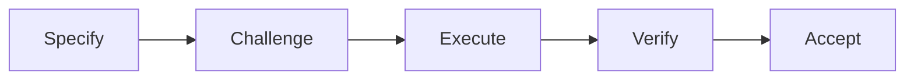

### Parallel evidence collection

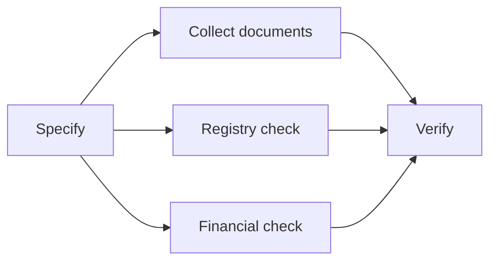

### Corrective loop

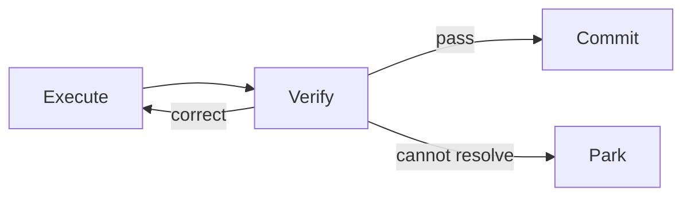

### Approval and effect

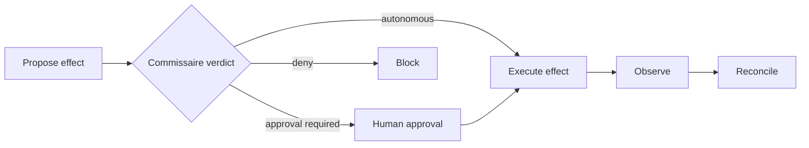

## 4. Stage contract

Each stage should declare:

```yaml
id: code-review
responsibility: verify
inputs:
  - contract.current
  - artifact.change-candidate
outputs:
  - evidence.software.code-review
entry:
  requires:
    - stage.implementation.completed
exit:
  passWhen:
    - evidence.review.blocking-findings == 0
  onFailure: implementation
lane: independent-review
checkpoint: pre-merge
```

This lets the runtime coordinate and Commissaire verify without understanding code review semantics.

## 5. Lane as boundary

A lane combines:

```text
responsibility
identity
context visibility
tool and data access
authority
budget
worker compatibility
independence rules
artifact contracts
interruption semantics
operator visibility
```

A lane is durable across worker replacement if policy permits. A worker is an occupant, not the lane itself.

## 6. Lane examples

### Software implementation lane

```yaml
id: implementation
responsibilities: [execute, correct]
context:
  include: [contract, spec, adr, repository]
  exclude: [holdout-private-rubric]
tools:
  allow: [repo.read, repo.write, test.run]
  deny: [repo.merge, deploy.production]
authority:
  reversibleRepositoryWrites: autonomous
  externalEffects: prohibited
independence:
  cannotProduce: [review.independent, holdout.code-blind]
```

### Supplier risk lane

```yaml
id: risk-assessment
responsibilities: [verify]
context:
  include: [contract, supplier-documents, registry-evidence]
tools:
  allow: [documents.read, policy.read]
  deny: [erp.write, external.email]
authority:
  recommendations: autonomous
  supplierApproval: prohibited
outputs:
  schema: supplier.risk-assessment@1
```

### Human approval lane

```yaml
id: procurement-approval
responsibilities: [approve]
workerType: human
eligibleRoles: [procurement-manager]
context:
  include: [contract, evidence-summary, proposed-effect]
authority:
  capabilities: [supplier.erp-record-create]
timeout:
  after: P2D
  onTimeout: escalate
```

## 7. Prompts and skills

Prompts, skills, and rubrics should be resolved from the pack and overlay:

```yaml
behaviour:
  systemPrompt: prompts/software-review.md
  skills:
    - skills/security-review
    - skills/accessibility-review
  rubric: rubrics/code-review@2
```

They can vary without changing lifecycle structure. A stage may swap the worker or behaviour asset while preserving the lane contract and evidence schema.

## 8. Independence models

Initial independence checks:

- different lane ID;
- worker not previously assigned to conflicting lane;
- context exclusion rules respected;
- immutable artifact version reviewed;
- review occurred after candidate creation;
- reviewer lacks prohibited write/effect capability.

Later models may include:

- different model provider or model family;
- isolated workspaces;
- blinded rubrics or candidate provenance;
- separate organisational principal;
- signed human attestation.

## 9. Visibility

The control plane should show lanes explicitly:

```text
Specification lane        complete       Opus / 12m / $3.10
Adversarial lane          complete       Command A / 4 findings
Implementation lane       running        Codex / heartbeat 22s ago
Independent review lane   waiting        blocked on candidate
Ship lane                 not authorised approval required
```

This gives the operator a mental model of responsibility and separation, not merely model invocations.

## 10. Worker categories

| Worker type | Examples | Runtime responsibility |
|---|---|---|
| Agent harness | Claude Code, Codex, Cohere agent | Invoke with bounded context/tools; collect artifacts/events. |
| Workflow engine | n8n, Temporal, LangGraph | Start/signal/observe sub-workflow; maintain supervisory contract. |
| Deterministic service | validator, registry client, CI | Call structured API; record result and provenance. |
| Human | reviewer, approver, specialist | Present assignment; record structured decision and identity. |
| External system | GitHub, ERP, CRM | Usually effect target or observation source rather than reasoning worker. |

## 11. Worker replacement

A task should survive replacement:

```text
worker A times out
    → lane records interruption
    → runtime requests retry/fallback policy
    → worker B receives permitted artifacts and state
    → prior evidence remains attributed to worker A
    → no duplicate external effect occurs
```

Idempotency and effect state are mandatory around retries.

## 12. Anti-patterns

- treating each skill as a lane;
- allowing a prompt to redefine authority;
- using model identity as the only independence guarantee;
- hiding lane changes inside retry logic;
- passing the full prior transcript to every lane;
- letting a domain pack directly invoke a worker outside the runtime protocol;
- making every domain use the same named stages;
- building a workflow canvas before pack APIs stabilise.


---

# FILE: 09-contract-state-and-events.md

# Delegation Contract, Runtime State, and Event Model

**Status:** Proposed foundational schemas.

## 1. Delegation Contract

The primary task artifact should be an immutable, versioned **Delegation Contract**.

> A delegation contract states the outcome being delegated, the scope and authority granted, the lifecycle and evidence obligations that apply, and the conditions under which the outcome may be accepted.

It generalises a software specification without assuming that all tasks produce code.

## 2. Contract shape

```yaml
apiVersion: superdomestique.dev/v1alpha1
kind: DelegationContract
metadata:
  id: task/supplier-acme
  version: 3
  taskType: supplier.onboarding
  domainPack: supplier-onboarding@0.1.0
  createdBy: principal/alec
  createdAt: 2026-08-08T14:00:00Z
  supersedes: 2

intent:
  outcome: Produce an approval-ready supplier onboarding package.
  rationale: Proposed supplier for facilities maintenance.
  sourceRequest: request://procurement/8821

scope:
  subjects:
    - supplier: Acme Services Ltd
  inputs:
    - artifact://supplier-questionnaire
    - artifact://insurance-certificate
  exclusions:
    - Do not send external communications.
    - Do not create a production ERP record before approval.
  assumptions:
    - Supplier operates only in Canada.
  unresolvedQuestions: []

autonomy:
  preset: L3
  authority:
    - capability: documents.read
      mode: autonomous
    - capability: registry.query
      mode: autonomous
    - capability: supplier.risk-summary.write
      mode: autonomous
    - capability: supplier.erp-record-create
      mode: approval-required
      approverRole: procurement-manager
    - capability: external.email.send
      mode: prohibited
  budgets:
    elapsed: PT2H
    modelCostCad: 10

lifecycle:
  graph: supplier.standard-onboarding@1
  requiredStages:
    - contract-review
    - evidence-collection
    - risk-assessment
    - approval
    - reconciliation

obligations:
  evidence:
    - id: legal-name-consistency
      type: supplier.identity-consistency
      minimumAssurance: runtime-observed
    - id: insurance-validity
      type: supplier.insurance-verification
      minimumAssurance: externally-observed
  evaluations:
    - id: risk-summary
      rubric: supplier.risk-summary@1
      minimumScore: 0.85
      independentLane: true
  approvals:
    - effect: supplier.erp-record-create
      role: procurement-manager

acceptance:
  deterministic:
    - all-required-obligations-satisfied
    - no-prohibited-effects
    - all-declared-effects-reconciled
    - every-admitted-stage-has-disposition
  semantic:
    - evaluation: risk-summary
      status: pass
  permittedTerminalStates:
    - accepted
    - rejected
    - cancelled
    - expired
  onUnresolved: park

changeControl:
  amendableBy:
    - requester
    - procurement-manager
  reReviewWhenChanged:
    - scope
    - authority
    - acceptance
    - lifecycle
```

## 3. Contract compiler

Natural-language intent may be compiled by a domain pack into a draft contract. Compilation is not admission.

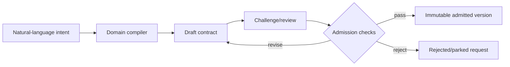

The compiler should surface assumptions and unresolved questions. It must not hide policy choices inside a prompt.

## 4. Contract amendment

Material intervention creates a new version:

```text
v3 active
human changes allowed recipient or acceptance threshold
    → amendment proposed
    → impacted obligations/stages calculated
    → review/admission as required
    → v4 admitted
    → affected stages invalidated or replayed
    → unaffected evidence remains linked where policy permits
```

The runtime coordinates this process. Commissaire anchors both versions, the authorisation, and the impact decision.

## 5. Runtime state model

Suggested generic task states:

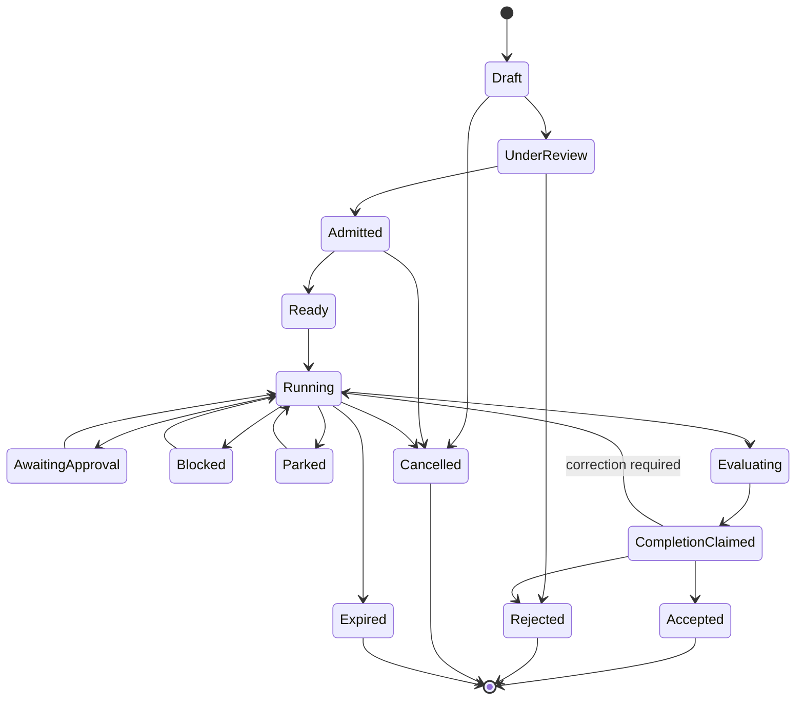

`CompletionClaimed` is deliberately distinct from `Accepted`.

## 6. Stage-instance state

```text
pending
ready
assigned
running
awaiting-input
awaiting-approval
blocked
parked
completed
failed
cancelled
invalidated
superseded
```

A correction edge creates a new stage attempt linked to the failed attempt rather than rewriting history.

## 7. Lane state

```text
unconfigured
available
reserved
occupied
waiting
interrupted
released
faulted
```

Lane occupancy records worker identity, start/end time, budgets, inputs, outputs, and heartbeat state.

## 8. Event model

### Generic event categories

```text
contract.*
task.*
lifecycle.*
stage.*
lane.*
worker.*
evidence.*
evaluation.*
authority.*
approval.*
effect.*
observation.*
reconciliation.*
intervention.*
verdict.*
integrity.*
```

### Domain event categories

```text
domain.software.*
domain.supplier.*
domain.contract-review.*
```

Domain events use the generic envelope and registered payload schemas.

## 9. Event examples

```text
contract.draft-created
contract.review-requested
contract.admitted
contract.amendment-proposed
contract.superseded

task.ready
task.running
task.parked
task.completion-claimed
task.accepted

stage.assigned
stage.started
stage.artifact-produced
stage.completed
stage.invalidated

lane.occupied
lane.heartbeat
lane.released
lane.independence-violation

worker.invoked
worker.interrupted
worker.failed
worker.replaced

evidence.recorded
evidence.superseded
evidence.obligation-satisfied

authority.requested
authority.allowed
authority.approval-required
authority.denied

effect.proposed
effect.authorised
effect.declared
effect.observed
effect.reconciled
effect.disputed

intervention.pause
intervention.resume
intervention.correct
intervention.exception-granted

verdict.checkpoint-allow
verdict.checkpoint-block
verdict.terminal-accept
verdict.terminal-reject
```

## 10. Event payload discipline

The event envelope should be stable and small. Large outputs live in an artifact store and are referenced by content hash. Payload schemas should contain declared facts rather than freeform transcripts wherever possible.

```yaml
type: evaluation.completed
payload:
  evaluationId: eval_01J...
  rubric: software.code-review@2
  candidateArtifact: artifact://sha256/...
  result: fail
  score: 0.72
  findingsRef: artifact://sha256/...
  evaluatorLane: independent-review
```

## 11. Provenance

Every artifact/evidence record should support:

- producer principal, lane, and worker;
- task/run/stage attempt;
- active contract and pack versions;
- source artifact lineage;
- content hash;
- created/observed time;
- assurance level;
- redaction and retention metadata;
- supersession relation.

## 12. No chain-of-thought requirement

The system should not require private hidden reasoning. It should request audit-appropriate outputs:

- decisions;
- findings;
- explicit assumptions;
- source references;
- structured rationale;
- unresolved uncertainty;
- proposed actions;
- evidence and artifact references.

## 13. Schema evolution

- active tasks pin exact schemas;
- registered adapters translate old domain events where possible;
- generic envelope changes require careful compatibility rules;
- pack migrations are explicit;
- audit bundles include schema identifiers;
- no background migration may reinterpret historical evidence silently.


---

# FILE: 10-control-plane.md

# Control Plane and Human Interaction Model

**Status:** Proposed product and interaction design.

## 1. Thesis

> **As autonomy increases, the conversation stops being the primary interface. The state of delegated work becomes the interface.**

At L1 and L2, chat or terminal interaction may be adequate because a human is close to each decision. At L3 and L4, the operator needs a control plane that communicates what has been delegated, what is happening, what evidence exists, where authority stops, and what requires intervention.

## 2. Ownership

SuperDomestique owns the generic control-plane model and APIs. Domain packs extend views and terminology. Commissaire supplies governed facts and verdicts. Trackers and external tools become projections and command surfaces.

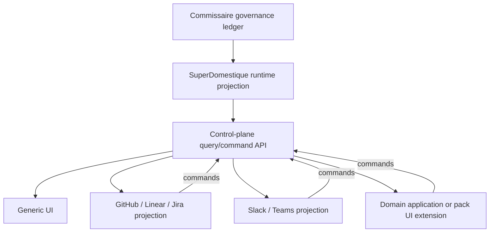

## 3. Generic task view

A task view should answer these questions without opening logs:

1. What outcome was requested?
2. Which contract version is active?
3. What authority and exclusions apply?
4. Where is the task in its lifecycle?
5. Which lanes/workers are active or waiting?
6. What evidence is required, present, missing, or invalid?
7. What effects are proposed, approved, completed, or unreconciled?
8. What is blocked or parked, and what exact action resolves it?
9. What has a human changed or approved?
10. Why was the result accepted or rejected?

## 4. Example generic summary

```text
Supplier onboarding — Acme Services Ltd
Contract v3 · L3 preset · running · 68% obligations satisfied

Lifecycle
✓ Contract specified
✓ Adversarial challenge
✓ Documents collected
! Identity verification blocked
○ Risk assessment waiting
○ Procurement approval not started
○ ERP effect not authorised

Active lane
Evidence verification · Registry worker · 6m 12s · $0.42

Needs attention
Legal name in insurance certificate does not match incorporation record.
Choose: provide corrected document · accept named exception · reject supplier

Effects
ERP record create · approval required · not attempted
External email · prohibited

Evidence
8 required · 5 satisfied · 1 disputed · 2 waiting
```

## 5. Control-plane views

### Portfolio / queue

- tasks by state, risk, pack, autonomy preset, owner, and age;
- tasks awaiting human action;
- parks and escalations;
- budget/latency alerts;
- unreconciled effects;
- failed integrity or conformance checks.

### Task overview

- intent and scope;
- contract summary and versions;
- lifecycle map;
- lanes and worker activity;
- blockers, approvals, effects, evidence;
- concise timeline.

### Contract view

- human-readable contract;
- structured authority matrix;
- obligations and acceptance criteria;
- amendment diff;
- review and admission status.

### Lifecycle view

- stages and attempts;
- dependencies and correction loops;
- current and next possible transitions;
- invalidated/superseded stages after amendment.

### Lane view

- responsibility;
- worker identity and configuration;
- allowed context/tools/capabilities;
- consumed budget;
- heartbeat and progress;
- artifacts produced;
- independence constraints.

### Evidence view

- obligation coverage;
- evidence type and assurance;
- producer and lineage;
- affected contract version;
- validity and expiry;
- competing/disputed evidence.

### Effect view

- proposed effect and capability;
- authority decision;
- approval history;
- execution attempt;
- declared outcome;
- external observation;
- reconciliation result.

### Audit view

- immutable timeline;
- filters by task, stage, lane, worker, evidence, effect, or decision;
- exportable audit bundle;
- integrity verification.

## 6. Commands and interventions

Every action should explain its consequences before submission.

```text
Pause
    Stop scheduling new work; do not revoke current safe operation unless requested.

Park
    Suspend with explicit reason and required resolution.

Resume
    Continue from a validated recoverable state.

Correct
    Route findings to an eligible stage/lane and create a new attempt.

Approve / deny
    Decide a named effect or exception under a declared role.

Amend contract
    Create a new version; show impacted stages and evidence.

Replace worker
    Interrupt/release current worker and reassign the lane.

Cancel
    Apply explicit terminal disposition and compensation requirements.
```

## 7. Natural language

Natural language can:

- submit intent;
- explain state;
- query evidence;
- propose an amendment;
- describe an intervention;
- request a summary.

It should compile into structured commands and show a confirmation diff for consequential changes.

```text
“Don't contact the supplier until Legal reviews the clause.”

Proposed amendment:
- external.email.send: prohibited until legal-review evidence satisfied
- add required stage: legal-review before supplier-communication
- invalidate current communication-preparation stage: no

[Review and admit amendment]
```

## 8. Tracker projection for software delivery

The existing tracker experience should remain strong:

| Runtime concept | GitHub/Linear projection |
|---|---|
| Task | Issue/ticket |
| Contract | Linked spec / issue document |
| Lifecycle state | Status/labels/checks |
| Park | Explicit parked state and reason |
| Approval | Review/check/command UI |
| Candidate effect | Pull request / deployment request |
| Verdict | Required status check |
| Audit detail | Linked SuperDomestique task timeline |

The tracker projection may remain the default Software Delivery UI, but it no longer needs to store every canonical runtime fact.

## 9. Domain extensions

A supplier pack may add:

- document checklist;
- legal-name comparison;
- sanctions/registry summary;
- risk matrix;
- procurement approval form;
- ERP record preview.

A software pack may add:

- spec and ADR renderer;
- code/PR links;
- test and CI matrix;
- review and holdout findings;
- release/deployment state.

Extensions read generic APIs and domain artifacts. They do not create a second hidden state machine.

## 10. Information-design principles

- show the current decision and required intervention before historical detail;
- distinguish deterministic verdicts from semantic opinions visually and textually;
- show evidence assurance, not only existence;
- expose authority boundaries and forbidden effects;
- make parks actionable;
- make amendments and invalidations legible;
- summarise cost/time without turning the interface into model telemetry;
- allow deep audit without requiring it for ordinary operation;
- avoid a workflow-canvas-first product;
- retain concise, useful personality without obscuring seriousness.

## 11. Proof-stage UI

The first UI only needs:

```text
Task list
Task overview
Contract and authority
Lifecycle/stage state
Lane activity
Evidence checklist
Pending approval/block/park
Effect and reconciliation state
Timeline/audit export
```

A plain React app or even server-rendered local UI is sufficient. The proof is the interaction model, not visual polish.

## 12. Control-plane acceptance criteria

- an operator can explain current state after less than two minutes;
- a seeded policy failure appears as a specific actionable block;
- the operator can intervene without opening an agent transcript;
- a contract amendment clearly shows affected stages;
- semantic and deterministic verdicts cannot be confused;
- an unreconciled effect is prominent;
- the same generic UI can show both software and supplier tasks;
- pack extensions add meaning without replacing generic state.


---

# FILE: 11-worker-effect-protocol.md

# Worker, Authority, Effect, and Observation Protocol

**Status:** Proposed stable boundary between SuperDomestique, workers, domain packs, and Commissaire.

## 1. Responsibility split

```text
Domain pack
    declares semantic worker binding, schemas, effects, and evidence

SuperDomestique
    selects, invokes, observes, interrupts, retries, and coordinates workers

Commissaire
    evaluates authority, obligations, effect state, reconciliation, and verdicts

Worker
    performs a bounded assignment and returns structured artifacts/facts
```

## 2. Worker adapter interface

A minimal adapter should support:

```typescript
interface WorkerAdapter {
  capabilities(): Promise<WorkerCapabilities>;
  start(assignment: Assignment): Promise<WorkerHandle>;
  signal(handle: WorkerHandle, signal: WorkerSignal): Promise<void>;
  observe(handle: WorkerHandle): AsyncIterable<WorkerEvent>;
  interrupt(handle: WorkerHandle, reason: string): Promise<InterruptResult>;
  resume?(checkpoint: WorkerCheckpoint): Promise<WorkerHandle>;
  dispose(handle: WorkerHandle): Promise<void>;
}
```

The protocol should not assume the worker is an LLM.

## 3. Assignment

```yaml
assignmentId: assign_01J...
taskId: task_01J...
stageAttemptId: stage_01J...
lane:
  id: implementation
  responsibilities: [execute]
workerBinding: software.coding
contract:
  id: contract_01J...
  version: 3
inputs:
  - artifact://contract
  - artifact://specification
  - repo://shftwst/faff@abc123
expectedOutputs:
  - schema: software.change-candidate@2
requiredEvidence:
  - schema: software.tests.local@1
capabilities:
  grantRef: grant_01J...
budgets:
  elapsed: PT90M
  modelCostCad: 20
interruption:
  heartbeat: PT30S
  onAmbiguity: park
```

## 4. Worker events

```text
worker.started
worker.heartbeat
worker.progress
worker.artifact-produced
worker.evidence-produced
worker.authority-requested
worker.effect-proposed
worker.checkpoint-requested
worker.blocked
worker.park-requested
worker.completion-claimed
worker.failed
worker.interrupted
```

Progress events are useful but not governance evidence unless a policy says otherwise.

## 5. Authority request

Workers should request authority before consequential actions:

```yaml
requestId: authreq_01J...
capability: repository.merge
subject: github://shftwst/faff/pull/123
proposedEffect:
  schema: software.merge-request@1
  ref: artifact://sha256/...
reason: Candidate passed required software verification.
```

SuperDomestique forwards structured facts to Commissaire. The result is one of:

```text
allow
deny
approval-required
evidence-required
amendment-required
```

## 6. Effect gateway

Where possible, the worker should not hold unrestricted credentials. It requests an effect through a gateway:

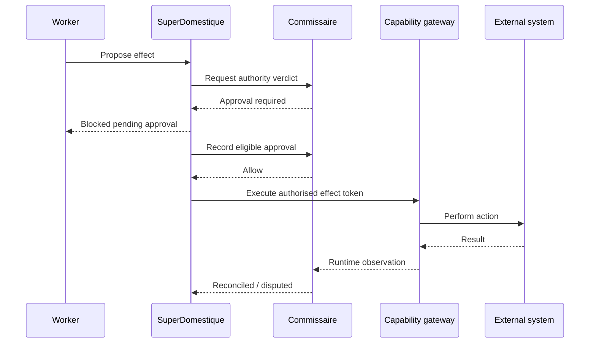

A pack defines the capability and adapter; SuperDomestique manages invocation; Commissaire governs the decision and records facts.

## 7. Capability grant

```yaml
id: grant_01J...
lane: implementation
contractVersion: 3
capabilities:
  - id: repository.read
    scope:
      repository: shftwst/faff
  - id: repository.write
    scope:
      worktree: wt_01J...
  - id: test.run
    scope:
      commandClass: project-test
prohibited:
  - repository.merge
  - deployment.production
expiresAt: 2026-08-08T18:00:00Z
budgets:
  invocations: 500
  modelCostCad: 20
```

The grant is derived from contract + pack + overlay + lane, and anchored in Commissaire.

## 8. Idempotency

Every effect request requires:

- unique effect ID;
- idempotency key;
- contract version;
- actor/lane identity;
- intended subject and parameters;
- retry classification;
- compensation or repair metadata where applicable.

A replay must not duplicate a merge, email, payment, or ERP record.

## 9. Observation

Observation should be independent where practical:

```yaml
observationId: obs_01J...
effectId: effect_01J...
observer:
  adapter: github.pull-request-observer
  principal: service-account/github-readonly
observedAt: ...
facts:
  merged: true
  mergeCommit: abc123
  baseBranch: main
assurance: externally-observed
```

The worker's API response may be a runtime observation. A later read-only query is stronger independent evidence.

## 10. Reconciliation

A pack registers a reconciliation strategy:

```text
exact match
set inclusion
numeric tolerance
semantic equivalence with required evaluator evidence
state transition observed
signed receipt
human attestation
```

Commissaire applies the registered deterministic adapter to declared and observed facts. If semantic comparison is needed, the evaluator result is separate evidence and policy decides whether it is sufficient.

## 11. Human worker protocol

Human work should use the same assignment model:

```text
assignment issued
eligible identity verified
structured context presented
decision/artifact submitted
role and timestamp recorded
optional signature/attestation
stage/evidence event recorded
```

A human approval is not a magic bypass. The active policy defines what the human is authorised to approve.

## 12. Workflow-engine adapter

An n8n, Temporal, or LangGraph worker may execute a stage or subgraph. The adapter should:

- pass an immutable assignment and capability references;
- map external run IDs to stage attempts;
- stream or poll progress;
- receive structured artifacts/evidence;
- intercept or proxy consequential effects where possible;
- support signals for pause/cancel/approval;
- preserve idempotency and causation;
- avoid treating the external engine's “success” as task acceptance.

## 13. Failure and recovery

```text
transient worker failure
    retry within pack/runtime policy

ambiguous domain state
    park and request intervention

authority denial
    block; do not retry unchanged

external effect result unknown
    observe/reconcile before retry

worker lost after reversible work
    replace worker and reuse valid artifacts

worker lost during consequential effect
    do not repeat until effect state is observed
```

## 14. Protocol proof criteria

- one software stage runs through a Claude/Codex-style adapter;
- one supplier stage runs through n8n or LangGraph;
- a human approval uses the same assignment/audit concepts;
- worker replacement does not lose state;
- a prohibited effect is blocked before execution;
- duplicate effect requests remain idempotent;
- a false completion/effect claim cannot yield acceptance;
- external engine success remains only worker evidence.


---

# FILE: 12-migration-strategy.md

# Migration Strategy: Integrated FAFF to Three-Layer Architecture

**Status:** Proposed incremental migration.

## 1. Strategy

Use a **strangler migration** inside the existing repository. Do not attempt a full rewrite or move every feature before proving a second domain.

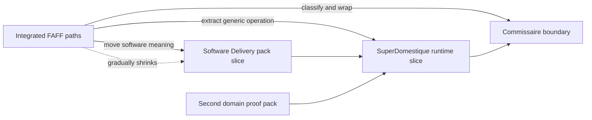

## 2. Migration objectives

- preserve current commands and user-visible software-delivery behaviour;
- make dependency boundaries testable before package publication;
- extract by vertical slice rather than by noun search;
- use the second domain to reject software-shaped abstractions;
- avoid premature repository split or rebrand;
- retain public history and clear IP provenance;
- create reviewable, reversible changes.

## 3. First activity: fresh code inventory

Classify every relevant current module, script, skill, schema, event, and test into:

```text
A. Commissaire candidate
B. SuperDomestique runtime candidate
C. Software Delivery pack candidate
D. Claude Code / worker adapter
E. Tracker projection / integration
F. Shared utility
G. Unclear — requires decision
```

For each item record:

- current path;
- responsibility;
- imported dependencies;
- domain nouns;
- public API/command impact;
- tests and fixtures;
- proposed destination;
- confidence and evidence status.

The inventory must be generated from current `main`; prior audit findings are hypotheses to revalidate.

## 4. Establish dependency tests before moving code

Target direction:

```text
domain packs → SuperDomestique → Commissaire
worker adapters → SuperDomestique worker protocol
projections → SuperDomestique control-plane API
```

Forbidden imports should fail CI. If the codebase does not use a package manager today, dependency checks can initially operate on paths/import graphs rather than forcing a packaging change.

## 5. Compatibility facade

Create an internal facade behind existing commands:

```text
/faff-prep
    → compatibility command
    → Software Delivery pack task compiler
    → SuperDomestique specify stages

/faff-graft
    → compatibility command
    → create L2 task with Software Delivery pack

/faff-beep-boop
    → compatibility command
    → runtime eligible-task scheduler using L3 preset
```

This permits internals to migrate while the current product remains usable.

## 6. Vertical slice selection

Choose a narrow current software path that exercises:

```text
contract/specification
independent challenge
execution
verification
approval or protected effect
observation/reconciliation
terminal acceptance
```

Avoid starting with every current command or full L4 complexity. The slice should be small enough to duplicate in the second domain and rich enough to test governance.

## 7. Extraction order

### Step 1 — Governance adapter

- wrap current event/ledger/verdict logic behind proposed Commissaire interfaces;
- retain existing storage and event translation;
- add domain-vocabulary boundary tests;
- avoid renaming public artifacts immediately.

### Step 2 — Runtime skeleton

- create task, contract, graph, stage, lane, worker, and intervention interfaces;
- implement only the selected slice;
- use current skills and commands as workers/compatibility entrypoints;
- request governance verdicts through the new adapter.

### Step 3 — Software Delivery pack slice

- move lifecycle composition, software evidence, GitHub/CI semantics, and prompt/skill bindings into a pack-shaped module;
- compile existing slots into lane worker selection;
- compile appetite/L-level configuration into runtime policy inputs;
- project state back to current tracker conventions.

### Step 4 — Second domain pack

- implement the same generic responsibilities with different domain stages, workers, evidence, effects, and UI labels;
- prohibit runtime/core edits for domain nouns;
- log every pressure on the generic APIs.

### Step 5 — Revise boundaries

For each pressure, decide whether it belongs in:

```text
core governance
runtime operation
pack semantics
worker adapter
application layer
```

Only add a generic runtime feature if at least two domains need the responsibility or the abstraction is clearly domain-neutral.

## 8. Suggested proof-stage repository shape

```text
faff/
├── packages/
│   ├── commissaire/
│   ├── superdomestique/
│   └── worker-sdk/
├── domain-packs/
│   ├── software-delivery/
│   └── supplier-onboarding-proof/
├── adapters/
│   ├── claude-code/
│   ├── codex/
│   ├── github/
│   ├── n8n-or-langgraph/
│   └── mock-erp/
├── apps/
│   ├── faff-compat-cli/
│   └── proof-control-plane/
├── docs/
└── tests/
    ├── architecture/
    ├── conformance/
    └── cross-domain/
```

This is illustrative. Preserve the current distribution model until the inventory determines the least disruptive shape.

## 9. Data migration

The first version should support current runs/artifacts through a compatibility reader.

Possible strategy:

```text
Current FAFF event/artifact
    → translation adapter
    → generic envelope/fact
    → Commissaire ledger or audit view
```

Do not rewrite historical events in place. Record translation provenance and source format.

## 10. Configuration migration

```text
Current `.faffrc.yaml`
    remains accepted

Compatibility compiler
    maps tracker, slots, appetite, and level
    into Software Delivery pack + runtime configuration

Native future configuration
    separates runtime, pack, overlay, worker, and projection settings
```

Warn on ambiguous mappings rather than silently changing behaviour.

## 11. Test strategy

### Characterisation tests

Capture current observable behaviour before extraction:

- command outputs and exit codes;
- tracker transitions;
- park behaviour;
- ledger completion rules;
- governance-check outcomes;
- slot and appetite effects;
- representative L2/L3/L4 run artifacts.

### Architecture tests

- forbidden imports;
- core schema vocabulary;
- pack registration boundaries;
- worker bypass prevention;
- control-plane command path.

### Cross-domain conformance tests

Run the same generic scenarios against both packs:

```text
missing evidence
self-review conflict
approval-required effect
false effect claim
contract amendment
budget exceeded
park and resume
terminal disposition
```

### Regression tests

Current software commands and reference runs remain valid throughout migration.

## 12. Release strategy

Suggested transitional releases:

```text
Release A
    internal boundaries and adapters; no user-visible architecture claim

Release B
    experimental native runtime path behind flag; compatibility remains default

Release C
    Software Delivery pack becomes default internally; same public commands

Release D
    second-domain proof and documented pack API marked experimental

Release E
    stable layer names and package/repository decision
```

## 13. Rebrand strategy

Do not make renaming a critical-path dependency. The architecture may be documented as:

```text
FAFF is the current integrated implementation.
SuperDomestique is the proposed generic progressive-autonomy runtime.
Commissaire is the deterministic governance core.
Software Delivery is the first domain pack.
```

Repository/package names can change after boundaries are proven and migration paths are clear.

## 14. Rollback strategy

Each extraction slice should retain:

- compatibility path;
- feature flag or command fallback;
- reversible storage migration;
- old event reader;
- side-by-side result comparison;
- explicit cutover criterion.

## 15. Migration completion criteria

The first architectural migration is complete when:

- selected software slice runs natively through pack → runtime → core;
- second domain runs through the same interfaces;
- existing FAFF commands remain functional;
- forbidden dependencies are enforced;
- current config compiles into native structures;
- audit histories can be reconstructed;
- no runtime/core domain conditionals exist;
- the next software workflows can migrate incrementally rather than require another redesign.


---

# FILE: 13-proof-and-evaluation-plan.md

# Cross-Domain Proof and Evaluation Plan

**Status:** Proposed experiment plan.

## 1. Hypothesis

> A narrow governance core and progressive-autonomy runtime can add meaningful safety, auditability, intervention, and executor portability across materially different domains without requiring domain logic in the core or runtime.

## 2. Proof domains

### Domain A — Software delivery

Use one current FAFF-compatible change task that includes:

- explicit specification and acceptance criteria;
- independent challenge;
- isolated implementation;
- deterministic tests;
- independent review/holdout evidence;
- a protected merge or mocked deployment effect;
- external observation and reconciliation;
- final acceptance.

### Domain B — Supplier onboarding / third-party risk

Use synthetic data and systems. The task:

> Review a proposed supplier, obtain and verify required evidence, identify missing or inconsistent information, produce an approval-ready risk summary, and create a mocked ERP supplier record only after eligible approval.

This domain is chosen because it combines evidence-heavy knowledge work, semantic judgement, deterministic checks, human approval, and an external effect without requiring real regulated data.

## 3. Shared experiment contract

Both domains must exercise:

```text
intent
specify
challenge
execute
verify
approve
commit effect
observe
reconcile
accept or park/reject
```

They must use the same:

- contract envelope/versioning;
- lifecycle and stage APIs;
- lane manifest API;
- worker protocol;
- governance event envelope;
- authority decisions;
- evidence obligations;
- effect lifecycle;
- reconciliation API;
- control-plane generic views;
- audit export.

## 4. Different implementation characteristics

To prove portability, intentionally vary:

| Concern | Software | Supplier proof |
|---|---|---|
| Primary worker | Claude Code/Codex-style coding worker | n8n or LangGraph agent/workflow |
| External systems | GitHub, CI, worktree | Synthetic documents, registry, mock ERP |
| Deterministic evidence | tests, CI, commit state | document presence, name match, ERP observation |
| Semantic evidence | architecture/review/holdout | risk summary and policy challenge |
| Human role | engineer/release approver | procurement manager |
| Effect | merge or mocked deploy | create supplier record |
| Projection | tracker plus generic UI | generic UI plus domain extension |

## 5. Seeded failures

### F1 — Missing evidence

Expected: checkpoint blocks with exact missing obligation.

### F2 — Self-certification

Executor attempts to produce independent review evidence.

Expected: independence obligation remains unsatisfied.

### F3 — Unauthorised effect

Worker attempts merge/ERP creation before approval.

Expected: effect gateway denies before execution.

### F4 — False effect claim

Worker declares effect complete but read-only observation finds no change or different state.

Expected: effect becomes disputed; task cannot be accepted.

### F5 — Budget exceeded

Expected: lane stops or parks according to policy; no silent continuation.

### F6 — Adversarial finding

Challenge lane finds a material unstated assumption.

Expected: contract/spec revision and re-admission before execution.

### F7 — Mid-run amendment

Human changes scope or authority.

Expected: new immutable contract version; impacted stages invalidated/replayed.

### F8 — Worker interruption and replacement

Expected: lane can be reassigned without losing evidence or duplicating effects.

### F9 — Terminal-disposition gap

A stage or admitted subtask is abandoned.

Expected: run cannot be marked complete.

## 6. Baselines

Compare against:

1. current FAFF software execution without the new layer boundaries;
2. equivalent supplier workflow in n8n/LangGraph using ordinary logs and approval node(s);
3. prompt-only single-agent execution;
4. the new architecture with Commissaire + SuperDomestique + pack.

The goal is not to prove every baseline bad. It is to identify the failures and operational questions the proposed layer uniquely or more reliably handles.

## 7. Metrics

### Safety and governance

- prohibited effects attempted and blocked;
- approval-order violations detected;
- missing obligations detected;
- self-review conflicts detected;
- false declared effects detected;
- tasks incorrectly accepted;
- integrity faults detected.

### Recoverability

- successful park/resume;
- successful worker replacement;
- duplicate effect rate under retry;
- amendment replay correctness;
- time to recover from seeded failure.

### Auditability

Can an independent reviewer answer:

- what was requested?
- which contract/policy versions applied?
- who/what performed each responsibility?
- which authority was granted?
- what evidence supported the result?
- which effects were proposed, authorised, performed, and observed?
- what changed during the run?
- why was the result accepted or rejected?

Score completeness and time-to-answer.

### Operator experience

- time to understand current task state;
- number of transcript/log views required;
- time to resolve a park;
- correctness of operator explanation;
- perceived distinction between semantic and deterministic evidence.

### Portability

- runtime/core changes required to add second domain;
- runtime/core changes required to replace a worker;
- percentage of domain implementation residing in pack/adapters;
- domain nouns found in core/runtime schemas.

### Cost and latency

- model cost overhead;
- runtime/governance latency;
- human intervention count and duration;
- evidence storage volume.

## 8. Experimental controls

- use fixed synthetic fixtures;
- pin pack, contract, schema, prompt/rubric, and model versions where possible;
- record all run inputs and seed values;
- separate evaluator from executor;
- repeat each scenario multiple times for probabilistic workers;
- publish failures and ambiguous results;
- do not claim compliance certification.

## 9. Demo script

A compelling demonstration should show:

```text
1. Submit intent.
2. Review generated structured contract and authority matrix.
3. Run independent challenge; expose and fix assumption.
4. Admit contract.
5. Execute stages in visible lanes.
6. Trigger prohibited effect; show pre-effect block.
7. Supply/record eligible approval.
8. Perform effect.
9. Trigger false declaration or observed mismatch.
10. Reconcile/repair.
11. Claim completion.
12. Show independent acceptance and audit bundle.
13. Switch to second domain using same generic views.
```

## 10. Success thresholds

Proceed to wider extraction/product exploration if:

- zero seeded prohibited effects execute successfully;
- zero false effect claims reach acceptance;
- all missing obligations and self-review conflicts are caught;
- worker replacement and amendment recovery succeed;
- second domain requires no domain conditionals in runtime/core;
- operator can resolve seeded parks from structured state;
- audit questions are answerable materially faster/more completely than baseline;
- overhead is proportionate to task consequence.

## 11. Kill or narrow criteria

Narrow the horizontal thesis if:

- most second-domain work requires runtime/core edits;
- pack APIs become a thin label over bespoke application code;
- ordinary n8n/LangGraph + OPA + logs reproduce all material value with trivial setup;
- effects cannot be mediated or independently observed;
- semantic evaluation dominates every acceptance decision;
- operator experience becomes a workflow-builder UI rather than governance of outcomes;
- safety overhead makes only software delivery viable.

A narrowed result can still yield a stronger Software Delivery product and reusable Commissaire core.


---

# FILE: 14-roadmap.md

# Revised Roadmap v2

## Phase R0 — Bank current thesis: L4 reference release

### Objective
Finish L4 enough to prove the software-specific progressive-autonomy thesis.

### Work
- harden L4;
- characterize L3/L4 behavior;
- improve release-critical control-plane ergonomics;
- add seeded failure scenarios;
- produce successful and blocked reference runs;
- document current limitations;
- publish proposed future architecture ADRs without implementing broad extraction;
- tag release.

### Gate
No broad generalized-runtime implementation before this gate.

---

## Phase R1 — Fresh four-way inventory

Classify current `main` into:

1. Commissaire candidate governance;
2. SuperDomestique candidate runtime;
3. Software Delivery domain semantics;
4. FAFF harness/adoption behavior;
5. supporting adapters/utilities where necessary.

Protect representative L2/L3/L4 behavior with characterization tests.

---

## Phase R2 — Contracts and internal boundaries

Define/accept:

- Delegation Contract;
- Domain Pack Contract;
- runtime/task/lifecycle contracts;
- Lane Manifest;
- Worker Adapter;
- Commissaire governance APIs;
- effect/observation/reconciliation contracts;
- adapter-provider contracts.

Enforce one-way dependencies internally without forcing public package/repo extraction.

---

## Phase R3 — First runtime vertical slice

Move one representative software slice through:

```text
Software pack → SuperDomestique → Commissaire
```

Preserve existing FAFF command/tracker experience via compatibility/adoption layer.

---

## Phase R4 — Cross-domain proof

Implement one materially different domain pack against unchanged runtime/core.

Requirements:

- external worker for at least one stage;
- protected effect;
- independent observation;
- self-certification failure;
- separation-of-duty failure;
- contract amendment;
- park/resume.

---

## Phase R5 — Adapter proof

Add early infrastructure replacement tests:

- native authorization ↔ external task-scoped authorization;
- native/local worker ↔ external workflow/agent runtime;
- optionally policy backend;
- defer durable workflow backend until long-running needs justify it.

Same conformance suite must hold.

---

## Phase R6 — Execution-independent Commissaire

Have Commissaire govern a workflow whose primary execution is outside SuperDomestique.

This is a major differentiation gate.

---

## Phase R7 — Control plane and UX proof

Build the minimum generic control plane showing:

- intent/contract/version;
- lifecycle;
- lanes/workers;
- evidence;
- blocks;
- approvals;
- interventions;
- effects/observations;
- audit/acceptance.

Domain packs may extend views.

The operator must not need worker transcripts for normal supervision.

---

## Phase R8 — Competitive falsification

Compare against a simpler conventional agent/workflow implementation.

Measure:

- false-success detection;
- violations prevented;
- evidence completeness;
- recovery/reconstruction;
- intervention burden;
- configuration overhead;
- runtime/cost overhead.

---

## Phase R9 — Decision

### Continue horizontal
If cross-domain and execution-independent governance show clear value.

### Narrow/verticalise
If governance is valuable mainly in regulated/high-consequence domains.

### Retain software focus
If generic runtime provides insufficient advantage over established platforms.

---

## Phase R10 — Only after proof: physical productisation

Possible work:

- split packages/repositories;
- stabilize public SDKs;
- decide final FAFF/SuperDomestique distribution model;
- hosted service;
- enterprise identity;
- richer UI;
- more domain packs;
- design partners.

None is required to prove the thesis.


---

# FILE: 15-risk-register.md

# Risk Register and Kill Criteria

**Status:** Active planning input.

## Risk scale

- **Likelihood:** Low / Medium / High
- **Impact:** Low / Medium / High / Critical
- **Disposition:** mitigate, test, accept, or kill/narrow

## Technical risks

| ID | Risk | Likelihood | Impact | Mitigation / test |
|---|---|---:|---:|---|
| T1 | Runtime abstractions remain software-shaped | High | High | Build second domain concurrently; ban domain nouns and conditionals in core/runtime. |
| T2 | Commissaire and SuperDomestique develop competing canonical state | Medium | Critical | Governance ledger is authoritative for governed facts; runtime projection must reconcile/rebuild. |
| T3 | Domain packs become unrestricted code with no real boundary | Medium | High | Pack API, capability limits, conformance suite, and no direct store access. |
| T4 | Lane concept collapses back into prompt/skill selection | Medium | High | Make identity, authority, context, independence, budget, and state mandatory lane properties. |
| T5 | External workers bypass effect mediation | High | Critical | Capability gateway or restricted credentials; label observation-only assurance honestly. |
| T6 | Worker retry duplicates consequential effects | Medium | Critical | Effect IDs, idempotency keys, observe-before-retry, compensation metadata. |
| T7 | Semantic evaluation is presented as deterministic governance | Medium | High | Evidence taxonomy and UI distinction; Commissaire verifies process/threshold facts only. |
| T8 | Event/schema design becomes enormous and brittle | Medium | High | Small generic envelope, domain payload schemas, artifact references, versioning. |
| T9 | Overbuilding durable workflow concerns | Medium | Medium | Use external Temporal/n8n/LangGraph adapters; maintain supervisory boundary. |
| T10 | Current dependency-free distribution conflicts with modular runtime | Medium | Medium | Inventory first; internal boundaries need not imply package-manager or runtime dependency immediately. |
| T11 | Migration breaks existing commands and tracker workflows | Medium | High | Characterisation tests, compatibility facade, side-by-side rollout, reversible slices. |
| T12 | Evidence storage leaks sensitive data or becomes unbounded | Medium | Critical | References/hashes, redaction/retention metadata, minimum sufficient evidence, later access controls. |

## Product and interaction risks

| ID | Risk | Likelihood | Impact | Mitigation / test |
|---|---|---:|---:|---|
| P1 | Product becomes another workflow canvas | Medium | High | Build outcome/state control plane first; no visual authoring in proof. |
| P2 | Operator still needs agent transcripts to understand state | Medium | High | Seed failures and measure resolution from structured views only. |
| P3 | Generic UI is too abstract to be useful | High | Medium | Pack-provided terminology and renderers on top of one state model. |
| P4 | Governance overhead exceeds value for ordinary tasks | High | High | Capability/risk-based profiles; measure intervention, latency, and cost. |
| P5 | Buyers want a vertical outcome, not a runtime | High | Medium | Treat pack/runtime as architecture; allow vertical product above it. |
| P6 | “Compliance” positioning overclaims assurance | Medium | Critical | Say governed/verifiable/auditable; map to formal compliance only with expert validation. |
| P7 | Pack ecosystem is premature and unused | Medium | Medium | Only publish after two packs and stable conformance tests. |

## Project execution risks

| ID | Risk | Likelihood | Impact | Mitigation / test |
|---|---|---:|---:|---|
| E1 | Scope expands into a company-sized platform | High | Critical | Evidence-gated roadmap; proof non-goals; defer enterprise substrate. |
| E2 | Architecture work displaces current FAFF value | Medium | High | Preserve compatibility and continue software-domain outcomes. |
| E3 | Solo builder spends time on packaging/branding rather than proof | High | Medium | No repo split/rebrand/marketplace before Phase 7. |
| E4 | Existing old ideas bias the design without current evidence | Medium | Medium | Derive from current code and second-domain pressure; inspect historical tickets later as corroboration. |
| E5 | Extensive documents are treated as implementation truth | Medium | High | ADR status, source labels, experiments, and revision checkpoints. |

## IP risks

*Redacted 2026-08-16 before this directory entered the repository: licensing and intellectual-property strategy is held privately under the repository's documentation policy. See critique-5.*

## Horizontal thesis kill criteria

Stop or narrow the generic-runtime direction if two or more remain true after the proof:

1. second domain requires repeated runtime/core changes for domain semantics;
2. domain adapters and bespoke UI contain nearly all useful value;
3. n8n/Temporal/LangGraph + OPA + ordinary audit logs reproduce material value with little effort;
4. effects cannot be mediated and external observation is rarely available;
5. acceptance is almost always another unconstrained LLM opinion;
6. operator UX requires the same workflow-specific knowledge as direct operation;
7. safety overhead is disproportionate outside software;
8. no prospective design partner offers concrete workflow access or commitment.

## Continue signals

- same runtime/core passes both domain conformance suites;
- one worker can be replaced without contract changes;
- seeded authority and effect failures are prevented or exposed;
- control-plane state materially reduces transcript dependence;
- audit reconstruction answers consequential questions quickly;
- software delivery becomes cleaner through the extraction;
- a real user identifies a painful process and asks to pilot it.


---

# v2 Risk Supplement

## R-L4-DRIFT — Generalized architecture derails L4

**Risk:** excitement about the broader architecture leaves L4 permanently almost-finished.

**Mitigation:** broad runtime implementation is gated behind the L4 reference release.

## R-COMMODITY — Runtime features become commodity

**Risk:** deterministic workflows, HITL, authorization, and agent orchestration converge rapidly across established projects.

**Mitigation:** do not differentiate on orchestration alone. Falsify the stronger delegation/evidence/effect/acceptance thesis.

## R-NIH — Rebuilding mature infrastructure

**Risk:** project spends months implementing authorization, policy languages, durability, connectors, identity, etc.

**Mitigation:** own semantics and reference implementations; adapt specialized infrastructure.

## R-BACKEND-LOCK — External infrastructure defines our model

**Risk:** OpenFGA/OPA/Temporal/n8n/etc. data model becomes the accidental public architecture.

**Mitigation:** project-owned contracts + conformance suites; provider-specific representation stays behind adapters.

## R-NAMING — Public identity becomes confusing during the transition

**Risk:** FAFF/SuperDomestique/Commissaire/runtime/domain-pack terminology looks like multiple unfinished projects.

**Mitigation:** freeze public naming for 1–2 months and clearly label future architecture as proposed.

## R-FAFF-VALUE-LOSS — General runtime destroys lightweight adoption

**Risk:** extracting a platform makes software users deploy unnecessary infrastructure.

**Mitigation:** preserve FAFF as potential harness-native adoption layer; do not force hosted/runtime deployment for basic software usage.

## R-FALSE-HORIZONTAL — Second demo creates unjustified platform confidence

**Risk:** a hand-picked second workflow appears to prove generality.

**Mitigation:** execution-independent governance + external adapters + competitive baseline + kill criteria are separate gates.


---

# FILE: 16-open-questions.md

# Open Questions and Decision Experiments

**Status:** Deliberately unresolved. Do not silently settle these during implementation.

## 1. Code and packaging

### Q1 — What language/module shape should the extracted core use?

Current FAFF is dependency-light and Node-based in operation. Options include internal JS/TS modules, a CLI/library boundary, or a separate service later.

**Decide after:** current-code inventory and first interface prototype.  
**Experiment:** wrap current governance without changing distribution.

### Q2 — When should repositories/packages split?

**Default:** one monorepo until two-domain proof and dependency tests pass.  
**Decision trigger:** stable APIs and independent release cadence, not branding.

## 2. Persistence and canonical state

### Q3 — What is the first native ledger/state backend?

Options:

- current file/git artifacts;
- SQLite;
- append-only log plus projection files;
- service database.

**Decision criteria:** reconstruction, portability, local UX, concurrency, integrity, and migration cost.

### Q4 — How is runtime operational state recovered from governance history?

**Required design:** define which events/facts are sufficient and which ephemeral worker states need separate checkpoints.

## 3. Contract model

### Q5 — Is `DelegationContract` the right public term?

Alternatives: task contract, outcome contract, delivery contract.  
**Default for proof:** Delegation Contract because it expresses authority and accountability, while packs may use domain labels.

### Q6 — How much lifecycle belongs in the contract versus pack version?

**Hypothesis:** contract references a pinned graph and adds task-specific required stages/overrides.  
**Experiment:** software and supplier contract compilation.

### Q7 — How are policy exceptions represented?

Options: contract amendment, separate exception object, approval evidence, or policy decision override.  
**Requirement:** explicit authority, scope, expiry, and audit trail.

## 4. Lifecycle and lane semantics

### Q8 — Which lifecycle primitives are actually universal?

The proposed set is intentionally provisional.  
**Experiment:** map two domains and remove primitives that add no shared value.

### Q9 — Are lanes static templates or dynamically created?

**Likely:** pack templates create task-specific instances; runtime may create additional correction/escalation lanes under pack policy.

### Q10 — What constitutes independence?

Start with lane/worker/context rules. Later consider model family, isolated workspace, organisation principal, and cryptographic identity.

### Q11 — Can one worker occupy multiple lanes sequentially?

Policy-dependent. The ledger must retain occupancy and detect conflicts for required independent evidence.

## 5. Worker orchestration

### Q12 — How much retry/durability belongs in SuperDomestique?

**Default:** minimal coordination and supervisory state; delegate complex durable subflows to external engines.  
**Experiment:** one in-process worker and one n8n/LangGraph adapter.

### Q13 — How should worker capability discovery work?

Options: static manifest, runtime handshake, registry, organisation allowlist.  
**Proof default:** static registered capabilities.

### Q14 — How are tools exposed without giving workers bypass credentials?

Options: mediated MCP/tool gateway, short-lived capability tokens, sandbox proxy, read-only direct access plus mediated writes.

## 6. Effects and observations

### Q15 — Which effects must be gateway-mediated?

Likely risk/capability based.  
**Proof:** merge/mock ERP creation are mediated; read/query operations may be directly granted and logged.

### Q16 — What happens when observation is impossible?

Record assurance as self-attested/runtime-observed and require stronger human/evidence obligations or prohibit high-risk autonomy.

### Q17 — How are compensation and repair modelled?

Need effect-specific metadata and lifecycle stages; do not pretend all effects are reversible.

## 7. Domain packs

### Q18 — Configuration only, code plugins, or both?

**Likely:** declarative manifest plus trusted code adapters/evaluators.  
**Risk:** arbitrary pack code can bypass boundaries.  
**Proof:** local trusted packs; later sandbox/signature policy.

### Q19 — How do overlays merge?

Need deterministic precedence and “may narrow but not silently widen” semantics.

### Q20 — What is the minimum pack conformance suite?

Use two packs to define rather than inventing a broad SDK first.

## 8. Control plane

### Q21 — Is the first generic UI web, terminal, or tracker-first?

**Recommendation:** small local React/web UI plus existing tracker projection. This tests the interaction model without replacing current software UX.

### Q22 — How much domain UI can packs inject safely?

Start with registered renderers/forms over typed artifacts and commands. Avoid arbitrary stateful micro-frontends in the proof.

## 9. Product and open-source boundary

### Q23 — Which layers remain Apache-2.0?

*Redacted 2026-08-16 before this directory entered the repository: licensing and open-source-boundary strategy is held privately under the repository's documentation policy. See critique-5.*

### Q24 — Is “SuperDomestique” the enduring generic runtime brand?

The name fits an enabler that executes human strategy. Architecture should not depend on naming.

### Q25 — Is supplier onboarding the best second domain?

It is a strong synthetic proof. A real design partner may identify a better evidence-heavy process. Keep the pack disposable if a stronger domain appears.

## 10. Decision log discipline

Each open question should become one of:

- ADR with evidence;
- time-boxed spike;
- cross-domain experiment;
- deferred decision with trigger;
- explicit non-goal.

No issue should resolve an open question incidentally through whichever implementation is quickest.


---

# FILE: 17-traceability-matrix.md

# Current-to-Target Traceability Matrix

**Status:** Planning map; exact source paths require Phase 1 inventory.

| Current FAFF concept | Current role | Target layer | Proposed treatment | Proof |
|---|---|---|---|---|
| L1–L4 | Per-workload progressive autonomy | SuperDomestique + pack policy | Retain as presets compiled to lanes, authority, evidence, and approvals | Same presets produce coherent software/supplier policy |
| Slot | Selects implementation for stage | Domain pack + runtime lane worker selector | Compatibility compiler; skills/prompts become worker behaviour assets | Swap worker without graph/contract change |
| Appetite | Limits rope/resources | Contract + lane + Commissaire budgets | Compile into explicit budgets/authority | Budget exceed parks in both domains |
| Tracker | Source, state, control plane | Projection over SuperDomestique APIs | Preserve software projection; add generic UI | Task understandable in both views |
| Issue/ticket | Work item | Runtime task | Translate to generic task identity with projection link | Software task exists without core issue noun |
| Spec/NLSpec | Build contract | Delegation Contract + Software pack schema | Generalise envelope; preserve rich software artifact | Supplier contract uses same envelope |
| `/faff-prep` | Specification workflow | Software pack lifecycle entrypoint | Compatibility command invokes `specify` stages | Same output/experience retained |
| `/faff-graft` | Interactive build | L2 runtime task | Compatibility command + Software pack | Gate approvals preserved |
| `/faff-beep-boop` | Unattended queue drain | L3 runtime scheduler | Runtime eligible-task coordination | Software and supplier tasks can park/resume |
| `faff lights-out` | L4 run | Stronger preset/policy | Pack-defined challenge/holdout/isolation obligations | Self-certification fails closed |
| Park protocol | Explicit unresolved state | SuperDomestique intervention + Commissaire disposition | Generalise; preserve tracker projection | Park/resume seeded failure |
| Run ledger | Run history/completeness | Commissaire event ledger | Wrap/translate; preserve integrity | Audit reconstruction |
| Ownership/heartbeat | Active agent/run status | Runtime lane occupancy + Commissaire events | Generalise worker/lane identity | Worker replacement test |
| Budget/resource boundary | Run constraints | Contract/lane budget + Commissaire verdict | Generalise capability/time/cost | Budget block in both domains |
| Sentry/derailment | Detect thrash/failure | Runtime operational policy + Commissaire evidence/verdict | Separate detection from deterministic limit facts | Repeated correction parks |
| Effects | Claimed changes | Commissaire effect lifecycle | Generalise proposed/authorised/declared/observed/reconciled | False claim caught |
| Integrity chain/witnesses | Audit integrity | Commissaire | Reuse/strengthen | Tamper test |
| Governance profile | Deterministic rules | Domain pack policy bundle + Commissaire evaluator | Version and pin | Two policy bundles same core |
| `governance-check` | Software-specific enforcement composition | Software pack over Commissaire | Preserve compatibility, decompose internals | Same check via generic obligations |
| PR association | Candidate code/effect | Software pack | Domain artifact/effect adapter | No PR noun in runtime/core |
| CI observation | Product evidence | Software pack evidence/observation adapter | Register typed evidence | Supplier uses different evidence |
| Holdout verdict | Independent semantic evidence | Software pack evaluator binding | Evidence with independence metadata | Core treats as evidence, not truth |
| Merge floor | Protected effect gate | Software pack policy + Commissaire authority | Map to generic effect checkpoint | ERP creation uses same effect lifecycle |
| Claude Code skill | Worker behaviour/workflow | Worker adapter + pack prompt/skill asset | Retain and wrap | Different worker adapter in supplier proof |
| Orchestrator/implementor/evaluator lanes | Separation of roles | SuperDomestique bounded lanes | Formalise identity, authority, context, and independence | Lane conflict blocked |
| Git worktree | Isolation | Software pack adapter/lane environment | Keep domain-specific | Supplier uses non-repo isolation |
| GitHub Action/status check | External enforcement/projection | Software projection + effect/check adapter | Preserve public integration | Generic verdict rendered in GitHub |

## Traceability rules

1. No current concept should be renamed “generic” without a second-domain mapping.
2. No generic layer should retain a domain noun merely to simplify compatibility.
3. Compatibility translation must preserve provenance and version.
4. Every extracted concept requires a characterisation test and a target conformance test.
5. Current features without target value may remain software-pack-specific rather than forcing generalisation.


---

# FILE: 19-glossary.md

# Glossary

| Term | Meaning |
|---|---|
| **Acceptance** | A terminal governance verdict that the active contract's required mechanically expressible obligations are satisfied. Distinct from a worker's completion claim. |
| **Active contract** | The immutable contract version currently governing a task. |
| **Amendment** | A proposed new contract version that changes scope, authority, lifecycle, obligations, or acceptance. |
| **Artifact** | A content-addressed or otherwise versioned output used by a task: document, spec, code candidate, report, form, dataset, etc. |
| **Assurance level** | Strength of evidence: self-attested, runtime-observed, independently evaluated, externally observed, or witnessed/signed. |
| **Authority envelope** | Capabilities, scopes, approvals, prohibitions, budgets, recipients, systems, expiry, and revocation applying to a task/lane. |
| **Bounded lane** | A persistent responsibility boundary with identity, context, tools, authority, budget, independence rules, worker compatibility, and visibility. |
| **Capability** | A named action class such as `repository.merge`, `registry.query`, or `supplier.erp-record-create`. |
| **Checkpoint** | A point at which Commissaire evaluates required facts and returns a progression/effect/terminal verdict. |
| **Commissaire** | The domain-neutral deterministic governance core. It records and verifies the governed run; it does not orchestrate work. |
| **Completion claim** | A worker/runtime assertion that work appears complete. It triggers verification and is not acceptance. |
| **Control plane** | The human-facing state and command surface for delegated work: contracts, lifecycle, lanes, evidence, effects, approvals, blocks, and verdicts. |
| **Correction** | A new stage attempt routed in response to failed verification or challenged work. History is not rewritten. |
| **Delegation Contract** | Immutable versioned artifact defining outcome, scope, authority, lifecycle, obligations, and acceptance for a task. |
| **Domain pack** | Versioned operating model defining a concrete class of work above SuperDomestique. |
| **Effect** | A consequential change to an external system or state. It progresses through proposed, authorised, attempted, declared, observed, and reconciled/disputed states. |
| **Evidence** | Structured or referenced material used to satisfy a contract obligation. |
| **Evaluation** | Semantic or subjective assessment produced by an agent or human and recorded as evidence. |
| **Governance ledger** | Append-only authoritative history of governed facts, decisions, versions, effects, observations, and verdicts. |
| **Lifecycle graph** | Versioned domain-pack composition of generic responsibilities and custom stages. |
| **Observation** | An independently captured fact about external state or an effect result. |
| **Organisation overlay** | Policy/configuration layer that narrows or extends a base domain pack for an organisation. |
| **Pack compiler** | Domain-specific component that turns intent and configuration into a draft contract, lifecycle, lanes, and obligations. |
| **Park** | Explicit resumable state for work that cannot safely progress without external resolution or human judgement. |
| **Projection** | A UI/tool-specific representation of runtime state, such as GitHub issue status or a Slack card. |
| **Reconciliation** | Comparison of authorised intent, worker declaration, and observed external state. |
| **Responsibility primitive** | Generic lifecycle purpose such as specify, challenge, execute, verify, approve, commit, observe, reconcile, or accept. |
| **Stage** | A domain-named lifecycle node mapped to a generic responsibility. |
| **Stage attempt** | One immutable execution attempt of a stage, including worker/lane, inputs, outputs, and disposition. |
| **SuperDomestique** | The generic progressive-autonomy runtime and control plane. It owns lifecycle, lanes, coordination, workers, visibility, and intervention. |
| **Task** | One operational instance of delegated work under a versioned contract and domain pack. |
| **Terminal disposition** | Explicit final state such as accepted, rejected, cancelled, or expired. |
| **Verdict** | Deterministic Commissaire decision such as allow, block, approval-required, park, reject, or accept. |
| **Worker** | A model/agent harness, workflow engine, deterministic service, external API, or human assigned to a lane. |
| **Worker adapter** | SuperDomestique integration implementing invocation, observation, signalling, interruption, and cleanup for a worker type. |


---

# FILE: 20-implementation-invariants.md

# Implementation Invariants and Review Checklist

These invariants are intended to become architecture tests, conformance tests, or required PR review checks.

## Layer invariants

1. Domain packs may depend on SuperDomestique public APIs.
2. SuperDomestique may depend on Commissaire public APIs.
3. Commissaire may not import SuperDomestique, packs, workers, projections, or domain adapters.
4. SuperDomestique may not import a concrete domain pack.
5. A pack may not mutate runtime/governance persistence directly.
6. A worker may interact only through its assignment, granted capabilities, and worker/effect protocols.

## Vocabulary invariants

7. Generic schemas contain no software or supplier nouns.
8. Generic lifecycle responsibilities remain small and semantically stable.
9. Domain stages are namespaced/versioned and mapped to responsibilities.
10. Prompts/skills do not encode hidden authority or lifecycle transitions.

## Contract invariants

11. Admitted contract versions are immutable.
12. Material intervention creates an amendment/version or an explicit authorised exception.
13. Every task pins pack, graph, policy, schema, and contract versions.
14. Natural-language commands compile to structured commands before consequential execution.

## Lane and worker invariants

15. Every stage attempt identifies a lane and worker/principal.
16. Lane authority cannot exceed the active task contract or organisation policy.
17. Required independent evidence cannot be produced by a conflicting lane/worker lineage.
18. Worker replacement preserves history and cannot duplicate effects.
19. Worker success or completion claim never equals task acceptance.

## Evidence and effect invariants

20. Required evidence identifies type, assurance level, producer, artifact version, and contract version.
21. Semantic evaluator outputs are labelled evidence, not deterministic truth.
22. Consequential effects have IDs, idempotency keys, authority decisions, and contract versions.
23. Approval must precede execution when policy requires it.
24. Declared effects remain unaccepted until required observations/reconciliation complete.
25. Unknown external effect state is observed before retry.

## Lifecycle and state invariants

26. Every admitted stage/task has an explicit disposition.
27. Invalidated/superseded stage attempts remain in history.
28. Runtime operational state can be reconciled with the Commissaire ledger.
29. A missing mandatory obligation fails closed.
30. Parks expose reason, required resolution, and resumable state.

## Control-plane invariants

31. Generic task state is queryable without an agent transcript.
32. Deterministic and semantic decisions are visibly distinguishable.
33. Projections cannot bypass structured commands and Commissaire verdicts.
34. Contract amendments show which stages/evidence become invalid.
35. Unreconciled or disputed effects are prominent.

## PR checklist

- Which layer owns this change, and why?
- Does it introduce a domain noun below the pack boundary?
- Does it change a stable schema or contract version?
- What characterisation test protects current FAFF behaviour?
- What cross-domain conformance scenario exercises it?
- Can a worker or projection bypass governance through this path?
- Does this change authority, evidence, independence, or effect semantics?
- What audit event/evidence proves the feature works?
- Which open question or ADR does it resolve?
- Is the change reversible if the horizontal thesis narrows?


---

# FILE: 21-supersession-and-decision-history.md

# Supersession and Decision History v2

## What changed from v1

### 1. L4 is now a hard strategic gate

Earlier roadmap:
```text
inventory → governance facade → runtime slice → second domain
```

Revised:
```text
finish/harden/tag L4
→ inventory
→ contracts/boundaries
→ facade/runtime slice
→ second domain
```

Reason: L4 is the best empirical source for lane, evidence, intervention, and governance requirements.

### 2. FAFF is preserved as an adoption surface

Earlier materials implicitly treated current FAFF primarily as the integrated precursor to a future generalized system.

Revised view:

```text
FAFF may remain useful as lightweight skills/plugin/harness adoption
rather than being simply renamed away.
```

### 3. SuperDomestique runtime is explicitly deterministic

The runtime controls lifecycle/state/lanes predictably around probabilistic workers.

Probabilistic routing must be represented as explicit lane work, not hidden in runtime code.

### 4. "Own semantics; adapt infrastructure"

External authorization/policy/workflow/durability systems are now expected to be used behind adapters rather than recreated.

Small native implementations remain valuable as semantic reference/test backends.

### 5. Execution-independent Commissaire became a major proof

The strongest governance claim is not merely "SuperDomestique has good guardrails."

It is:

> Commissaire can establish contract/evidence/effect conformance even when another runtime performs the work.

### 6. Competitive falsification is now mandatory

The generalized platform should be killed/narrowed if it cannot demonstrate meaningful value beyond simpler workflow/agent/governance approaches.

### 7. Naming is frozen for near-term legibility

- SuperDomestique: project identity/docs.
- FAFF: repo/plugin/skills/commands.
- Commissaire: governance subsystem.
- No new public brand.


---

# FILE: adr/0001-three-layer-architecture.md

# ADR-0001: Adopt a Three-Layer Architecture

- **Status:** Proposed
- **Date:** 2026-08-08
- **Decision owners:** Project maintainer

## Context

FAFF currently combines deterministic governance, progressively autonomous execution, and software-delivery semantics in one integrated system. Generalising only the governance region would leave orchestration duplicated across domains. Generalising the whole system without a boundary would pollute the core with models, prompts, and domain logic.

## Decision

Adopt three explicit layers:

```text
Domain packs → SuperDomestique runtime → Commissaire core
```

External workers are invoked by SuperDomestique through stable adapters. Domain packs configure the runtime. Commissaire is consumed by the runtime and remains independent from both.

## Consequences

### Positive

- governance remains narrow and reusable;
- lifecycle/lanes/control plane have one owner;
- software delivery remains a first-class domain rather than being erased;
- second-domain proof becomes possible;
- prompts/models/workers remain replaceable.

### Negative

- introduces new APIs and migration complexity;
- creates a potential dual-state problem that must be designed explicitly;
- boundaries may initially feel heavier than the current skills-based shape.

## Guardrails

- no domain conditionals in Commissaire or SuperDomestique;
- no package/repository split required until proof;
- current public FAFF commands remain supported during migration;
- this ADR does not claim that all three layers already exist physically.


---

# FILE: adr/0002-superdomestique-owns-runtime.md

# ADR-0002: SuperDomestique Owns the Progressive-Autonomy Runtime

- **Status:** Proposed
- **Date:** 2026-08-08

## Context

An earlier possible shape treated “Commissaire Runtime” as both governance and supervisory execution. That conflicts with the established distinction that Commissaire does not plan, execute, or make subjective judgements.

## Decision

SuperDomestique owns:

- lifecycle graphs and stage instances;
- bounded lanes;
- worker selection and interaction;
- context/artifact routing;
- coordination, correction, park, resume, and intervention;
- runtime state and control-plane APIs.

Commissaire owns deterministic governance facts and verdicts only.

## Rationale

The middle layer actively runs work. Giving it to Commissaire would blur “do the work” and “verify the run,” weaken independent acceptance, and make the governance core model/harness aware.

## Consequences

- SuperDomestique becomes a durable identity beyond software delivery;
- Software Delivery becomes its first domain pack;
- Commissaire can be consumed by other runtimes in principle;
- runtime and governance state reconciliation becomes a required design concern.


---

# FILE: adr/0003-domain-packs.md

# ADR-0003: Represent Concrete Work as Versioned Domain Packs

- **Status:** Proposed
- **Date:** 2026-08-08

## Context

Software delivery requires specs, architecture, worktrees, PRs, CI, reviews, holdouts, merge, and release. Other domains require different stages, evidence, workers, effects, and terminology. Hard-coding either into the runtime defeats generality.

## Decision

Create versioned domain packs that define:

- task types and contract templates;
- lifecycle composition and custom stages;
- lane templates;
- policy and evidence schemas;
- prompts/skills/rubrics;
- worker bindings and adapters;
- effects, observations, and reconciliation;
- optional control-plane extensions.

Allow organisation and project overlays that narrow or extend a base pack under explicit precedence rules.

## Consequences

- second domain can test the runtime honestly;
- current software semantics have a clear destination;
- pack trust, versioning, code execution, and conformance need design;
- a vertical product may use a pack internally without exposing it to users.


---

# FILE: adr/0004-lifecycle-primitives-and-lanes.md

# ADR-0004: Use Generic Lifecycle Responsibilities and Bounded Lanes

- **Status:** Proposed
- **Date:** 2026-08-08

## Context

Current stages and skills are software-oriented. Configurable lanes were an earlier conceptual direction, but the architecture must be justified by current responsibilities and cross-domain proof rather than historical intent alone.

## Decision

SuperDomestique provides a small generic responsibility vocabulary such as `specify`, `challenge`, `execute`, `verify`, `approve`, `commit-effect`, `observe`, `reconcile`, and `accept`. Domain packs compose these into graphs and add named stages.

A lane is a bounded responsibility context containing identity, authority, context, tools, budgets, independence, compatible workers, and visibility. Prompts and skills are behaviour assets assigned to lane/stage execution; they are not the orchestration unit.

## Consequences

- separation of duties becomes mechanically expressible;
- model/worker changes do not redefine the lifecycle;
- current slots need a compatibility compiler;
- the primitive vocabulary must remain provisional until two domains use it.


---

# FILE: adr/0005-trackers-are-projections.md

# ADR-0005: Trackers and Business Tools Are Projections, Not Canonical Runtime State

- **Status:** Proposed
- **Date:** 2026-08-08

## Context

The tracker is a strong current control plane for software delivery, but a general task may span many systems and may not naturally fit issue/PR state.

## Decision

SuperDomestique owns canonical operational task state derived and checked against the Commissaire governance ledger. GitHub, Linear, Jira, Slack, Teams, CRM cases, and custom UIs project that state and submit structured commands.

The Software Delivery pack preserves tracker-first UX as a preferred projection.

## Consequences

- control-plane insight survives outside software;
- projections require synchronization/reconciliation;
- current tracker storage may remain authoritative for some domain artifacts during migration, but not for generic state;
- task state must be available through a stable API.


---

# FILE: adr/0006-effects-authorise-then-reconcile.md

# ADR-0006: Consequential Effects Are Authorised Before Execution and Reconciled Afterward

- **Status:** Proposed
- **Date:** 2026-08-08

## Context

A ledger that records what an agent says it did provides observability but cannot prevent unauthorised actions or expose false claims reliably.

## Decision

Model effects through:

```text
proposed → authorised/denied/approval-required
         → attempted → declared → observed → reconciled/disputed
```

Use a capability gateway or restricted credentials for high-assurance effects where possible. Use independent read-only observations after execution. Record the assurance mode when mediation or observation is unavailable.

## Consequences

- effect IDs, idempotency, and retry rules become mandatory;
- integrations need separate effect and observation adapters;
- some systems cannot be fully mediated and must receive lower assurance labels;
- a worker success response never equals terminal acceptance.


---

# FILE: adr/0007-executor-cannot-self-accept.md

# ADR-0007: Executors Cannot Self-Certify Terminal Acceptance

- **Status:** Proposed
- **Date:** 2026-08-08

## Context

An autonomous worker can claim completion, and an evaluator can offer subjective evidence, but neither should unilaterally establish that all contract, authority, process, and effect obligations are satisfied.

## Decision

Workers may emit `completion_claimed`. SuperDomestique then requests a terminal verdict from Commissaire. Acceptance requires policy-defined obligations, including independent evidence where configured. The runtime cannot override a fail-closed verdict without an explicit authorised contract amendment or exception.

## Consequences

- completion and acceptance are distinct states;
- current run-completion rules have a generic destination;
- terminal verdict logic must be reconstructable and explainable;
- human acceptance remains possible only within declared authority and audit.


---

# FILE: adr/0008-proof-before-productisation.md

# ADR-0008: Require Cross-Domain Proof Before Productisation

- **Status:** Proposed
- **Date:** 2026-08-08

## Context

The architecture is promising but unvalidated outside software. Packaging, rebranding, hosted infrastructure, and a marketplace could consume substantial effort while preserving software-shaped assumptions.

## Decision

Do not make the following critical path before the two-domain evaluation:

- separate repositories or public packages;
- hosted multi-tenancy;
- full generic rebrand;
- visual workflow authoring;
- enterprise connector marketplace;
- broad SDK stability promises.

Build one software vertical slice and one supplier-onboarding slice on the same internal interfaces, then make an explicit continue/narrow decision.

## Consequences

- faster falsification;
- less architectural theatre;
- temporary internal APIs may change;
- public messaging must distinguish current product from proposed direction.


---

# FILE: adr/0009-bank-l4-before-generalisation.md

# ADR-0009: Bank L4 Before Broad Generalisation

**Status:** Proposed

## Context

The current software-delivery system has a solid L3 and an L4 path that still needs hardening, failure testing, and release-critical ergonomics. The generalized runtime architecture emerged from the same responsibilities L4 is attempting to exercise.

## Decision

Finish and tag a defensible L4 reference release before broad generalized-runtime implementation.

Architecture ADRs, inventories, and boundary characterization may proceed before the tag.

## Consequences

- Generalization is grounded in observed high-autonomy behavior.
- A clean pre-extraction release exists for users, regression, and provenance.
- Runtime work cannot become an excuse to leave L4 permanently half-finished.


---

# FILE: adr/0010-faff-remains-adoption-surface.md

# ADR-0010: Preserve FAFF as the Near-Term Adoption Surface

**Status:** Proposed

## Decision

Keep the `faff` repository/plugin/skills/commands stable through the L4 release and initial extraction proof.

Treat FAFF as a possible long-term lightweight harness-native adoption layer rather than automatically renaming or replacing it with the generalized runtime.

## Rationale

The skills/plugin approach has independent value: progressively governed software delivery can be adopted inside an existing coding harness without deploying a new platform.

## Consequences

- Public naming remains stable during the transition period.
- Runtime/domain-pack extraction must preserve compatibility.
- Physical repo split is deferred until technical/versioning pressure justifies it.


---

# FILE: adr/0011-superdomestique-deterministic-runner.md

# ADR-0011: SuperDomestique Is a Deterministic Runner Around Non-Deterministic Work

**Status:** Proposed

## Decision

SuperDomestique's control semantics are deterministic.

Probabilistic reasoning, human judgment, and external-system uncertainty occur through explicit workers/lanes/artifacts.

Given the same admitted contract, runtime state, pack version, worker outputs, observations, and Commissaire verdicts, the runtime must select the same next transition.

## Rule

Do not hide LLM judgment inside runtime routing. If judgment is required, model it as explicit work in a lane and record its result.


---

# FILE: adr/0012-own-semantics-adapt-infrastructure.md

# ADR-0012: Own Semantics; Adapt Infrastructure

**Status:** Proposed

## Decision

SuperDomestique/Commissaire own their semantic contracts and conformance suites.

Authorization, policy evaluation, durable execution, workflow engines, identity, and external systems are accessed through replaceable providers/adapters.

Small native/reference implementations exist to define behavior and enable tests, not to recreate mature infrastructure.

## Early proof

At least one authorization backend and one external worker/runtime must be swapped behind stable project-owned contracts during the intermediate proof.


---

# FILE: adr/0013-competitive-falsification-gate.md

# ADR-0013: Require Competitive Falsification Before Horizontal Productisation

**Status:** Proposed

## Decision

Do not treat a successful second-domain demo as sufficient evidence for a horizontal platform.

Before productisation, demonstrate:

- execution-independent Commissaire;
- replaceable authorization provider;
- false-effect detection through observation/reconciliation;
- separation-of-duty enforcement;
- contract-based acceptance;
- measurable advantage over a simpler conventional workflow/agent implementation.

If these fail, narrow or retain software focus rather than forcing the horizontal thesis.


---

# FILE: roadmap.yaml

```yaml
version: '0.2'
initiative:
  id: PA2-INIT
  title: Bank L4 and prove a runtime for safe progressive autonomy
  outcome: Publish a defensible L4 reference release, then test whether FAFF can be decomposed into a lightweight adoption
    layer, Software Delivery domain pack, deterministic SuperDomestique runtime, and execution-independent Commissaire governance
    core.
  principles:
  - Workers reason probabilistically; SuperDomestique coordinates deterministically; Commissaire governs independently.
  - Commissaire governs; SuperDomestique runs; domain packs define meaning; workers perform work.
  - Own semantics; adapt infrastructure.
  - Executor completion is not acceptance.
  - Authorize consequential effects, then independently observe and reconcile.
  - Bank L4 before broad generalized-runtime implementation.
  - Proof and competitive falsification precede productisation.
  near_term_naming:
    project_identity: SuperDomestique
    repo_plugin_skills_commands: FAFF
    governance_subsystem: Commissaire
    constraint: Do not introduce another public product name during the next 1–2 months.
  decision_gate: PA2-GATE-HORIZONTAL
projects:
- id: PA2-P0
  title: L4 reference release
  outcome: Bank the current software-delivery thesis before broad extraction.
  depends_on: []
  exit_criteria:
  - Representative unattended L4 run succeeds.
  - Seeded governance failures block or park predictably.
  - Independent challenge/holdout responsibilities are evidenced.
  - Tracker/control surface supports normal supervision without transcript replay.
  - Successful and blocked walkthroughs are published.
  - Release is tagged with current limitations and future-architecture ADRs.
  issues:
  - id: PA2-001
    title: Inventory remaining L4 correctness and hardening gaps
    depends_on: []
    evidence_status: PROPOSED
    acceptance:
    - Separate release blockers from polish.
    - Map each blocker to evidence/test.
    evidence:
    - L4 release checklist
  - id: PA2-002
    title: Add L4 seeded failure scenarios
    depends_on:
    - PA2-001
    evidence_status: PROPOSED
    acceptance:
    - Cover missing evidence, independence violation, stale artifact, false completion, stall/heartbeat, and effect mismatch
      where applicable.
    evidence:
    - Automated fixtures
    - Blocked-run artifacts
  - id: PA2-003
    title: Harden release-critical L4 control-plane ergonomics
    depends_on:
    - PA2-001
    evidence_status: PROPOSED
    acceptance:
    - Operator can identify progress, blocks, parks, required intervention, and outcome without reading full worker transcript.
    evidence:
    - Usability walkthrough
  - id: PA2-004
    title: Publish successful and intentionally blocked L4 reference runs
    depends_on:
    - PA2-002
    - PA2-003
    evidence_status: PROPOSED
    acceptance:
    - Each walkthrough identifies intent, stages, workers/roles, evidence, governance decisions, corrections, and disposition.
    evidence:
    - Reference-run docs
    - Run artifacts
  - id: PA2-005
    title: Tag L4 reference release
    depends_on:
    - PA2-004
    evidence_status: PROPOSED
    acceptance:
    - Version/tag created.
    - Current limitations documented.
    - Future architecture explicitly labelled proposed.
    evidence:
    - Release tag
    - Release notes
- id: PA2-P1
  title: Four-way current-main inventory
  outcome: Map current code to Commissaire, SuperDomestique runtime, Software Delivery semantics, FAFF adoption, and adapters.
  depends_on:
  - PA2-P0
  exit_criteria:
  - Inventory covers current main.
  - Dependency/data-flow map exists.
  - Representative L2/L3/L4 behavior is characterized.
  - First vertical slice selected.
  issues:
  - id: PA2-010
    title: Classify current repository responsibilities
    depends_on:
    - PA2-005
    evidence_status: PROPOSED
    acceptance:
    - Each relevant path has current responsibility, dependencies, tests, public impact, and candidate destination.
    evidence:
    - Inventory CSV/report
  - id: PA2-011
    title: Generate dependency and data-flow diagrams
    depends_on:
    - PA2-010
    evidence_status: PROPOSED
    acceptance:
    - Show governance, runtime-like coordination, software semantics, skills/plugin, tracker, harness, and tools.
    evidence:
    - Architecture diagrams
  - id: PA2-012
    title: Protect representative behavior with characterization tests
    depends_on:
    - PA2-010
    evidence_status: PROPOSED
    acceptance:
    - Fixtures cover current commands, events/artifacts, tracker state, parks, and terminal dispositions.
    evidence:
    - Golden fixtures
    - Tests
  - id: PA2-013
    title: Select first extraction vertical slice
    depends_on:
    - PA2-011
    - PA2-012
    evidence_status: PROPOSED
    acceptance:
    - Slice exercises specify/challenge/execute/verify/effect/reconcile/accept or closest current equivalent.
    evidence:
    - Slice ADR
- id: PA2-P2
  title: Contracts and architecture boundaries
  outcome: Define project-owned semantics before moving implementation.
  depends_on:
  - PA2-P1
  exit_criteria:
  - Core/runtime/pack/adoption contracts are explicit.
  - No external backend format becomes canonical accidentally.
  - Dependency rules are testable.
  issues:
  - id: PA2-020
    title: Decide ADR-0001 through ADR-0013
    depends_on:
    - PA2-013
    evidence_status: PROPOSED
    acceptance:
    - Each ADR accepted, rejected, or superseded with rationale.
    evidence:
    - ADR decision log
  - id: PA2-021
    title: Define Delegation Contract v0.1
    depends_on:
    - PA2-020
    evidence_status: PROPOSED
    acceptance:
    - Covers intent, scope, authority, lifecycle, obligations, acceptance, versioning, amendments.
    evidence:
    - Schema
    - Examples
    - Tests
  - id: PA2-022
    title: Define lifecycle primitive and StageAttempt model
    depends_on:
    - PA2-021
    evidence_status: PROPOSED
    acceptance:
    - Supports correction, park, dependencies, parallelism, and terminal dispositions.
    evidence:
    - Schema
    - State-machine tests
  - id: PA2-023
    title: Define Lane Manifest and separation-of-duty semantics
    depends_on:
    - PA2-022
    evidence_status: PROPOSED
    acceptance:
    - Lane covers identity/responsibility/context/tools/authority/budgets/worker compatibility/independence/visibility.
    evidence:
    - Schema
    - Independence tests
  - id: PA2-024
    title: Define worker and provider adapter contracts
    depends_on:
    - PA2-023
    evidence_status: PROPOSED
    acceptance:
    - Worker, authorization, policy, and effect-observer interfaces have conformance suites.
    evidence:
    - Interface specs
    - Conformance harness
- id: PA2-P3
  title: Commissaire facade
  outcome: Expose current governance through a narrow domain-neutral contract.
  depends_on:
  - PA2-P2
  exit_criteria:
  - Selected current run reconstructs through facade.
  - Generic schemas reject domain nouns.
  - Existing governance behavior remains green.
  issues:
  - id: PA2-030
    title: Define generic governance event envelope
    depends_on:
    - PA2-024
    evidence_status: PROPOSED
    acceptance:
    - Includes task/run/contract/actor/lane/causation/integrity fields.
    - Domain payloads are namespaced.
    evidence:
    - Schema
    - Examples
  - id: PA2-031
    title: Translate current governance facts into facade
    depends_on:
    - PA2-030
    evidence_status: PROPOSED
    acceptance:
    - Preserve provenance/history.
    - Selected reference run reconstructs.
    evidence:
    - Translation adapter
    - Tests
  - id: PA2-032
    title: Define authority/evidence/effect/observation/reconciliation/verdict APIs
    depends_on:
    - PA2-030
    evidence_status: PROPOSED
    acceptance:
    - No model/prompt/GitHub/supplier semantics.
    - Missing obligations fail closed.
    evidence:
    - API spec
    - Conformance tests
  - id: PA2-033
    title: Enforce governance dependency/vocabulary boundaries
    depends_on:
    - PA2-031
    - PA2-032
    evidence_status: PROPOSED
    acceptance:
    - CI catches forbidden imports and domain vocabulary leaks.
    evidence:
    - Architecture tests
- id: PA2-P4
  title: SuperDomestique runtime vertical slice
  outcome: Operate one software task through deterministic generic runtime structures.
  depends_on:
  - PA2-P3
  exit_criteria:
  - Lifecycle transitions are deterministic.
  - Probabilistic judgment appears as explicit lane work.
  - Completion remains distinct from acceptance.
  - Generic task state is inspectable without transcript.
  issues:
  - id: PA2-040
    title: Implement task/contract/lifecycle runtime state
    depends_on:
    - PA2-033
    evidence_status: PROPOSED
    acceptance:
    - Immutable contract versions and stage attempts work through selected slice.
    evidence:
    - Runtime state tests
  - id: PA2-041
    title: Implement lane occupancy and worker assignment
    depends_on:
    - PA2-040
    evidence_status: PROPOSED
    acceptance:
    - Worker identity/authority/context are pinned.
    - Independence violations are detectable.
    evidence:
    - Lane tests
  - id: PA2-042
    title: Implement deterministic routing/correction/park/resume
    depends_on:
    - PA2-041
    evidence_status: PROPOSED
    acceptance:
    - Same recorded inputs produce same control decision.
    - No hidden LLM routing.
    evidence:
    - Replay tests
  - id: PA2-043
    title: Implement generic control-plane projection/API
    depends_on:
    - PA2-040
    - PA2-042
    evidence_status: PROPOSED
    acceptance:
    - Shows contract, lifecycle, lanes, evidence, blocks, effects, disposition.
    evidence:
    - API fixture
    - Reference view
- id: PA2-P5
  title: Software Delivery domain-pack slice and FAFF compatibility
  outcome: Move concrete software semantics above the runtime while retaining harness-native adoption.
  depends_on:
  - PA2-P4
  exit_criteria:
  - Runtime has no software nouns for selected slice.
  - Existing FAFF UX remains usable.
  - Skills/prompts become pack/lane behavior assets rather than orchestration primitives.
  issues:
  - id: PA2-050
    title: Define Software Delivery pack manifest for selected slice
    depends_on:
    - PA2-043
    evidence_status: PROPOSED
    acceptance:
    - Defines lifecycle composition, lanes, evidence, policies, worker bindings, effects/observers.
    evidence:
    - Pack YAML/schema
  - id: PA2-051
    title: Move software-specific checks/integrations behind pack adapters
    depends_on:
    - PA2-050
    evidence_status: PROPOSED
    acceptance:
    - PR/CI/review/holdout/tracker concepts remain outside generic runtime/core.
    evidence:
    - Adapters
    - Boundary tests
  - id: PA2-052
    title: Preserve FAFF skills/plugin/command compatibility
    depends_on:
    - PA2-050
    evidence_status: PROPOSED
    acceptance:
    - Current commands compile/map into pack/runtime behavior without broad user-facing breakage.
    evidence:
    - Compatibility tests
    - Migration notes
- id: PA2-P6
  title: Second-domain proof
  outcome: Prove the same runtime/core can govern materially unrelated evidence-heavy work.
  depends_on:
  - PA2-P5
  exit_criteria:
  - No core/runtime domain conditionals.
  - At least one external worker/runtime.
  - Protected effect and independent observation.
  - Seeded failures block appropriately.
  issues:
  - id: PA2-060
    title: Implement second-domain pack fixtures and lifecycle
    depends_on:
    - PA2-052
    evidence_status: PROPOSED
    acceptance:
    - Use distinct domain nouns/workers/systems while unchanged generic contracts remain sufficient.
    evidence:
    - Reference pack
    - Fixtures
  - id: PA2-061
    title: Bind at least one stage to external worker/runtime
    depends_on:
    - PA2-060
    evidence_status: PROPOSED
    acceptance:
    - External worker satisfies same assignment/result protocol.
    evidence:
    - Adapter
    - Run evidence
  - id: PA2-062
    title: Implement protected effect and independent observer
    depends_on:
    - PA2-060
    evidence_status: PROPOSED
    acceptance:
    - Unauthorized effect blocks.
    - False declared effect is exposed by observation/reconciliation.
    evidence:
    - Effect fixture
    - Reconciliation evidence
  - id: PA2-063
    title: Run cross-domain conformance suite
    depends_on:
    - PA2-061
    - PA2-062
    evidence_status: PROPOSED
    acceptance:
    - Same runtime/core APIs serve both domains.
    - No prohibited vocabulary leaks.
    evidence:
    - Conformance report
- id: PA2-P7
  title: Adapter proof
  outcome: Show specialized infrastructure can replace reference implementations without changing project semantics.
  depends_on:
  - PA2-P6
  exit_criteria:
  - External authorization provider passes same conformance suite.
  - Domain packs unchanged.
  - Provider-specific details stay behind adapter.
  issues:
  - id: PA2-070
    title: Implement external task-scoped authorization provider
    depends_on:
    - PA2-063
    evidence_status: PROPOSED
    acceptance:
    - Matches native reference verdicts for conformance scenarios.
    evidence:
    - Provider adapter
    - Comparison report
  - id: PA2-071
    title: Evaluate policy provider need
    depends_on:
    - PA2-070
    evidence_status: PROPOSED
    acceptance:
    - Decision based on real domain-policy complexity, not architecture fashion.
    evidence:
    - Decision record
  - id: PA2-072
    title: Document durable-execution trigger criteria
    depends_on:
    - PA2-063
    evidence_status: PROPOSED
    acceptance:
    - Define when local runner is insufficient and a Temporal-style backend should be introduced.
    evidence:
    - ADR/decision criteria
- id: PA2-P8
  title: Execution-independent Commissaire proof
  outcome: Govern a workflow not primarily orchestrated by SuperDomestique.
  depends_on:
  - PA2-P7
  exit_criteria:
  - Contract/authority/evidence/effects/reconciliation/acceptance still work.
  - No requirement to wrap every internal workflow step.
  issues:
  - id: PA2-080
    title: Define external-execution governance bridge
    depends_on:
    - PA2-070
    evidence_status: PROPOSED
    acceptance:
    - External workflow can submit/produce governed events/evidence/effects under admitted contract.
    evidence:
    - Bridge spec
  - id: PA2-081
    title: Run external-execution governed scenario
    depends_on:
    - PA2-080
    evidence_status: PROPOSED
    acceptance:
    - Commissaire detects at least one seeded violation/false-success independent of executor.
    evidence:
    - Run report
    - Audit bundle
- id: PA2-P9
  title: Generic control-plane UX proof
  outcome: Prove the state of delegated work can be the interface.
  depends_on:
  - PA2-P8
  exit_criteria:
  - Operator understands both domains without transcript dependency.
  - Can approve, block, amend, park/resume, inspect evidence/effects.
  issues:
  - id: PA2-090
    title: Build minimal cross-domain control plane
    depends_on:
    - PA2-081
    evidence_status: PROPOSED
    acceptance:
    - Task/contract/lifecycle/lane/evidence/effect/approval views work for both packs.
    evidence:
    - Reference UI
  - id: PA2-091
    title: Run operator comprehension/usability exercise
    depends_on:
    - PA2-090
    evidence_status: PROPOSED
    acceptance:
    - Normal supervision succeeds without reading model transcripts.
    evidence:
    - Usability notes
- id: PA2-P10
  title: Competitive falsification
  outcome: Determine whether the generalized layer is actually more valuable than simpler existing workflow/governance patterns.
  depends_on:
  - PA2-P9
  exit_criteria:
  - Baseline comparison exists.
  - Safety/accountability gain and overhead are measured.
  - Kill/narrow criteria are applied.
  issues:
  - id: PA2-100
    title: Build/represent simpler baseline for second-domain task
    depends_on:
    - PA2-091
    evidence_status: PROPOSED
    acceptance:
    - Comparable objective and worker capability without full governance contract.
    evidence:
    - Baseline implementation
  - id: PA2-101
    title: Run failure and overhead comparison
    depends_on:
    - PA2-100
    evidence_status: PROPOSED
    acceptance:
    - Measure violations, false-success, evidence completeness, recovery, operator burden, config/runtime cost.
    evidence:
    - Evaluation matrix
    - Results
  - id: PA2-102
    title: Apply horizontal/narrow/stop decision gate
    depends_on:
    - PA2-101
    evidence_status: PROPOSED
    acceptance:
    - Decision explicitly chooses horizontal, regulated/vertical, or software-focused continuation.
    evidence:
    - Decision memo
- id: PA2-P11
  title: Optional productisation
  outcome: Only after the proof, make durable package/repository/product decisions.
  depends_on:
  - PA2-P10
  exit_criteria:
  - Triggered only if PA2-102 supports continued generalisation.
  issues:
  - id: PA2-110
    title: Decide physical FAFF/SuperDomestique/Commissaire boundaries
    depends_on:
    - PA2-102
    evidence_status: PROPOSED
    acceptance:
    - Decision considers versioning, adoption, external use, history preservation, and release cadence.
    evidence:
    - Packaging ADR
  - id: PA2-111
    title: Prioritize design partner or next domain
    depends_on:
    - PA2-102
    evidence_status: PROPOSED
    acceptance:
    - Choose based on observed governance pull rather than generic platform ambition.
    evidence:
    - Product discovery brief
gates:
  PA2-GATE-L4:
    after: PA2-P0
    question: Is L4 credible enough that there is a real high-autonomy system worth generalizing?
  PA2-GATE-CROSS-DOMAIN:
    after: PA2-P6
    question: Did an unrelated domain fit without contaminating runtime/core abstractions?
  PA2-GATE-EXTERNAL-GOVERNANCE:
    after: PA2-P8
    question: Can Commissaire govern execution it did not orchestrate?
  PA2-GATE-HORIZONTAL:
    after: PA2-P10
    question: Does the architecture provide enough measurable value over simpler alternatives to justify horizontal productisation?

```
