# FAFF Distributed Evidence & Recoverable Runs

> **Architecture note:** on-demand remote execution without sacrificing evidence integrity.

## 1. Goal

FAFF should be able to run autonomous work on **on-demand or sleeping remote executors**—for example Fly.io Sprites—without requiring an always-on worker.

At the same time, runs and interactive grafts may happen across many machines:

- developer laptops;
- local workstations;
- remote Sprites;
- CI runners;
- future customer-controlled infrastructure.

FAFF must still present these as **one coherent body of run evidence**.

The harder requirement is work in progress: if a runner disappears halfway through a graft, FAFF must preserve enough state to recover the work **without admitting partial evidence into canonical lineage**.

The core invariants are:

> **Durability is incremental; admission is atomic.**

and:

> **A graft claims lineage at commit, not while doing work.**

---

## 2. Separate execution from evidence ownership

A machine is an **execution origin**, not the owner of a run.

A run is a logical, governed FAFF operation with an identity independent of the machine executing it.

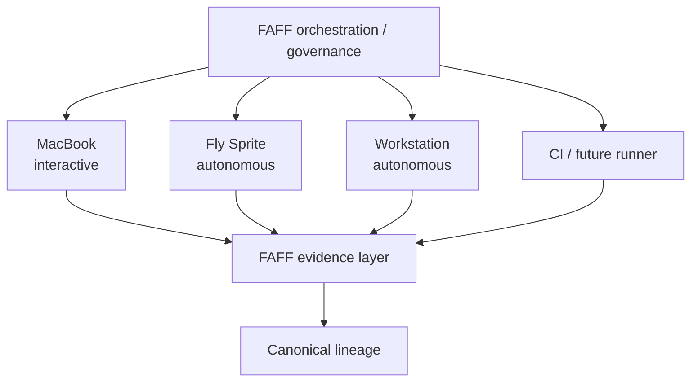

This means a run may begin on one executor and, following failure, continue on another without becoming a different logical run.

```text
Run R42
├── execution attempt 1 — fly:sprite-A
│   └── interrupted
└── execution attempt 2 — fly:sprite-B
    └── resumed → committed
```

Machine identity therefore must **not** equal run identity.

---

## 3. `.faff` should not be a shared mutable filesystem

The solution is not to mount the same `.faff` directory on every executor.

That would introduce distributed filesystem concerns that the evidence model does not need:

- concurrent writers;
- filesystem locks;
- partial writes;
- executor failure during mutation;
- conflicting indexes;
- ambiguous ownership.

Instead, each executor can have a local `.faff` materialization/cache while synchronizing against a machine-neutral evidence backend.

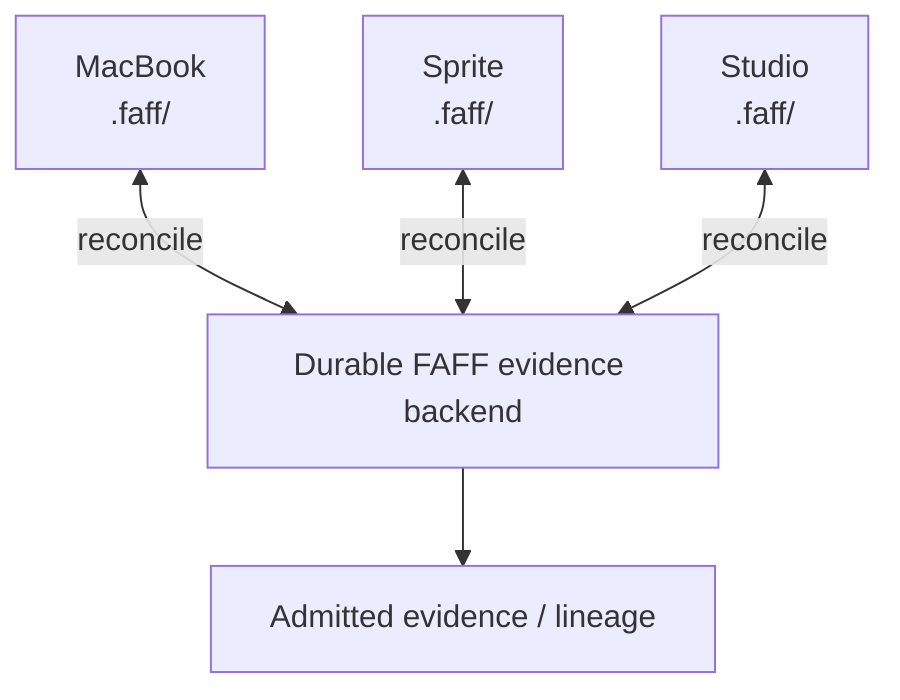

Completed runs can largely be immutable, while larger artifacts can be content-addressed.

The backing store could initially be an S3-compatible object store, but **Fly should not appear in the evidence semantics**. Sprite is simply one implementation of a remote executor.

---

## 4. Durable evidence is not admitted evidence

This distinction is critical.

During execution, FAFF **should** continuously move evidence off the executor. Otherwise a dead Sprite could destroy the only record of what occurred.

However:

```text
uploaded ≠ admitted
durable  ≠ canonical
```

Instead, durable storage contains two logical domains:

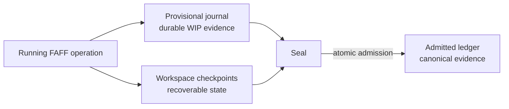

The provisional journal can contain perfectly valid evidence about events that occurred without making the larger claim that the run successfully completed.

---

## 5. Run lifecycle

A run needs an explicit lifecycle.

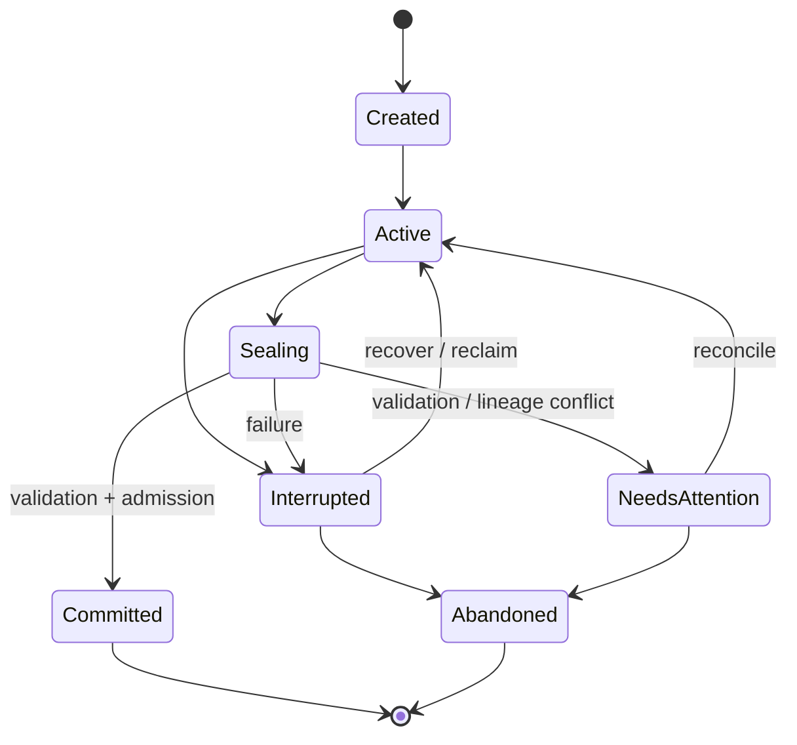

An active run can emit large amounts of durable evidence without advancing canonical lineage.

For example:

```text
R42  INTERRUPTED
parent: R41
evidence integrity: valid through seq 187
workspace checkpoint: C17
canonical lineage contribution: NONE
recoverable: YES
```

This is preferable to either:

1. losing the evidence entirely; or
2. leaving partially admitted evidence that makes the lineage ambiguous.

An interrupted run is therefore **not half trusted**.

It is a valid record of an incomplete operation.

---

## 6. Grafts require lineage coordination

Suppose the current canonical lineage is:

```text
R39 → R40 → R41
```

A graft starts R42 against R41.

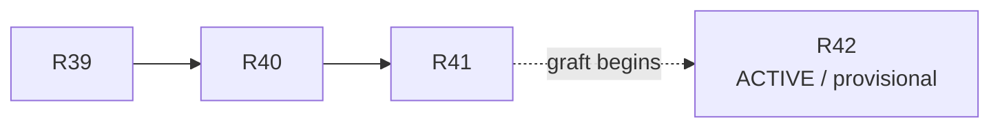

R42 records:

```text
run: R42
parent: R41
lease: L928
state: ACTIVE
```

It then performs work:

```text
journal
  seq 1
  seq 2
  ...
  seq 187

checkpoint
  C17
```

But **R42 has not yet become the child of R41 in canonical lineage**.

The dotted relationship is intent, not admission.

### If the executor dies

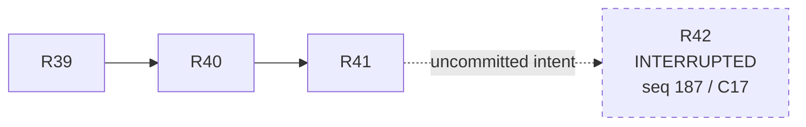

Canonical lineage remains:

```text
R39 → R40 → R41
```

Nothing needs to be rolled back because R42 never advanced it.

---

## 7. Leases

An active graft should hold a temporary lease describing the lineage it intends to extend.

Conceptually:

```yaml
lineage: project/foo
expected_head: R41
lease: L928
holder:
  run: R42
  execution: sprite-A
expires: ...
```

The lease provides coordination and establishes authority to operate, but it is **not ownership of canonical lineage**.

If the executor disappears, the execution lease can expire.

A replacement executor can then obtain a recovery lease for **R42 itself**.

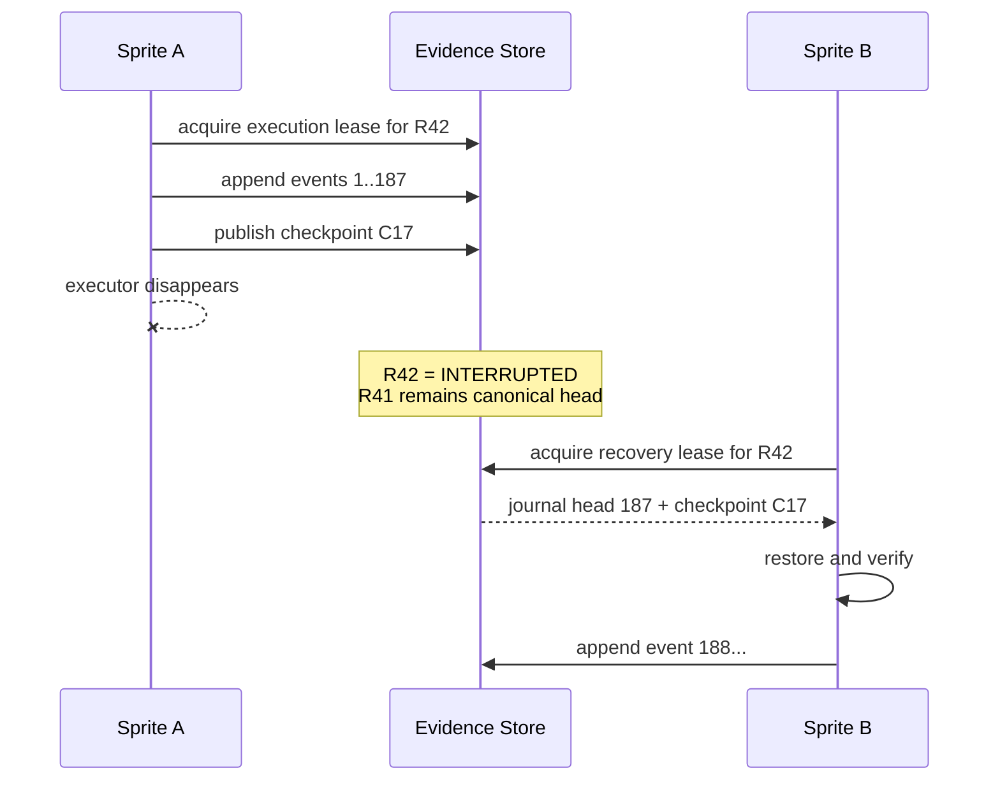

The logical operation has survived the physical executor.

---

## 8. Three durability classes

FAFF likely needs three distinct durability mechanisms.

| Class | Purpose | Write pattern | Canonical while running? |
|---|---|---|---|
| **Event journal** | Actions, tool calls, decisions, provenance, state transitions | Append continuously | No |
| **Workspace checkpoint** | Recover working tree and required execution state | Periodic immutable snapshot/delta | No |
| **Commit manifest** | Bind the completed evidence set and result | Single atomic admission | Yes |

### 8.1 Event journal

The journal is append-only and sequence-addressed.

```text
R42
├── 000001
├── 000002
├── ...
└── 000187
```

Each record can bind to the preceding record/hash, making missing or reordered evidence detectable.

### 8.2 Workspace checkpoints

Evidence alone is insufficient for recovery if the executor has modified a working tree.

FAFF therefore periodically captures enough state to reconstruct execution:

```text
checkpoint C17
├── repository base
├── working-tree delta / snapshot
├── execution metadata
├── journal head: 187
└── relevant runtime state
```

The exact representation can evolve. The architectural requirement is simply:

> A durable checkpoint must be sufficient for another compatible executor to continue the governed operation.

### 8.3 Commit manifest

The final manifest binds the completed run together.

Conceptually:

```json
{
  "run": "R42",
  "parent": "R41",
  "journal_head": "sha256:...",
  "workspace": "sha256:...",
  "result": "sha256:...",
  "final_sequence": 263
}
```

Admission then behaves like:

```text
ADMIT R42
IF canonical_head == R41
```

---

## 9. Admission must be atomic

Consider two grafts beginning from the same head:

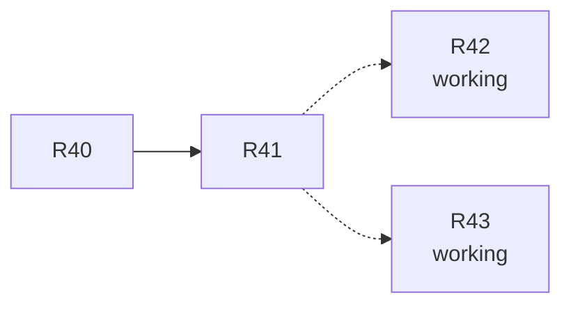

Both can legitimately produce provisional evidence.

Suppose R43 commits first:

```text
R40 → R41 → R43
```

When R42 later attempts to seal:

```text
expected head: R41
actual head:   R43
```

FAFF must **not** silently produce:

```text
R40 → R41 → R43 → R42
```

because R42 did not operate against R43.

Nor should its work disappear.

Instead:

```text
R42
state: NEEDS_ATTENTION
evidence: valid
workspace: recoverable
canonical contribution: NONE
reason: lineage advanced
```

It can then be:

- reconciled;
- rebased;
- grafted through an explicit decision;
- abandoned while retaining its evidence.

This gives FAFF compare-and-swap-like lineage semantics.

---

## 10. Recovery preserves the complete execution history

Recovery should not pretend the interruption never happened.

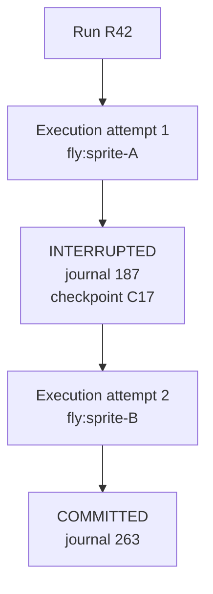

The interruption itself is evidence.

A final inspection could therefore show:

```text
R42
parent: R41
status: COMMITTED

executions:
  1:
    origin: fly:sprite-A
    outcome: interrupted
    final_sequence: 187

  2:
    origin: fly:sprite-B
    resumed_from: checkpoint C17
    outcome: completed
    final_sequence: 263
```

This is stronger audit evidence than hiding the infrastructure failure.

---

## 11. On-demand Sprite runner

With these semantics, Sprite execution becomes relatively simple.

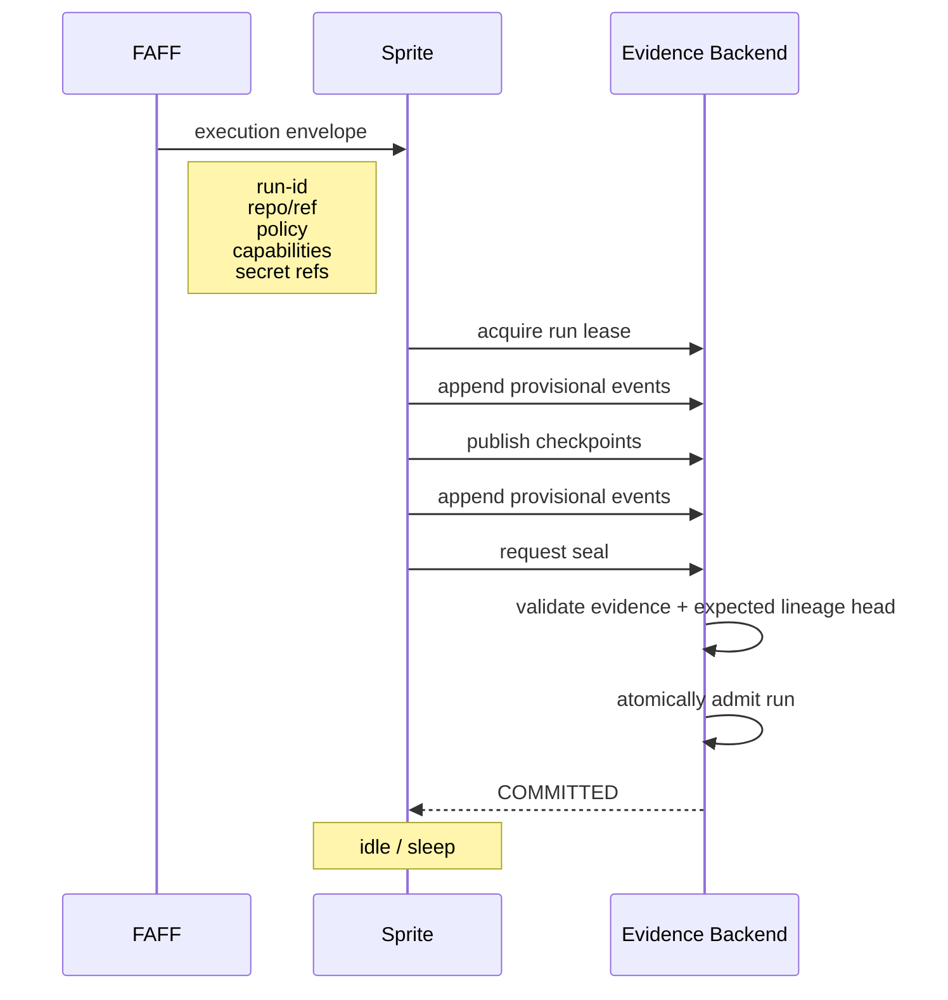

If the Sprite disappears before seal, the final two operations never happen.

The evidence backend still has enough information to describe and potentially recover the interrupted operation.

---

## 12. Reconciliation across machines

A user's local `.faff` should become a local view/materialization of the broader evidence set rather than necessarily containing every artifact.

For example:

```text
$ faff runs

RUN    ORIGIN             MODE          STATUS
R41    alec-mbp           interactive   committed
R42    fly:sprite-A/B     autonomous    committed
R43    studio             autonomous    interrupted
R44    alec-mbp           interactive   active
```

A synchronization operation might reconcile lightweight evidence:

```text
faff sync
```

while large content remains remote until required:

```text
faff show R42
```

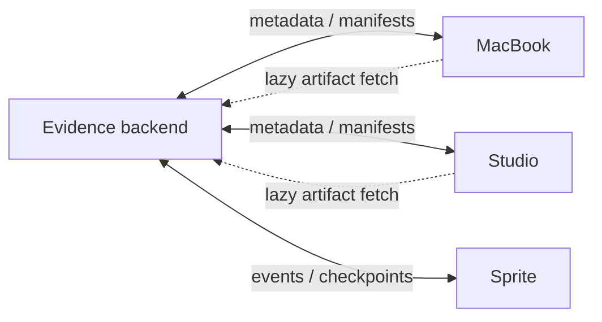

This also means an interactive graft on a laptop can graft from an autonomous Sprite run without requiring access to the Sprite's filesystem.

It references **R42**, not `/some/sprite/.faff/...`.

---

## 13. Evidence and blobs

A useful underlying split is:

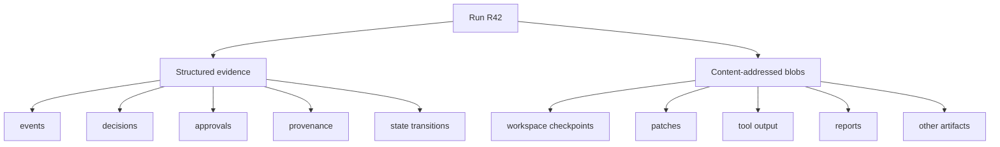

An event can refer to a blob by digest:

```json
{
  "type": "artifact.created",
  "run": "R42",
  "sha256": "74d832...",
  "media_type": "text/markdown",
  "name": "analysis.md"
}
```

This provides natural deduplication and makes the integrity of recovered evidence independently verifiable.

---

## 14. Proposed invariants

The distributed execution model should preserve these properties:

1. **Runs have globally unique identities independent of executor identity.**
2. **Evidence can become durable before a run becomes canonical.**
3. **Only successful atomic admission advances canonical lineage.**
4. **A graft claims lineage at commit, not when execution begins.**
5. **Interrupted runs remain inspectable evidence objects but contribute nothing to canonical lineage until recovered and committed.**
6. **Recovery continues the same logical run rather than manufacturing a replacement run.**
7. **Every execution attempt remains represented in the run's evidence.**
8. **Admission verifies that the lineage head against which work was performed has not changed.**
9. **Divergent completed work is retained rather than silently discarded or attached to an incompatible lineage.**
10. **Executors are replaceable infrastructure; governance and evidence semantics do not depend on Fly.io.**

---

## 15. Likely implementation concepts

Even if these do not all become public FAFF terminology immediately, the implementation appears to need first-class representations for:

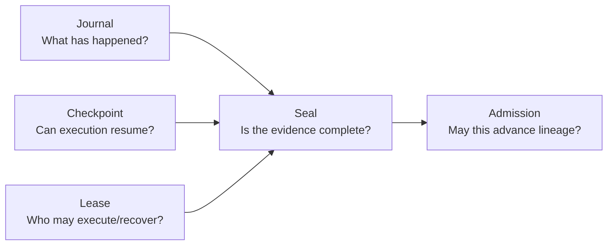

These concepts turn remote execution from a **log synchronization problem** into a **transactional evidence problem**.

That is the more general abstraction.

FAFF can allow progressively autonomous work to execute across unreliable, heterogeneous and on-demand compute while maintaining a deterministic boundary between:

- work that was observed;
- work that is recoverable;
- work that completed;
- and evidence that FAFF is prepared to canonically claim.

---

## 16. Architectural consequence

Fly.io Sprites should therefore be treated as the **first remote executor**, not as the architecture.

```text
                 FAFF
        governance / orchestration
                   |
            execution envelope
                   |
       +-----------+-----------+
       |           |           |
     LOCAL       SPRITE        CI
       |           |           |
       +----- provisional -----+
                   |
             evidence layer
                   |
        journal + checkpoints
                   |
                  seal
                   |
          atomic admission
                   |
          canonical lineage
```

Once that boundary exists, other execution environments can implement the same contract.

The important abstraction is:

> **Runs are globally addressable governed evidence objects; machines merely execute them.**
