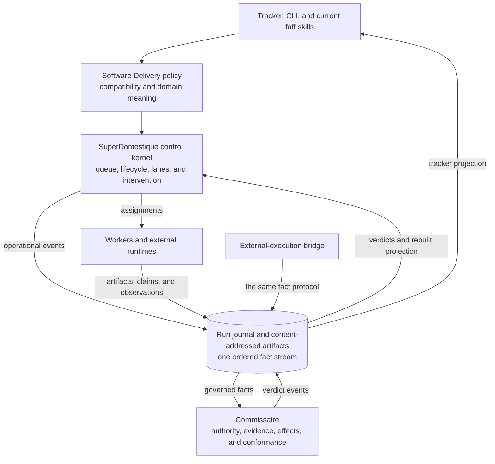
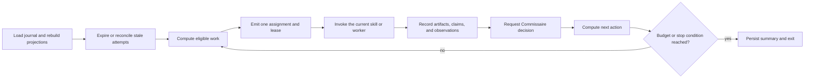
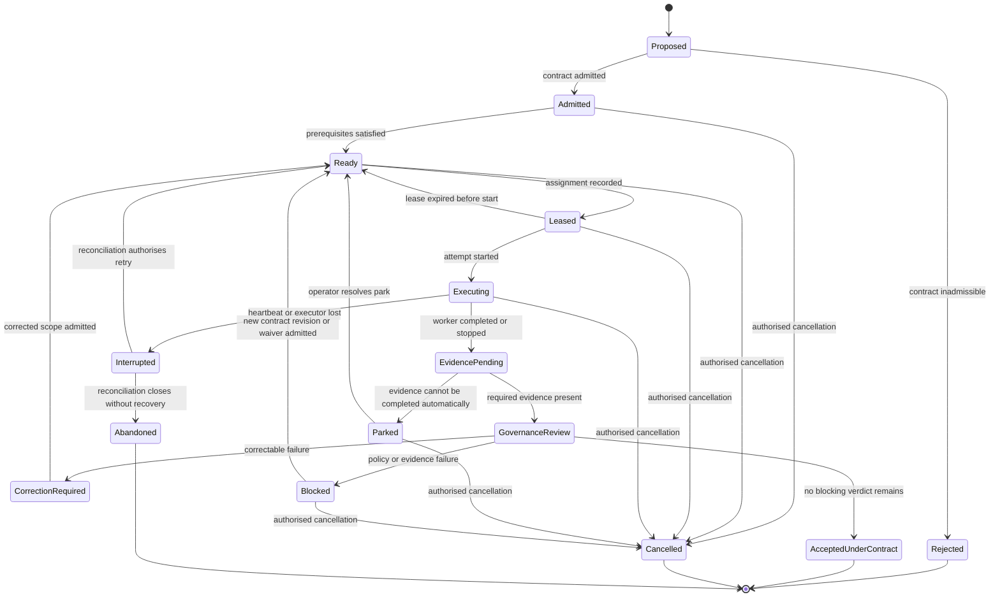
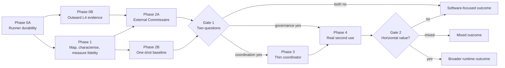

# SuperDomestique safe progressive autonomy: master direction v4

Status: proposed
Date: 2026-08-12
Model: Claude Fable 5
Decision owner: project maintainer
Planning horizon: evidence-gated, not calendar-gated

## Document authority

This document is the normative strategic direction for evolving SuperDomestique and Commissaire from the current repository.

It supersedes the planning sequence and proposed architecture in [master v3](../v3/FAFF-SAFE-PROGRESSIVE-AUTONOMY-MASTER-v3.md), which in turn superseded [master v2](../v2/FAFF-SAFE-PROGRESSIVE-AUTONOMY-MASTER-v2.md) and [roadmap v2](../v2/FAFF-PROGRESSIVE-AUTONOMY-ROADMAP-v2.yaml). It does not rewrite their historical evidence, experiment records, or prior decisions.

[Critique-3](../critique-3.md) records the cross-checks and reasons for this revision. [Critique-2](../critique-2.md), [critique-1](../critique-1.md), the [plot input](../v2/FAFF-PLOT-INPUT-v2.md), and the [distributed-run note](../v2/faff-distributed-evidence-recoverable-runs.md) remain source material rather than parallel plans.

When this document and an older planning document conflict, this document controls. Implementation facts in the repository still outrank proposed design.

v4 keeps v3's skeleton: extraction before construction, the external Commissaire proof and one-shot comparison before generic runtime work, an ephemeral bounded coordinator, effect assurance classes, the independence vector, and evidence-gated phases. The changes are corrections, not a new direction:

1. the run journal names its real enforcement class per deployment tier, the way effects already do;
2. the migration boundary between the journal and the existing hash-chained ledgers is stated before the first journal write path lands;
3. the lifecycle regains Cancelled and Abandoned terminal states;
4. Gate 1 splits into two separately answerable questions, and Phase 1 gains the coordination-fidelity measurement that answers the second one;
5. Phase 2A's exit evidence is scoped to what a solo operation can prove;
6. the surviving v2 assets, the real ADR log, and the decisions register get explicit homes;
7. Phase 0 splits into a runner-durability slice and an outward evidence pack.

## Executive decision

Evolve outward from the current L3 runner. Do not start by constructing a generic automation platform.

The programme will:

1. make the current unattended runner easier to trust, recover, and supervise;
2. map and characterise the deterministic control kernel already present, and measure how faithfully the prompt-interpreted orchestration follows it;
3. prove that Commissaire adds value to execution it did not orchestrate;
4. compare that value with the existing one-shot baseline;
5. wrap current skills and primitives in a thin deterministic coordinator only if the coordination evidence, separately from the governance evidence, earns it; and
6. pursue domain packs or a broader runtime only after a real second use creates evidence for them.

The intended product shape remains open. Three outcomes are acceptable:

- a broader protocol-driven SuperDomestique runtime with domain packs;
- reusable Commissaire governance with a software-focused SuperDomestique runtime; or
- stronger internal boundaries that improve software-delivery L3 and L4 without a separate horizontal product.

This is progressive autonomy in two senses. Individual runs receive no more authority than their evidence supports, and the product receives no more generality than observed use supports.

## Product and naming

The public product is SuperDomestique. Commissaire is its governance system. `faff` remains the literal name of the current repository, plugin, CLI, commands, configuration, paths, and historical records.

[Names and language](../../../concept/positioning-and-language.md) remains authoritative. Naming stability is tied to the product-shape decision at Gate 2, not to a calendar.

The harness-native adoption surface is a product asset, not only a migration shim. Someone already working inside a coding harness can adopt progressively governed delivery without deploying a platform; that adoption vector retains value in the mixed and software-focused outcomes as much as in the horizontal one. Packaging decisions about it wait for Gate 2, but no phase may treat the skills and plugin surface as disposable scaffolding.

No new public product name is introduced by this RFC.

## Current truth

### What is already valuable

Verified at repository state `79563ac` (2026-08-12):

- L3 runs unattended on a runner and automates most of a build for a solo builder.
- The tracker, CLI, skills, and review flow are the adoption surface and remain usable throughout extraction.
- L4 is a preview; its strongest independence claims still need outward evidence.
- The deterministic decision kernel is real and tested: next-step selection, terminal run outcomes, queue projection, region dependency rules, budgets, liveness, resume, and merge handling all pass their selftests.
- A governance and factory dependency boundary is enforced in code by the region checker.
- The one-shot baseline is strong and already instrumented: all nine recorded control tasks worked, and the experiment design defines matched arms, north-star outcomes, and a reportable null.
- The repository has a live ADR log at `records/adr` (105 entries) and a decisions register (`faff decisions`), which are the homes for decisions this programme takes.

### What is not yet proven

- A generic runtime is not yet shown to be more valuable than a well-instructed one-shot runner for ordinary successful builds.
- The cycle around the decision kernel does not exist in code. No module loads state, selects work, invokes a worker, records results, and loops; the harness LLM does that by following skill prose. How often the LLM's actions diverge from what the kernel prescribes has never been measured.
- Commissaire has not been proven as a small execution-independent governance system through a stable external protocol.
- L4 evidence has not demonstrated all claimed separation properties in a clean outward setting.
- Runner-local state is not durable enough to support strong recovery claims across executor loss; the one hosted-runner spike's environment was destroyed afterwards.
- An internal software-adjacent second use would not, by itself, prove a horizontal market.
- A standing hosted runtime is neither required nor evidenced.

### Strategic consequence

This is an extraction, assurance, and product-proof programme. The decision kernel is extracted; the coordination cycle is new code whose justification must be measured, not assumed. Platform construction is conditional work.

## Goals

1. Preserve and improve L3 while the architecture evolves.
2. Make unattended runs reconstructable without transcript replay or a surviving runner.
3. Keep probabilistic work inside workers and deterministic lifecycle decisions inside explicit code.
4. Make governance claims precise enough to be independently tested.
5. Let external workflows use Commissaire without pretending SuperDomestique orchestrated them.
6. Retain one canonical ordered history for operational and governance facts, with a stated migration boundary from the current ledgers.
7. Provide a credible path to a broader runtime without committing to it early.
8. Keep the operating and maintenance burden appropriate for a solo builder.

## Non-goals

This RFC does not commit to:

- a long-running daemon;
- a write-authenticating journal service before a measured trigger requires one;
- a hosted multi-tenant control plane;
- live workspace migration between runners;
- a domain-pack marketplace;
- a universal policy language;
- a second public product;
- replacing the current tracker, CLI, or skills before a thin compatible path works;
- claiming human-equivalent judgement from deterministic evidence bookkeeping; or
- requiring a second human for every L4 run.

## Design principles

### Preserve the working surface

The current runner, tracker, CLI, and skills are the migration surface. An extraction that makes common L3 work harder is a regression unless it removes a measured failure mode of greater value.

### Extract before generalising

Start with current primitives and one end-to-end vertical slice. Stabilise a protocol only after two concrete producers or consumers need it.

### One history, multiple meanings

Operational coordination and governance may project the same ordered run history differently. They must not maintain competing canonical mutable state.

### Executor completion is a claim

A worker can report that it finished. Only Commissaire can append the governance verdict that the run is `accepted_under_contract`.

### Assurance must be named, including for the record system itself

An effect observed after execution is not an effect prevented before execution. A second prompt is not necessarily an independent reviewer. A journal whose producers all hold the write credential does not enforce append authority at write time, whatever its schema says. Every result, and the record system carrying it, states the assurance actually achieved.

### Failure should reduce scope, not erase value

Early work must remain useful if the horizontal thesis fails. Each roadmap item records whether it retains value in horizontal, mixed, and software-focused outcomes.

### Operate in bounded segments

The first runtime process is ephemeral. Each runner or cron firing rebuilds state, performs a bounded amount of work, records durable facts, and exits. A service becomes justified only when measured requirements cannot be met this way.

### Buy each layer with its own evidence

Governance value does not justify a coordinator; coordination value does not justify governance. Each purchase has its own gate question and its own measurement.

## Target architecture

### Logical components

### Responsibility table

| Component | Owns | Does not own |
|---|---|---|
| Current faff surface | User commands, tracker interaction, compatible skill workflows, configuration | Canonical runtime or governance state |
| Software Delivery policy | Stage meaning, software artifacts, checks, branch and PR semantics, delivery-specific defaults | Generic run ordering or governance verdict storage |
| SuperDomestique control kernel | Eligibility, assignment, lanes, leases, attempts, correction, park, resume, bounded-cycle decisions | Acceptance authority, domain-specific quality meaning, artifact bytes |
| Worker | Probabilistic execution, artifact production, claims, observations | Admission, protected-effect authority, terminal acceptance |
| Run journal | Ordered append, stream revision, idempotency, integrity, artifact references, conditional writes, lineage-head records | Operational or governance policy meaning |
| Artifact store | Immutable, content-addressed evidence and workspace snapshots | Lifecycle decisions |
| Commissaire | Contract admission, authority, evidence requirements, effect decisions, reconciliation, waivers, terminal conformance | Work scheduling, worker selection, tracker presentation |
| External bridge | Translation of external execution facts into the common protocol | Pretending external work was coordinated by SuperDomestique |

### SuperDomestique as a reference coordinator

The initial SuperDomestique runtime is the reference implementation of four small protocols:

1. assignment;
2. control decision;
3. run record; and
4. protected effect.

External runtimes may implement the same protocols or may use only the external-execution bridge. Domain logic should not depend on a particular process manager, queue product, or hosting topology.

## Canonical run record

### Journal requirements

The run journal is append-only and neutral. At minimum, each record carries:

- run ID and execution-attempt ID;
- stream revision and event ID;
- event type and schema version;
- producer and acting principal;
- correlation and causation references;
- observed time and recorded time;
- payload digest and immutable artifact references;
- expected prior revision for conditional append; and
- integrity metadata sufficient to detect missing, reordered, or altered records.

Repeated delivery of the same event ID is idempotent. A write against a stale expected revision fails and is reconciled rather than silently overwriting state.

Stream revision defines order. Producer-supplied observation time may explain causality, but it cannot reorder the canonical stream.

### Append authority and its real enforcement class

The journal restricts which event types each producer may append:

- SuperDomestique may append assignments, leases, attempt lifecycle, and control decisions;
- workers may append their own claims, artifact references, heartbeats, and observations;
- Commissaire alone may append admissions, governance-gate decisions, waivers, protected-effect decisions, reconciliation verdicts, and terminal verdicts; and
- an external bridge may append only the fact types granted to its authenticated external producer.

How that restriction is enforced depends on the deployment tier, and the achieved class is recorded, using the same vocabulary as protected effects:

| Tier | Mechanism | Class | Permitted claim |
|---|---|---|---|
| Store-enforced | Object-store or database policy denies out-of-scope appends outside every producer's trust domain | A | An out-of-scope append could not occur. |
| Service-mediated | An authenticating writer holds the only write credential and validates type scope per principal | B | An out-of-scope append could not occur through the governed path. |
| Verification-time | All producers can write; principal and type scope are validated at projection, seal, and verdict time; violations are detected and quarantined | C | An out-of-scope append is detected and has no authority. |
| Declared-only | Producer identity is recorded but not validated | D | The record says who wrote it. |

The first no-daemon implementation is verification-time (class C): a payload claiming to be a Commissaire verdict has no authority when its principal or type scope fails validation, and the projection treats it as a quarantined anomaly, but the write itself is not prevented. Class D is not acceptable for governance event types. Raising the journal to class A or B is an open decision with a measured trigger, not implied work.

A terminal verdict's assurance summary includes the journal enforcement class in force for its lineage.

### Migration boundary from the current ledgers

The repository already keeps hash-chained per-run history: run event files, chain heads, run ledgers, and declared-effect records. The journal is their successor, not their sibling. Before the first journal write path lands, Phase 1 must state, per current artifact:

- whether it becomes journal content (translated forward with provenance), a projection (rebuildable, discardable), or a frozen historical record (readable through a compatibility reader, never migrated in place);
- the cutover point at which the journal becomes canonical for new runs; and
- the rule that no run is ever canonical in both histories at once.

Existing integrity chains are preserved as evidence. Translation records its source format and provenance. Rewriting historical events in place is prohibited.

### Run and attempt identity

A logical run ID is stable across runner loss and retry. Each execution obtains a new attempt ID. Evidence from a failed or expired attempt remains in the journal and cannot be relabelled as evidence from its successor.

### Lineage heads and concurrent grafts

Two concurrent grafts from the same lineage head contend on the head, not on each other's run streams. The journal therefore keeps a named lineage-head record per governed lineage. Admission of a run into canonical lineage is a conditional write against that record: admit run R at head H only if the head is still H. A run that loses the race keeps its evidence, enters reconciliation, and may be rebased, regrafted through an explicit decision, or abandoned; it is never silently appended to a head it did not build on.

### Retention classes

Operational and governance events share one ordered stream but not one retention rule:

- **Governance events** (admissions, gate decisions, verdicts, effect decisions, waivers, reconciliations) are retained indefinitely.
- **Operational events** (heartbeats, leases, progress) may be compacted after their run reaches a terminal state, replaced by a segment digest.

The evidence seal for a terminal verdict covers the governance lineage plus the digests of any compacted operational segments, so seals remain verifiable after compaction. Compaction never touches an open run and never removes a record a seal references directly.

### Artifacts and workspace snapshots

Large evidence stays outside the journal in content-addressed storage. Journal records carry digests, locations, media types, producers, and production context.

A workspace snapshot is an immutable artifact that can seed a later attempt. It is not a mutable checkpoint database and does not become canonical state. Branch references may be recorded as durable recovery inputs when their commit identities are fixed.

### Projections

Queue state, run status, tracker status, governance summary, and operator views are rebuildable projections. They may be cached, but a cache is discardable.

If a projection and the journal disagree, the journal wins. If an external system disagrees with the journal, reconciliation appends observations and decisions rather than rewriting history.

### Terminal safety rule

No partial or truncated journal may produce a canonical accepted result. A terminal verdict requires:

- a complete lineage from admitted contract to candidate result;
- all mandatory evidence references;
- a current governance verdict appended at the expected stream revision; and
- an evidence seal that covers the terminal lineage.

Later observations can append a superseding reconciliation verdict. They do not edit the earlier verdict.

## Runtime locus and cycle

No daemon is required for the first implementation.

Each scheduled firing or manual invocation runs the same bounded cycle:

The cycle may park instead of assigning work, request correction, or stop because no work is eligible. Those are explicit outcomes, not prompt-level conventions.

### Trigger for a durable service

A long-running coordinator, hosted control plane, or write-authenticating journal service is considered only when one or more of these are measured:

- required reaction latency is shorter than practical scheduled firings;
- lease renewal must continue while workers run independently for long periods;
- concurrent writers cause material conditional-append contention;
- event volume makes bounded projection rebuilds too slow even with snapshots;
- a protected effect or governance claim requires journal enforcement class B that no store-side policy can provide;
- an external design partner requires a stable network endpoint; or
- operator burden from ephemeral invocations exceeds the service's operating burden.

Until then, a daemon is optional infrastructure without proven product value.

## Lifecycle and recovery

### Normative lifecycle

Every admitted run reaches one of four terminal dispositions: AcceptedUnderContract, Rejected, Cancelled, or Abandoned. Cancellation requires recorded authority and reason; abandonment is a reconciliation decision over an interrupted run and preserves all evidence. A run with no disposition is a defect, not a state.

The diagram names logical states. Implementations record events and derive these states rather than mutating a row without history.

### Leases and liveness

Leases are runtime coordination, not governance authority. Acquisition, renewal, release, and expiry are journalled. A lease grants the right to attempt assigned work for a bounded interval. It does not grant permission for protected effects.

Heartbeats show liveness but do not prove progress or quality. Lease expiry marks an attempt interrupted or suspect and starts reconciliation. It never silently transfers evidence to a new attempt.

### Minimal runner durability

Before broader runtime extraction, scheduled L3 and preview L4 runs must support:

- machine-independent run identity;
- distinct attempt identity per executor;
- off-box journal and summary publication at stage or build boundaries;
- durable commit, branch, and terminal artifact references where applicable;
- deterministic interrupted-attempt detection;
- recovery on a later invocation without a surviving local ledger; and
- a killed-executor fixture proving that partial history cannot become accepted.

Live process continuation and transparent cross-machine workspace migration remain deferred. Recovery begins at a safe stage boundary from immutable artifacts.

## Commissaire contract

### Minimum facade

The first external facade contains only operations needed for the proof:

1. admit a versioned contract;
2. append or register facts and evidence;
3. request a protected-effect decision;
4. request a terminal conformance verdict;
5. append observations and reconciliation outcomes; and
6. seal and export an audit bundle.

Queueing, worker assignment, scheduling, and domain-specific stage logic stay outside this facade.

### Contract admission

Admission answers whether the proposed work is governable under a named contract version. It checks required identities, authority, evidence obligations, protected effects, terminal criteria, and declared independence requirements.

Admission does not assert that the work will succeed. A material contract change creates a new revision and a new admission decision.

### Governance gates

A governance gate is a decision point that can allow, deny, require correction, require more evidence, park, or escalate. Avoid `governance checkpoint`: `checkpoint` has been used for both governance evaluation and workspace state.

### Terminal verdict

The positive terminal verdict is `accepted_under_contract`, not simply `complete` or `good`.

Its assurance summary includes:

- contract identity and revision;
- terminal criteria evaluated;
- evidence coverage and seal;
- unresolved observations or waivers;
- review-independence vector;
- effect-control assurance by effect;
- the journal enforcement class in force for the lineage; and
- the Commissaire rule and implementation versions that produced the verdict.

Worker completion, test success, merge, deployment, and acceptance are separate facts.

### Evidence vocabulary

| Term | Meaning |
|---|---|
| Contract admission | Initial decision that a proposed run can be governed under a versioned contract. |
| Governance gate | An authority, evidence, effect, or conformance decision within the admitted run. |
| Workspace snapshot | Immutable content-addressed material from which a later attempt can restart. |
| Evidence seal | Integrity commitment over the evidence and event lineage used for a verdict. |
| Lineage commit | Commitment that binds an artifact or decision to its causal predecessors. |
| Lineage head | The journal record naming the current canonical tip of a governed lineage; admission is a conditional write against it. |

There is one admission per contract revision. A lineage commit is not a second admission.

## Protected effects

Every consequential effect declares the strongest mechanism actually enforcing it.

| Class | Enforcement | Permitted claim |
|---|---|---|
| A | External enforcement outside the worker trust domain, such as branch protection | The effect could not occur unless the external rule allowed it. |
| B | Mediated gateway using a scoped credential unavailable to the worker | The effect could not occur through the governed path unless the gateway allowed it. |
| C | Independent observation after the attempt | An unauthorised or mismatched effect can be detected and reconciled. |
| D | Worker or coordinator self-attestation | The system reports that it followed the expected rule. |

Only A and B satisfy a claim that an effect was blocked before execution. C may still support strong detection and recovery. D supports debugging and audit context, not independent enforcement.

The contract sets a minimum class per effect. A terminal verdict cannot silently substitute a weaker class. The same class vocabulary applies to the journal's own append authority, as stated above.

## Independence model

Independence is recorded as a vector, not a Boolean:

| Dimension | Examples |
|---|---|
| Invocation and principal | Separate process, identity, credential, or operator |
| Lane history | No actor occupies conflicting author, reviewer, or judge lanes |
| Context lineage | Fresh context, isolated prompt history, no private chain inherited |
| Model | Different model instance, family, or provider |
| Workspace and capabilities | Read-only code access, code-blind environment, separate network or effect credentials |
| Artifact version and timing | Reviewer sees a fixed digest produced before review begins |

The solo-builder default for an L4 adversarial review is:

- a distinct invocation;
- fresh context;
- conflicting-lane exclusion;
- a fixed candidate artifact digest; and
- a different model family from the primary authoring worker.

Code-blind environment evaluation and stronger credential separation are required when the contract says they are enforceable and material. A human remains an escalation path, not a mandatory participant in every successful run.

A reference run initiated by a non-author operator strengthens outward evidence when practical. Its presence or absence is recorded in the assurance vector and does not replace the technical separation requirements.

## Operator comprehension

Every bounded invocation publishes one durable run summary. A maintainer should not need a worker transcript to answer:

- What was attempted?
- What is the current logical state?
- Which attempt and worker acted most recently?
- Which contract and policy versions applied?
- Which evidence is present or missing?
- Why did the run continue, stop, park, block, or request correction?
- Which protected effects occurred and under what assurance class?
- What is the next permitted action?
- Is human intervention required?

The tracker remains a projection and navigation surface. The sealed audit bundle remains the inspectable source for a terminal verdict.

Operator-burden measures are derived from journal and tracker timestamps wherever possible, not from self-report. Where self-report is unavoidable, it is labelled as such in the scorecard.

## Proof strategy

### Proof ladder

Evidence increases in cost only when the preceding question is answered positively.

### Required reference scenarios

The first proof set contains at least:

1. a successful run;
2. a seeded governance block;
3. a self-certification attempt (an executor tries to satisfy its own independent-review obligation);
4. an executor killed after partial evidence publication;
5. an incomplete or stale evidence submission;
6. a protected-effect mismatch;
7. a budget or retry threshold exceeded;
8. a mid-run contract amendment invalidating affected work; and
9. a correction or resume path.

This restores the v2 catalogue's coverage: its F1 through F9 map onto scenarios 5, 3, 6, 6, 7, 2, 8, 9, and the terminal-disposition gap respectively, with the disposition gap enforced structurally by the four-terminal lifecycle rather than by a scenario. Each scenario is reproducible in a clean outward repository or fixture environment and exports the same form of audit bundle.

### External Commissaire proof

The proof must govern work that SuperDomestique did not schedule. Suitable first candidates are:

- a manually executed one-shot software task; or
- a real internal eval-baseline update workflow.

The external producer submits through the common run-record protocol. Commissaire admits the contract, evaluates evidence and protected effects, appends verdicts, and exports the audit bundle. The proof fails if it requires importing the whole current orchestration stack.

What this proof can establish, with one maintainer acting as producer, operator, and rule author, is protocol sufficiency, mechanical detection of the seeded classes, and replay-stable verdicts. It cannot establish executor independence in the strong sense; that claim is carried only by the recorded assurance vector. Exit evidence is worded accordingly.

### One-shot comparison

Reuse the existing faff-lab design rather than inventing a weak control. It already provides nine strong controls, matched treatment arms, north-star outcomes, and a reportable null. Compare a matched treatment using the same task, repository state, model budget, and outcome criteria where practical.

The comparison asks whether the governed treatment adds value in:

- pre-execution qualification;
- independent catches;
- false-block rate;
- recovery after interruption;
- operator time;
- audit completeness;
- repeated-run consistency; and
- total execution and maintenance cost.

The treatment need not win every dimension. It must show a valuable pattern that simpler logs, CI status, branch protection, and a well-instructed one-shot worker do not provide at lower cost. Per-run marginal cost and amortised setup cost are reported separately.

### Coordination fidelity

The coordinator (Phase 3) is justified by a different claim than governance: that LLM-interpreted control flow misroutes, drifts, or costs more than explicit code. That claim is measured directly:

- for recorded L3 runs, replay the ledger inputs through the deterministic kernel (next-step selection, run completion, queue projection) and compare the action the harness took against the action the kernel prescribes;
- count divergences, classify each divergence's consequence (harmless, wasteful, wrong), and report the orchestration token and time cost per cycle;
- where current ledgers do not record enough to replay a decision, record that gap; closing it is Phase 0A work, and the gap itself is evidence about transcript-independence.

This measurement uses existing run history and costs little. It is the evidence Gate 1's coordination question consumes.

### Internal second use

An eval-baseline workflow is the preferred first abstraction-pressure test because it is real, available, and meaningfully different in lifecycle and evidence. It remains software-adjacent and human-supervised, so success does not support a broad horizontal claim.

A synthetic supplier workflow is a fallback for conformance mechanics only.

### External design partner

Pack SDK, marketplace, and broad runtime positioning wait for one real workflow owned by a party with different incentives, terminology, artifacts, and effects. The partner must adopt the protocol without requiring repository-specific internal knowledge.

Partner search has calendar lead time that engineering cannot compress. Scouting starts during Phase 3; integration stays where the roadmap places it, after the internal second use remains promising.

## Measures

The programme maintains one scorecard across the proof ladder.

| Dimension | Measure |
|---|---|
| Reliability | Runs or bounded segments that reach the correct durable outcome without lost state |
| Recovery | Interrupted attempts detected and safely resumed or parked on the next eligible invocation |
| Autonomy | Eligible work completed without maintainer intervention |
| Coordination fidelity | Divergence rate between recorded harness actions and kernel-prescribed actions on replayed runs, with consequence classification and per-cycle orchestration cost |
| Operator burden | Maintainer minutes required to understand and resolve a run, derived from timestamps where possible |
| Governance yield | Material seeded and natural issues caught before acceptance |
| False blocks | Valid outcomes prevented or parked without a contract-supported reason |
| Assurance | Required independence, effect-control, and journal enforcement classes actually achieved |
| Evidence quality | Required lineage present, sealed, exportable, and reconstructable |
| Economics | Compute, model, storage, and maintenance cost relative to one-shot execution, marginal and amortised reported separately |

Each experiment records raw counts and denominators. "Mostly autonomous" and "safer" are not accepted as unmeasured conclusions.

Before product claims, the proof set must at least show:

- all seeded blocks detected for the declared rule set;
- no accepted terminal result from the killed-executor or incomplete-journal fixtures;
- successful stage-boundary recovery without the original runner-local ledger;
- no conflicting-lane violation in the reference L4 scenarios;
- an operator-readable outcome from one durable summary;
- a measured coordination-fidelity result from replayed runs; and
- a matched one-shot comparison with costs and limitations reported.

Natural catch rate and false-block rate require longer observation and must not be inferred from seeded fixtures alone.

## Roadmap

### Roadmap shape

Phase numbers describe decision order, not release versions. Phase 0B may overlap Phase 2A. Phase 2A and Phase 2B run as one bounded comparison effort. Gate 1's two questions have independent consequences, described at the gate.

### Phase 0A: runner durability

Objective: make unattended runs survive executor loss without weakening evidence.

Deliverables:

- machine-independent run IDs and per-attempt IDs;
- off-box stage-boundary journal, summary, and terminal artifact publication;
- deterministic interrupted-attempt detection and safe next-invocation recovery;
- recording sufficient for the Phase 1 coordination-fidelity replay (every control decision's inputs and chosen action); and
- the killed-executor fixture proving partial history cannot become accepted.

The off-box format in this phase is explicitly provisional: attempt, summary, and terminal records, not a stabilised event vocabulary. The journal envelope stabilises in Phase 2A when the second producer appears. The migration boundary from the current ledgers is decided in Phase 1 before any journal write path replaces an existing artifact.

Exit evidence:

- the killed-executor fixture is repeatable from a clean runner context;
- no killed or partial attempt can produce `accepted_under_contract`;
- a later invocation can reconstruct and safely resume or park without the original local ledger; and
- current L3 operation has not regressed.

Retained value: horizontal yes; mixed yes; software focused yes.

Constraints:

- do not block L3 reliability fixes on future contracts;
- do not require a standing hosted runner.

### Phase 0B: outward L4 evidence

Objective: make the preview governance claims safe to state in public.

Deliverables:

- an inventory of L4 correctness gaps, separated from polish;
- the reference scenario set (successful, seeded-block, self-certification, killed-executor, stale-evidence, effect-mismatch, budget-exceeded, amendment, correction-resume) reproducible in a clean outward repository;
- an operator summary that answers the comprehension questions in this document; and
- release notes that distinguish implemented assurance from proposed architecture.

Exit evidence:

- the reference fixtures are repeatable from a clean context;
- seeded independence and evidence failures produce founded block or park reasons; and
- no claim is published beyond the recorded assurance vector.

Retained value: horizontal yes; mixed yes; software focused yes.

This phase may overlap Phase 2A; both produce audit bundles in the same form, and neither blocks Phase 1.

### Phase 1: map, characterise, and measure fidelity

Objective: identify the smallest extraction boundary without duplicating current behaviour, and measure whether prompt-interpreted orchestration is actually failing.

Classify relevant repository paths into five buckets:

1. Commissaire governance;
2. deterministic runtime kernel;
3. Software Delivery policy;
4. harness and skill orchestration; and
5. external adapters and infrastructure.

Deliverables:

- dependency and data-flow maps rooted in the current region checker;
- characterisation tests for representative L2, L3, and preview L4 decisions, seeded from the v2 implementation-invariants list where the invariants apply to the selected slice;
- a state-authority map showing every canonical, cached, projected, and external state source;
- the per-artifact migration boundary for the journal (journal content, projection, or frozen record, with the cutover rule);
- the coordination-fidelity replay result over recorded L3 runs;
- a selected vertical slice from admission through terminal verdict, with concept-level traceability (current concept, destination layer, proof) for every concept the slice touches; and
- only the ADRs required to implement that slice, numbered in `records/adr`.

Exit evidence:

- every state-changing step in the slice has one named owner and durable fact;
- existing queue, run completion, gate, budget, and liveness semantics are either retained or intentionally changed with tests;
- no second queue or lifecycle implementation is proposed without an explicit replacement boundary;
- the fidelity replay reports divergence rate, consequence classes, and orchestration cost, or the recording gaps that prevent it (which then bound Phase 0A follow-up); and
- the first slice can be delivered behind the current faff surface.

Retained value: horizontal yes; mixed yes; software focused yes.

### Phase 2A: prove execution-independent Commissaire

Objective: determine whether Commissaire is independently useful before building a generic runtime.

Deliverables:

- the minimum facade defined in this document;
- the neutral journal envelope needed by one external producer, with its enforcement class recorded;
- one externally executed governed workflow;
- pass, seeded-block, stale-evidence, effect-mismatch, and killed-producer fixtures; and
- an exported sealed audit bundle and operator summary for each outcome.

Exit evidence:

- the external producer does not import SuperDomestique scheduling or skills;
- Commissaire produces founded decisions from protocol facts and evidence;
- replay from the journal reproduces the same verdict projection;
- weaker effect, independence, or journal-enforcement assurance cannot silently satisfy a stronger contract;
- the integration is materially smaller than adopting the whole current faff workflow; and
- the claims made are protocol sufficiency, mechanical detection, and replay stability, with independence carried by the assurance vector only.

Retained value: horizontal yes; mixed yes; software focused yes.

### Phase 2B: run the existing one-shot comparison

Objective: determine whether governance and recoverability justify their operational cost.

Deliverables:

- one matched treatment using the existing one-shot experiment design;
- failure and interruption scenarios, not just happy paths;
- operator-time, execution-cost, evidence, catch, and false-block results, with marginal and amortised costs separated; and
- a written account of which benefits ordinary CI controls already provide.

Exit evidence:

- the result is reproducible;
- the one-shot control is represented at full strength;
- unique value and added cost are both visible; and
- limitations and negative results are retained.

Retained value: horizontal yes; mixed yes; software focused yes.

### Gate 1: two questions, answered separately

**Question 1: does governance earn its cost?** Proceed with the Commissaire path (Phase 4, and eventually the mixed or horizontal outcomes) only if the combined Phase 2 evidence shows at least one material, repeatable advantage over the strong one-shot control, and the advantage matters for unattended operation. Qualifying advantages:

- a material issue caught before acceptance by an independently assured lane;
- safe recovery from interruption that the control cannot match without equivalent machinery;
- materially lower repeated-run operator burden;
- a useful audit or authority property required by a real workflow; or
- reliable correction and resume behaviour across multiple attempts.

Seeded failures prove that enforcement mechanics work; they do not establish product value by themselves. At least one qualifying advantage must come from a real workflow or the matched comparison. Cleaner logs do not qualify.

**Question 2: does deterministic coordination earn its cost?** Proceed with Phase 3 only if the coordination-fidelity measurement shows divergence with real consequences, material orchestration cost, or recovery behaviour that explicit code demonstrably fixes. A low divergence rate with harmless consequences fails this question regardless of how the governance question resolves.

The consequences are independent:

| Governance | Coordination | Outcome |
|---|---|---|
| Yes | Yes | Phase 3, then Phase 4 through the coordinator. |
| Yes | No | Skip Phase 3. Phase 4 proceeds through the facade and external bridge; the kernel remains authoritative for decisions inside the current skill surface. |
| No | Yes | Build the thin coordinator as software-product hardening only; no generic runtime, no Phase 4. |
| No | No | Software-focused outcome. Keep the journal, recovery, summaries, and low-cost governance checks inside the software-delivery product. |

### Phase 3: extract the thin deterministic coordinator

Objective: replace prompt-interpreted orchestration with the narrowest explicit cycle that preserves current product behaviour.

The first coordinator performs only:

1. load and project;
2. reconcile stale attempts;
3. compute ready work;
4. assign one unit under a lease;
5. invoke the current skill or worker adapter;
6. record results;
7. request Commissaire decisions;
8. compute the next action; and
9. stop, park, or repeat within a bounded budget.

Deliverables:

- assignment, control-decision, run-record, and effect protocols for the selected slice;
- an ephemeral reference coordinator;
- compatible current CLI, tracker, and skill entry points;
- stage-boundary retry and resume; and
- side-by-side characterisation against the previous orchestration path, including the fidelity measure re-run under the coordinator.

Exit evidence:

- the selected L3 path runs without an LLM interpreting control flow;
- probabilistic decisions are explicit worker outputs, not hidden lifecycle mutations;
- the journal can reconstruct every coordinator decision;
- current user-facing operation remains recognisable; and
- the new path improves or preserves the Phase 0A scorecard and the measured divergence consequences.

Design-partner scouting starts during this phase; it is a search activity, not an integration commitment.

Retained value: horizontal yes; mixed yes; software focused yes.

### Phase 4: apply real second-use pressure

Objective: learn whether the protocols describe more than the software-delivery path that produced them.

Step 1 uses a real internal eval-baseline workflow. It should exercise different artifacts, evidence, correction, and terminal semantics while using the same journal and Commissaire facade. If Gate 1 skipped Phase 3, this step runs through the external bridge.

Step 2 occurs only if Step 1 remains promising. It uses one distant design partner with a real workflow. The partner integration should expose missing semantics rather than being forced into Software Delivery vocabulary.

Deliverables:

- a thin internal domain binding with no copied runtime kernel;
- a record of protocol changes forced by the second use;
- a comparison with a simpler baseline for that workflow; and
- if justified, a design-partner integration brief and result.

Exit evidence:

- shared protocols remain small after real pressure;
- domain meaning stays outside the kernel and Commissaire;
- the new workflow receives measurable value beyond uniform logging; and
- maintenance burden remains viable for a solo builder.

Retained value: horizontal yes; mixed partly; software focused only where shared improvements return to L3 or L4.

### Gate 2: what product shape did the evidence earn?

Classify the outcome:

| Evidence | Product decision |
|---|---|
| The internal and external second uses adopt the protocols with limited special casing and gain measurable value | Build the pack SDK and broader SuperDomestique runtime deliberately. |
| Commissaire transfers cleanly but runtime coordination remains software-specific | Publish or reuse Commissaire; keep SuperDomestique focused on software delivery. |
| Neither transfers cleanly or the operating cost dominates | Keep the internal boundary improvements and stop horizontal productisation. |

This gate settles whether physical package, repository, public-product, and naming boundaries change.

### Phase 5: productise only the earned shape

Possible work after Gate 2 includes:

- stable protocol versioning and compatibility policy;
- pack authoring and conformance tooling;
- a network service if measured triggers require it;
- provider or authorisation adapters backed by real demand;
- a cross-domain operator surface; and
- public positioning for the chosen product shape.

None of these is implied work in earlier phases.

Retained value depends on the selected outcome and must be stated per project before work begins.

## Mapping from v3

| V3 element | V4 treatment |
|---|---|
| Phase 0 | Split into 0A runner durability and 0B outward evidence; 0B may overlap 2A; off-box format marked provisional; fidelity-recording requirement added. |
| Phase 1 | Retained; adds the coordination-fidelity replay, the per-artifact ledger migration boundary, invariant-seeded characterisation tests, and slice-scoped concept traceability. |
| Phase 2A | Retained; exit evidence scoped to protocol sufficiency, mechanical detection, and replay stability. |
| Phase 2B | Retained; marginal and amortised cost separated. |
| Gate 1 | Split into governance and coordination questions with an explicit outcome matrix. |
| Phase 3 | Retained; conditional on the coordination question alone; partner scouting starts here. |
| Phase 4 | Retained; can run through the external bridge if Phase 3 was skipped. |
| Gate 2 and Phase 5 | Retained unchanged. |
| Journal append authority | Reworded from write-time enforcement to a per-tier enforcement-class table; first implementation is class C. |
| Lifecycle | Cancelled and Abandoned terminal states restored; four-terminal disposition rule added. |
| Reference scenarios | Expanded from six to nine, restoring self-certification, budget-exceeded, and amendment; F1 through F9 mapping stated. |
| Retention | Retention classes and compaction-safe seals added. |
| Lineage concurrency | Lineage-head record named; conditional-write admission defined against it. |
| Decisions and ADRs | Recorded in `records/adr` (next free numbers) or the decisions register when first needed; the RFC-internal ADR-0001 to 0013 numbering is retired. |
| Adoption surface | Restored as a product asset in all three outcomes, without packaging commitments. |
| Links | The distributed-run note is referenced at its real path under `v2/`. |

Existing PA2 issue identifiers may be reused only where their acceptance still matches this document. Do not preserve dependencies merely to keep the old numbering tidy.

## Retained v2 assets

Three v2 artifacts survive with explicit homes:

- **Implementation invariants** (v2 file 20). The subset applying to the selected slice becomes the Phase 1 characterisation and architecture-test backlog; each invariant either becomes a test, is deferred with its trigger, or is retired with a reason.
- **Concept traceability** (v2 file 17). The slice-scoped concept map (current concept, destination layer, proof) is a Phase 1 deliverable; whole-system traceability waits for the phases that touch the remaining concepts.
- **Seeded-failure catalogue** (v2 file 13). Absorbed into the nine reference scenarios as mapped above.

## Decisions taken now

1. The current L3 runner is the product baseline and may improve throughout the programme.
2. Commissaire, runtime coordination, and domain meaning remain separate responsibilities.
3. One neutral run journal is canonical for ordered operational and governance facts, behind a stated per-artifact migration boundary from the current ledgers.
4. The journal's append authority carries a named enforcement class per deployment tier; the first no-daemon implementation is verification-time (class C), and class D is unacceptable for governance event types.
5. SuperDomestique begins as an ephemeral reference coordinator, not a required daemon, and is built only if the coordination question at Gate 1 passes.
6. The current faff surface remains the compatibility layer during extraction, and the harness-native adoption surface is treated as a product asset in all three outcomes.
7. `accepted_under_contract` is the positive terminal governance verdict; every admitted run terminates in one of AcceptedUnderContract, Rejected, Cancelled, or Abandoned.
8. Effect assurance, review independence, and journal enforcement are explicit structured claims.
9. Minimal off-box evidence and stage-boundary recovery precede broad runtime work.
10. External Commissaire proof and the strong one-shot comparison precede generic runtime extraction; the external proof claims protocol sufficiency and mechanical detection, not strong independence.
11. A real internal second use is abstraction pressure, not horizontal-market proof.
12. Product naming and physical packaging change only after Gate 2.
13. Decisions from this programme are recorded in `records/adr` under the next free numbers, or in the decisions register, at the moment the first slice needs them; this RFC is direction, not a decision log.

## Open decisions and their triggers

| Decision | Deferred until | Evidence required |
|---|---|---|
| Journal storage implementation | Phase 0A slice | Smallest store that provides off-box append, revision checks, integrity, and artifact references in current runners |
| Journal enforcement class above C | A protected effect or governance claim requires write-time prevention | Threat model showing verification-time detection is insufficient for a named claim |
| Event schema breadth | A second producer or consumer needs stability | Two concrete integrations and replay fixtures |
| Package and process boundaries | Phase 3 extraction | Characterised dependency map and working vertical slice |
| Long-running service | A durable-service trigger is measured | Latency, contention, scale, partner, enforcement-class, or operator-burden data |
| Formal domain-pack SDK | Gate 2 horizontal outcome | Real second use with limited special casing |
| External authorisation provider | A protected effect cannot meet its class with existing infrastructure | Threat model and concrete credential boundary |
| Generic policy provider | Two domains need shared policy evaluation outside Commissaire rules | Repeated policy shape and clear ownership |
| Cross-domain control-plane UI | Two real workflows need a shared view | Operator tasks that a durable summary cannot satisfy |
| Public repository or product split | Gate 2 | Proven mixed or horizontal product shape |

An open decision is not a blocker before its trigger.

## Solo-builder operating model

The programme is designed for one maintainer using unattended runners, and the runner is also the build capacity executing the programme. An L3 regression is therefore a capacity regression, not only a product regression; the constraint that L3 must not degrade binds every phase twice.

- Shape roadmap items so the autonomous runner can build them: small, evidence-gated, reviewable in one sitting. Review bandwidth, not typing, is the scarce resource.
- Prefer one vertical slice and one scorecard over parallel framework construction.
- Keep scheduled segments bounded so a failed invocation does not own the system.
- Publish durable state at meaningful boundaries so the next invocation can continue safely.
- Automate reproducible pass, block, and kill fixtures instead of requiring routine manual witnessing.
- Use model-family separation, fresh context, fixed artifact digests, and lane exclusion for routine adversarial review.
- Escalate only ambiguity, policy exceptions, irreconcilable side effects, and product-shape decisions.
- Keep the tracker projection concise enough that supervision does not become transcript review.
- Stop work at gates when evidence is weak. Sunk implementation effort is not a reason to generalise.

The target is not zero human involvement. It is high unattended throughput with bounded authority, inspectable reasons, and cheap recovery.

## Risks and kill criteria

| Risk | Early signal | Response or stop condition |
|---|---|---|
| Platform work displaces L3 value | L3 reliability or delivery cadence worsens | Stop abstraction work and restore the current path as priority. |
| Duplicate control semantics | Two queues, lifecycle models, terminal rules, or run histories diverge | Halt extraction until one owner and migration boundary are explicit. |
| Journal claims exceed its enforcement class | A published claim implies write-time prevention while the deployment is class C | Correct the claim; treat the mismatch as a correctness defect in the assurance summary. |
| Governance adds ceremony only | Phase 2 yields cleaner logs but no material catch, recovery, authority, or burden advantage | Fail Gate 1's governance question and retain only low-cost internal improvements. |
| Coordinator built without coordination evidence | Phase 3 starts while the fidelity measure shows harmless divergence | Fail Gate 1's coordination question; keep the kernel authoritative inside the current surface. |
| Self-certified L4 | The same lineage authors, reviews, judges, and controls effects | Narrow the L4 claim to recorded assurance or add a stronger boundary. |
| Journal becomes a platform project | Storage design expands ahead of one run slice | Return to minimum append, replay, integrity, and artifact-reference needs. |
| Internal second use confirms itself | Software-adjacent workflow fits only through hidden faff assumptions | Do not claim horizontal value; seek a distant partner or choose the mixed outcome. |
| Partner search starts too late | Gate 2 arrives with no candidate partner in the pipeline | Begin scouting in Phase 3; treat lead time as a scheduled dependency. |
| Operator view hides uncertainty | Summary says complete without contract, evidence, or assurance detail | Treat as a correctness defect and block reference claims. |
| Runner recovery duplicates effects | Retry cannot establish prior effect state | Park and reconcile; do not automate retry for that effect class. |
| Maintenance burden exceeds solo capacity | Protocol, adapters, and fixtures consume more time than delivery gains | Reduce product surface or stop productisation. |

## Planning and traceability rules

Future tracker decomposition or plot input derived from this master must:

- preserve phase gates and not schedule conditional phases as committed work;
- attach acceptance evidence to each issue;
- label facts as implemented, observed, proposed, or deferred;
- state retained value for horizontal, mixed, and software-focused outcomes;
- link to the exact experiment or artifact supporting a claim;
- avoid duplicating this document or embedding a second authoritative roadmap;
- keep ADRs just in time with the first slice that needs the decision, numbered in `records/adr`;
- reference files at their real paths (the distributed-run note lives under `v2/`); and
- make L3 regressions and operator burden visible in every phase scorecard.

No ticket is complete because a document exists. Completion requires the evidence named by its acceptance criteria.

## Source basis

The main implementation and evidence anchors used by this direction are:

- current public level positioning in the [README](../../../../README.md);
- product naming in [positioning and language](../../../concept/positioning-and-language.md);
- current skill-level orchestration in [`faff-beep-boop`](../../../../plugin/skills/faff-beep-boop/SKILL.md);
- deterministic next-step and terminal logic in [`next.js`](../../../../plugin/skills/faff/bin/lib/next.js) and [`run-done.js`](../../../../plugin/skills/faff/bin/lib/run-done.js);
- queue projection and region enforcement in [`queue-state.js`](../../../../plugin/skills/faff/bin/lib/queue-state.js) and [`regions.js`](../../../../plugin/skills/faff/bin/lib/regions.js);
- current runner behaviour in the [L3 watcher](../../../../operations/ci/l3-watcher.yml) and [L4 watcher](../../../../operations/ci/l4-watcher.yml);
- persistent-runner assumptions in the [self-hosted rig guide](../../../guide/self-hosted-rig.md);
- hosted-runner experiment status in the [FAFF-654 results](../../../../records/spikes/2026-07-26-FAFF-654/RESULTS.md);
- the strong one-shot control and matched-arm design in the [L4 experiment design](../../../../verification/external-verification/faff-labs/experiments/l4-experiment-design.md);
- the ADR log at [`records/adr`](../../../../records/adr); and
- the decisions register introduced by FAFF-448 (`faff decisions`).

These anchors describe the repository as reviewed on 2026-08-12 at `79563ac`, with the four deterministic selftests and the region check rerun and passing at that state. Future planning must recheck implementation facts rather than treating this RFC as a frozen code inventory.
