# SuperDomestique runtime v5: architecture diagram atlas

Status: accepted companion to the v5 master direction, 2026-08-16  
Date: 2026-08-15  
Implementation inspected at: `7d89640ce7b8`

## How to read this atlas

This atlas is the visual companion to the [v5 technical design](TECHNICAL-DESIGN-v5.md). The [v5 master direction](FAFF-SAFE-PROGRESSIVE-AUTONOMY-MASTER-v5.md) remains authoritative for strategy, evidence gates, and product outcomes.

Every diagram has a status:

| Status | Meaning |
|---|---|
| Current | A simplified view of behaviour or structure present in the inspected codebase |
| Transitional | A migration mechanism, not a permanent end-state component |
| Earned end state | The intended architecture after its prerequisites and gates have passed |
| Conditional | Included only if a named V5 gate or measured trigger buys it |
| Logical | Defines responsibilities or authority, not a required deployment topology |

Solid arrows represent calls, commands, or accepted state transitions. Dotted arrows represent observation, projection, compatibility, or comparison. A box labelled as a lane is a logical assurance boundary. A surrounding process, container, CI job, or service is only one possible physical realisation.

# 1. Clean end-state architecture

## 1.1 System context

Status: earned end state, with the coordinator and service subject to their own gates.

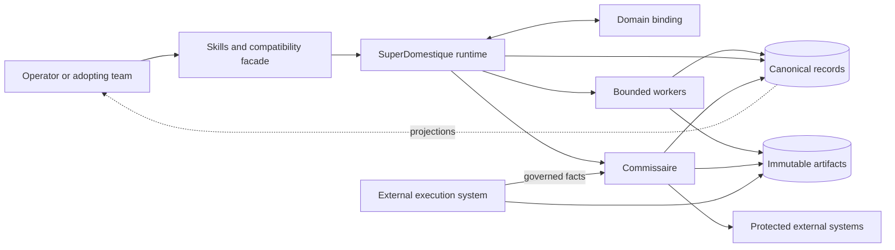

The execution path and the governance path meet through typed records and explicit decisions. Commissaire can govern execution it did not schedule. SuperDomestique cannot grant itself governance approval.

## 1.2 Logical components and dependency direction

Status: logical, earned end state.

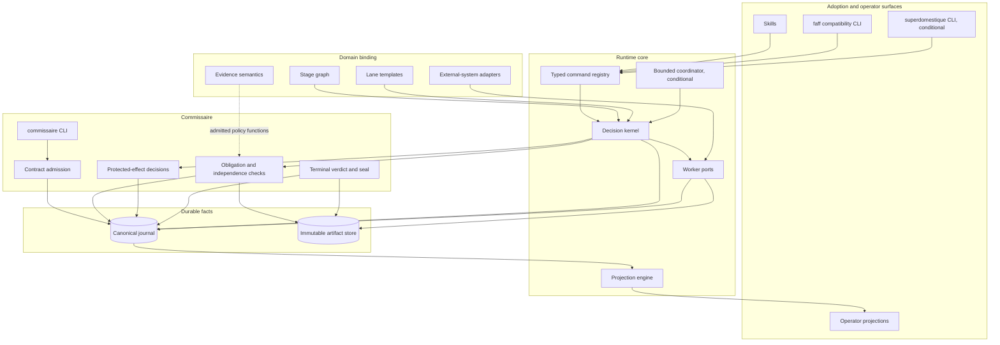

The domain binding points inward through declared ports. Commissaire does not import Software Delivery skills, tracker adapters, or scheduling code.

## 1.3 Skills-first adoption

Status: fixed compatibility requirement.

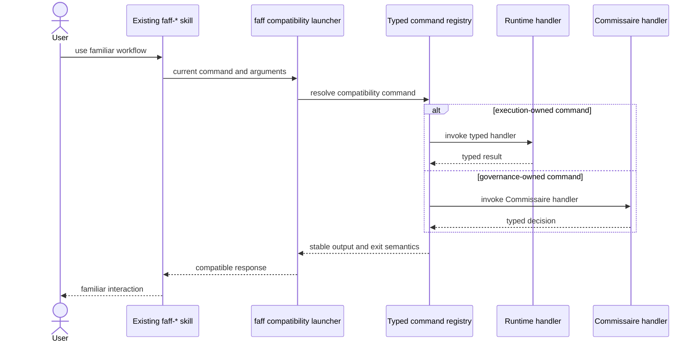

The skill remains the front door. Compatibility is implemented by shared handlers, not by maintaining a second runtime.

## 1.4 Deployment profiles

Status: embedded and isolated profiles are required; external execution is required for the Phase 2A proof; a service is conditional.

```mermaid
flowchart TB
    subgraph P1[Profile A: embedded skill mode]
        P1Skill[Skill]
        P1Proc[Local Node process]
        P1Files[(Local records and artifacts)]
        P1Skill --> P1Proc --> P1Files
    end

    subgraph P2[Profile B: isolated runner]
        P2Ctl[Runtime control]
        P2Run[Separate process, worktree, container, or CI job]
        P2Store[(Shared record and artifact ports)]
        P2Ctl --> P2Run --> P2Store
    end

    subgraph P3[Profile C: external execution with Commissaire]
        P3Ext[External producer]
        P3Bridge[External bridge]
        P3Gov[Commissaire]
        P3Store[(Governed records and artifacts)]
        P3Ext --> P3Bridge --> P3Store
        P3Gov --> P3Store
    end

    subgraph P4[Profile D: service, conditional]
        P4Clients[Multiple clients or producers]
        P4Svc[Long-running runtime or governance service]
        P4Durable[(Durable shared stores)]
        P4Clients --> P4Svc --> P4Durable
    end
```

The same logical ports and record semantics span the profiles. The architecture does not require every adopter to operate a service.

## 1.5 Records, artifacts, and projections

Status: earned end state.

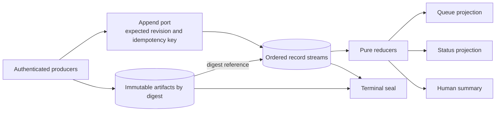

Only records and immutable artifact references are canonical. Queue files, tracker views, summaries, and dashboards are rebuildable projections.

## 1.6 Identity and scope relationships

Status: logical, earned end state.

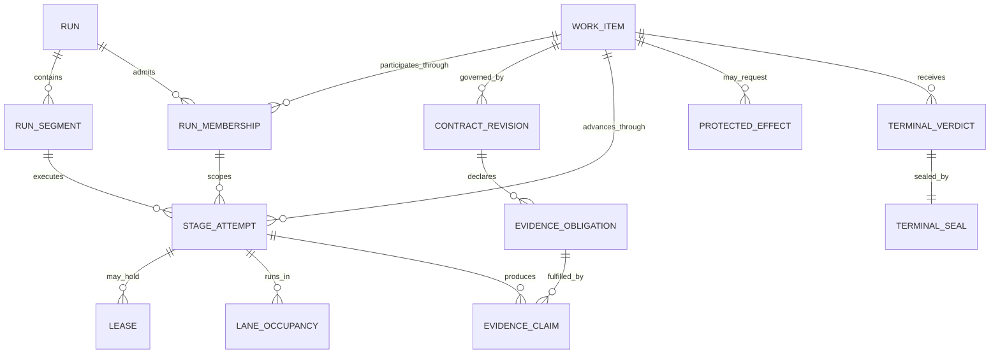

The identities are not interchangeable. A retry creates a new stage attempt, not a new work item, and a resumed executor creates a new run segment, not a new run. Contract revisions and terminal verdicts belong to the work item; a run reaches a work item only through a run membership, and that membership's disposition is never the work item's verdict. A later reconciliation appends a superseding verdict beside the sealed one.

## 1.7 Contract, execution, and acceptance separation

Status: earned end state.

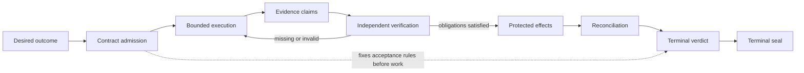

Acceptance criteria are admitted before execution. The producer of a claim cannot also grant the final acceptance that depends on that claim.

## 1.8 Protected-effect protocol

Status: earned end state.

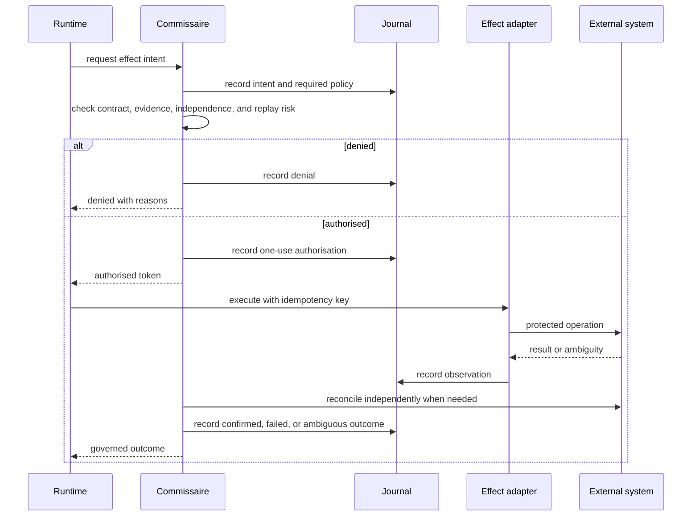

An authorised effect is not assumed to have happened. Reconciliation establishes the external outcome before retry or terminal acceptance.

# 2. Lanes and isolation boundaries

## 2.1 Lane as a logical assurance boundary

Status: fixed end-state concept.

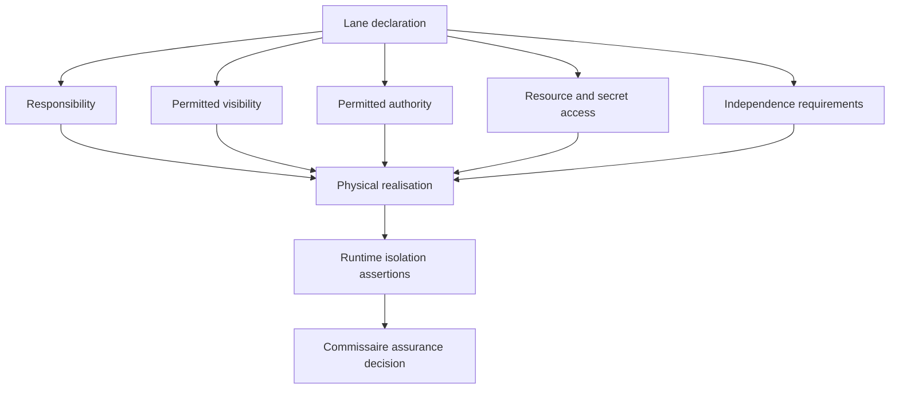

A lane declaration states what must be true. Infrastructure chooses how to make it true. Runtime assertions report what was actually achieved. Commissaire decides whether that assurance satisfies the admitted contract.

## 2.2 Replaceable physical realisations

Status: logical, not a selection of one preferred topology.

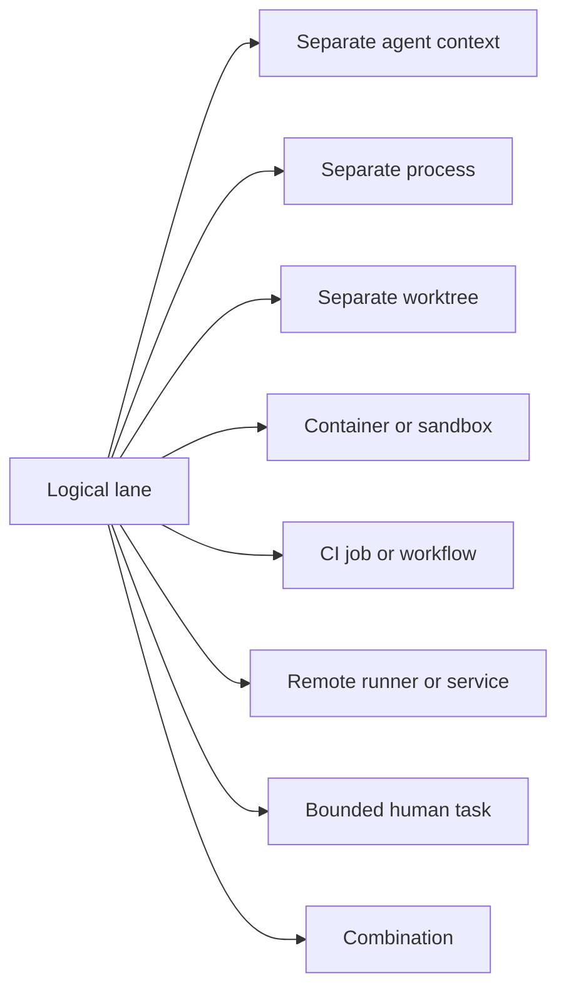

No physical form proves isolation by itself. The declared visibility, authority, access, independence, and artifact-timing properties still need assertions.

## 2.3 Base and domain-defined lanes

Status: earned end state.

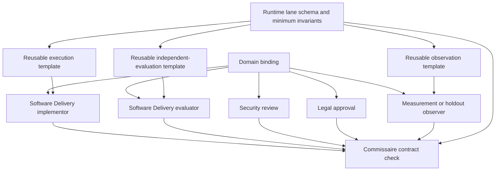

Domains may add lanes and strengthen constraints. They cannot remove required independence, expose forbidden inputs, grant protected-effect authority, or bypass Commissaire.

## 2.4 Current lane topology

Status: current, simplified.

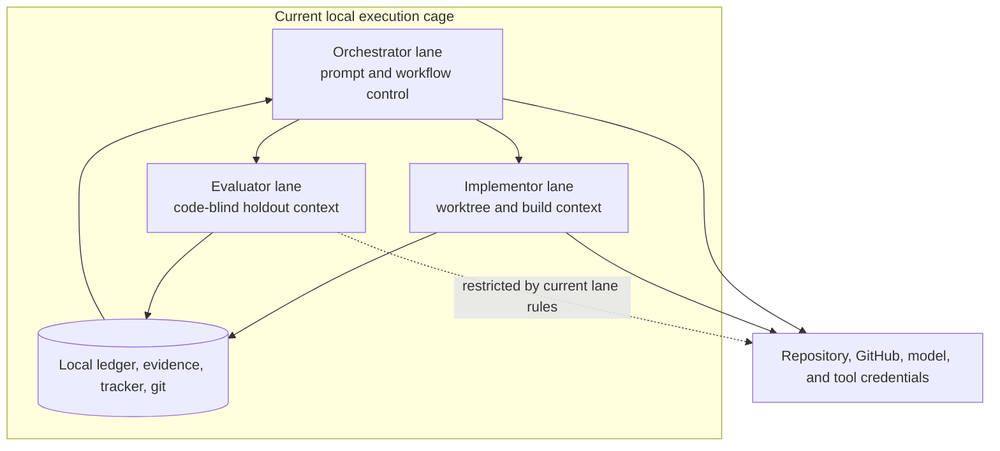

The present lanes provide useful separation, but they share a broad local trust cage. The current orchestrator is both a lane and the workflow-control mechanism. In the target design, deterministic control moves into code and the remaining orchestrator responsibility becomes a narrower operator or exception lane.

## 2.5 Target lane isolation example

Status: illustrative earned end state, not a requirement that all lanes use containers.

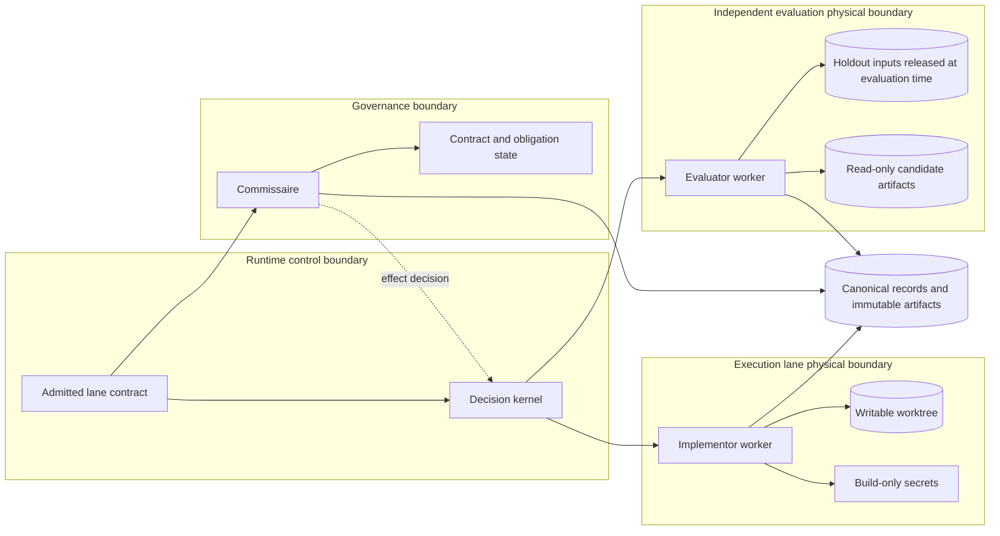

The evaluator cannot see holdout material before its lane is admitted and occupied. It receives candidate artifacts without inheriting build authority. Commissaire is outside both producer lanes.

## 2.6 Visibility and authority matrix

Status: logical example for Software Delivery. A domain binding can add rows.

| Capability or material | Runtime control | Implementor lane | Evaluator lane | Commissaire |
|---|---:|---:|---:|---:|
| Contract and stage graph | Read | Read relevant slice | Read evaluation slice | Read and admit |
| Candidate source | Route reference | Read and write | Read only when admitted | Digest and metadata |
| Holdout material before evaluation | No content | No | No | Commitment or digest only |
| Holdout material during evaluation | Route reference | No | Read | Read policy and result |
| Build credentials | Reference only | Scoped use | No | Policy only |
| Governance signing material | No | No | No | Scoped use |
| Protected-effect credential | No direct use | No | No | Authorise scoped adapter use |
| Canonical append | Typed runtime facts | Typed worker facts | Typed evaluation facts | Typed governance facts |
| Final acceptance | No | No | Claim only | Yes |

# 3. Current implementation map

## 3.1 Current region boundaries

Status: current.

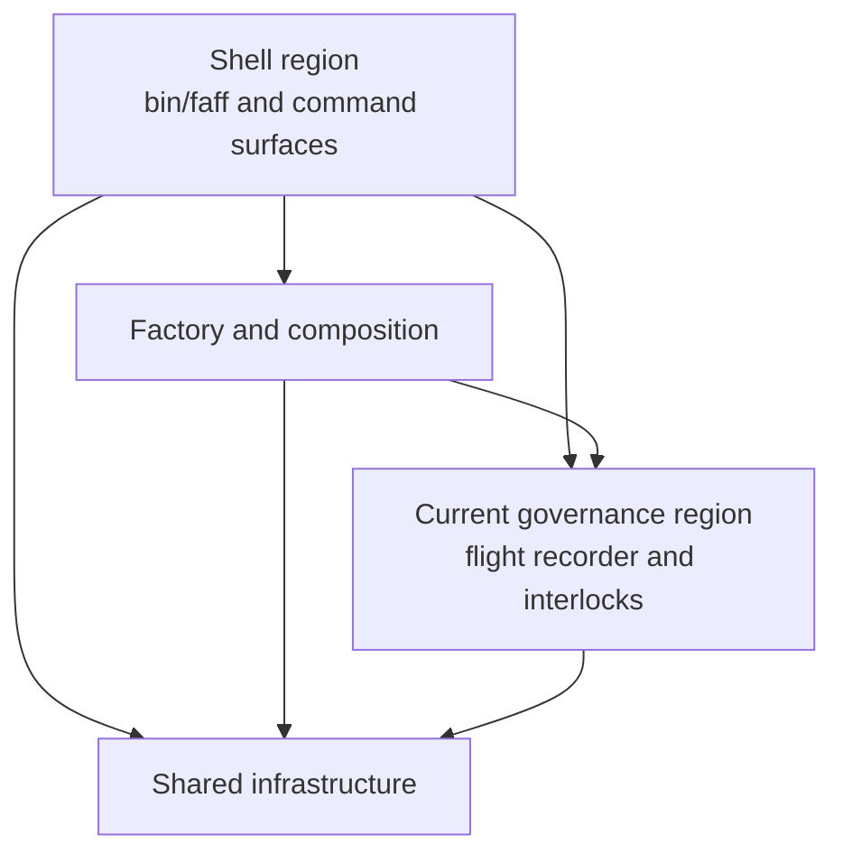

The current region named governance is an implementation boundary around record integrity and interlocks. It is not yet the full external Commissaire product boundary.

## 3.2 Current orchestration flow

Status: current, simplified from the `faff-beep-boop` workflow.

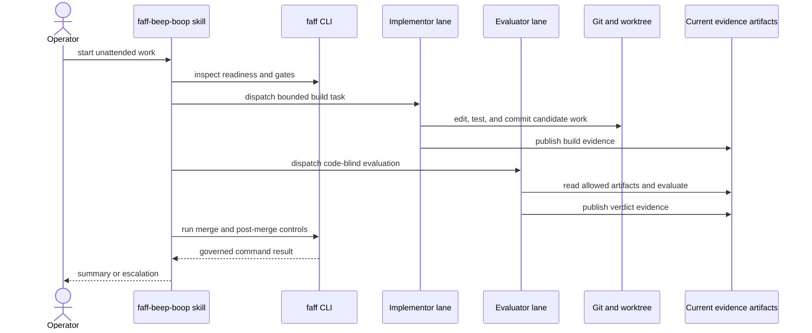

Control is primarily encoded in skill prose and CLI commands. The target only moves repeated deterministic decisions into code if Gate 1 proves that worthwhile.

## 3.3 Current artifact relationships

Status: current.

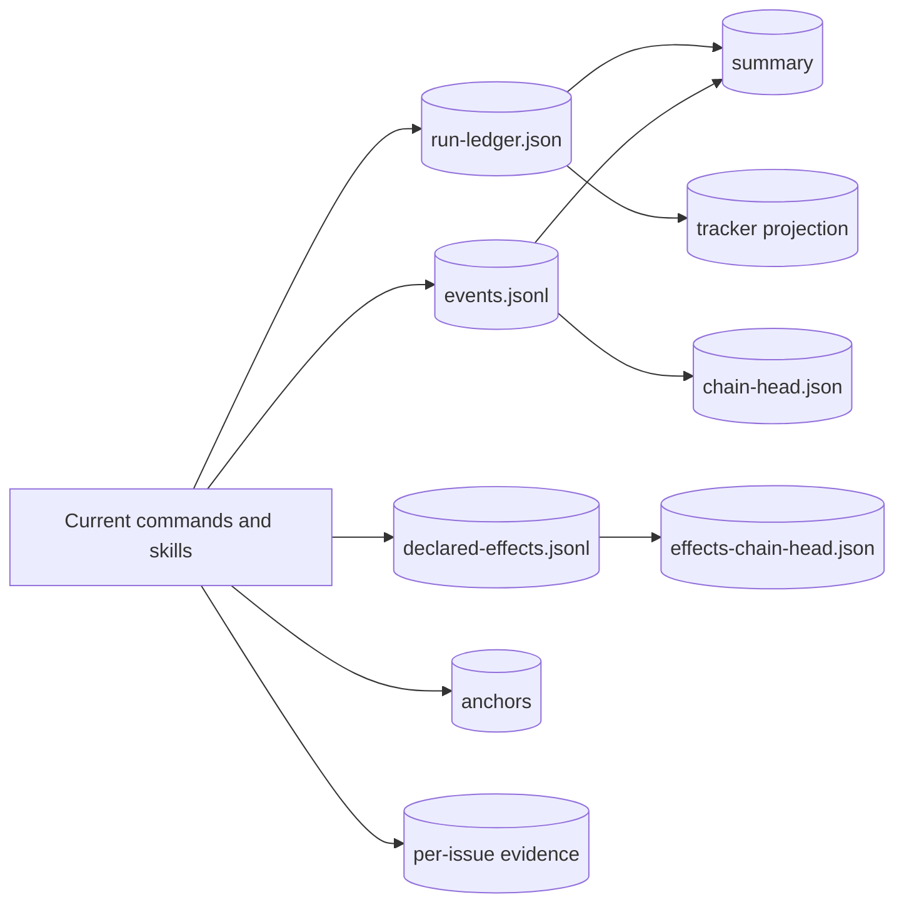

These artifacts remain canonical through Phase 0. The generic journal is not introduced merely to document an ideal architecture.

## 3.4 Current command ownership and target split

Status: current-to-target mapping.

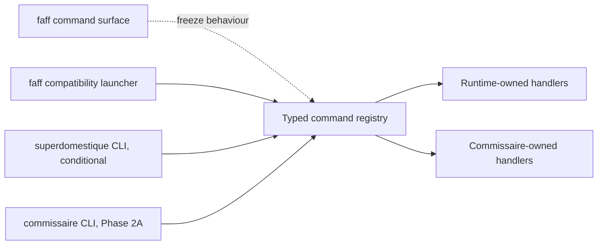

One handler has one owner. Multiple launchers can expose it with compatibility translations.

# 4. Transition architecture

## 4.1 Evidence-gated route

Status: V5 transition.

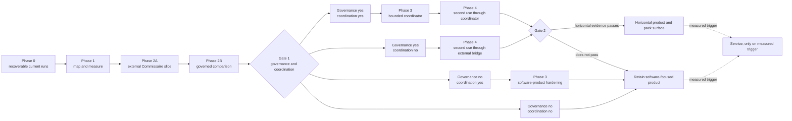

Gate 1 answers governance and coordination independently. A successful Commissaire facade does not automatically justify a coordinator.

## 4.2 Phase 0 recovery-bundle publication

Status: transitional, current artifacts remain canonical.

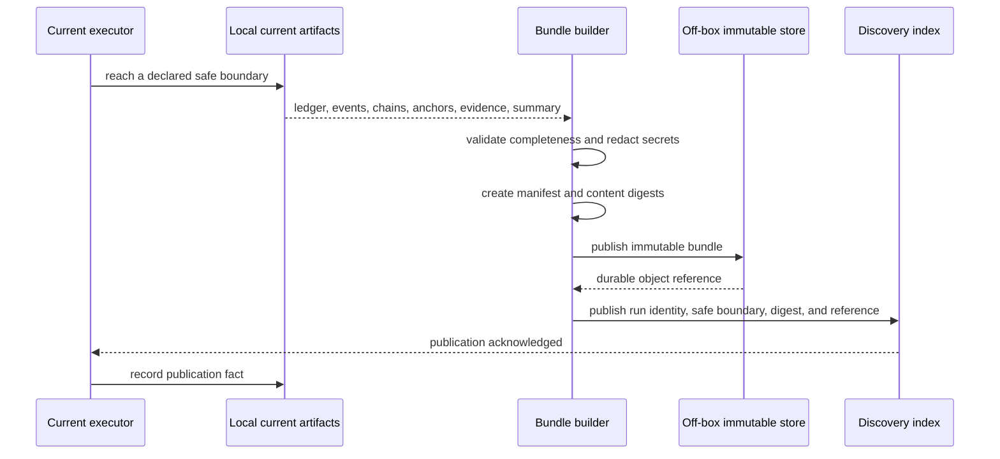

The executor does not claim a recoverable boundary until both the immutable bundle and its discovery record are durable.

## 4.3 Recovery by a later executor

Status: transitional Phase 0 requirement.

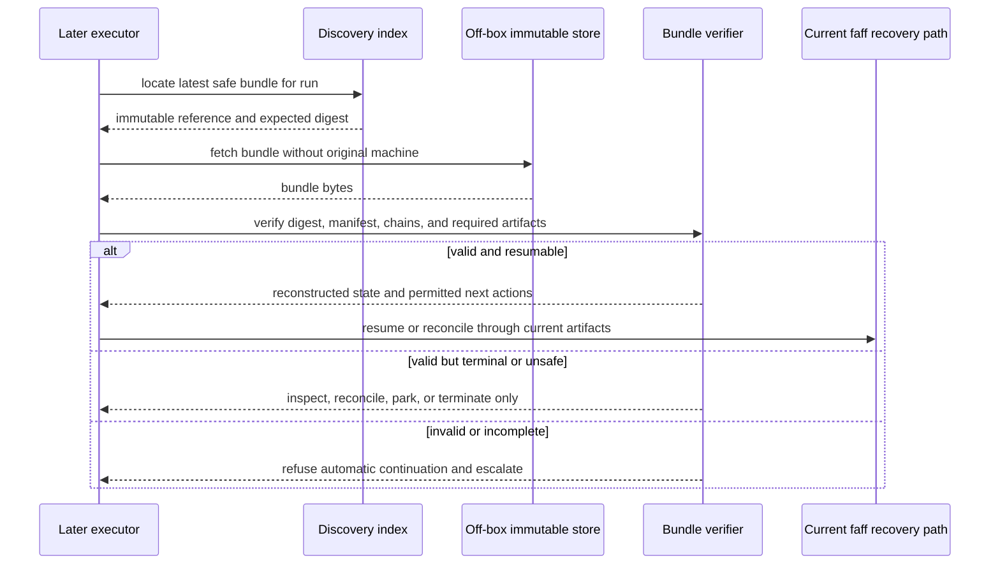

Recovery proves the next safe action, not merely that files can be downloaded.

## 4.4 Canonical record cutover

Status: transitional, earliest in a selected Phase 2A slice.

```mermaid
flowchart TB
    Start[Current records are canonical]
    Freeze[Freeze current semantics and build readers]
    Shadow[Write current canonical records<br/>derive generic shadow projection]
    Compare[Replay and compare semantics]
    Select[Select one bounded producer or run class]
    Cutover[Change canonical writer for selected scope]
    Generic[Generic journal is canonical for selected scope<br/>current format is compatibility projection]
    Rollback[Stop admission and revert future runs<br/>do not rewrite accepted history]

    Start --> Freeze --> Shadow --> Compare --> Select --> Cutover --> Generic
    Compare -->|semantic mismatch| Freeze
    Cutover -->|cutover failure before acceptance| Rollback
    Rollback --> Start
```

```mermaid
flowchart LR
    subgraph Before[Before cutover]
        W1[One current writer] --> C1[(Current canonical)]
        C1 --> G1[Generic shadow reader]
    end

    subgraph After[After cutover for selected scope]
        W2[One generic writer] --> G2[(Generic canonical)]
        G2 --> C2[Current compatibility projection]
    end

    Forbidden[Forbidden: two canonical writers]
    Forbidden -. never .-> C1
    Forbidden -. never .-> G2
```

## 4.5 Incremental TypeScript migration

Status: fixed transition direction.

```mermaid
flowchart LR
    JS[Current CommonJS JavaScript]
    Characterise[Characterisation and contract tests]
    Ports[Type-only ports and runtime schemas]
    NewTS[New V5 modules in TypeScript]
    Slice[Convert one cohesive module slice]
    Build[Compile or bundle to standalone Node 20 JavaScript]
    Parity[Behaviour, distribution, and artifact parity]
    More{More selected slices?}
    Entry[Convert entrypoint last]
    Authoritative[TypeScript authoritative source]

    JS --> Characterise --> Ports --> NewTS --> Slice --> Build --> Parity --> More
    More -->|yes| Slice
    More -->|no| Entry --> Authoritative
    Parity -->|failure| Slice
```

```mermaid
flowchart TB
    Source[TypeScript source]
    Schemas[Runtime schemas for external data]
    Compiler[Development-only compiler or bundler]
    Artifact[Generated standalone JavaScript CLI]
    Freshness[CI freshness and reproducibility check]
    Installs[Symlink, marketplace, checkout, and pinned-action tests]

    Source --> Compiler
    Schemas --> Source
    Compiler --> Artifact
    Source --> Freshness
    Artifact --> Freshness
    Artifact --> Installs
```

Types do not replace validation of records, configuration, subprocess output, worker claims, or external API responses.

## 4.6 Interface naming migration

Status: transitional, with two conditional steps.

```mermaid
flowchart LR
    Today[faff CLI and faff-* skills]
    Registry[Extract typed command registry]
    Owners[Assign execution or governance owner]
    GovCLI[Add commissaire CLI in Phase 2A]
    Aliases[Keep faff governance aliases]
    Gate1{Gate 1 coordination decision}
    RuntimeCLI[Add superdomestique CLI]
    NoRuntimeCLI[Keep skills and faff runtime launcher]
    Gate2{Gate 2 product decision}
    NewSkills[Optional canonical skill rename]
    CurrentSkills[Retain current skill names as aliases]

    Today --> Registry --> Owners --> GovCLI --> Aliases --> Gate1
    Gate1 -->|yes| RuntimeCLI --> Gate2
    Gate1 -->|no| NoRuntimeCLI --> Gate2
    Gate2 -->|rename earned| NewSkills --> CurrentSkills
    Gate2 -->|no rename| CurrentSkills
```

The `commissaire` CLI is introduced only when its handlers no longer depend on current scheduling or Software Delivery internals.

## 4.7 Coordinator extraction

Status: conditional on Gate 1.

```mermaid
flowchart TB
    Prompt[Current skill-driven control]
    Observe[Measure repeated deterministic decisions]
    Shadow[Shadow decision kernel]
    Compare[Compare proposed and actual decisions]
    Gate{Gate 1 buys coordination?}
    Kernel[Authoritative decision kernel]
    ThinSkill[Skills become thin interaction and exception surfaces]
    Remain[Keep prompt-driven coordination]

    Prompt --> Observe --> Shadow --> Compare --> Gate
    Gate -->|yes| Kernel --> ThinSkill
    Gate -->|no| Remain
```

The shadow kernel cannot write canonical decisions, assign work, or authorise effects.

## 4.8 Release and rollback boundaries

Status: transition rule.

```mermaid
flowchart LR
    Additive[Additive reader, projection, or alias]
    Verify[Verify current behaviour and new evidence]
    Admit[Admit bounded new scope]
    Observe[Observe completion and recovery]
    Expand[Expand one dimension]
    Stop[Stop new admission]
    Reconcile[Reconcile in-flight effects and facts]
    ResumeOld[Resume future work on previous canonical path]

    Additive --> Verify --> Admit --> Observe --> Expand
    Verify -->|failure| Stop
    Admit -->|failure| Stop
    Observe -->|failure| Stop
    Stop --> Reconcile --> ResumeOld
```

Rollback changes future admission and routing. It never deletes accepted evidence or rewrites a governed external effect.

# 5. State-machine atlas

## 5.1 Contract admission

Status: earned end state.

```mermaid
stateDiagram-v2
    [*] --> Draft
    Draft --> Validating: submit
    Draft --> Withdrawn: proposer withdraws
    Validating --> Rejected: schema, capability, or policy failure
    Validating --> Admitted: all admission checks pass
    Rejected --> Draft: revise
    Admitted --> [*]
    Withdrawn --> [*]
```

An admitted revision is immutable. A material amendment goes through admission as a new revision. An admitted work item retains its governing revision until a governed amendment protocol binds the replacement.

## 5.2 Run

Status: earned end state.

```mermaid
stateDiagram-v2
    [*] --> Proposed
    Proposed --> Admitted: run admission recorded
    Proposed --> Rejected: admission denied
    Proposed --> Withdrawn: proposer withdraws
    Admitted --> Running: first segment starts
    Running --> Pausing: safe-stop requested
    Pausing --> Paused: boundary bundle published
    Paused --> Running: new segment resumes
    Running --> Closing: stop requested or admitted work exhausted
    Paused --> Closing: operator closes run
    Closing --> Completed: every membership has a run-scoped outcome
    Closing --> Paused: unresolved work remains recoverable
    Closing --> Terminated: closure records why continuation is forbidden
    Rejected --> [*]
    Withdrawn --> [*]
    Completed --> [*]
    Terminated --> [*]
```

Run completion is not work-item acceptance. It proves that every admitted run membership has a run-scoped outcome. Wider work items can remain non-terminal after a completed run. Run admission is a runtime control decision over which admitted work items the campaign may process; contract admission belongs to the work item, shown in 5.1 and 5.5.

## 5.3 Run segment

Status: earned end state.

```mermaid
stateDiagram-v2
    [*] --> Created
    Created --> Active: executor binds
    Active --> Exiting: bounded work ends or handoff requested
    Exiting --> Exited: final facts and safe boundary published
    Active --> Interrupted: executor disappears before orderly exit
    Active --> Expired: segment authority or heartbeat expires
    Exited --> [*]
    Interrupted --> [*]
    Expired --> [*]
```

The terminal segment disposition is `exited`, `interrupted`, or `expired`. An interrupted or expired segment is never resumed in place. Reconciliation may authorise a successor with a new run-segment ID from a verified safe boundary.

## 5.4 Run membership

Status: earned end state.

```mermaid
stateDiagram-v2
    [*] --> Admitted
    Admitted --> Active: run starts work on member
    Admitted --> Closing: run ends before member is reached
    Active --> Closing: run stops processing member
    Closing --> Shipped: run completed its shipping path
    Closing --> Parked: operator decision or missing fact required
    Closing --> Blocked: dependency or policy prevents progress
    Closing --> UnreachedBudget: run budget ends first
    Closing --> Superseded: another membership replaces this one
    Shipped --> [*]
    Parked --> [*]
    Blocked --> [*]
    UnreachedBudget --> [*]
    Superseded --> [*]
```

A run membership relates one admitted work item to one run. Each outcome is terminal for that run ledger. `Parked`, `Blocked`, or `UnreachedBudget` can leave the wider work item eligible for a later run with a new membership.

## 5.5 Admitted work item

Status: earned end state.

```mermaid
stateDiagram-v2
    [*] --> Ready
    Ready --> Leased: assignment recorded
    Leased --> Executing: stage attempt started
    Leased --> Ready: lease expires before start
    Executing --> EvidencePending: worker stops or claims completion
    Executing --> Interrupted: executor or heartbeat lost
    Interrupted --> Ready: reconciliation authorises retry
    Interrupted --> Abandoned: reconciliation closes without recovery
    EvidencePending --> GovernanceReview: required evidence present
    EvidencePending --> Parked: evidence cannot be completed automatically
    GovernanceReview --> AcceptedUnderContract: obligations satisfied
    GovernanceReview --> OutcomeRejected: terminal failure under contract
    GovernanceReview --> CorrectionRequired: correctable failure
    GovernanceReview --> Blocked: policy or evidence block
    CorrectionRequired --> Ready: corrected scope admitted
    Parked --> Ready: operator resolves park
    Blocked --> Ready: amendment or waiver admitted
    AcceptedUnderContract --> [*]
    OutcomeRejected --> [*]
    Abandoned --> [*]
```

Authorised cancellation can move any non-terminal admitted state to `Cancelled`. It is a transition rule rather than a separate edge from every state. Retries and corrections create new stage attempts while the work-item identity remains stable.

## 5.6 Stage attempt

Status: earned end state.

```mermaid
stateDiagram-v2
    [*] --> Planned
    Planned --> Assigned: worker and lane selected
    Assigned --> Leased: lease acquired
    Leased --> Running: invocation starts
    Running --> Reporting: bounded result returned
    Reporting --> Succeeded: result and required claims recorded
    Reporting --> Failed: declared failure recorded
    Running --> TimedOut: deadline or lease expires
    Running --> Lost: worker disappears
    TimedOut --> Reconciled: side effects and artifacts inspected
    Lost --> Reconciled: side effects and artifacts inspected
    Reconciled --> Failed: outcome known
    Reconciled --> Ambiguous: outcome remains unknown
    Planned --> Cancelled: no longer eligible
    Assigned --> Cancelled: assignment withdrawn before execution
    Succeeded --> [*]
    Failed --> [*]
    Ambiguous --> [*]
    Cancelled --> [*]
```

An ambiguous attempt cannot be retried until effect and artifact reconciliation makes replay safe or a governed exception parks the parent work.

## 5.7 Lease

Status: earned end state.

```mermaid
stateDiagram-v2
    [*] --> Offered
    Offered --> Held: worker accepts with expected revision
    Offered --> Withdrawn: eligibility changes
    Held --> Renewed: valid heartbeat and policy
    Renewed --> Renewed: subsequent heartbeat
    Held --> Released: attempt completes or yields
    Renewed --> Released: attempt completes or yields
    Held --> Expired: deadline passes
    Renewed --> Expired: deadline passes
    Held --> Revoked: authority withdrawn
    Renewed --> Revoked: authority withdrawn
    Withdrawn --> [*]
    Released --> [*]
    Expired --> [*]
    Revoked --> [*]
```

A lease limits concurrent authority. It is not evidence that work completed and does not transfer protected-effect authority.

## 5.8 Lane occupancy

Status: earned end state.

```mermaid
stateDiagram-v2
    [*] --> Declared
    Declared --> Provisioning: attempt requests occupancy
    Provisioning --> Verified: boundary assertions pass
    Provisioning --> Denied: boundary assertions fail
    Verified --> Occupied: admitted member enters
    Occupied --> Quarantined: visibility, access, or liveness violation
    Occupied --> Released: attempt exits and resources close
    Quarantined --> Released: evidence preserved and authority removed
    Denied --> [*]
    Released --> [*]
```

Occupancy records the achieved boundary and assertion evidence. A lane name alone is not proof of isolation.

## 5.9 Evidence obligation

Status: earned end state.

```mermaid
stateDiagram-v2
    [*] --> Declared
    Declared --> Due: triggering scope reaches obligation point
    Due --> Claimed: producer submits evidence reference
    Claimed --> Verifying: verifier admitted
    Verifying --> Satisfied: validity, provenance, and independence pass
    Verifying --> Rejected: claim invalid or insufficient
    Rejected --> Due: replacement claim permitted
    Due --> Waived: authorised waiver with reason and scope
    Due --> Breached: deadline or terminal boundary passes
    Satisfied --> Sealed: included in terminal seal
    Waived --> Sealed: waiver included in terminal seal
    Breached --> Sealed: negative outcome included in terminal seal
    Sealed --> [*]
```

A waiver is a governed fact, not an absent claim. The terminal seal makes both visible.

## 5.10 Protected effect

Status: earned end state.

```mermaid
stateDiagram-v2
    [*] --> Intended
    Intended --> Denied: policy or evidence check fails
    Intended --> Authorised: one-use authority issued
    Authorised --> Executing: adapter begins with idempotency key
    Executing --> ObservedSuccess: target reports success
    Executing --> ObservedFailure: target reports failure
    Executing --> Ambiguous: response lost or outcome uncertain
    ObservedSuccess --> Confirmed: independent reconciliation agrees
    ObservedFailure --> ConfirmedFailed: reconciliation agrees
    Ambiguous --> Confirmed: target proves effect occurred
    Ambiguous --> ConfirmedFailed: target proves effect did not occur
    Ambiguous --> Parked: safe conclusion unavailable
    ConfirmedFailed --> Intended: policy permits retry with new intent
    Denied --> [*]
    Confirmed --> [*]
    Parked --> [*]
```

An authorisation is consumed once execution begins. An ambiguous result does not reuse it.

## 5.11 Terminal verdict and reconciliation

Status: earned end state.

```mermaid
stateDiagram-v2
    [*] --> Pending
    Pending --> Reconciling: terminal evaluation requested
    Reconciling --> Incomplete: required fact or artifact missing
    Incomplete --> Reconciling: fact supplied or recovered
    Reconciling --> Positive: all obligations and effects pass
    Reconciling --> Negative: failure or breach established
    Reconciling --> Parked: outcome cannot be established safely
    Positive --> Sealing: canonical revisions and digests fixed
    Negative --> Sealing: canonical revisions and digests fixed
    Sealing --> SealedPositive: seal published
    Sealing --> SealedNegative: seal published
    Parked --> Reconciling: governed new fact arrives
    SealedPositive --> ReconciliationPending: material later observation
    SealedNegative --> ReconciliationPending: material later observation
    ReconciliationPending --> Reconciling: superseding evaluation starts
    SealedPositive --> [*]: retention closes
    SealedNegative --> [*]: retention closes
```

Only the current sealed positive verdict is acceptance. A later reconciliation appends a superseding verdict and seal without altering earlier records. A parked work item is visible and recoverable, but not successful.

## 5.12 Journal migration

Status: transitional.

```mermaid
stateDiagram-v2
    [*] --> CurrentCanonical
    CurrentCanonical --> ShadowReading: generic reducer reads current facts
    ShadowReading --> ParityProved: replay and semantic comparison pass
    ShadowReading --> CurrentCanonical: mismatch found
    ParityProved --> CutoverPrepared: bounded scope and rollback fixed
    CutoverPrepared --> GenericCanonical: one writer switches for new admitted scope
    CutoverPrepared --> CurrentCanonical: readiness check fails
    GenericCanonical --> CompatibilityServing: current views derive from generic facts
    CompatibilityServing --> Complete: soak and recovery pass
    GenericCanonical --> AdmissionStopped: cutover failure
    CompatibilityServing --> AdmissionStopped: semantic failure
    AdmissionStopped --> CurrentCanonical: future runs return to current path
    Complete --> [*]
```

Already accepted generic history remains immutable if future admission returns to the current path.

## 5.13 TypeScript module migration

Status: transitional.

```mermaid
stateDiagram-v2
    [*] --> JavaScriptAuthoritative
    JavaScriptAuthoritative --> Characterised: behaviour and port tests fixed
    Characterised --> Wrapped: typed boundary and runtime schema added
    Wrapped --> TypeScriptShadow: TypeScript implementation compared
    TypeScriptShadow --> Wrapped: parity failure
    TypeScriptShadow --> TypeScriptAuthoritative: parity and distribution pass
    TypeScriptAuthoritative --> GeneratedVerified: standalone artifact freshness passes
    GeneratedVerified --> JavaScriptRemoved: old implementation has no callers
    JavaScriptRemoved --> [*]
```

The generated JavaScript artifact remains distributable. `JavaScriptRemoved` refers to the handwritten legacy implementation, not the shipped build output.

## 5.14 Cross-scope transition effects

Status: logical, earned end state.

```mermaid
flowchart TB
    Contract[Contract admitted]
    Run[Run admitted]
    Membership[Membership active]
    Segment[Run segment active]
    Work[Work item eligible]
    Attempt[Stage attempt running]
    Lease[Lease held]
    Lane[Lane occupied]
    Obligation[Evidence obligation due]
    Effect[Protected effect authorised]
    Verdict[Terminal verdict reconciling]

    Contract --> Work
    Run --> Membership
    Run --> Segment
    Run --> Work
    Membership --> Attempt
    Segment --> Attempt
    Work --> Attempt
    Attempt --> Lease
    Attempt --> Lane
    Attempt --> Obligation
    Obligation --> Effect
    Work --> Verdict
    Effect --> Verdict
    Obligation --> Verdict

    Lease -. expiry stops attempt authority .-> Attempt
    Lane -. quarantine revokes occupancy .-> Attempt
    Membership -. revocation prevents new attempts .-> Work
    Contract -. revocation triggers run safe-stop .-> Run
    Effect -. ambiguity blocks terminal acceptance .-> Verdict
```

The dotted edges are constraints across state machines. They do not collapse the identities into one lifecycle.

# 6. Assurance and trust views

## 6.1 Assurance levels

Status: logical end-state model.

```mermaid
flowchart LR
    Declared[Declared boundary]
    Configured[Configured boundary]
    Observed[Runtime observation]
    Asserted[Mechanically asserted property]
    Governed[Commissaire accepts assurance for contract]
    Sealed[Assurance evidence included in terminal seal]

    Declared --> Configured --> Observed --> Asserted --> Governed --> Sealed
```

An implementation may provide different strength for different properties. For example, a worktree can strongly separate writable files while providing no network or process isolation.

## 6.2 Producer trust and record integrity

Status: earned end state.

```mermaid
flowchart LR
    Identity[Producer identity]
    Membership[Active run membership]
    Capability[Record-type capability]
    Idempotency[Idempotency key]
    Revision[Expected stream revision]
    Payload[Schema-valid payload]
    Append{Append accepted?}
    Record[Canonical record]

    Identity --> Append
    Membership --> Append
    Capability --> Append
    Idempotency --> Append
    Revision --> Append
    Payload --> Append
    Append -->|all checks pass| Record
    Append -->|any check fails| Reject[Reject without mutation]
```

Digest chaining detects later mutation. It does not establish that the original producer was authorised, truthful, or independent, so those properties are checked separately.

## 6.3 Minimum end-to-end reference fixture

Status: required verification shape.

```mermaid
flowchart LR
    Adopt[Start through existing skill]
    Admit[Admit contract and lanes]
    Build[Produce candidate in execution lane]
    Evaluate[Evaluate in independent lane]
    Inject[Inject declared failure]
    Recover[Recover on later executor]
    Effect[Request and reconcile protected effect]
    Seal[Produce terminal verdict and seal]
    Replay[Rebuild projections from canonical facts]

    Adopt --> Admit --> Build --> Evaluate --> Inject --> Recover --> Effect --> Seal --> Replay
```

The fixture must prove the compatibility surface, isolation assertions, off-box recovery, effect ambiguity handling, terminal reconstruction, and projection replay in one bounded scenario.

# 7. Diagram-to-design index

| Design concern | Primary diagrams |
|---|---|
| Clean end state | 1.1, 1.2, 1.5, 1.7 |
| Skills-first adoption | 1.3, 4.6 |
| Deployment choices | 1.4 |
| Identity and state scopes | 1.6, 5.1 through 5.14 |
| Lane meaning and isolation | 2.1 through 2.6, 6.1 |
| Current architecture | 2.4, 3.1 through 3.4 |
| Safe current-to-target transition | 4.1 through 4.8 |
| TypeScript migration | 4.5, 5.13 |
| CLI and skill naming | 3.4, 4.6 |
| Record canonicality | 1.5, 4.4, 5.12 |
| Governance and effects | 1.7, 1.8, 5.9 through 5.11 |
| Verification | 6.2, 6.3 |
