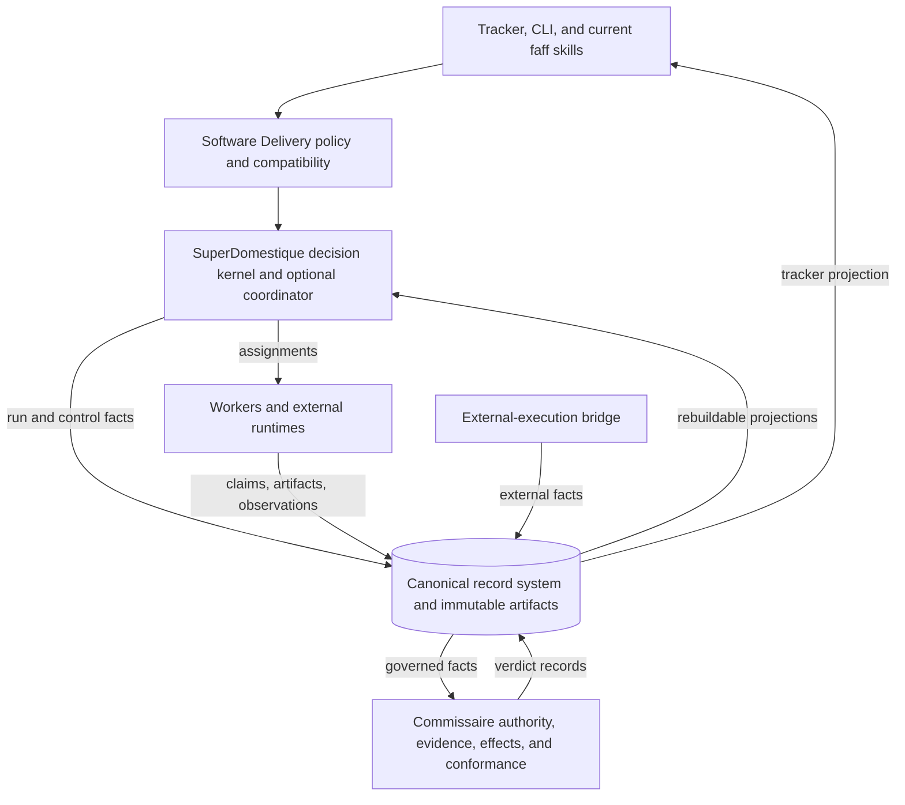
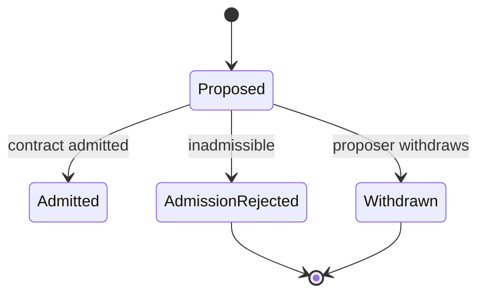
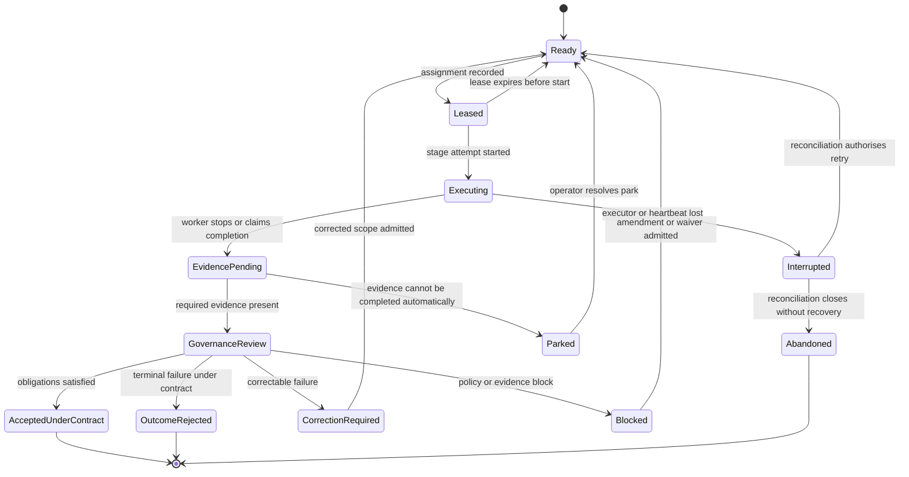
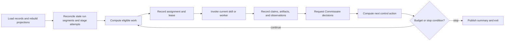
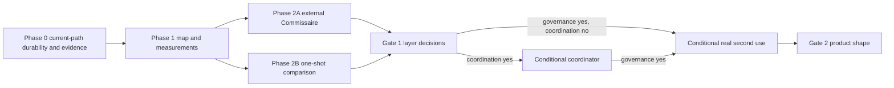

# SuperDomestique safe progressive autonomy: master direction v5

Status: accepted 2026-08-16
Date: 2026-08-12
Decision owner: project maintainer
Planning horizon: evidence-gated, not calendar-gated

## Document authority

This document is the normative strategic direction for evolving SuperDomestique and Commissaire from the current repository.

It supersedes [master v4](../v4/FAFF-SAFE-PROGRESSIVE-AUTONOMY-MASTER-v4.md), which superseded [master v3](../v3/FAFF-SAFE-PROGRESSIVE-AUTONOMY-MASTER-v3.md), [master v2](../v2/FAFF-SAFE-PROGRESSIVE-AUTONOMY-MASTER-v2.md), and [roadmap v2](../v2/FAFF-PROGRESSIVE-AUTONOMY-ROADMAP-v2.yaml). Historical evidence, experiment records, and accepted repository decisions remain unchanged.

[Critique-4](../critique-4.md) records the cross-checks and reasons for this revision. [Critique-5](../critique-5.md) records the pre-lock verification of this revision and the corrections applied to its companion documents. The earlier critiques, [plot input](../v2/FAFF-PLOT-INPUT-v2.md), and [distributed-run note](../v2/faff-distributed-evidence-recoverable-runs.md) remain source material, not parallel plans.

When this document conflicts with an older planning document, this document controls. Implemented facts and accepted ADRs in the repository outrank proposed design here.

Companion material:

- [Technical design v5](TECHNICAL-DESIGN-v5.md) separates the clean end-state architecture, the implementation currently present, and the safe transition between them.
- [Architecture diagram atlas v5](ARCHITECTURE-DIAGRAMS-v5.md) shows the component, isolation, migration, and state-machine views.
- [faff plot input v5](FAFF-PLOT-INPUT-v5.md) supplies the outcome, constraints, dependencies, evidence horizons, and open questions for agile roadmap shaping without pre-writing the roadmap.

v5 preserves v4's strategic direction:

- extract and measure before constructing a platform;
- improve L3 and bank outward L4 evidence first;
- prove Commissaire on execution SuperDomestique did not schedule;
- compare against the strong one-shot control;
- buy governance and coordination with separate evidence;
- start with an ephemeral bounded coordinator if coordination earns its cost; and
- make product and package decisions after real second-use pressure.

v5 corrects the record identity model, Phase 0 cutover order, journal authentication requirement, lifecycle dispositions, Gate 1 attribution, roadmap branching, retention timing, and the capacity model for a maintainer steering an always-on autonomous runner.

## Executive decision

Evolve outward from the current L3 runner. Do not begin with a generic automation platform or a replacement event system.

The programme will:

1. close known trust and reliability defects in the current unattended path;
2. make current run artifacts durable off-box and prove safe stage-boundary recovery without changing their canonical meaning;
3. publish an outward L4 evidence baseline with claims limited to the assurance achieved;
4. map and characterise the existing decision kernel, state authorities, and record identities;
5. measure how faithfully prompt-interpreted orchestration follows the existing kernel and how much that orchestration costs;
6. introduce a domain-neutral record envelope only when an external producer becomes the second producer;
7. prove whether Commissaire adds value to execution it did not schedule;
8. compare the governed treatment with the existing one-shot baseline;
9. build a thin deterministic coordinator only if coordination evidence supports it; and
10. test wider use only after governance evidence supports proceeding.

Three product outcomes remain acceptable:

- a broader protocol-driven SuperDomestique runtime with domain bindings;
- reusable Commissaire governance with software-focused SuperDomestique coordination; or
- a stronger software-delivery product whose internal boundaries, evidence, and recovery improve without a separate horizontal product.

Generalisation is earned by observed use. Authority is earned per workload and contract.

## Product and naming

The public product is SuperDomestique. Commissaire is its governance system. `faff` remains the literal name of the repository, plugin, CLI, commands, configuration, paths, and historical records.

[Names and language](../../../concept/positioning-and-language.md) remains authoritative. Product or package naming changes only after Gate 2 establishes the earned shape.

The harness-native `faff` adoption surface is a product asset in every possible outcome. It lets someone already using a coding harness adopt governed software delivery without first deploying a service. The programme preserves that surface while testing whether any protocol below it deserves independent consumption.

No new public product name is introduced by this RFC.

## Current truth

### Implemented and useful at `79563ac`

- L3 runs unattended on a runner and performs much of the software-delivery loop.
- The runner is also the project's build capacity. Reliability failures reduce product quality and engineering throughput at the same time.
- The tracker, CLI, skills, review flow, and park protocol are the current control and adoption surface.
- L4 is a preview. Its strongest isolation and independence claims need outward evidence.
- Deterministic functions exist for issue next-step selection, run termination, queue projection, region dependencies, budgets, liveness, resume, gates, and merge handling.
- `faff next` decides a high-level next action. `faff run-done` decides whether a queue-drain run continues, completes, or escalates. Neither is a complete coordinator.
- The current `run-ledger.json` is one record per run. It records an admitted issue set and a terminal outcome for every member of that run.
- The governance and factory region boundary is enforced in code.
- The existing one-shot experiment has nine successful controls and a matched-arm design with a reportable null.
- The repository contains 105 ADR files and read-only decisions-register mechanics for smaller settled decisions. No `docs/decisions.md` carrier has been committed yet.

### Not yet proven

- Current prompt-interpreted orchestration has not been measured against kernel-prescribed decisions over a predeclared observation set.
- A generic coordinator has not shown enough benefit to justify its new loop, state, and migration cost.
- Commissaire has not been consumed through a stable external protocol without importing current scheduling and skills.
- A no-daemon journal has not established producer-authentic class J-C records.
- Current runner-local state cannot support a strong cross-executor recovery claim.
- L4 evidence does not yet establish every claimed independence dimension in a clean outward setting.
- A second internal use would apply useful abstraction pressure but would not establish a horizontal market.
- A standing hosted service is neither required nor evidenced.

### Consequence

The next work is product hardening, evidence publication, characterisation, and bounded proof. Generic runtime construction remains conditional.

## Goals

1. Preserve and improve L3 throughout the programme.
2. Make unattended work reconstructable without a surviving executor or transcript replay.
3. Keep current run artifacts canonical until a mapped cutover replaces them for a selected slice.
4. Make record identity, authority, and disposition scopes explicit.
5. Keep probabilistic judgement in workers and deterministic transition selection in code.
6. Let external execution use Commissaire without pretending SuperDomestique scheduled it.
7. State effect, review, and journal assurance at the level actually achieved.
8. Retain value under horizontal, mixed, and software-focused outcomes.
9. Use autonomous build capacity while keeping human steering and evidence acceptance bounded.

## Non-goals before Gate 2

The programme does not commit to:

- a long-running daemon;
- a write-authenticating network service;
- a hosted multi-tenant control plane;
- live process continuation or transparent cross-machine worktree migration;
- journal compaction;
- a domain-pack marketplace or stable public pack SDK;
- a universal workflow or policy language;
- a generic visual workflow builder;
- broad package or repository extraction;
- replacing the current tracker, CLI, or skills;
- a second public product;
- human-equivalent quality claims from deterministic evidence checks;
- a second human in every successful run; or
- compliance certification claims.

## Design principles

### Preserve the value-bearing path

The current unattended software path remains usable while boundaries move. A change that weakens L3 reliability, throughput, or supervision is a regression unless it removes a measured failure of greater consequence.

### One canonical record system, ordered by stream

The target has one authoritative record system for operational and governance facts. It need not impose a total order on unrelated work. Each named stream has strict revision order; causation and correlation references connect streams.

### Preserve before replacing

Phase 0 publishes current artifacts off-box. It does not invent a second canonical journal. The new envelope begins only after Phase 1 maps existing state and Phase 2A supplies a second producer.

### Completion is a claim

A worker may claim completion. A run member may reach an operational outcome. Only Commissaire may issue `accepted_under_contract` for a work item under a named contract revision.

### Assurance includes the record carrier

An event type and principal field do not establish authority by themselves. The assurance summary states how producer identity was authenticated, how effect control was enforced, and how review independence was obtained.

### Each layer is bought by its own evidence

Durability is baseline product value. Governance must show governance-specific value. Coordination must show coordination-specific value. Evidence from one does not purchase another.

### Stabilise after the second concrete use

The first slice may use provisional internal structures. A shared protocol stabilises only after two real producers or consumers exercise it.

### Bounded processes before services

Each scheduled firing loads durable state, performs a bounded segment, publishes records, and exits. A service is considered only after a measured trigger.

### Parallelise settled work, serialise product decisions

The autonomous runner may prepare and build independent, well-specified tickets concurrently when write and merge boundaries permit it. One architecture decision frontier remains active at a time. Review queue age, rework, and parks set the effective work-in-progress limit.

## Record identity and disposition scopes

### Required identities

| Identity | Meaning | Stability |
|---|---|---|
| Run ID | One bounded orchestration campaign that may admit several work items | Stable across scheduled resume of that run |
| Run-segment ID | One process or executor occupation of a run | New for every resumed or replacement execution |
| Work-item ID | One delegated outcome, normally one tracker issue in Software Delivery | Stable across runs and retries |
| Contract revision | The immutable terms governing a work item at a point in time | New on a material amendment |
| Stage-attempt ID | One immutable attempt to perform a stage for a work item | New on retry, correction, or replacement |
| Effect ID | One consequential external action | Stable across idempotent retries and reconciliation |

The bare term `attempt ID` is not used in schemas or normative prose. A record names either `run_segment_id` or `stage_attempt_id`.

### Three disposition scopes

| Scope | What must close | Example outcomes |
|---|---|---|
| Run segment | One executor occupation | exited, interrupted, expired |
| Run membership | One admitted work item within one run | shipped, parked, blocked, unreached-budget, superseded |
| Work item | The delegated outcome under its contract history | accepted_under_contract, outcome_rejected, cancelled, abandoned |

A parked or budget-unreached run membership may leave the work item eligible for a later run. It is terminal for the current run ledger and non-terminal for the wider work item. This preserves current `run-ledger.json` semantics while giving future work items a clear terminal governance lifecycle.

Every admitted run membership receives a run-scoped outcome before the run calls itself complete. Every admitted work item eventually receives one work-item terminal verdict unless the contract explicitly defines a continuing service rather than a bounded outcome.

## Target architecture

### Responsibility table

| Component | Owns | Does not own |
|---|---|---|
| Current `faff` surface | Commands, tracker interaction, configuration, compatible skill workflows | Canonical generic state |
| Software Delivery policy | Software stages, artifacts, checks, branches, PRs, merge and delivery meaning | Generic ordering or governance authority |
| SuperDomestique kernel | Eligibility, run termination, assignment rules, leases, correction, park, resume, bounded control decisions | Quality acceptance, domain meaning, artifact bytes |
| Optional coordinator | The explicit bounded cycle around the kernel | Probabilistic judgement or governance override |
| Worker | Bounded execution, artifact production, claims, semantic observations | Contract admission, protected-effect authority, terminal governance verdicts |
| Record system | Stream revision, idempotency, integrity, identity evidence, artifact references, conditional writes | Domain policy or work selection |
| Artifact store | Immutable evidence and safe-boundary recovery material | Lifecycle decisions |
| Commissaire | Contract admission, authority, obligations, effects, reconciliation, waivers, terminal conformance | Scheduling, worker selection, tracker presentation |
| External bridge | Translation of external execution facts into admitted record types | Claiming SuperDomestique scheduled external work |

### Reference protocols

SuperDomestique may become the reference implementation of four small protocols:

1. assignment;
2. control decision;
3. run record; and
4. protected effect.

These protocols are provisional until two concrete users need each one. External runtimes may implement them or use only the bridge and Commissaire facade.

## Current-artifact durability and journal migration

### Phase 0 recovery bundle

Phase 0 keeps the current files canonical. At a safe execution boundary it publishes an immutable off-box recovery bundle containing, where applicable:

- run ID and current run-segment ID;
- current `run-ledger.json` and `events.jsonl` with their integrity heads;
- per-issue terminal or resume artifacts already defined by the current workflow;
- immutable branch and commit references;
- artifact digests and source paths;
- the last completed safe boundary;
- a restart descriptor naming the next permitted action;
- redaction metadata; and
- a bundle manifest digest.

The bundle is a durable replica and recovery input. It is not a new event vocabulary, a second ledger, or an admission into a future generic lineage.

Recovery on a later executor verifies the bundle, reconstructs current projections, checks external effect state, and either resumes at the next safe boundary or parks with a founded reason. It never treats lost in-memory or uncommitted work as completed.

### Migration map before cutover

Phase 1 classifies each current artifact as:

- translated journal content for new runs after cutover;
- a rebuildable projection;
- an immutable blob referenced by a record; or
- a frozen historical format served by a compatibility reader.

For every selected artifact the map records its current writer, consumers, integrity mechanism, future owner, translation rule, and cutover condition. No run is canonical in both the old and new record systems.

### First generic journal cutover

Phase 2A introduces the neutral envelope for the selected slice when an external producer becomes the second producer. New runs in that slice use the journal as canonical. Earlier runs remain frozen under their original integrity rules and are readable through the compatibility path.

## Canonical journal requirements after cutover

### Stream model

The journal supports at least:

- a run stream for admissions, run segments, run-level control decisions, and run completion;
- a work-item stream for contract revisions, stages, evidence, and terminal verdicts; and
- an effect stream where an effect needs independent idempotency and reconciliation.

Each record carries:

- stream ID, stream type, and expected prior revision;
- event ID, event type, and schema version;
- run, run-segment, work-item, stage-attempt, contract-revision, and effect references as applicable;
- producer principal and the evidence used to authenticate it;
- acting principal when different from the producer;
- correlation and causation references;
- observed and recorded times;
- payload digest and immutable artifact references; and
- integrity metadata sufficient to detect missing, reordered, or altered records.

Repeated delivery of one event ID is idempotent. A stale expected revision fails and enters reconciliation. Observation time cannot rewrite stream order.

### Journal authority classes

Journal authority is separate from effect control. Use `J-A` through `J-D`:

| Class | Mechanism | Permitted claim |
|---|---|---|
| J-A | Store policy outside every producer's trust domain denies out-of-scope writes | An out-of-scope record could not be stored |
| J-B | An authenticating writer holds the only write credential and validates principal and type scope | An out-of-scope record could not enter through the governed write path |
| J-C | Shared byte-write access is possible, but the record has a verifiable producer binding unavailable to conflicting producers; validation rejects unauthorised types from authoritative projections and seals | An out-of-scope or forged record is detected and has no authority |
| J-D | Producer identity is declared but cannot be verified independently | The record reports who produced it |

The first no-daemon journal may use J-C. It qualifies only when producer authenticity exists. A self-declared principal under a shared credential is J-D.

Governance verdicts require J-C or stronger. A contract may require J-C or stronger for worker facts whose producer identity matters. J-D records may be retained as diagnostic observations but cannot silently satisfy a stronger obligation.

A terminal assurance summary names the journal class achieved for every relied-on stream.

### Conditional writes and lineage

Conditional append protects a stream revision. A separate lineage-head record is needed only where work competes to advance one governed artifact or external state, such as two grafts based on the same branch head.

Lineage admission uses compare-and-swap against that named head. Losing work retains its evidence and enters reconciliation. It is never attached silently to a head it did not use.

### Artifacts

Large material remains in immutable content-addressed storage. Journal records bind digest, media type, producer, contract revision, and production context.

A workspace snapshot is a recovery artifact, not canonical lifecycle state. Phase 0 recovers at safe boundaries. Interval worktree checkpointing and live migration remain executor-specific later work.

### Projections

Queue state, run status, tracker status, summaries, and operator views are rebuildable. A cache is discardable.

When an external system disagrees with the journal, reconciliation appends observations and decisions. It does not edit earlier records.

### Retention

Proof phases retain the complete relied-on record set. Redaction occurs before durable publication. Volume, retrieval time, and storage cost are measured.

Compaction requires a later ADR after a measured trigger. The ADR must define a pre-compaction manifest, proof-preserving digest transformation, retrieval policy, validator, and fixture showing that a terminal seal still verifies. No proof-phase record is deleted merely because it is labelled operational.

### Terminal safety

No partial, unauthenticated, or truncated record set may produce `accepted_under_contract`. A positive verdict requires:

- an admitted contract revision;
- complete causal lineage for the candidate result;
- all mandatory evidence under the required producer and assurance rules;
- no unresolved blocking effect or observation;
- a current verdict at the expected work-item stream revision; and
- an evidence seal over every relied-on record and artifact digest.

Later observations append a superseding reconciliation verdict. Earlier records remain visible.

## Work-item lifecycle

### Admission lifecycle

### Admitted work-item lifecycle

Authorised cancellation may move any non-terminal admitted state to `Cancelled`. The implementation tests this as a transition rule rather than drawing a separate edge from every state. Cancellation records the authorising principal, contract revision, reason, effect state, and any required reconciliation.

Every admitted work item ends as `AcceptedUnderContract`, `OutcomeRejected`, `Cancelled`, or `Abandoned`. `AdmissionRejected` applies only before admission.

State is derived from records. No mutable status row may erase the events that produced it.

### Leases and liveness

Leases coordinate execution. They do not grant protected-effect authority. Acquisition, renewal, release, and expiry are recorded.

Heartbeats show liveness only. They do not prove progress or quality. Lease expiry makes a run segment or stage attempt suspect and starts reconciliation. Evidence is never relabelled as belonging to a successor.

## Runtime locus

The first coordinator, if Gate 1 buys it, is an ephemeral bounded process.

The cycle may park, block, request correction, or find no eligible work. Each is a structured result.

### Trigger for a service

A long-running coordinator, hosted control plane, or authenticating writer service is considered only after one of these is measured:

- required response latency is shorter than practical scheduled firings;
- leases must renew while workers run independently for long periods;
- conditional-write contention causes material work loss or operator intervention;
- projection rebuild time exceeds the bounded invocation budget;
- a required journal class or protected effect cannot be achieved without a service boundary;
- an external design partner needs a stable network endpoint; or
- operating ephemeral invocations costs more human time than the service would cost to run.

## Commissaire contract

### Minimum external facade

The first facade exposes only:

1. admit a versioned contract;
2. register producer-authentic facts and immutable evidence;
3. request a protected-effect decision;
4. append observations and request reconciliation;
5. request a terminal conformance verdict; and
6. seal and export an audit bundle.

Queueing, scheduling, worker choice, and domain stage composition remain outside the facade.

### Contract admission

Admission checks whether proposed work can be governed under the named identities, authority, evidence obligations, effects, terminal criteria, and independence requirements. It does not predict success.

A material change creates a new immutable contract revision and a new admission decision. The impact record names which evidence and stage attempts remain valid.

### Terminal verdict

The positive verdict is `accepted_under_contract`.

Its assurance summary includes:

- work-item identity and contract revision;
- criteria evaluated;
- evidence coverage and seal;
- unresolved observations, exceptions, or waivers;
- review-independence vector;
- effect-control class by effect;
- journal-authority class by relied-on stream; and
- Commissaire rule and implementation versions.

Worker completion, test success, merge, deployment, run-member outcome, and work-item acceptance remain separate facts.

## Protected effects

Use `E-A` through `E-D` for effect control:

| Class | Mechanism | Permitted claim |
|---|---|---|
| E-A | External enforcement outside the worker trust domain | The effect could not occur unless the external rule allowed it |
| E-B | A mediated gateway holds a scoped credential unavailable to the worker | The effect could not occur through the governed path unless the gateway allowed it |
| E-C | An independently authenticated observation occurs after the attempt | An unauthorised or mismatched effect can be detected and reconciled |
| E-D | Worker or coordinator self-attestation | The system reports that it followed the rule |

Only E-A and E-B support a pre-execution prevention claim. E-C supports detection. E-D is diagnostic.

The contract sets the minimum class per effect. Unknown effect state is observed before retry. If state cannot be established safely, the work item parks.

## Independence model

Independence is a vector:

| Dimension | Evidence |
|---|---|
| Invocation and principal | Separate process, identity, credential, operator, or authenticated producer |
| Lane history | Conflicting author, reviewer, and judge occupancy excluded |
| Context lineage | Fresh context and no inherited private authoring history |
| Model | Instance, family, and provider recorded |
| Workspace and capability | Read-only, code-blind, separate environment, or separate effect credential where applicable |
| Artifact timing | Fixed digest exists before review begins |

The default L4 adversarial review for this solo operation requires:

- a distinct invocation;
- fresh context;
- conflicting-lane exclusion;
- a fixed candidate digest; and
- a different model family from the primary authoring worker.

Code-blind topology, separate credentials, a different operator, and stronger isolation are required only when the contract names them. Claims use the achieved vector, not the label `independent` alone.

## Operator surface and capacity model

### Durable summary

Every bounded invocation publishes a durable summary that answers:

- what the run admitted;
- which work item and stage acted most recently;
- current run-member and work-item states;
- contract, rule, model, and record versions;
- evidence present, missing, rejected, or superseded;
- reason for continue, stop, park, block, correction, cancellation, or abandonment;
- protected effects and their control classes;
- next permitted action; and
- whether human attention is required.

The tracker remains the default Software Delivery navigation and command surface. The sealed audit bundle supports terminal inspection.

### Human and runner responsibilities

The maintainer primarily:

- sets product direction and authority;
- decides unresolved architecture and policy questions;
- reviews evidence and high-consequence changes;
- resolves parks that exceed the runner's mandate;
- accepts or rejects gate results; and
- manages external design-partner relationships.

The autonomous runner may:

- groom and prepare already-scoped work;
- build independent tickets with accepted specs;
- run repeatable fixtures and experiments;
- assemble evidence and comparisons;
- surface contradictions and missing decisions; and
- maintain routine work while the maintainer steers the decision frontier.

### Work-in-progress control

No fixed ticket count is assumed. Each phase measures:

- age and size of the human review queue;
- number and age of decision parks;
- rework after review;
- time from accepted spec to merged evidence;
- runner idle time caused by missing decisions; and
- main-branch conflict or merge contention.

Parallel build work is reduced when review age, rework, or contention rises. Architecture and protocol changes remain one vertical frontier even when routine tickets drain beside them.

## Proof strategy

### Evidence ladder

The Gate 1 outcome matrix, not the simplified diagram, determines whether Phase 3 or Phase 4 runs.

### Phase 0 reference scenarios

The outward set contains:

1. successful governed work;
2. a seeded governance block;
3. an executor attempting to satisfy its own independent-review obligation;
4. executor loss after partial durable publication;
5. incomplete or stale evidence;
6. protected-effect mismatch;
7. budget or retry limit reached;
8. material mid-run contract amendment; and
9. correction and safe resume.

Each scenario uses a clean outward repository or fixed fixture, reports the achieved assurance, and exports the same audit-bundle shape. A scenario may cover more than one failure class, but the result matrix lists each expected decision separately.

### External Commissaire proof

The first external producer may be a manually executed one-shot software task or the real internal eval-baseline workflow. SuperDomestique does not schedule it.

The proof establishes only:

- the facade can admit and govern protocol facts without importing current orchestration;
- relied-on producer identities meet the declared journal class;
- seeded rule violations receive founded decisions;
- replay produces the same deterministic verdict projection; and
- the integration is materially smaller than adopting the whole `faff` workflow.

The assurance vector records all independence dimensions. The proof does not infer organisational independence from a different process controlled by the same maintainer.

### One-shot comparison

Reuse the existing faff-lab experiment design. Compare matched tasks using the same repository state, model budget, task inputs, and outcome criteria where practical.

Report:

- pre-execution qualification;
- governance-specific catches and authority changes;
- false blocks;
- interruption recovery;
- operator and review time;
- audit completeness;
- repeated-run variance;
- execution cost; and
- setup and maintenance cost.

Marginal run cost and amortised setup cost are separate. Existing CI, branch protection, ordinary logs, and the one-shot worker are represented at full strength.

### Coordination-fidelity study

Phase 1 publishes a protocol before reading results. It defines the observation window, inclusion rules, kernel versions, input requirements, action normalisation, and consequence categories.

For each eligible recorded decision point:

1. replay the complete recorded input through the named pure kernel function;
2. normalise the harness action to the same output vocabulary;
3. compare prescribed and actual actions;
4. classify divergence as harmless, wasteful, or wrong using predeclared rules; and
5. record orchestration token, elapsed-time, and intervention cost.

Missing input is `not replayable`, not a divergence. Control flow with no kernel prescription is `uncovered`, not a divergence. Both inform instrumentation and scope.

Before live cutover, a shadow coordinator consumes the same inputs without acting. Its decision coverage, output, latency, and cost are compared with the current path.

### Internal and external second use

The first second use is the real eval-baseline workflow. It applies different artifact, evidence, correction, and terminal pressure while remaining available to the project.

Success establishes abstraction pressure only. A horizontal claim requires a distant design partner with its own incentives, terms, systems, and consequential effects. Partner scouting begins when Gate 1's governance question passes, whether or not Phase 3 runs.

## Measures

| Dimension | Measure |
|---|---|
| Reliability | Runs and segments reaching the correct durable outcome without lost or duplicated state |
| Recovery | Interrupted work detected and safely resumed or parked on the next eligible segment |
| Autonomy | Eligible work completed without maintainer intervention |
| Coordination fidelity | Replayable decisions, divergences by consequence, uncovered decisions, and orchestration cost |
| Governance yield | Seeded and natural issues that change a governance outcome before acceptance |
| False blocks | Valid work prevented or parked without a contract-supported reason |
| Assurance | Required independence, effect, and journal classes achieved |
| Evidence quality | Required lineage present, authenticated, sealed, exportable, and reconstructable |
| Operator burden | Time spent understanding, reviewing, and resolving work, derived from timestamps where possible |
| Steering capacity | Review queue age, decision-park age, rework, and runner idle time from missing decisions |
| Economics | Model, compute, storage, maintenance, and human cost relative to the one-shot path |

Every measure reports raw counts and denominators. Seeded fixtures establish mechanism behaviour, not natural catch rate. Natural rates require an observation window and are reported with their limits.

Before public trust claims, the proof set must show:

- every declared seeded rule produces its expected decision;
- no partial or unauthenticated record set yields `accepted_under_contract`;
- recovery works without the original local run directory;
- every admitted run member has a run-scoped outcome;
- every reference work item has a valid lifecycle state and assurance summary;
- operator state is understandable from the durable summary and linked artifacts;
- the coordination study reports replayable, uncovered, and missing-input counts; and
- the matched one-shot comparison reports gains, losses, costs, and negative results.

## Roadmap

### Phase 0A: harden and make the current runner recoverable

Objective: preserve current semantics while making unattended work survive executor loss at safe boundaries.

Deliverables:

- resolve known evidence-chain and L3 reliability defects selected in the current [ticket carry-forward revision](../phase-0-ticket-carry-forward-v2.md);
- machine-independent run IDs and distinct run-segment IDs;
- redaction before off-box publication;
- immutable recovery bundles from current canonical artifacts;
- enough recorded decision input and action data for Phase 1 fidelity analysis;
- deterministic interrupted-segment detection;
- next-segment recovery or founded park without the original local run directory; and
- a killed-executor fixture proving partial work cannot become accepted.

Exit evidence:

- the kill fixture repeats from a clean runner context;
- the off-box bundle verifies independently;
- a later executor resumes at the next safe boundary or parks;
- unknown effect state is observed or parked before retry;
- no Phase 0 artifact competes with the current ledger as canonical; and
- current L3 reliability and throughput do not regress.

Retained value: horizontal yes; mixed yes; software focused yes.

### Phase 0B: publish the outward L4 evidence baseline

Objective: make preview L4 claims reproducible and limited to the assurance achieved.

Deliverables:

- the nine-scenario reference matrix;
- common audit-bundle and durable-summary shapes;
- successful and intentionally blocked walkthroughs;
- a clean-install and clean-run procedure;
- current limitations and claim status beside each material trust claim; and
- a tagged evidence baseline through a consumable release channel.

Exit evidence:

- a new operator can reproduce the documented procedure;
- seeded independence, evidence, budget, amendment, and effect failures produce founded outcomes;
- the killed-executor scenario uses Phase 0A recovery;
- no published claim exceeds its review vector, effect class, or record class; and
- current L3 operation remains available while the evidence work runs.

Phase 0B may overlap Phase 1 after the relevant fixtures stabilise. It does not wait for the generic journal.

Retained value: horizontal yes; mixed yes; software focused yes.

### Phase 1: map, characterise, and measure

Objective: define the smallest safe extraction and establish whether explicit coordination addresses a measured problem.

Classify current paths into:

1. Commissaire governance;
2. deterministic decision kernel;
3. Software Delivery policy;
4. harness and skill orchestration; and
5. external adapters and infrastructure.

Deliverables:

- dependency and data-flow maps rooted in the current region checker;
- the identity and disposition map for current run, issue, stage, effect, and artifact records;
- a state-authority map;
- per-artifact migration and cutover rules;
- characterisation tests seeded from the applicable v2 invariants;
- the coordination-fidelity protocol and result;
- a shadow-coordinator comparison for the selected decisions;
- a vertical slice from contract admission to terminal verdict;
- concept traceability for everything the slice touches; and
- only the ADRs needed by that slice, using the next free numbers in `records/adr`.

Exit evidence:

- each state-changing step has one owner and durable fact;
- run-member and work-item dispositions are not conflated;
- current queue, termination, budget, liveness, gate, and merge semantics are retained or intentionally changed with tests;
- no second canonical history is introduced;
- fidelity results distinguish replayable, uncovered, and missing-input decisions; and
- the first slice remains behind the current `faff` surface.

Retained value: horizontal yes; mixed yes; software focused yes.

### Phase 2A: prove the external Commissaire protocol

Objective: determine whether Commissaire is useful when SuperDomestique did not schedule the work.

Deliverables:

- the minimum facade;
- the neutral stream envelope needed by the external producer;
- producer authentication sufficient for J-C or stronger on governance-relevant records;
- the selected-slice cutover and historical compatibility reader;
- one externally executed governed workflow;
- pass, seeded-block, stale-evidence, effect-mismatch, and killed-producer fixtures; and
- sealed audit bundles and summaries.

Exit evidence:

- the producer imports neither SuperDomestique scheduling nor current skills;
- forged or out-of-scope records cannot satisfy obligations;
- replay reproduces the verdict projection;
- weaker journal, effect, or independence assurance cannot satisfy a stronger contract;
- integration cost is materially smaller than whole-workflow adoption; and
- claims are limited to protocol sufficiency, authenticated record handling, mechanical detection, and replay stability.

Retained value: horizontal yes; mixed yes; software focused yes.

### Phase 2B: run the strong one-shot comparison

Objective: determine which governed and recoverable behaviours justify their cost.

Deliverables:

- matched treatment and one-shot control;
- success, failure, and interruption cases;
- governance, durability, operator, evidence, execution, and maintenance results; and
- a written account of value already supplied by CI, branch protection, logs, and the tracker.

Exit evidence:

- procedure and inputs are reproducible;
- controls run at full strength;
- unique value, shared value, and added cost are separated; and
- negative and null results remain in the report.

Retained value: horizontal yes; mixed yes; software focused yes.

### Gate 1: decide governance and coordination independently

The gate has two predeclared questions.

**Governance question:** Does Commissaire produce a material, repeatable governance outcome that the strong control cannot provide at lower cost?

Qualifying evidence is one or more of:

- an independently assured finding changes acceptance or required correction;
- a contract, authority, or waiver decision changes what may proceed;
- a protected effect is prevented or a false effect claim is detected and reconciled; or
- a real workflow requires the sealed accountability property and adopts it.

Recovery by itself, cleaner logs, and seeded failures by themselves do not pass the governance question.

**Coordination question:** Does explicit coordination remove material wrong or wasteful divergence, reduce orchestration cost, or improve retry and resume behaviour enough to justify the coordinator?

Qualifying evidence must come from the predeclared fidelity study, shadow comparison, or a repeated real failure. Missing instrumentation alone does not pass the question.

The decision record applies this matrix:

| Governance | Coordination | Required outcome |
|---|---|---|
| Yes | Yes | Build Phase 3, then run Phase 4 through the coordinator. Begin partner scouting after the gate. |
| Yes | No | Skip Phase 3. Run Phase 4 through the external bridge. Begin partner scouting after the gate. |
| No | Yes | Build Phase 3 only as software-product hardening. Stop the horizontal path after its evidence review. |
| No | No | Stop at the software-focused outcome. Retain low-cost durability, summaries, and governance checks. |

### Phase 3: build the thin coordinator when bought

Objective: replace measured prompt-interpreted control problems with the smallest explicit bounded cycle.

The coordinator implements only load, reconcile, select, assign, invoke, record, request verdict, choose the next action, and stop.

Deliverables:

- selected-slice assignment, decision, record, and effect interfaces;
- an ephemeral coordinator;
- a shadow-to-live cutover with rollback;
- compatible CLI, tracker, and skill entry points;
- stage-boundary retry and resume; and
- the fidelity study repeated on the coordinator path.

Exit evidence:

- the selected control path runs without an LLM interpreting the covered transitions;
- uncovered judgement remains explicit worker work;
- every coordinator decision reconstructs from authenticated records;
- the Phase 0 scorecard is preserved or improved; and
- measured wrong or wasteful divergence, recovery, or cost improves enough to justify maintenance.

If governance failed at Gate 1, Phase 3 ends with a software-focused decision record. It does not feed Phase 4.

Retained value: horizontal yes when governance also passed; mixed yes; software focused yes.

### Phase 4: apply real second-use pressure when governance passed

Objective: learn whether the governance protocol describes more than the software path that produced it.

Step 1 binds the real internal eval-baseline workflow. It uses the external bridge when Phase 3 was skipped and the coordinator when both gate questions passed.

Step 2 occurs only when Step 1 remains promising and a distant design partner supplies a real workflow.

Deliverables:

- a thin internal binding with no copied kernel;
- a record of protocol changes forced by the second use;
- a simpler baseline comparison for that workflow; and
- if justified, a partner integration and result.

Exit evidence:

- shared protocols remain small;
- domain meaning stays outside Commissaire and the kernel;
- the second use receives value beyond uniform logging;
- special cases and maintenance cost are reported; and
- the partner can adopt without repository-specific internal knowledge.

Retained value: horizontal yes; mixed partly; software focused only where improvements return to L3 or L4.

### Gate 2: decide the earned product shape

| Evidence | Product decision |
|---|---|
| Internal and external second uses adopt the protocols with limited special cases and receive measured value | Build the broader runtime and authoring SDK deliberately |
| Commissaire transfers but coordination remains software-specific | Publish or reuse Commissaire while keeping SuperDomestique software-focused |
| Neither transfer nor cost is acceptable | Retain internal improvements and stop horizontal productisation |

This gate controls physical packaging, repositories, public positioning, and naming changes.

### Phase 5: productise the selected outcome

Possible work includes protocol compatibility, pack authoring tools, a service after a measured trigger, demanded adapters, a cross-domain operator surface, and revised public positioning.

No Phase 5 item is implied work before Gate 2.

## Mapping from v4

| V4 element | V5 treatment |
|---|---|
| Phase skeleton | Retained |
| `run` and `attempt` identity | Split into run, run segment, work item, contract revision, stage attempt, and effect |
| Terminal lifecycle | Split into admission and admitted-work lifecycles; `AdmissionRejected` and `OutcomeRejected` are distinct |
| One ordered fact stream | Replaced with one canonical record system and strict per-stream order |
| Phase 0A off-box journal | Replaced with recovery bundles over current canonical artifacts |
| Phase 1 migration boundary | Retained and placed before Phase 2A journal cutover |
| Journal class C | Requires verifiable producer identity; self-declaration is J-D |
| Journal/effect class vocabulary | Separated into J-A to J-D and E-A to E-D |
| Retention classes | Deferred until volume and retrieval measurements trigger an ADR |
| Coordination fidelity | Limited to replayable decisions; uncovered and missing-input cases reported separately; shadow comparison added |
| Gate 1 governance qualifiers | Recovery and coordination benefits removed from the governance question |
| Gate 1 roadmap | Four-outcome matrix made authoritative; coordination-only Phase 3 cannot feed Phase 4 |
| Partner scouting | Starts when governance passes, whether or not Phase 3 runs |
| Solo-builder model | Replaced with maintainer-steered autonomous capacity and evidence-based work-in-progress control |
| Phase 0 ticket input | Updated by [carry-forward v2](../phase-0-ticket-carry-forward-v2.md) against the live 131-ticket set |

## Decisions fixed by this direction

1. L3 remains the product and capacity baseline throughout the programme.
2. Commissaire governance, SuperDomestique coordination, domain meaning, and the current adoption surface remain separate responsibilities.
3. The target has one canonical record system with strict order within named streams, not one global order across unrelated work.
4. Run, run segment, work item, contract revision, stage attempt, and effect identities are distinct.
5. Run-member disposition and work-item terminal verdict are distinct.
6. Phase 0 preserves current ledgers as canonical and publishes immutable off-box recovery bundles.
7. Journal cutover begins only after the Phase 1 map and with the external producer in Phase 2A.
8. J-C requires producer-authentic records. Self-declared producer identity is J-D.
9. `accepted_under_contract` is the positive work-item terminal verdict.
10. Every admitted work item ends as accepted, outcome-rejected, cancelled, or abandoned.
11. Effect, independence, and journal assurance are separate structured claims.
12. Complete proof-phase records are retained until a measured compaction trigger exists.
13. Governance and coordination receive separate Gate 1 decisions.
14. A real internal second use applies abstraction pressure. A distant partner is required for a horizontal claim.
15. Harness-native adoption remains an asset in every outcome.
16. Product naming and physical packaging change only after Gate 2.

These directions become accepted repository decisions through the decisions register or next-free-number ADRs when the selected slice first needs them. This RFC does not replace those implementation records.

## Open decisions and triggers

| Decision | Trigger | Required evidence |
|---|---|---|
| Phase 0 off-box store | First recovery-bundle slice | Smallest available store with immutable publication, digest retrieval, and acceptable operator cost |
| Recovery-bundle boundary | First killed-executor fixture | Current artifacts sufficient to reconstruct and name the next safe action |
| Producer-authentication mechanism | Phase 2A external producer | Threat model and a J-C conformance fixture |
| Journal stream partition | Phase 1 state map and Phase 2A slice | Actual contention, causation, and query needs of two producers |
| Generic schema breadth | Second producer exercises the slice | Two replay fixtures and compatibility requirements |
| Package or process split | Phase 3 if built | Working slice and characterised dependency map |
| Long-running service | A service trigger is measured | Latency, lease, contention, class, partner, or operator-cost data |
| Compaction | Storage or replay cost breaches an agreed bound | Volume measurements and proof-preserving transformation design |
| Formal authoring SDK | Gate 2 horizontal outcome | Real second use with limited special cases |
| External authorisation provider | Existing infrastructure cannot meet a named E-class | Threat model and credential boundary |
| Cross-domain UI | Two real workflows cannot use durable summaries and projections effectively | Named operator tasks and measured burden |
| Public split or rename | Gate 2 | Mixed or horizontal product evidence |

An open decision does not block earlier work before its trigger.

## Risks and stop conditions

| Risk | Early signal | Response |
|---|---|---|
| L3 loses value or capacity | Reliability, delivery rate, or runner availability worsens | Stop abstraction work and restore the current path |
| Autonomous production outruns review | Review queue and rework rise | Reduce parallel build work and clear the evidence queue |
| Decision parks starve the runner | Runner idle time rises while ambiguous tickets wait | Narrow the active decision frontier and settle or remove blockers |
| Identity scopes collapse | Run, issue, segment, and stage outcomes overwrite each other | Halt record migration and fix the identity map |
| Two canonical histories exist | Old ledger and journal disagree for one new run | Stop cutover and restore one authority |
| J-C is claimed without authenticity | Principal is only a payload field under shared credentials | Downgrade to J-D and block stronger verdicts |
| Governance receives durability credit | Gate 1 passes only on recovery or cleaner logs | Reapply governance-specific qualifiers |
| Coordinator is built from missing-data evidence | Fidelity study contains few replayable decisions | Improve instrumentation or fail the coordination question |
| Generic protocol absorbs domain meaning | Software or eval conditionals appear below bindings | Keep the logic in the domain layer or stop generalisation |
| Journal becomes a platform project | Storage, retention, or service work expands ahead of the selected slice | Return to recovery bundle and minimum Phase 2A envelope |
| Recovery repeats an effect | Prior effect state cannot be established | Park and reconcile before retry |
| Self-certified L4 | One lineage authors, judges, and controls effects | Narrow the claim or add a stronger boundary |
| Internal second use confirms hidden assumptions | Eval workflow fits only with `faff` internals | Choose mixed/software focus or seek stronger external pressure |
| Maintenance cost dominates | Protocol and fixtures consume more attention than they save | Reduce the surface or stop productisation |

## Planning and traceability rules

Tracker decomposition derived from this document must:

- preserve the gate matrix and avoid scheduling conditional phases as committed work;
- state whether an issue is current-path hardening, proof, conditional construction, or productisation;
- attach evidence to acceptance criteria;
- label claims as enforced, attested, demonstrated, planned, or unsupported under current public language;
- name run, run-segment, work-item, stage-attempt, and effect scopes precisely;
- state retained value for horizontal, mixed, and software-focused outcomes;
- link the exact experiment, artifact, or code path supporting a fact;
- keep ADRs just in time and use the next free repository number;
- preserve current commands and tracker behaviour unless a measured failure justifies change;
- make L3 regression, operator burden, review queue, and rework visible;
- avoid duplicating this master as a second roadmap; and
- use small tickets that the autonomous runner can prepare and build without hiding an architecture decision.

A document alone does not complete a ticket. Completion requires its named evidence.

## Source basis

The main implementation and evidence anchors are:

- public level positioning in the [README](../../../../README.md);
- product language in [names and language](../../../concept/positioning-and-language.md);
- current orchestration in [`faff-beep-boop`](../../../../plugin/skills/faff-beep-boop/SKILL.md);
- next-step and run-termination functions in [`next.js`](../../../../plugin/skills/faff/bin/lib/next.js) and [`run-done.js`](../../../../plugin/skills/faff/bin/lib/run-done.js);
- queue projection and region enforcement in [`queue-state.js`](../../../../plugin/skills/faff/bin/lib/queue-state.js) and [`regions.js`](../../../../plugin/skills/faff/bin/lib/regions.js);
- current run-ledger semantics in [`run-ledger.md`](../../../../verification/evidence/v0.1/run-ledger.md);
- current runner behaviour in the [L3 watcher](../../../../operations/ci/l3-watcher.yml) and [L4 watcher](../../../../operations/ci/l4-watcher.yml);
- persistent-runner assumptions in the [self-hosted rig guide](../../../guide/self-hosted-rig.md);
- hosted-runner status in the [FAFF-654 results](../../../../records/spikes/2026-07-26-FAFF-654/RESULTS.md);
- matched controls in the [L4 experiment design](../../../../verification/external-verification/faff-labs/experiments/l4-experiment-design.md);
- the [ADR log](../../../../records/adr); and
- the complete [RFC history](../).

These anchors describe the repository at `79563ac` on 2026-08-12. The companion [technical design](TECHNICAL-DESIGN-v5.md) and [diagram atlas](ARCHITECTURE-DIAGRAMS-v5.md) were inspected later, at `7d89640ce7b8` on 2026-08-15; where they and this section disagree on implementation detail, the later inspection is the fresher observation, while this document still controls strategy. Planning must recheck implementation and tracker facts at the time work starts.
