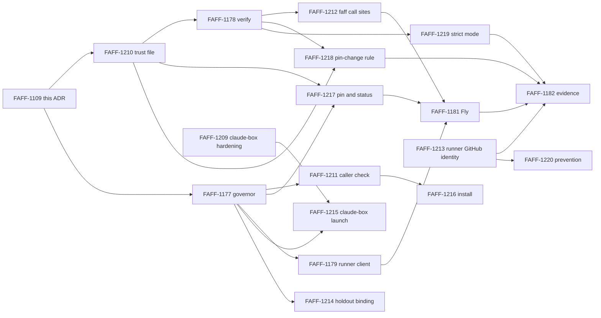

# ADR 0135 - Commissaire governor runs out of process, opt-in, with pinned keys

- **Status:** Proposed
- **Provenance:** human
- **Date:** 2026-10-06
- **Issue:** FAFF-1109

Drafted by an agent from the FAFF-1109 spike. Each decision is marked with who made it:

- **Human** decisions come from seven FAFF-1109 comments: 71b55ac3, 186e010e, 5bc1c730, c76c0d54, 236415f8 and ded5c387 (2026-10-06), and 4706c740 (2026-10-07). They are binding. Comment 236415f8 answered the four open questions in the first draft of this ADR. Comment ded5c387 makes Linux a first-class platform. Comment 4706c740 makes the governor part of Commissaire, with faff as one consumer.
- **Agent proposal** decisions take the FAFF-1109 description's default, or the agent's choice where the default no longer fits. They stand only once the human accepts this ADR.

## Context

Today `commissaire contract admit` writes `SK_commissaire` (Ed25519) and the HMAC `master_secret` to `<run_dir>/commissaire/governor/governor.json`. The same runner process reads them back in `effect authorize` (`cmdRequestDecision`) and `verdict conclude` (`cmdTerminalVerdict`) to sign verdicts. This is custody option 3 (FAFF-1034). It gives author binding and mechanical mediation, but a runner can sign its own grant, which is the FAFF-1027 threat model.

Addendum decision 3 (2026-10-05) requires the out-of-process governor, custody option 1, before Phase 2B (FAFF-830) starts. Gate 1 (FAFF-832) can count faff's own governed runs as governance evidence only if the grant comes from a signer the runner cannot impersonate.

Here "the runner" means Claude Code and every shell command it runs (c76c0d54).

Evidence for this ADR is in [`records/spikes/2026-10-06-faff-1109/RESULTS.md`](../spikes/2026-10-06-faff-1109/RESULTS.md): a macOS prototype round trip that is an experiment only (part 1), a read of the claude-box launcher (part 2), and a Linux prototype round trip across separate OS users (part 3).

## Decision

### Ownership: Commissaire, faff and outside

**Human (4706c740).** The governor belongs to Commissaire. faff is one consumer of it.

| Owner | Owns |
|---|---|
| Commissaire | The governor process (admit, authorize, conclude); key generation, storage and rotation; the trusted-key list and the pin-change rule; custody labels; `audit verify` against the pins; strict mode; the socket caller check; the commands `commissaire governor install`, `start`, `pin` and `status` |
| faff | The runner asking the governor; the `merge-gate` and `pr-create` call sites, which call Commissaire's verify function; faff's config switch that points at a governor; Gate 1 counting of faff's own runs |
| Outside both | The claude-box host launch and hardening (FAFF-1209); the runner's GitHub identity and the Fly deployment, which are operator tasks |

The pins live in a Commissaire-owned TOML file, not `.faffrc.yaml` (decision 11), so repositories without faff can use them, and Commissaire's code never imports faff's config reader. The commands run from the standalone `commissaire` binary (`plugin/skills/faff/bin/commissaire`). faff may wrap them.

**Agent proposals:**

- Commissaire exports one verify function from the governance region. faff's call sites in `merge-gate.js` (factory region) call it, which the region rule allows. The branch-delete leg is a `merge-gate` call site and uses the same function.
- `commissaire governor status` prints the custody label, the governor's fingerprint, whether that fingerprint is pinned on the base branch, the install check result, and whether the socket answers.
- Key rotation is a fifth command, `commissaire governor rotate`.
- The trust-file parser and the governor's new modules must pass the standalone binary's import-independence guard (`test/commissaire-standalone.test.mjs`).

### 1. Two custody labels, opt-in governor

**Human (186e010e, c76c0d54).**

| Label | When | Counted for Gate 1 |
|---|---|---|
| `custody: in-process` | Default, whenever no governor is configured. No setup, unchanged from today | No |
| `custody: governor` | A governor is configured, holds the only signing key, and the runner cannot reach that key | Only when the verdict's key is pinned (decision 6) and decision 7's other conditions hold |

There is no same-user tier. A governor configured for a run never falls back to in-process signing. If the governor cannot be reached, the run stops. Every admission and conclude record states its custody label.

**Agent proposal.** FAFF-1179's `custody: "out-of-process"` becomes `custody: "governor"`, to match the human decision.

### 2. Process shape

**Human (c76c0d54).** The governor is a plain Node process and needs no containers.

**Human (ded5c387).** Linux is a first-class platform alongside macOS and Fly. The Linux form of each boundary:

| Boundary | Linux | macOS |
|---|---|---|
| Separate OS user | A system user with a systemd service, created by `commissaire governor install` | `_faffgov` with a launchd daemon, created by the same command (agent proposal) |
| Caller authentication on the Unix socket | Peer credentials (`SO_PEERCRED`) | Peer credentials (`getpeereid`, `LOCAL_PEERCRED`) (agent proposal) |
| Separate machine | Fly, or any Linux host | Fly, or any Linux host |
| Caged runner | A governor on the host, outside the cage | A governor on the host, outside the cage |

**Agent proposal.** The governor is one program in two placements:

- **Local**, on Linux or macOS. A long-running process that listens on a Unix socket. It checks each caller's uid by peer credentials against an allow list before reading the request, and the socket file is also restricted to the runner's group.
- **Remote.** The same program on a separate machine: its own Fly app for unattended L3 runs, starting on request and stopping when idle, or any Linux host the operator runs.

**Agent proposal: Windows.** Native Windows is out of scope. Windows users run faff and the governor inside WSL2, where the Linux forms apply.

Requests are stateless. The only state is the governor's key, its per-run admission records and its append-only log. The program is TypeScript (CommonJS) with a committed `.js` emit (ADR-0132). The wire format is the one the prototype used: one newline-delimited JSON request per connection, with operations `admit`, `authorize` and `conclude`.

Rejected alternatives:

| Alternative | Why rejected |
|---|---|
| Per-request CLI under a separate OS user | Each call needs a privilege switch (a sudoers rule or a setuid helper) that takes runner-controlled arguments. That is more attack surface than a socket, and Fly needs a listening process anyway, so it would add a second shape |
| Hosted multi-tenant service | Operating cost, and it claims organisational independence the master RFC says faff does not claim |
| Governor inside a container the runner can reach | Same-user Docker is not independent: the user controls their own Docker, so `docker exec` reaches in. The cage's nested engine is controlled by the runner (c76c0d54) |
| Same-user local process as a counted tier | Rejected by the human (c76c0d54): no boundary the runner cannot cross |

**Trigger for a service.** The local governor is a long-running process, so the master RFC's "Trigger for a service" applies. The condition met is: "a required journal class or protected effect cannot be achieved without a service boundary". Commissaire decisions need a signer the runner cannot impersonate (the J-C binding in the addendum's custody row), and the runner holds every credential in its own process. No in-process arrangement meets that, which the FAFF-1034 analysis and step 7 of both prototypes show.

### 3. Request authentication

**Agent proposal (description default).**

- Every record the decision depends on (request, declares, observes) is authenticated by its existing `producer_hmac` under `K_producer`. The governor re-derives `K_producer` and checks each one.
- Locally, the caller's uid is checked by peer credentials (human, ded5c387), with socket file permissions as a second layer. On Fly, network placement and app identity.
- No new credential.

The Linux prototype (RESULTS part 3) refused a second user's connection by its peer uid before reading the request. Node has no peer-credential API, so the prototype used a helper process. FAFF-1211 picks the production route.

Admit is the one request without an HMAC, because the runner has no key before it. Any allowed caller can admit a new run and get that run's `K_producer`. This gives them no authority over other runs. The governor applies the same policy to every run, so admitting extra runs earns nothing a runner could not get on its own run.

Rejected: a client certificate or token for the runner. It would be a credential the runner holds, so it authenticates the runner to the governor without constraining what the runner asks for.

### 4. Ledger trust

**Agent proposal (description default, with one addition).** On every request the governor:

- verifies the hash chain from genesis with the existing `verifyEffectsChain`;
- re-verifies every producer HMAC and every Commissaire signature;
- evaluates against that verified ledger;
- appends the request and its verdict to its own append-only log outside the run directory.

**Addition.** The governor keeps the last ledger head it verified for each run and refuses a ledger that does not extend it. That turns truncation between two governor requests into a refusal, not just a later detection.

Known limit: a record the runner appends and then removes before its next governor request is never seen by the governor. A runner can therefore hide a newer `observe` by never sending it.

Prototype finding (RESULTS parts 1 and 3): a lost race leaves a validly signed grant that the runner holds but never appends. The chokepoint and `audit verify` must accept a verdict only at its signed position in an intact chain. The governor's log records every verdict it signed, including orphans.

Rejected: the governor reading the run directory itself. That fails on Fly, and locally it would need read access to a directory the runner can rewrite, which buys nothing over receiving the ledger.

### 5. Chain position

**Agent proposal (description default, confirmed by the prototype).**

1. The runner sends the next `seq` and `prev` with its request.
2. The governor computes them from its verified copy and refuses on a mismatch (`position-mismatch`).
3. The governor signs the verdict at that position.
4. The runner appends it with the existing `appendRecordsUnderLock`, which already refuses a record whose `seq` or `prev` differs from the position it assigns under the lock.
5. A runner that loses the race requests again, at most three times, then parks.

Step 4 of both prototypes forced a lost race and recovered on the second request.

Rejected:

- The governor appending to the ledger itself. That fails on Fly and gives the governor write access to the run directory.
- Signing without a chain position. The signature would no longer bind the verdict to the ledger's history.

### 6. Keys and pins

**Human (5bc1c730, 186e010e, 71b55ac3).**

- Each independent governor generates one long-lived Ed25519 key pair inside itself on first start and never exports the private key.
- `governor_key_fingerprints` is a list committed on the base branch. `merge-gate` and `audit verify` accept a grant signed by any listed key. Comment 5bc1c730 put the list in `.faffrc.yaml`; comment 4706c740 moves it to the Commissaire trust file (decision 11).
- Adding or removing an entry is a pin change. A PR that changes the pin always needs human approval, at every level.
  - The governor refuses an unattended grant for any merge that touches the pin.
  - `merge-gate` checks the same thing independently.
- Runs signed by an unlisted governor key still work. They are recorded as unpinned and do not count.
- In-process custody keeps today's fresh key pair per run, checked against the run's own `pk.json`. It is never pinned.
- With no pin present, `merge-gate` behaves as today.
- `commissaire governor pin` writes a new fingerprint on a branch and opens the PR (4706c740 renames the command).

**Human (236415f8).**

- **Fly storage.** The Fly governor's key lives on a Fly volume. It is generated inside the governor machine and never exported. It is not a Fly secret set from outside. Whether the runner's Fly credentials can reach that volume stays FAFF-1181's open question.
- **Strict mode.** An opt-in config switch, off by default. When it is on, `merge-gate` refuses any grant not signed by a key on the pinned list, so in-process and unpinned grants are refused. faff's own repository turns it on. Per 4706c740 the switch lives in the trust file and Commissaire owns it.

**Agent proposals:**

- **Per-run HMAC master.** Derived inside the governor as `HMAC-SHA256(root_secret, "faff-run-master:" + run_id)` from a long-lived root secret the governor also generates on first start. Neither secret leaves the governor. `K_producer` is derived from the per-run master with the existing `admitProducerKey`, as the prototype did.
- **Local storage.** One file, mode `0600`, in a directory only the governor's OS user can read:
  - under the `_faffgov` user, its own home directory;
  - for a governor claude-box starts on the host, a host path outside every cage mount (decision 9).
- **Strict mode key and sequencing.** The switch is `require_pinned_governor = true` in the trust file (decision 11). faff's repository turns it on only after its first governor fingerprint is merged into the list. The trust-file reader refuses strict mode with an empty list, because it would refuse every merge.
- **Rotation.** An explicit operator command (`commissaire governor rotate`) generates a new key pair. The old fingerprint stays listed until a human-approved PR removes it, so earlier grants keep verifying. Keys from earlier in-process runs stay where they are.
- **Base-branch read.** The pin is read from the base branch's committed config, never the working tree. A local clone's base ref is under the runner's control, so a verifier that needs independence (Gate 1 evidence, an external `audit verify`) reads the pin from the remote base branch.
- **What "touches the pin" means.** The PR changes the trust file at all, including strict mode and the approver list, since switching strict mode off weakens trust as much as adding a key. The governor learns the PR's changed files from GitHub with its own read-only token, never from the runner. Human approval means an approving review on the PR's head commit by an account in `pin_change_approvers`, read from the base branch's trust file (decision 11). Decision 10 explains why that account must differ from the runner's GitHub identity.
- **`commissaire governor pin` refuses to pin a governor whose key file the invoking user can read.** It tries the read itself, so a same-user governor cannot be pinned by accident.

Rejected:

- A single pinned key. Superseded by the list (5bc1c730).
- A key set from outside as a secret, locally or on Fly. That conflicts with "generated inside, never exported" (5bc1c730, 236415f8).
- Reading the pin from the working tree. A feature branch could move it.
- Keeping the pins in `.faffrc.yaml`. Superseded by 4706c740.

### 7. What "independent" means for Gate 1

**Human (c76c0d54).** A governor is independent only across a boundary the runner cannot cross:

| Placement | Independent |
|---|---|
| Same OS user, as a separate process or a Docker container | No |
| Separate OS user (`_faffgov` on macOS, a `faffgov` system user on Linux) | Yes, unless the runner can use sudo, or on Linux is in the `docker` group |
| Separate machine (the Fly app, or any Linux host) | Yes |
| Runner caged by claude-box, governor on the host outside the cage's Docker | Yes, but only once FAFF-1209 closes the cage's host routes (decision 9) |

**Human (236415f8).** A run counts as independent only when the runner uses a GitHub identity separate from the human's, such as a bot account or a GitHub App. Zero-config runs are unchanged. The reason: claude-box forwards the human's own `gh auth token`, so while the runner acts as the human, no "needs a human" rule enforced on GitHub can tell them apart.

**Agent proposal.** A run counts for Gate 1 when all three hold:

- it is labelled `custody: governor`;
- every Commissaire record verifies under a fingerprint pinned on the base branch at the time of the grant; and
- the run's evidence records a runner GitHub identity different from the human's, and the merge's GitHub actor is that identity.

The human approving each pin PR vouches for that governor's placement. The run is recorded on the invocation-and-principal dimension of the master RFC's independence vector as "separate process and separate credential". Organisational independence is not claimed.

**The sudo caveat.** A separate OS user is a boundary only while the runner's user cannot become root or `_faffgov` without a human. If the runner can use sudo, through cached credentials, a `NOPASSWD` rule, or any other route, it can read the key and the governor is not independent. The same holds for any root-equivalent path on the machine. The spike did not inspect the machine's sudo configuration, because doing so needs sudo.

**The Linux caveat (human, ded5c387).** Membership of the `docker` group is root-equivalent, because `docker run -v /:/host` can read any user's files. A separate-user governor counts as independent only when the runner's user is not in the `docker` group and has no sudo. Rootless Docker, which runs as the user, is fine. `commissaire governor install` checks both and records the result, so the record never over-claims.

**Agent proposal: how install checks and records.** `commissaire governor install` takes the runner's user name as an argument. It records whether that user is in the `docker` group and whether `sudo -l -U <user>` lists any rule; the human is already running install under sudo, so this adds no privilege. It writes the result into the governor's own configuration, and the governor states it on every admission record. `commissaire governor pin` refuses to pin a governor whose recorded check failed. On macOS the same check covers the `admin` group and sudo.

### 8. Level-policy inputs

**Agent proposal (description default).** `attended` and `holdout` stay runner claims in this set. They reach `evaluateLevelPolicy` from the request payload, and the Gate 1 evidence states that they are claims.

A dishonest runner at L1 or L2 can claim `attended: true`. At L3, the level Fly runs use, the policy adds no runner-claimed input. Binding `holdout` to an evaluator-signed verdict is a follow-on.

`admitted_scope` is also runner-supplied at admit today. That is another claim, recorded the same way.

### 9. Scenarios and the claude-box conditions

**Human (c76c0d54, ded5c387).** The scenarios, for macOS and Linux:

| Setup | Novice | Moderate | Expert on macOS | Expert on Linux |
|---|---|---|---|---|
| Bare Claude Code, no Docker | in-process | in-process | `sudo commissaire governor install` (`_faffgov`, launchd), or the Fly governor; then pin | `sudo commissaire governor install` (`faffgov`, systemd), or Fly or another Linux host; then pin |
| Bare Claude Code, with Docker | in-process | in-process | Same as above; Docker adds nothing to the claim | Same as above, and counts only if the runner's user is not in the `docker` group. Rootless Docker is fine |
| claude-box (caged) | Governor started by claude-box on the host, unpinned | Plus `commissaire governor pin` once per machine, after FAFF-1209 | Plus the Fly governor | Same as macOS |

Every cell assumes the runner's user has no sudo (decision 7). Windows is out of scope except through WSL2 (agent proposal, decision 2).

The macOS and Linux claude-box paths differ in how the socket reaches the cage. On Colima, claude-box relays it over a host loopback TCP port. On Docker hosts that can bind-mount a socket, including Linux, it mounts the socket file (`libcage.sh:447`, `361`).

The human asked the spike to confirm that claude-box does not mount the host Docker socket or the governor's key directory into the cage. RESULTS part 2 has the file and line references.

- **Docker socket.** Not mounted. The cage entrypoint refuses to start if one is present (`entrypoint-cage.sh:114-119`).
- **Key directory.** No mount covers a path outside the ones claude-box lists. But claude-box mounts these read-write: the project directory, `~/.cache`, `~/.local/bin`, `~/.claude-box/state` (at `~/.claude`), and on this machine `~/.faff` (from faff's untracked `.env.agent-box`). A host governor's key must live outside all of them.
- **Host network.** The cage reaches host loopback TCP ports through `host.docker.internal`. On Colima, claude-box relays a host Unix socket to the cage over such a port, as it already does for the SSH agent and the worker broker. A host governor is reachable the same way.

The spike also found paths from the cage to code execution on the host as the same OS user. These break the caged scenario, because the host governor in that row runs as the human's own user:

- the launcher `source`s `.env.agent-box` and `.env.claude-box` from the read-write project directory on the host (`libcage.sh:817-826`);
- `~/.local/bin`, mounted read-write, holds the host's `faff` link into the faff checkout;
- the faff checkout is itself the read-write project directory when the runner works on faff.

**Human (236415f8).** Caged runs count only after claude-box closes its host routes. Until then they are labelled unpinned and do not count. The routes are:

- the read-write `~/.faff` mount added by faff's `.env.agent-box`;
- the read-write `~/.local/bin` mount that holds the host's `faff` link;
- the launcher running `.env.agent-box` and `.env.claude-box` from the read-write project folder.

The hardening is tracked as FAFF-1209, an external dependency on the claude-box repository. FAFF-1209 also covers the read-write `~/.cache` mount and an optional separate GitHub identity for the runner.

**Agent proposal.** Two conditions on the host-side launch itself, beyond FAFF-1209:

1. claude-box starts the governor from an install the cage cannot write: a version-pinned copy outside every mount, never `~/.local/bin/faff` or the project checkout.
2. claude-box keeps the key outside every mount and checks that mechanically against its own mount list before starting the container.

`commissaire governor pin` should not pin a claude-box host governor until FAFF-1209 is done and both conditions hold.

### 10. Prevention

**Correction to FAFF-1034.** The FAFF-1034 design spec (`records/specs/2026-09-25-FAFF-1034-promote-runner-onto-commissaire-facade-design.md`, section 6, the key-custody question) says option 1 gives "genuine E-B mediated prevention against the runner". It does not. The runner keeps the GitHub credential and runs `merge-gate` itself, so a dishonest runner can merge without asking. Option 1 gives:

- an independent grant decision: a grant the runner cannot forge; and
- after-the-fact detection of merges without a grant, by `effects reconcile-merges` (FAFF-1028) and `audit verify`.

In the master RFC's terms the merge stays E-C (detection) against a dishonest runner. It is E-B only for a runner that goes through `merge-gate`.

**Agent proposal: prevention is out of scope for this set.** The cheapest route to it is a follow-on:

- a GitHub ruleset on the base branch requires a status check that only a GitHub App owned by the governor can post;
- the governor posts it on the head commit only when it grants the merge;
- the runner uses a GitHub identity that is neither that App nor an admin, and cannot bypass the ruleset.

That moves merges through GitHub to E-A. It depends on the runner's separate GitHub identity (decision 7, 236415f8). claude-box today forwards the human's own GitHub token into the cage (`libcage.sh:889-893`), and while the runner acts as the human on GitHub, no GitHub-side human gate means anything. That includes the approving review the pin-change rule needs.

### 11. The trust file and its parser

**Human (4706c740).** Commissaire's configuration is TOML in a Commissaire-owned file, committed and read from the base branch. It holds `governor_key_fingerprints` and the strict-mode switch. Everything else about the pins stands: a list, human approval for every change, read from the base branch (71b55ac3, 5bc1c730).

**Agent proposal: the name.** `.commissaire/trust.toml`. A directory leaves room for other Commissaire files without widening what the pin-change rule covers. The pin-change rule then covers exactly this file.

Rejected names:

- `.commissaire.toml` at the root. Any later Commissaire setting would land in the same file, and every change to it would need the pin-change approval.
- A section in `.faffrc.yaml`. Superseded by 4706c740.

**Agent proposal: schema 1.**

```toml
# .commissaire/trust.toml
schema = 1

# SHA-256 of each pinned governor's SPKI-DER public key, lowercase hex.
governor_key_fingerprints = [
  "c8585945163d2114c2883388517cf83247ce2e17c96248faa1ec2988d4db693b",  # Fly governor
]

# Strict mode: refuse any grant not signed by a pinned key.
require_pinned_governor = false

# GitHub accounts whose approving review authorises a change to this file.
pin_change_approvers = ["example-maintainer"]
```

| Key | Type | Rule |
|---|---|---|
| `schema` | integer | Required. Must be `1` |
| `governor_key_fingerprints` | array of strings | Optional, default empty. Each entry is 64 lowercase hex characters, the format `pkFingerprint` already produces. No duplicates |
| `require_pinned_governor` | boolean | Optional, default `false`. `true` with an empty fingerprint list is refused |
| `pin_change_approvers` | array of strings | Optional, default empty. GitHub logins. With none listed, the governor grants no merge that changes this file, so a human must merge it outside the governed path |

Reading rules:

- **No file:** no pins, strict mode off, no approvers. Zero-config is unchanged.
- **Unknown key:** refused, so a misspelt `require_pinned_governor` cannot silently leave strict mode off.
- **Malformed or invalid file:** every reader fails closed with `trust-file-invalid` and the line number. A reader never falls back to "no pins".
- **Where it is read from:** the base branch's committed file. A local read uses `git show <base>:.commissaire/trust.toml`. The governor and any independent verifier read it from the remote base branch, since the runner controls the local clone's refs (decision 6).

**Agent proposal: the parser.** A small built-in parser for a strict TOML subset, in a new governance-region module with its committed `.js` emit (ADR-0132). It follows the precedent of faff's built-in `parseYamlSubset` (`shared-infra.js`) and adds no runtime dependency. It lives in the governance region because only Commissaire reads the file. It can move to the shared-infra region if a second reader ever needs it.

The subset:

| Accepted | Refused, with a line-numbered error |
|---|---|
| UTF-8 text with LF or CRLF line endings | A byte-order mark |
| Blank lines and `#` comments, on their own line or after a value | Table headers (`[x]`) and arrays of tables (`[[x]]`) |
| Top-level `key = value` pairs with bare keys matching `[A-Za-z0-9_-]+` | Dotted keys, quoted keys and duplicate keys |
| Basic strings in double quotes, with `\"` and `\\` as the only escapes | Literal strings, multi-line strings and other escapes |
| Decimal integers with no sign, underscores or leading zeros | Floats, dates, times, and hex, octal or binary integers |
| `true` and `false` | Inline tables |
| Arrays of basic strings, on one line or several, with comments between elements and an optional trailing comma | Nested arrays and arrays mixing types |

Every file the parser accepts is valid TOML with the same meaning, so standard TOML tools read it unchanged. The proposed test pairs a corpus of accepted and refused files with a full TOML parser as a test-only devDependency, beside `typescript`, to check that accepted files parse to the same values. That parser never enters the shipped closure.

Rejected alternatives:

| Alternative | Why rejected |
|---|---|
| A TOML library as a runtime dependency (`smol-toml`, `@iarna/toml`) | Commissaire ships with no runtime dependencies |
| Vendoring a full TOML 1.0 parser | Hundreds of lines in the governance region to audit for features the trust file does not use |
| A YAML file read by `parseYamlSubset` | The human chose TOML (4706c740). YAML's implicit typing, where `no` and `on` become booleans, is a hazard in a security file |
| A JSON file | The human chose TOML. JSON has no comments, and a reviewer of a pin change is helped by a comment naming each key's governor |
| Reading through `config.js` or `readGovernanceConfig` | Commissaire must not import faff's config reader (4706c740), and the file is not faff's |
| Accepting tables in schema 1 | Schema 1 needs none. Single-level tables can be added in a later schema |

## Consequences

### What the prototypes demonstrated

Two throwaway prototypes completed one `effect authorize` round trip across a process boundary, with the unchanged evaluators, a verdict signed at the runner's chain position, a recovered lost race, a deny, and a runner self-grant refused against the pinned fingerprint.

| | Linux (RESULTS part 3) | macOS (RESULTS part 1) |
|---|---|---|
| Boundary | Separate OS users: `faffgov` owns the key (`0600`) and runs the governor; `runner` runs the runner | A Seatbelt profile (`sandbox-exec`) on the runner; same OS user. An experiment only (ded5c387) |
| Runner reads the key | `EACCES` | `EPERM` |
| Runner signals the governor | Refused | Allowed |
| Caller authentication | Peer credentials: a second user was refused by uid | None |
| Where | A throwaway `node:20` container, root inside it only, Node 20.20.2 | The host, Node 24.15.0 |

Neither prototype tested:

- the `docker` group or sudo escape routes;
- systemd or launchd;
- the claude-box container;
- Fly.

The Linux run proves the OS-user boundary on Linux. It does not show a deployment on a real host.

### Build tickets re-cut

**Agent proposal, filed at the human's request (2026-10-07).** The tickets are split along the ownership line (4706c740) and are in Backlog in the project "Governed execution is compared with a strong one-shot control". FAFF-1109 blocks all of them. Each description states its domain in its first line.

| Ticket | Domain | Scope | Size |
|---|---|---|---|
| FAFF-1177 | Commissaire | The governor process behind `commissaire governor start`: admit, authorize and conclude; key generation and rotation; per-run masters; chain, head-extension and position checks; its own log | M |
| FAFF-1178 | Commissaire | The verify function: pinned, unpinned or in-process classification against the trust file; chain-position check for orphaned grants; no `pk.json` fallback; `audit verify` | M (was S) |
| FAFF-1212 | faff | Split from FAFF-1178: `merge-gate`, pr-create and branch-delete call the verify function, with the adversarial self-grant test | S |
| FAFF-1179 | faff | The runner asks the governor; faff's switch `commissaire.governor`; `custody: governor`; append with retry; fail closed | M |
| FAFF-1181 | Outside (operator) | The Fly governor app, key generated on its own volume, pinned through a human-approved PR | M |
| FAFF-1182 | faff | Gate 1 counting of faff's runs (decision 7), the evidence run, strict mode on in faff's repository, and docs | M (was S) |
| FAFF-1210 | Commissaire | `.commissaire/trust.toml` and the built-in TOML-subset parser (decision 11) | M |
| FAFF-1211 | Commissaire | Peer-credential caller check on the socket | S |
| FAFF-1216 | Commissaire | `commissaire governor install`: systemd and launchd, an immutable install, the `docker` group and sudo checks | L |
| FAFF-1217 | Commissaire | `commissaire governor pin` and `status` | S |
| FAFF-1218 | Commissaire | The pin-change human rule, in the governor and the verify function | M |
| FAFF-1219 | Commissaire | Strict mode | S |
| FAFF-1213 | Outside (operator), small faff part | The runner's own GitHub identity (Human-task) | M |
| FAFF-1220 | Commissaire, operator setup | Prevention: a required status check only the governor's App can post (Human-task follow-on) | M |
| FAFF-1214 | Commissaire, with faff's evaluator | Bind `holdout` to an evaluator-signed verdict (follow-on) | M |
| FAFF-1215 | External (claude-box) | Start the governor on the host from claude-box | M |
| FAFF-1209 | External (claude-box) | Close the cage's host routes (filed by the human) | M |

FAFF-1195 (owner-only key file modes) already existed and is not duplicated.



### Other consequences

- Zero-config users see no change.
- An operator who wants counted evidence configures a governor, pins its key through a human-approved PR, gives the runner its own GitHub identity, and runs on Fly, another Linux host, or under a separate OS user that passes the install checks.
- With strict mode on, faff's own repository stops accepting in-process grants, so every governed merge there needs a reachable pinned governor.
- `audit verify` on a governor run reports producer claims as `unverifiable_without_secret`, because only the governor holds the master. Verification on the governor side is a follow-on.
- Until the prevention follow-on (FAFF-1220) lands, a dishonest runner's merge without a grant is detected, not prevented.

### Open questions

The four open questions in the first draft were answered in FAFF-1109 comment 236415f8 and are recorded above as human decisions. None remain open. The agent proposals throughout still need the human's acceptance of this ADR.
