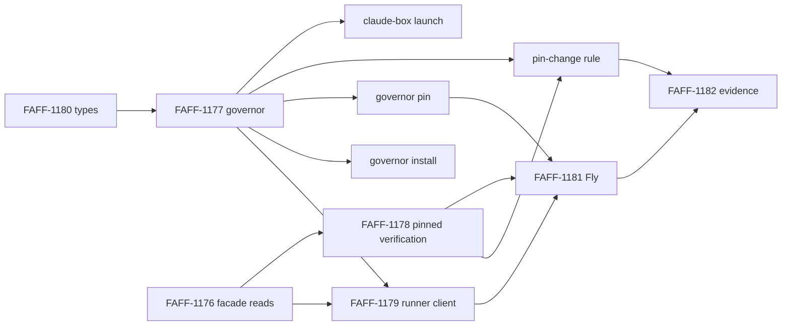

# ADR 0135 - Commissaire governor runs out of process, opt-in, with pinned keys

- **Status:** Proposed
- **Provenance:** human
- **Date:** 2026-10-06
- **Issue:** FAFF-1109

Drafted by an agent from the FAFF-1109 spike. Each decision is marked with who made it:

- **Human** decisions come from the four FAFF-1109 comments of 2026-10-06: 71b55ac3, 186e010e, 5bc1c730 and c76c0d54. They are binding.
- **Agent proposal** decisions take the FAFF-1109 description's default, or the agent's choice where the default no longer fits. They stand only once the human accepts this ADR.

## Context

Today `commissaire contract admit` writes `SK_commissaire` (Ed25519) and the HMAC `master_secret` to `<run_dir>/commissaire/governor/governor.json`. The same runner process reads them back in `effect authorize` (`cmdRequestDecision`) and `verdict conclude` (`cmdTerminalVerdict`) to sign verdicts. This is custody option 3 (FAFF-1034). It gives author binding and mechanical mediation, but a runner can sign its own grant, which is the FAFF-1027 threat model.

Addendum decision 3 (2026-10-05) requires the out-of-process governor, custody option 1, before Phase 2B (FAFF-830) starts. Gate 1 (FAFF-832) can count faff's own governed runs as governance evidence only if the grant comes from a signer the runner cannot impersonate.

Here "the runner" means Claude Code and every shell command it runs (c76c0d54).

Evidence for this ADR is in [`records/spikes/2026-10-06-faff-1109/RESULTS.md`](../spikes/2026-10-06-faff-1109/RESULTS.md): a prototype round trip across a process boundary (part 1) and a read of the claude-box launcher (part 2).

## Decision

### 1. Two custody labels, opt-in governor

**Human (186e010e, c76c0d54).**

| Label | When | Counted for Gate 1 |
|---|---|---|
| `custody: in-process` | Default, whenever no governor is configured. No setup, unchanged from today | No |
| `custody: governor` | A governor is configured, holds the only signing key, and the runner cannot reach that key | Only when the verdict's key fingerprint is pinned (decision 6) |

There is no same-user tier. A governor configured for a run never falls back to in-process signing. If the governor cannot be reached, the run stops. Every admission and conclude record states its custody label.

**Agent proposal.** FAFF-1179's `custody: "out-of-process"` becomes `custody: "governor"`, to match the human decision.

### 2. Process shape

**Human (c76c0d54).** The governor is a plain Node process and needs no containers.

**Agent proposal.** The governor is one program in two placements:

- **Local.** A long-running process that listens on a Unix socket. The socket file is owner-only, or group-readable by a dedicated client group under a separate OS user.
- **Fly.** The same program as its own Fly app, reached over the network for unattended L3 runs. It starts on request and stops when idle.

Requests are stateless. The only state is the governor's key, its per-run admission records and its append-only log. The program is TypeScript (CommonJS) with a committed `.js` emit (ADR-0132). The wire format is the one the prototype used: one newline-delimited JSON request per connection, with operations `admit`, `authorize` and `conclude`.

Rejected alternatives:

| Alternative | Why rejected |
|---|---|
| Per-request CLI under a separate OS user | Each call needs a privilege switch (a sudoers rule or a setuid helper) that takes runner-controlled arguments. That is more attack surface than a socket, and Fly needs a listening process anyway, so it would add a second shape |
| Hosted multi-tenant service | Operating cost, and it claims organisational independence the master RFC says faff does not claim |
| Governor inside a container the runner can reach | Same-user Docker is not independent: the user controls their own Docker, so `docker exec` reaches in. The cage's nested engine is controlled by the runner (c76c0d54) |
| Same-user local process as a counted tier | Rejected by the human (c76c0d54): no boundary the runner cannot cross |

**Trigger for a service.** The local governor is a long-running process, so the master RFC's "Trigger for a service" applies. The condition met is: "a required journal class or protected effect cannot be achieved without a service boundary". Commissaire decisions need a signer the runner cannot impersonate (the J-C binding in the addendum's custody row), and the runner holds every credential in its own process. No in-process arrangement meets that, which the FAFF-1034 analysis and the prototype's step 7 both show.

### 3. Request authentication

**Agent proposal (description default).**

- Every record the decision depends on (request, declares, observes) is authenticated by its existing `producer_hmac` under `K_producer`. The governor re-derives `K_producer` and checks each one.
- Transport authentication is defence in depth: socket file permissions locally, and network placement and app identity on Fly.
- No new credential.

Admit is the one unauthenticated request, because the runner has no key before it. Anyone who can reach the socket can admit a new run and get that run's `K_producer`. This gives them no authority over other runs. The governor applies the same policy to every run, so admitting extra runs earns nothing a runner could not get on its own run.

Rejected: a client certificate or token for the runner. It would be a credential the runner holds, so it authenticates the runner to the governor without constraining what the runner asks for.

### 4. Ledger trust

**Agent proposal (description default, with one addition).** On every request the governor:

- verifies the hash chain from genesis with the existing `verifyEffectsChain`;
- re-verifies every producer HMAC and every Commissaire signature;
- evaluates against that verified ledger;
- appends the request and its verdict to its own append-only log outside the run directory.

**Addition.** The governor keeps the last ledger head it verified for each run and refuses a ledger that does not extend it. That turns truncation between two governor requests into a refusal, not just a later detection.

Known limit: a record the runner appends and then removes before its next governor request is never seen by the governor. A runner can therefore hide a newer `observe` by never sending it.

Prototype finding (RESULTS part 1): a lost race leaves a validly signed grant that the runner holds but never appends. The chokepoint and `audit verify` must accept a verdict only at its signed position in an intact chain. The governor's log records every verdict it signed, including orphans.

Rejected: the governor reading the run directory itself. That fails on Fly, and locally it would need read access to a directory the runner can rewrite, which buys nothing over receiving the ledger.

### 5. Chain position

**Agent proposal (description default, confirmed by the prototype).**

1. The runner sends the next `seq` and `prev` with its request.
2. The governor computes them from its verified copy and refuses on a mismatch (`position-mismatch`).
3. The governor signs the verdict at that position.
4. The runner appends it with the existing `appendRecordsUnderLock`, which already refuses a record whose `seq` or `prev` differs from the position it assigns under the lock.
5. A runner that loses the race requests again, at most three times, then parks.

The prototype's step 4 forced a lost race and recovered on the second request.

Rejected:

- The governor appending to the ledger itself. That fails on Fly and gives the governor write access to the run directory.
- Signing without a chain position. The signature would no longer bind the verdict to the ledger's history.

### 6. Keys and pins

**Human (5bc1c730, 186e010e, 71b55ac3).**

- Each independent governor generates one long-lived Ed25519 key pair inside itself on first start and never exports the private key.
- `.faffrc.yaml` on the base branch holds `governor_key_fingerprints`, a list. `merge-gate` and `audit verify` accept a grant signed by any listed key.
- Adding or removing an entry is a pin change. A PR that changes the pin always needs human approval, at every level.
  - The governor refuses an unattended grant for any merge that touches the pin.
  - `merge-gate` checks the same thing independently.
- Runs signed by an unlisted governor key still work. They are recorded as unpinned and do not count.
- In-process custody keeps today's fresh key pair per run, checked against the run's own `pk.json`. It is never pinned.
- With no pin present, `merge-gate` behaves as today.
- `faff governor pin` writes a new fingerprint on a branch and opens the PR.

**Agent proposals:**

- **Per-run HMAC master.** Derived inside the governor as `HMAC-SHA256(root_secret, "faff-run-master:" + run_id)` from a long-lived root secret the governor also generates on first start. Neither secret leaves the governor. `K_producer` is derived from the per-run master with the existing `admitProducerKey`, as the prototype did.
- **Local storage.** One file, mode `0600`, in a directory only the governor's OS user can read:
  - under the `_faffgov` user, its own home directory;
  - for a governor claude-box starts on the host, a host path outside every cage mount (decision 9).
- **Fly storage.** The governor generates its key on first start and writes it to a volume attached only to the governor app. The description's default was a Fly secret, but a secret is set from outside the governor, which conflicts with "generated inside, never exported". Whether the runner's Fly credentials can reach that volume is FAFF-1181's open question.
- **Rotation.** An explicit operator command (`faff governor rotate`) generates a new key pair. The old fingerprint stays listed until a human-approved PR removes it, so earlier grants keep verifying. Keys from earlier in-process runs stay where they are.
- **Pin location in the file.** Under the existing `commissaire:` block as `commissaire.governor_key_fingerprints`. The key name is the human's. The nesting is a proposal.
- **Base-branch read.** The pin is read from the base branch's committed config, never the working tree. A local clone's base ref is under the runner's control, so a verifier that needs independence (Gate 1 evidence, an external `audit verify`) reads the pin from the remote base branch.
- **What "touches the pin" means.** The PR changes `.faffrc.yaml` at all. The governor learns the PR's changed files from GitHub with its own read-only token, never from the runner. Human approval means an approving review on the PR's head commit by a GitHub account the governor's own configuration names. Decision 10 explains why that account must differ from the runner's GitHub identity.
- **`faff governor pin` refuses to pin a governor whose key file the invoking user can read.** It tries the read itself, so a same-user governor cannot be pinned by accident.

Rejected:

- A single pinned key. Superseded by the list (5bc1c730).
- A key set from outside as a secret, locally or on Fly. That conflicts with "generated inside, never exported".
- Reading the pin from the working tree. A feature branch could move it.

### 7. What "independent" means for Gate 1

**Human (c76c0d54).** A governor is independent only across a boundary the runner cannot cross:

| Placement | Independent |
|---|---|
| Same OS user, as a separate process or a Docker container | No |
| Separate OS user (`_faffgov`) | Yes, unless the runner can use sudo |
| Separate machine (the Fly app) | Yes |
| Runner caged by claude-box, governor on the host outside the cage's Docker | Yes, subject to decision 9's findings |

**Agent proposal.** A run counts for Gate 1 when:

- it is labelled `custody: governor`; and
- every Commissaire record verifies under a fingerprint pinned on the base branch at the time of the grant.

The human approving each pin PR vouches for that governor's placement. The run is recorded on the invocation-and-principal dimension of the master RFC's independence vector as "separate process and separate credential". Organisational independence is not claimed.

**The sudo caveat.** A separate OS user is a boundary only while the runner's user cannot become root or `_faffgov` without a human. If the runner can use sudo, through cached credentials, a `NOPASSWD` rule, or any other route, it can read the key and the governor is not independent. The same holds for any root-equivalent path on the machine. The spike did not inspect the machine's sudo configuration, because doing so needs sudo.

### 8. Level-policy inputs

**Agent proposal (description default).** `attended` and `holdout` stay runner claims in this set. They reach `evaluateLevelPolicy` from the request payload, and the Gate 1 evidence states that they are claims.

A dishonest runner at L1 or L2 can claim `attended: true`. At L3, the level Fly runs use, the policy adds no runner-claimed input. Binding `holdout` to an evaluator-signed verdict is a follow-on.

`admitted_scope` is also runner-supplied at admit today. That is another claim, recorded the same way.

### 9. Scenarios and the claude-box conditions

**Human (c76c0d54).**

| Setup | Novice | Moderate | Expert |
|---|---|---|---|
| Bare Claude Code, no Docker | in-process | in-process | `sudo faff governor install` (separate OS user), or the Fly governor; then pin |
| Bare Claude Code, with Docker | in-process | in-process | Same as above; Docker adds nothing to the claim |
| claude-box (caged) | Governor started by claude-box on the host, unpinned | Plus `faff governor pin` once per machine | Plus the Fly governor |

The human asked the spike to confirm that claude-box does not mount the host Docker socket or the governor's key directory into the cage. RESULTS part 2 has the file and line references.

- **Docker socket.** Not mounted. The cage entrypoint refuses to start if one is present (`entrypoint-cage.sh:114-119`).
- **Key directory.** No mount covers a path outside the ones claude-box lists. But claude-box mounts these read-write: the project directory, `~/.cache`, `~/.local/bin`, `~/.claude-box/state` (at `~/.claude`), and on this machine `~/.faff` (from faff's untracked `.env.agent-box`). A host governor's key must live outside all of them.
- **Host network.** The cage reaches host loopback TCP ports through `host.docker.internal`. On Colima, claude-box relays a host Unix socket to the cage over such a port, as it already does for the SSH agent and the worker broker. A host governor is reachable the same way.

The spike also found paths from the cage to code execution on the host as the same OS user. These break the caged scenario, because the host governor in that row runs as the human's own user:

- the launcher `source`s `.env.agent-box` and `.env.claude-box` from the read-write project directory on the host (`libcage.sh:817-826`);
- `~/.local/bin`, mounted read-write, holds the host's `faff` link into the faff checkout;
- the faff checkout is itself the read-write project directory when the runner works on faff.

**Agent proposal.** The caged row counts as independent only when claude-box meets four conditions:

1. It starts the governor from an install the cage cannot write: a version-pinned copy outside every mount, never `~/.local/bin/faff` or the project checkout.
2. It keeps the key outside every mount and checks that mechanically against its own mount list before starting the container.
3. It stops sourcing configuration from runner-writable paths, or moves those files out of the project directory.
4. It mounts `~/.local/bin` read-only.

Until claude-box meets these conditions, the caged scenario is a same-user claim and is not counted. `faff governor pin` should not pin a claude-box host governor until then. The human decides whether to accept this narrowing.

### 10. Prevention

**Correction to FAFF-1034.** The FAFF-1034 design spec (`records/specs/2026-09-25-FAFF-1034-promote-runner-onto-commissaire-facade-design.md`, section 6, the key-custody question) says option 1 gives "genuine E-B mediated prevention against the runner". It does not. The runner keeps the GitHub credential and runs `merge-gate` itself, so a dishonest runner can merge without asking. Option 1 gives:

- an independent grant decision: a grant the runner cannot forge; and
- after-the-fact detection of merges without a grant, by `effects reconcile-merges` (FAFF-1028) and `audit verify`.

In the master RFC's terms the merge stays E-C (detection) against a dishonest runner. It is E-B only for a runner that goes through `merge-gate`.

**Agent proposal: prevention is out of scope for this set.** The cheapest route to it is a follow-on:

- a GitHub ruleset on the base branch requires a status check that only a GitHub App owned by the governor can post;
- the governor posts it on the head commit only when it grants the merge;
- the runner uses a GitHub identity that is neither that App nor an admin, and cannot bypass the ruleset.

That moves merges through GitHub to E-A. One prerequisite applies to the claude-box path: claude-box today forwards the human's own GitHub token into the cage (`libcage.sh:889-893`). While the runner acts as the human on GitHub, no GitHub-side human gate means anything. That includes code-owner review of the pin.

## Consequences

### What the prototype demonstrated

The prototype completed one `effect authorize` round trip across a process boundary with the unchanged evaluators, a verdict signed at the runner's chain position, and a recovered lost race.

The boundary it demonstrated is a macOS Seatbelt profile (`sandbox-exec`) applied to the runner process and every child it spawned. The runner could not read, list or write the governor's key directory. One escape route, `launchctl submit`, was refused while a control outside the profile succeeded.

The boundary it did not demonstrate:

- a separate OS user, which needs sudo;
- the claude-box container;
- Fly;
- protection of the governor process, since the runner could still signal it;
- any other escape route.

Seatbelt is deprecated by Apple and is not proposed for deployment. It was the kernel-enforced boundary provable without privilege.

### Build tickets re-cut

**Agent proposal.** The human decides which proposals to adopt.

| Ticket | Proposed scope | Size |
|---|---|---|
| FAFF-1177 governor process | Confirmed, with changes: `governor.ts` serving `admit`, `authorize` and `conclude` over a Unix socket and a network listener (decision 2); a long-lived key pair and root secret generated on first start, and per-run masters (decision 6); ledger verification with the head-extension check (decision 4); position check (decision 5); its own log; shared composition code moved into a governance-region module; selftests per its done criteria plus `position-mismatch` and a truncated-ledger refusal. The pin-change refusal moves to a new ticket | M |
| FAFF-1178 pinned verification | Re-cut to the list: verify against `governor_key_fingerprints` read from the base branch; classify each grant as pinned, unpinned or in-process; accept a verdict only at its signed chain position (orphaned grants); stop `verifyAuthLeg` falling back to the runner-written `pk.json` under governor custody; keep the adversarial self-grant test. Adds an opt-in `commissaire.require_pinned_governor` that makes `merge-gate` refuse unpinned and in-process grants (open question 2) | M (was S) |
| FAFF-1179 runner as client | Confirmed, with changes: label `custody: governor`; the append-signed-with-retry loop; fail closed when unreachable; no key material in the run directory. Configuration: `commissaire.governor` (the endpoint) in `.faffrc.yaml`, overridable by an environment variable claude-box sets | M |
| FAFF-1181 placement | Re-cut to Fly only: the governor app, key on its own volume, network path from the L3 runner, start on request, and the Fly token and organisation question. Local placements move to the two new tickets below | M |
| FAFF-1182 evidence and docs | Confirmed: label `custody: governor`; the evidence run is a Fly L3 run with a pinned key; the FAFF-830 note counts only pinned `custody: governor` runs | S |
| New: `faff governor install` | Separate OS user `_faffgov` with a launchd (macOS) or systemd (Linux) service and an immutable install. The human runs it with sudo; faff never calls sudo itself. Prints the fingerprint to pin | M |
| New: `faff governor pin` | Reads the governor's public key over its socket, refuses if the invoking user can read the key file, writes the fingerprint to `governor_key_fingerprints` on a branch, opens the PR | S |
| New: pin-change human rule | The governor refuses an unattended grant for a merge whose PR changes `.faffrc.yaml`, using its own read-only GitHub token; it requires an approving review from a named human account; `merge-gate` checks the same independently. Tests at every level | M |
| New: claude-box host-side launch (claude-box repo) | Start the governor on the host from an immutable install, key outside every mount with a mechanical check, socket relay (bind mount, or the Colima TCP relay); close the host code-execution paths in decision 9 | M |
| New: prevention follow-on | Required status check posted only by a governor-owned GitHub App; the runner moves to a non-admin bot identity (decision 10) | M, human task |
| New: bind `holdout` to an evaluator-signed verdict | Follow-on named in decision 8 | S |

### Other consequences

- Zero-config users see no change.
- An operator who wants counted evidence configures a governor, pins its key through a human-approved PR, and runs on Fly or under `_faffgov`.
- `audit verify` on a governor run reports producer claims as `unverifiable_without_secret`, because only the governor holds the master. Verification on the governor side is a follow-on.
- Until the prevention follow-on lands, a dishonest runner's merge without a grant is detected, not prevented.

### Open questions for the human

1. **Scope of the caged scenario.** Should it wait for the claude-box conditions in decision 9, or count as soon as the governor runs on the host?
2. **A strict mode.** Should there be an opt-in that makes `merge-gate` refuse unpinned and in-process grants, for example on the Fly runner? The human decisions keep pins counting-only by default.
3. **GitHub identity.** Should the runner move to its own GitHub identity? Without that, neither the pin-change review nor the prevention route can be enforced on GitHub.
4. **Fly volume.** Does a Fly volume on a separate app satisfy "never exported", given that Fly operators with access to that app can reach the volume? This connects to FAFF-1181's token-scope question.
