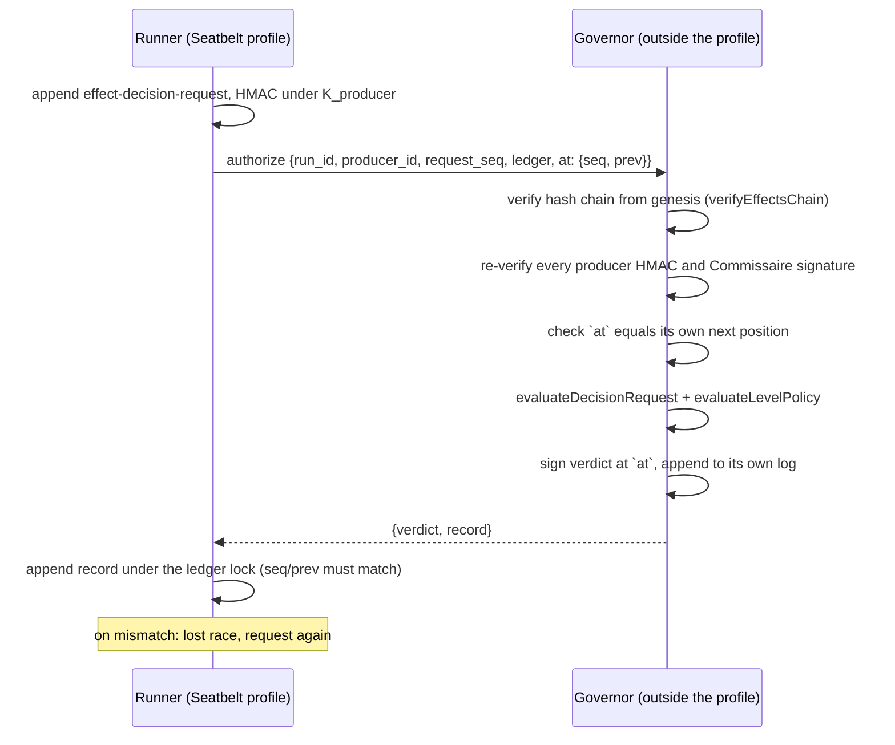

# FAFF-1109 spike evidence: governor round trip and claude-box mount check

Evidence for ADR 0135. Recorded 2026-10-06 on the maintainer's machine: macOS 15.6.1, Node 24.15.0, faff at `82d6dbb2` (origin/main). Every command ran as the same OS user (uid 501). No command used sudo.

## Part 1: prototype round trip

### What was built

A throwaway prototype in a scratch worktree at `82d6dbb2`. It changed no tracked file (`git status --short` showed only the untracked `proto-1109/` directory), was never committed or pushed, and the worktree was deleted after this run. Four files:

| File | Lines | SHA-256 | Role |
|---|---|---|---|
| `governor.js` | 130 | `c5c8c613cda59cda02089c361327a19b096eff0a622c8bad31b6763770f4b4d1` | Governor on a Unix socket. Generates and keeps its key, verifies, evaluates and signs |
| `runner.js` | 105 | `7776264ec52f32a2de359bd84c2f3fee51d6033337bda4b68c6599b3b7782aca` | Runner side of admit, declare, request and authorize |
| `runner.sb` | 4 | `f465bcb0efa4a4415416b06e2cc6b18c74ea63cb13df77ede70f10a72cad97a5` | Seatbelt profile the runner runs under |
| `demo.sh` | 37 | `df2512a304b9086978fc63684a42a2208eeabe9e657847cb9aaf63e74521a7a6` | Starts the governor, runs the runner, prints the evidence below |

The governor imports `evaluateDecisionRequest`, `evaluateLevelPolicy`, `buildEnvelope` and `LEDGER_CFG` from the committed `plugin/skills/faff/bin/lib/commissaire.js`, the key helpers from `producer-auth.js`, and `verifyEffectsChain`, `tailReadState`, `sha256Hex` and `parseJsonlEntries` from `events.js`. Nothing was copied. The only new decision-side code is the composition of the two evaluators, which mirrors `cmdRequestDecision` line for line.

Protocol, one request per connection, newline-delimited JSON:



Key custody in the prototype:

- The governor generates an Ed25519 key pair and a 32-byte root secret on first start, writes them to `/private/tmp/faff-1109-gov/key/governor-key.json` (directory `0700`, file `0600`), and never sends either.
- The per-run HMAC master is `HMAC-SHA256(root_secret, "faff-run-master:" + run_id)`, computed inside the governor. `K_producer` is derived from it with the existing `admitProducerKey`.
- The runner receives `K_producer` and the public key only.

The Seatbelt profile (`runner.sb`):

```
(version 1)
(allow default)
(deny file-read* file-write* (subpath "/private/tmp/faff-1109-gov"))
(deny signal (target others))
```

A Seatbelt profile applies to the process `sandbox-exec` starts and to every process it spawns.

### Commands and output

`./demo.sh`, full output in [`demo-output.txt`](demo-output.txt). Abridged:

```
$ node governor.js $GOV/key $GOV/state $SOCK &
governor pid=63446 uid=501 socket=/private/tmp/faff-1109-sock/gov.sock pk_fingerprint=c8585945…db693b

$ sandbox-exec -f runner.sb node runner.js $RUN $SOCK $GOV/key/governor-key.json $FP
runner: {"pid":63453,"uid":501,"run_id":"run-2026-10-06-proto"}
step 1, runner reads the governor key file with node: EPERM: operation not permitted, open '/private/tmp/faff-1109-gov/key/governor-key.json'
step 1, runner child process runs cat on the key file: exit=1 cat: …/governor-key.json: Operation not permitted
step 1, runner lists the key directory: exit=1 ls: /private/tmp/faff-1109-gov/key: Operation not permitted
  admission appended: {"seq":0,"custody":"governor","pk_fingerprint":"c8585945…db693b"}
  request appended: {"seq":2,"producer_hmac":"2243218fdfd205d7..."}
  authorize attempt 1 lost the race: append core: minted record must carry the supplied seq/prev (want seq 4 …, got seq 3 …)
  authorize attempt 2: {"verdict":"grant","reason":"all-legs-pass","signed_seq":4}
step 5, chokepoint check with the pinned fingerprint: {"permit":true,"reason":"valid-grant"}
  authorize attempt 1: {"verdict":"deny","reason":"effect-not-declared","signed_seq":6}
  chokepoint, runner key, pinned fingerprint: {"permit":false,"reason":"pk-fingerprint-mismatch"}
  chokepoint, runner key, fingerprint from the runner's own pk.json (today): {"permit":true,"reason":"valid-grant"}

$ sandbox-exec -f runner.sb /bin/kill -0 $GPID
exit=0

$ grep -rl 'BEGIN PRIVATE KEY\|master_secret\|root_secret' $RUN || echo none
none

$ faff commissaire audit verify --run-dir $RUN
{"result":"pass", "producer_claims":{"verified":0,"unverifiable_without_secret":4,"failed":0}, "commissaire_decisions":{"verified":3,"failed":0}, …}
exit=0
```

The governor's own log (outside the run directory) shows three signed verdicts for two requests: the grant at seq 3 that lost the race and was never appended, the grant at seq 4, and the deny at seq 6.

One escape route was tested, in [`escape-output.txt`](escape-output.txt):

```
$ sandbox-exec -f runner.sb launchctl submit -l dev.faff.1109probe -- /bin/sh -c 'cat $GOV/key/governor-key.json > …/leak; …'
submit exit=1
$ wc -c leak
wc: /private/tmp/faff-1109-sock/leak: open: No such file or directory

$ launchctl submit -l dev.faff.1109control -- /bin/sh -c 'echo ran > …/control'   # control, outside the profile
submit exit=0
$ cat control
ran
```

### What the prototype proved

1. One `effect authorize` round trip crosses a process boundary: the runner sends the HMAC'd `effect-decision-request` record and its ledger; a separate governor process verifies the chain and every record, evaluates through the unchanged `evaluateDecisionRequest` and `evaluateLevelPolicy`, and returns a verdict signed at the runner's chain position.
2. The existing append core already enforces the chain-position contract. A governor-signed record for a stale position is refused under the lock, and the runner's second request succeeds.
3. The runner process, and every child it spawned, could not read, list or write the key directory. The runner held no private key, HMAC master or root secret.
4. A grant the runner signs with its own key pair passes `chokepointPermit` when the fingerprint comes from the runner's own `pk.json` (today's merge-gate behaviour) and fails with `pk-fingerprint-mismatch` against the governor's fingerprint. This confirms the premise of FAFF-1178.
5. `audit verify` on the resulting run passes with Commissaire decisions verified and producer claims `unverifiable_without_secret`, the default FAFF-1179 proposes.

### What the prototype did not prove

| Not demonstrated | Why it matters |
|---|---|
| A separate OS user (`_faffgov`) | Creating one needs sudo, which this spike did not use. The boundary shown is a kernel-enforced sandbox on the runner, not a user boundary |
| The claude-box container boundary | Not run. Part 2 reads its configuration instead |
| The Fly placement | Not run |
| Protection of the governor process itself | `kill -0` from inside the profile succeeded: the `(deny signal (target others))` rule did not stop the runner signalling the governor. A runner can kill the governor. A governed run then fails closed, so this costs availability, not integrity |
| Other escape routes | Only `launchctl submit` was tried. AppleScript, `open`, and files that unsandboxed tools execute later were not tested |
| Production suitability of Seatbelt | `sandbox-exec` is deprecated by Apple. It was used because it is a kernel-enforced boundary provable without privilege, not as a proposed deployment |

### Findings for the build tickets

- **Orphaned grants.** A lost race leaves a validly signed grant the runner holds but never appended (seq 3 above). `chokepointPermit` checks the signature and coverage, not the record's place in the chain, so a runner could append it later. The chokepoint and `audit verify` should accept a verdict only at its signed position in an intact chain. Recorded in the governor's log either way.
- **`verifyAuthLeg` falls back to `pk.json`.** With no governor file in the run directory, `audit verify` checks Commissaire signatures against the runner-written `producer/pk.json` (`commissaire.ts`, `verifyAuthLeg`). Under governor custody that is the only key present, so the pin list must replace it.

## Part 2: claude-box mount check

claude-box is at `/Users/shftwst/workspace/shftwst/claude-box` (`/usr/local/bin/claude-box` links to it), commit `b65330a`. The launcher `claude-box` sources `libcage.sh`, whose `cage_run` builds the `docker run`. The docker host on this machine is Colima 0.10.1 (`DOCKER_HOST=unix:///Users/shftwst/.colima/default/docker.sock`).

### Docker socket

The host Docker socket is not mounted.

- The `docker run` in `libcage.sh:946-967` mounts the project directory, the state directory and `override_mounts`. No line in `claude-box` or `libcage.sh` mounts `docker.sock`.
- `entrypoint-cage.sh:114-119` refuses to start if `/var/run/docker.sock` exists in the container: "a mounted host docker socket voids the cage's host isolation".
- The in-cage engine is a nested rootless `dockerd` the runner controls (`libcage.sh:245-272`, `entrypoint-cage.sh:125-141`). A governor must not run there.
- Two running faff boxes (`claude-box-faff-82705`, started 2026-10-06, and `claude-box-faff-35138`, started 2026-09-25) have no socket mount in `docker inspect`. Both predate `b65330a`, so neither shows the newer `~/.agents` mount.

### Host home directory and governor key paths

The home directory itself is not mounted, and `libcage.sh:791-798` refuses to launch from `$HOME`. These host paths are mounted:

| Host path | Mode | Source |
|---|---|---|
| Project directory | rw | `libcage.sh:960` |
| `~/.claude-box/state` at `~/.claude` | rw | `libcage.sh:961` |
| `~/.ssh` | ro | `libcage.sh:346` |
| SSH agent socket (Docker Desktop paths) | socket | `libcage.sh:357-363` |
| `~/.cache` | rw | `libcage.sh:902` |
| `~/.local/bin` | rw | `libcage.sh:903` |
| `~/.claude/projects/<slug>` and six state directories (not on Colima) | rw | `claude-box:188-199` |
| `~/.claude/plugins`, `skills`, `hooks`, `.mcp.json` (not on Colima) | ro | `claude-box:205-215` |
| Parent directories of skill symlink targets (not on Colima) | ro | `claude-box:215`, `libcage.sh:559-571` |
| `~/.agents` and its skill link targets | ro | `libcage.sh:578-593` |
| Worker broker socket (with `--workers`) | socket | `libcage.sh:447` |
| `${CLAUDE_BOX,AGENT_BOX}_EXTRA_MOUNTS` from project `.env` files | as given | `libcage.sh:907-918` |

On this machine, faff's untracked `.env.agent-box` (lines 10-12) adds `$HOME/.faff:$HOME/.faff` read-write, and `docker inspect claude-box-faff-82705` shows it mounted. A governor key under `~/.faff`, `~/.cache`, `~/.local`, `~/.claude`, `~/.claude-box` or the project would be readable from the cage.

### Host network and a host-side socket

- No `--network` flag is passed, so the cage is on the default bridge network (`docker inspect`: `bridge`).
- `host.docker.internal` resolves to the host gateway (`libcage.sh:288-292`; `docker inspect` shows `host.docker.internal:host-gateway`).
- On Colima a host Unix socket cannot be bind-mounted ("virtiofs carries files, not sockets", `libcage.sh:294-296`). claude-box relays one through a host loopback TCP port that the box dials at `host.docker.internal` (`libcage.sh:305-337`, used for the SSH agent at `libcage.sh:348-356` and the worker broker at `libcage.sh:437-445`; container side `entrypoint-cage.sh:182-207`). That design relies on the box reaching host loopback TCP ports.
- On other Docker hosts the socket is bind-mounted (`libcage.sh:447`, `361`).

A host-side governor is therefore reachable from the cage the same way the worker broker is, and only through the socket or port claude-box chooses to expose.

### Paths from the cage to host code execution

These matter more than the mounts, because the claude-box scenario keeps the governor's key under the same OS user on the host. Any way for the caged runner to run code on the host as that user reads the key.

| Path | Evidence |
|---|---|
| The launcher `source`s `.env.agent-box` and `.env.<label>` from the project directory on the host, at every launch | `libcage.sh:817-826`. The project directory is mounted read-write (`libcage.sh:960`), so the runner can write these files |
| `~/.local/bin` is mounted read-write and holds the host's `faff` and `commissaire` links into the faff checkout | `libcage.sh:903`; `ls -la ~/.local/bin` |
| The faff checkout is the project directory when the runner works on faff, so any host process that runs faff from that checkout runs runner-written code | `libcage.sh:960`; `~/.claude/skills/faff` links into the checkout |
| `~/.cache` is mounted read-write | `libcage.sh:902` |

The project's `.git/hooks` and `.claude/settings.json` are also inside the read-write project mount, and host tools run them. These were not tested.

The claude-box launcher also forwards the human's own GitHub token into the cage (`libcage.sh:889-893`, `gh auth token`). That does not affect key custody, but it limits any GitHub-side human gate: the runner acts as the human on GitHub.
